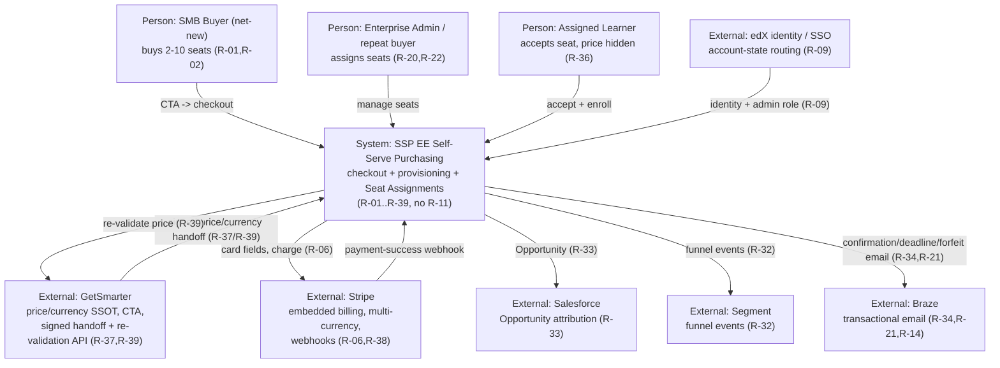
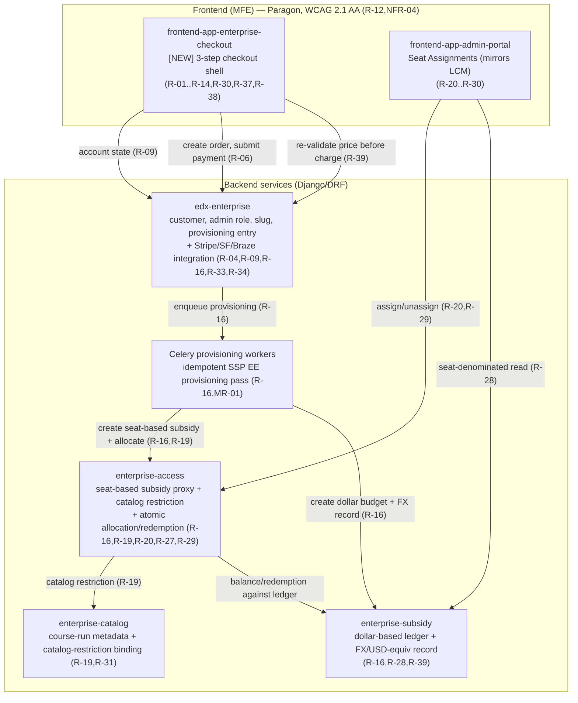
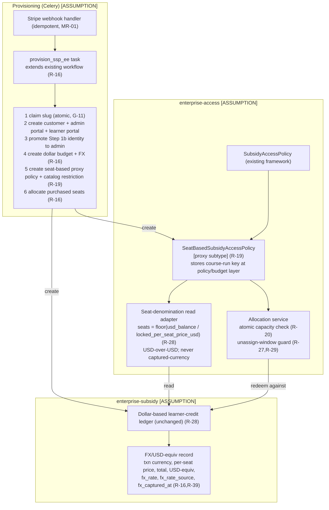
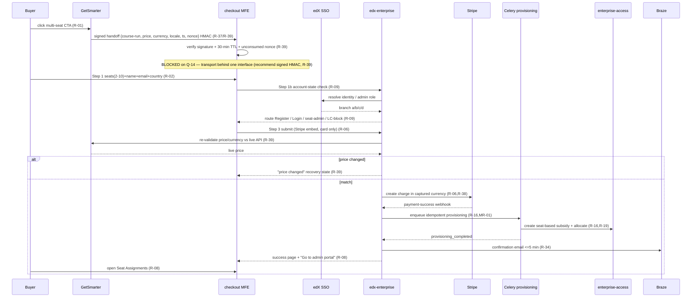

# 06 — Solution Architecture

### Stage 4 — Wave A · Solution Architecture (ARB-ready)

> Requirement IDs are inherited **verbatim** from `test.txt` (R-01…R-39, **no R-11**). Canonical cross-refs per `04_GAP_ANALYSIS.md` §6. Every component mapping is tagged `[ASSUMPTION — verify in live repos]` because the live edX repositories are **not mounted** (02 §1). This artifact designs **reuse-first** over the existing enterprise-access Policy framework, the dollar-based enterprise-subsidy ledger, the Celery provisioning workflow, the admin-portal Learner Credit Management (LCM) IA, and the Stripe embedded billing surface — **no new parallel systems**.

---

## 1. Architecture principles

| # | Principle | Why / requirement cites |
|---|-----------|--------------------------|
| **P-1** | **Reuse before create.** The seat-based subsidy is a **proxy/subtype** over the existing `enterprise-access` subsidy-access-policy; the **dollar-based** `enterprise-subsidy` ledger stays unchanged underneath; provisioning **extends** the existing Celery workflow; admin Seat Assignments **mirrors** LCM; Stripe embedded billing is **reused**. No new subsidy engine, no new ledger, no new orchestrator. | §1.3 "the unlock"; R-16, R-17, R-19, R-22, R-28; A-1/A-2/A-4 (03 §10) |
| **P-2** | **Server-side enforcement of every client gate.** Every UI guard is re-checked on the server before any irreversible effect (payment, allocation, unassign). Seat range, capacity, seat-lock, unassign window, and price integrity are all re-validated server-side. | R-10 (range), R-20 (atomic capacity), R-27 (seat-lock), R-29 (unassign window), R-39 (price integrity) |
| **P-3** | **Seat-denominated UI over a dollar ledger.** Admin surfaces express everything as **seats** ("8 total · 5 assigned · 3 open"), never raw dollars; the dollar-based learner-credit logic stays in the backend and is abstracted entirely at the read/serializer layer. Course name is a first-class, high-hierarchy element. | R-28; BR-15 |
| **P-4** | **Card data never touches edX.** Card capture is exclusively in the Stripe-hosted embedded surface; edX systems persist only Stripe references (PaymentIntent / order id). PCI scope is minimized to SAQ-A posture. | R-06; BR-16 |
| **P-5** | **Price/currency consumed, never derived.** GetSmarter is the single source of truth; the checkout MFE and back end **consume, verify, persist** — they never geo-detect or recalculate. Price/currency are read **only** from the signed + re-validated server-side record, never from URL/localStorage/sessionStorage. | R-37, R-39; BR-11 |
| **P-6** | **Each purchase → exactly one standalone plan/budget; never merged.** | R-16, R-17, R-18; BR-06 |
| **P-7** | **Idempotent, webhook-driven provisioning.** Provisioning is triggered by the Stripe payment-success webhook and is idempotent under retries/replays (MR-01). | R-16; MR-01 |
| **P-8** | **Design pricing transport behind one internal interface.** R-37–R-39 are **BLOCKED on Q-14**; both transport options (signed HMAC payload vs Learner Credit API extension) sit behind one interface so non-pricing work proceeds. Recommended default: **signed HMAC** per R-39. | R-37, R-38, R-39; G-01 |

---

## 2. C4 Context diagram



---

## 3. Container diagram

`[ASSUMPTION — verify in live repos]` for every repo mapping.



---

## 4. Component diagram — seat-based subsidy proxy + provisioning

The seat-based subsidy is **not** a new model family. It is a **subtype/proxy** of the existing subsidy-access-policy: a thin `SeatBasedSubsidyAccessPolicy` discriminator + a seat-denomination read adapter over the unchanged dollar ledger.



---

## 5. Service-responsibility table

`[ASSUMPTION — verify in live repos]` on every repo.

| Service / surface | Responsibilities | Req IDs |
|-------------------|------------------|---------|
| **frontend-app-enterprise-checkout** `[NEW]` | 3-step checkout shell + Step 1b interstitial; seat-range UI guard (2–10); banned-country selector; HMAC payload verify + read-only currency render; locale-correct formatting; Stripe embed mount; forfeiture disclaimer; success page + portal handoff; Segment events; fresh-session-on-return | R-01–R-10, R-12–R-14, R-30, R-32, R-37, R-38 |
| **edx-enterprise** | Account-state resolution (R-09) via SSO; order record + price/currency persistence; payment submission + price re-validation orchestration; Stripe webhook ingress; enqueue provisioning; SF Opportunity (retry); Braze email triggers; slug ownership | R-04, R-06, R-09, R-16, R-33, R-34, R-39 |
| **Celery provisioning workers** | Idempotent SSP EE provisioning pass: slug claim, customer + portals, admin promotion (Step 1b identity, never new user), budget + subsidy + allocation | R-16, R-17, MR-01 |
| **enterprise-access** | Seat-based subsidy **proxy** subtype; course-run key at policy/budget layer + catalog restriction; atomic allocation/redemption; server-enforced capacity, seat-lock, unassign-window | R-16, R-19, R-20, R-27, R-29 |
| **enterprise-subsidy** | Unchanged dollar-based ledger; per-purchase budget; FX/USD-equiv + per-seat price record; expiry = course end + 6 mo | R-16, R-28, R-39, BR-07, BR-13 |
| **enterprise-catalog** | Course-run metadata; catalog-restriction binding for the budget; learner-portal price suppression by subsidy type | R-19, R-31, R-36 |
| **frontend-app-admin-portal** | Seat Assignments landing + detail + tabs (Activity/Learners/Catalog placeholder); assign modal; seat-denominated display; deadline banners; server-truth lock states | R-20–R-30 |

---

## 6. End-to-end sequence — CTA → handoff → checkout → provisioning → portal



---

## 7. Key sequence — seat assignment via modal with atomic capacity + forfeiture lock

```mermaid
sequenceDiagram
  participant A as Admin
  participant ADM as admin-portal
  participant EA as enterprise-access
  participant BR as Braze

  A->>ADM: open Assign Seat modal (course-run scoped) (R-20)
  A->>ADM: enter learner emails + submit (R-20)
  ADM->>EA: assign request
  EA->>EA: server-side checks: format, duplicate, domain, banned, ATOMIC capacity (R-20)
  EA->>EA: guard threshold = min(course_start, enrollment_deadline) (BR-08)
  alt before threshold
    EA-->>ADM: per-email outcome rows (R-20)
    ADM-->>A: "review results" view (R-20)
  else after threshold
    EA-->>ADM: reject — assignment locked (R-27,R-29)
    ADM-->>A: locked-state notice; Unassign removed (R-25,R-27)
  end
  Note over EA: deadline re-eval -> banner warning <=7d / danger <=3d / aggregate >=3 runs (R-21,R-26)
  EA->>BR: 7-day + 3-day reminders (R-21)
  EA->>EA: course start passes -> mark unassigned seats forfeited, no refund (R-21,BR-08,BR-10)
  EA->>BR: forfeit notice (R-21)
```

> Unassign/reassign is reversible **only** until `min(course_start, enrollment_deadline)` (BR-08); after that the server rejects any direct unassign — UI hiding alone is insufficient (R-27(d), R-29). Forfeiture-engine must **not hard-assume "no refund"** because Legal sign-off (G-04) is pending — the no-refund branch is config-gated.

---

## 8. Integration flow

| Integration | Flow & contract | Resilience | Req IDs |
|-------------|-----------------|------------|---------|
| **GetSmarter handoff** | Signed `{course-run ID, per-seat price, ISO-4217 currency, locale, timestamp, nonce}` payload; MFE verifies HMAC-SHA256 + 30-min TTL + nonce-not-consumed; price/currency read-only, immutable after Step 3. **BLOCKED on Q-14.** | Reject invalid/expired/replayed payload; log integrity failure | R-37, R-39, BR-11 |
| **GetSmarter re-validation** | Back end re-validates price/currency vs live product API **before any Stripe charge**; mismatch → block charge + "Update price and continue" recovery (current/prior price). **BLOCKED on Q-14.** | Treat API down as fail-closed (block charge); rate-limit (MR-04) | R-39, UX-09 |
| **Stripe webhook** | `payment_intent.succeeded` triggers idempotent provisioning; signature-verified; idempotency key on `(payment_intent_id)` so retries/replays don't double-provision | Webhook signing-key rotation; dedupe; DLQ on repeated failure | R-06, R-16, MR-01, G-08 |
| **Salesforce Opportunity** | On payment confirmation, create Opportunity {customer ID, course run, seat count, amount, source attribution}; **auto-retry** on failure | Celery retry w/ backoff; failure does not block provisioning | R-33, G-13 |
| **Segment** | Emit `exec_ed_teams_cta_clicked`, `checkout_step_1/2/3_entered`, `checkout_step_3_submitted`, `checkout_abandoned`, `checkout_completed`, `provisioning_completed` with UTM, user ID, course-run ID, seat count, step, outcome | Client-side buffering; non-blocking | R-32 |
| **Braze** | Transactional: confirmation ≤5 min (R-34), deadline 7d/3d reminders + forfeit notice (R-21). Abandonment-recovery email = **V2** (canonical resolution G-22). | Idempotent send keys; copy Legal+Marketing-approved (G-04) | R-21, R-34, R-14 |

---

## 9. Cross-cutting concerns

- **Caching.** Course-run metadata + catalog restriction cached (read-mostly) in `enterprise-catalog`; seat-denomination figures derived per request from the ledger (no stale seat counts). Price/currency are **never** cached client-side as authoritative — server-side record is the only source (P-5, R-39).
- **Async / Celery.** Provisioning, SF Opportunity, and Braze sends run on Celery, extending the existing workflow (A-2). Tasks are idempotent with retry+backoff; provisioning keyed on PaymentIntent (MR-01).
- **AuthN / AuthZ.** edX SSO resolves identity for Step 1b (R-09); the Learner-Credit-admin branch is a **terminal block** (R-09(d), BR-14). Seat-based admin role gates the Seat Assignments area (R-22). Server enforces every mutation gate (P-2).
- **Secrets.** HMAC shared secret rotated on a **90-day cadence** (R-39) with **dual-key overlapping validity** so in-flight payloads verify against either key during overlap (G-10); managed via the platform secrets store, not in source. Stripe webhook signing key likewise rotated. **BLOCKED on Q-14** for the transport-specific secret shape.
- **Logging.** All price-integrity failures logged with course-run ID, submitted value, live value, buyer session ID for fraud review (R-39). PII annotations required on every new model field (02 §7).
- **Monitoring (MR-03).** SLO alerting beyond KPI dashboards for provisioning success, webhook processing, and price-revalidation failure rates; ties to R-35 dashboards (conversion, repeat rate, deflection, payment-failure).
- **Resilience / error handling.** Fail-closed on re-validation outage (no charge); per-email outcome surfacing (R-20); slug-conflict inline recovery (R-04, UX-09); price-change recovery (R-39); SF retry (R-33). Duplicate-submit prevented via disabled control + processing state (UX-03).
- **Scalability (NFR-02 — unquantified, G-09).** Architecture is horizontally scalable (stateless MFE + Celery worker pool); **throughput/burst SLOs cannot be set until Data + Marketing supply expected CTA volume + peak** — flagged G-09, load-test gate before GA.
- **Availability.** Checkout depends on GetSmarter re-validation + Stripe; degrade gracefully (block charge, recoverable state) rather than partial-provision. DR/rollback per MR-05 (`07`).

---

## 10. Architecture Decision Register

| ID | Context | Alternatives | Trade-offs | Chosen | Rationale | Risks | Consequences | Req IDs |
|----|---------|--------------|------------|--------|-----------|-------|--------------|---------|
| **DR-01** | How to model the seat-based subsidy | (a) new parallel subsidy engine (b) **proxy/subtype over existing subsidy-access-policy** | New engine = clean model but duplicates ledger/redemption + huge blast radius; proxy = reuse but couples to existing framework | **(b) proxy subtype** `[ASSUMPTION]` | §1.3 mandates reuse; R-19 needs course-run key at the policy layer; avoids parallel system | Proxy leaks dollar semantics into seat surfaces if abstraction is weak | Seat denomination is a read-adapter concern, not a new ledger | R-16, R-19, R-28 **[ADR-worthy -> emit via adr skill]** |
| **DR-02** | GetSmarter price/currency transport (**Q-14**) | (a) **signed HMAC handoff payload** (b) extension of the Learner Credit API | HMAC = self-contained, decoupled, matches R-39; LC-API = central but couples to LC evolution + larger surface | **Present BOTH behind ONE internal interface; recommend signed HMAC** | R-39 already specifies HMAC-SHA256; lets non-pricing work proceed; **BLOCKED on Q-14** until decided | Wrong choice forces rework of the pricing epic | Interface admits either transport; only the adapter changes | R-37, R-38, R-39 **[ADR-worthy -> emit via adr skill]** |
| **DR-03** | Checkout UI surface | (a) **new MFE** `frontend-app-enterprise-checkout` (b) extend an existing MFE | New MFE = clean 3-step flow + isolation, more scaffolding; extend = less new code but conflates concerns + auth contexts | **(a) new MFE, reusing Paragon + Stripe-embed patterns** `[ASSUMPTION]` | Checkout is unauthenticated→authenticated with a distinct IA (Step 1b); isolation reduces blast radius; A-3 | New-app overhead; must re-establish a11y/i18n baselines | Reuses patterns, not parallel components | R-01–R-14, R-12, NFR-04 |
| **DR-04** | Provisioning trigger + safety | (a) synchronous post-payment (b) **idempotent webhook-driven Celery** | Sync = simpler UX coupling but risks dup-charge/partial state on retry; webhook+idempotent = robust, eventually-consistent | **(b) idempotent webhook-driven** | Stripe is async truth; retries/replays must not double-provision (MR-01); extends existing Celery workflow | Webhook spoofing/replay (G-08); eventual-consistency UX gap | Idempotency key on PaymentIntent; success page polls provisioning state | R-16, R-06, MR-01 **[ADR-worthy -> emit via adr skill]** |
| **DR-05** | Admin display denomination | (a) show dollars (b) **seat-denominated abstraction over dollar ledger** | Dollars = no UI work but violates R-28; seats = UI/read-layer work, deliberate tech-debt | **(b) seat-denominated**; ledger stays dollar-based | R-28 forbids raw dollars in any V1 admin surface; backend rework avoided | Abstraction drift if any surface leaks dollars (esp. R-30 disclaimer, which uses captured currency) | Single read adapter computes seats; R-30 disclaimer is the **only** currency-bearing admin surface | R-28, R-30, BR-15 |
| **DR-06** | Price/currency tamper-resistance | (a) trust client-passed values (b) **signed payload + nonce/TTL + server re-validation, never read from client** | Client-trust = trivially tampered (URL/console); signed+revalidate = robust, adds a GetSmarter API dependency | **(b) HMAC-signed + 30-min TTL + nonce + server re-validation; price never from client** | R-39 mandates it; fraud/integrity is a payment-security concern; **BLOCKED on Q-14** for transport | Re-validation API availability; secret-rotation ops (G-10) | Fail-closed on mismatch/outage; integrity failures logged for fraud review | R-39, R-37, MR-04 **[ADR-worthy -> emit via adr skill]** |

> **ADR-worthy flagged:** **DR-01** (seat-subsidy-as-proxy), **DR-02** (price/currency transport — Q-14), **DR-04** (idempotent webhook-driven provisioning), **DR-06** (HMAC tamper-resistance). DR-03 and DR-05 are recorded here but do not warrant standalone ADRs (conventional surface + UI-layer decisions).
