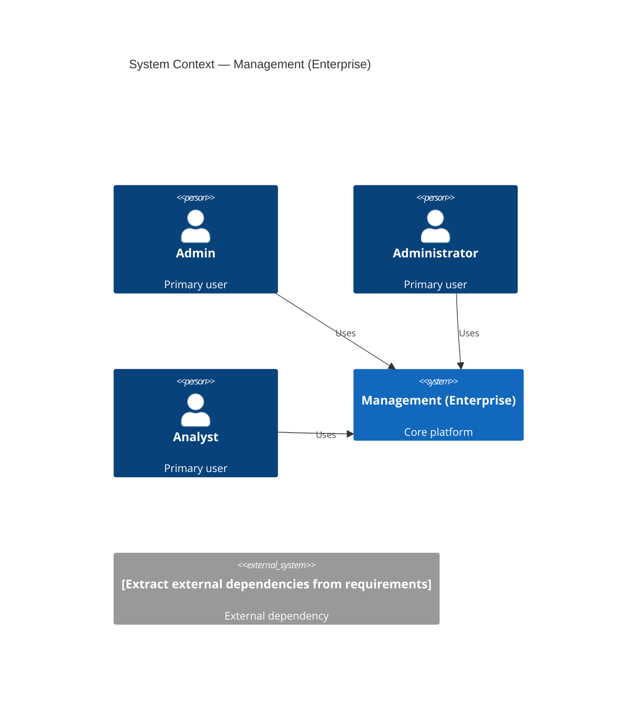
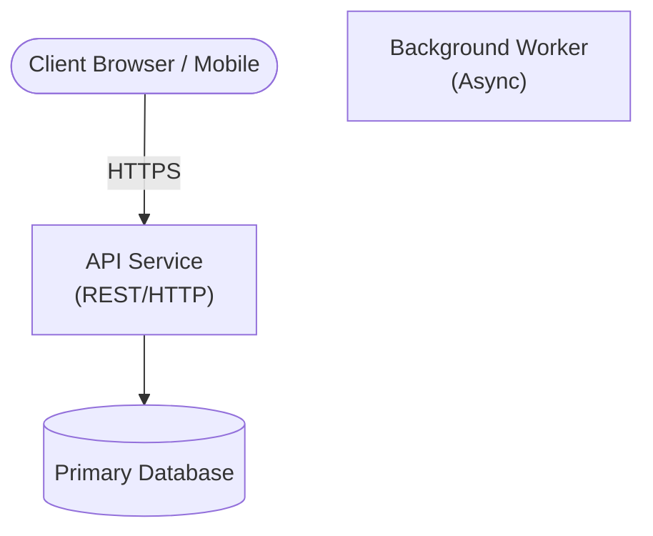
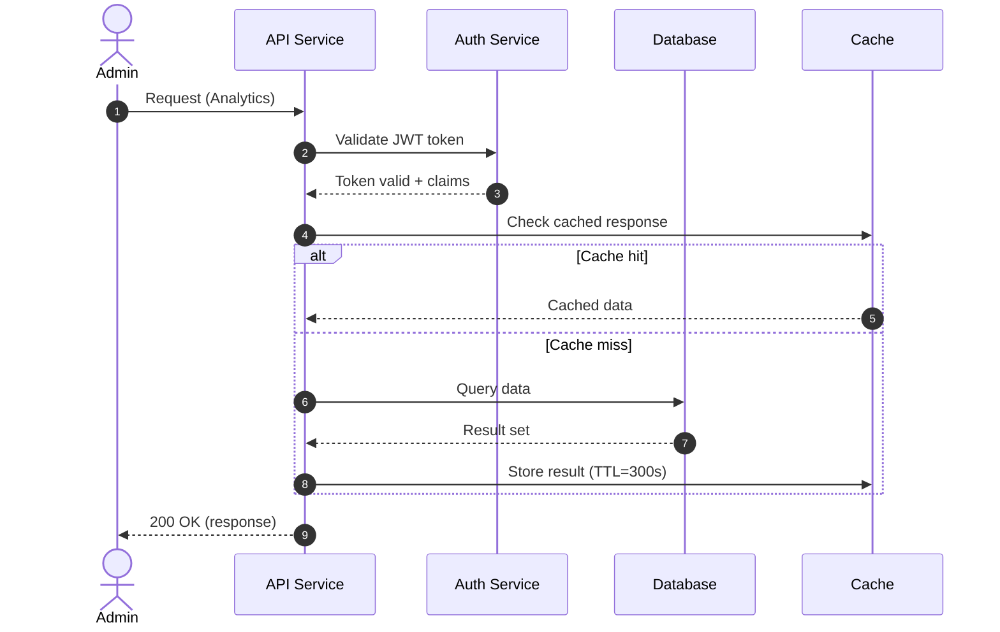
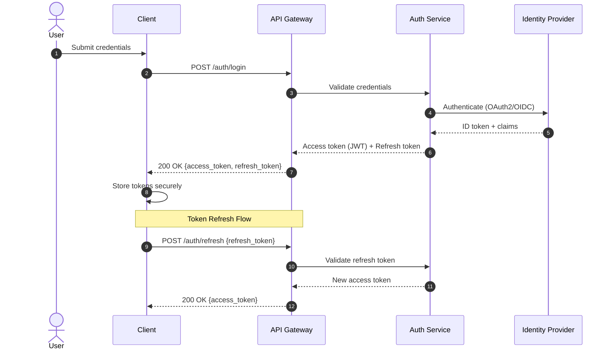
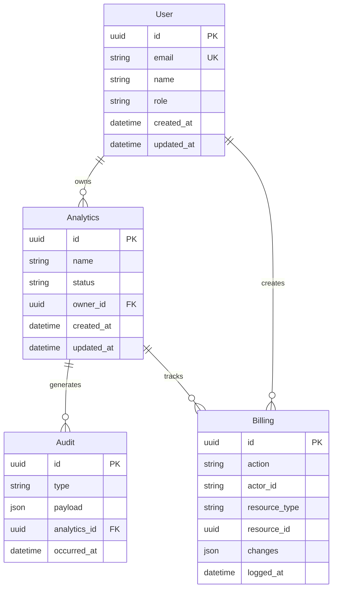

# Management (Enterprise) — Architecture Diagrams

> Generated: 2026-06-30 09:04 UTC | Source: `enterprise-architect/skills/arch-review/archdocument.txt`

Copy and paste any diagram block into [Mermaid Live Editor](https://mermaid.live/) to render.

---

## System Context Diagram

C4 Context diagram for Management (Enterprise) showing external actors and dependencies.

---

## Container Diagram

Major deployable containers and communication paths.

---

## Main User Flow — Sequence Diagram

End-to-end sequence for the primary Analytics operation.

---

## Authentication Flow — Sequence Diagram

Login, token issuance, and token refresh sequence.

---

## Entity Relationship Diagram

Core domain entities and their relationships.

---
