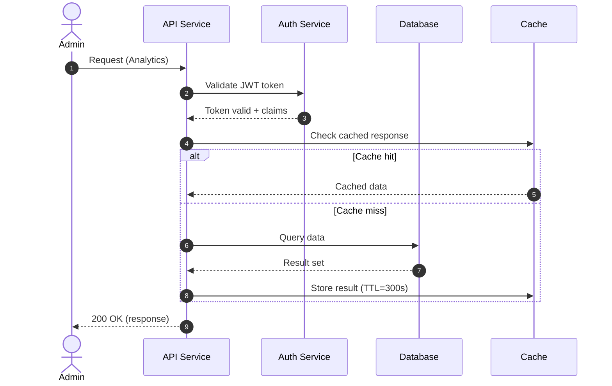
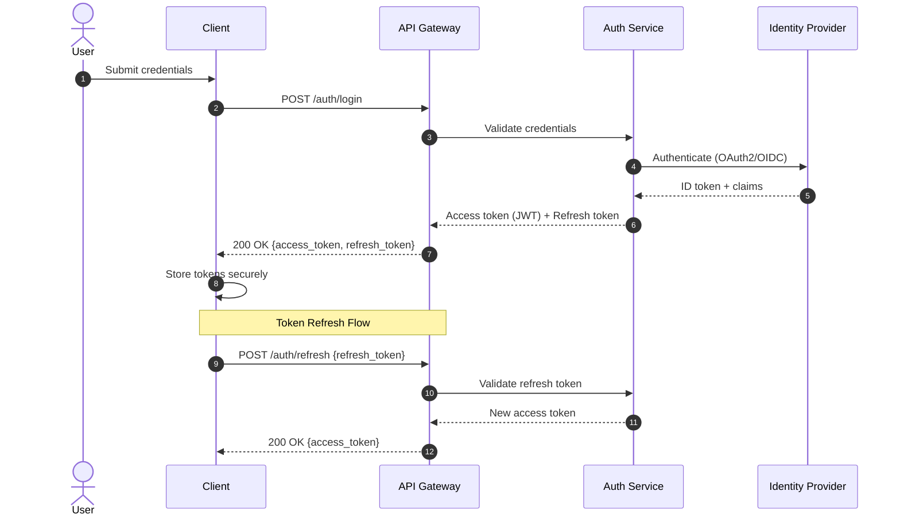
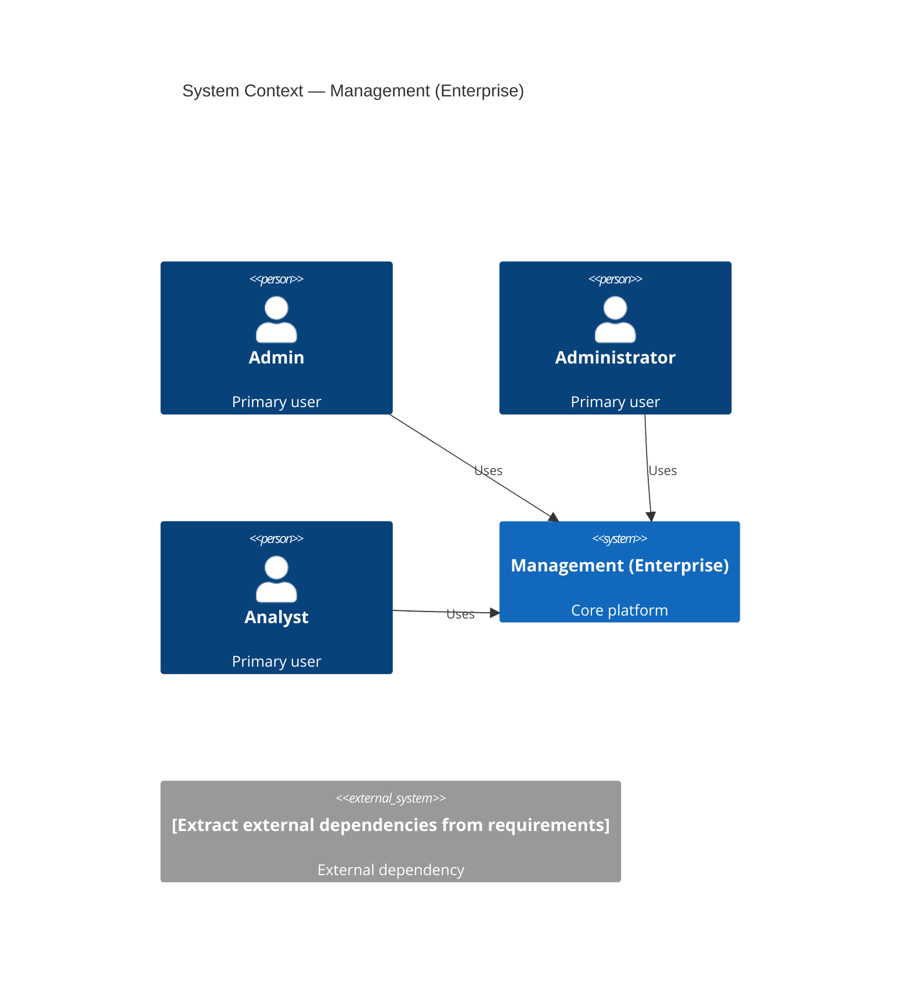
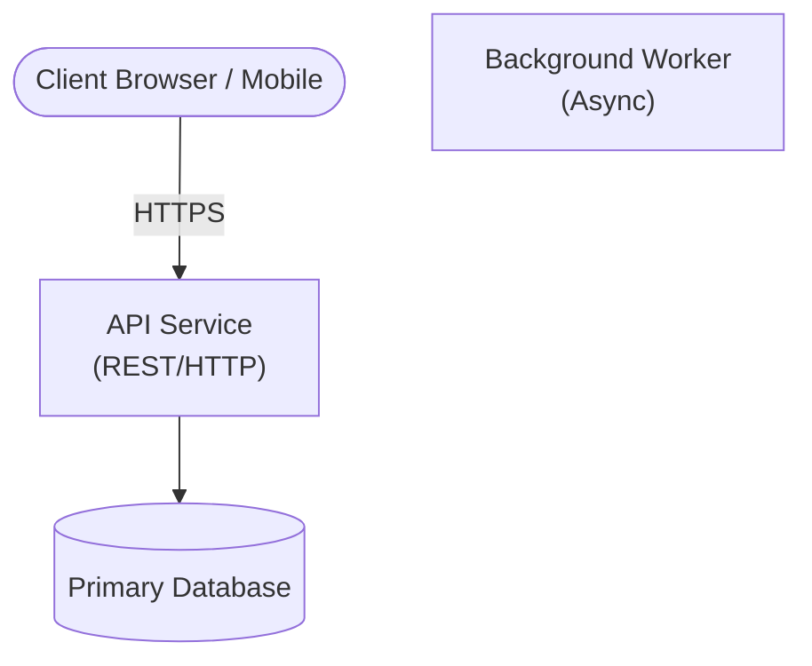

# Management (Enterprise)

> **Generated:** 2026-06-30 09:04 UTC  
> **Source:** `enterprise-architect/skills/arch-review/archdocument.txt`  
> **Model:** `offline (--no-claude)`  
> **Domain:** ecommerce

---

## Table of Contents

1. [Executive Summary](#executive-summary)
2. [Business Overview](#business-overview)
3. [Assumptions](#assumptions)
4. [Functional Analysis](#functional-analysis)
5. [Non-Functional Requirements](#non-functional-requirements)
6. [Solution Architecture](#solution-architecture)
7. [Platform Architecture](#platform-architecture)
8. [Component Design](#component-design)
9. [API Design](#api-design)
10. [Data Architecture](#data-architecture)
11. [Security Architecture](#security-architecture)
12. [Infrastructure Architecture](#infrastructure-architecture)
13. [Deployment Architecture](#deployment-architecture)
14. [Sequence Diagrams](#sequence-diagrams)
15. [Component Diagrams](#component-diagrams)
16. [Deployment Diagrams](#deployment-diagrams)
17. [Risks](#risks)
18. [Tradeoff Analysis](#tradeoff-analysis)
19. [Implementation Roadmap](#implementation-roadmap)
20. [Appendix](#appendix)

---

## Executive Summary

This document defines the enterprise architecture for **Management (Enterprise)**.

> ⚠️ Generated in `--no-claude` mode. Run without `--no-claude` for AI-generated content.

The system addresses the following business goals: [Infer from requirements — run without --no-claude for AI extraction].

Key stakeholders include: Admin, Administrator, Analyst, Client, Customer, Employee, Manager, Partner, Service, System, User, Vendor.

---

## Business Overview

### Business Problem Statement

TBD — derived from Management (Enterprise).

### Business Goals

| Goal | Priority | Success Metric |
|------|----------|---------------|
| [Infer from requirements — run without --no-claude for AI extraction] | High | TBD |

### Stakeholders

| Role | Interest | Influence |
|------|----------|-----------|
| Admin | TBD | TBD |
| Administrator | TBD | TBD |
| Analyst | TBD | TBD |
| Client | TBD | TBD |
| Customer | TBD | TBD |
| Employee | TBD | TBD |
| Manager | TBD | TBD |
| Partner | TBD | TBD |
| Service | TBD | TBD |
| System | TBD | TBD |
| User | TBD | TBD |
| Vendor | TBD | TBD |

### Scope

**In Scope:** [Extract from requirements document]

**Out of Scope:** [Extract from requirements document]

---

## Assumptions

1. [Technology] Cloud-native deployment on AWS/Azure/GCP
2. [Technology] REST APIs with JWT-based authentication
3. [Technology] PostgreSQL as primary datastore unless otherwise specified
4. [Technology] Kubernetes for container orchestration

---

## Functional Analysis

> ⚠️ `--no-claude` mode. Run without `--no-claude` for AI-generated content.

### Functional Requirements

| ID | Requirement | Priority | Actor | Business Capability |
|----|------------|----------|-------|---------------------|
| FR-001 | TBD | High | Admin | Analytics |

### CRUD Matrix

| Entity | Create | Read | Update | Delete | Actor(s) |
|--------|--------|------|--------|--------|---------|
| TBD | ✓ | ✓ | ✓ | ✓ | Admin, Administrator |

---

## Non-Functional Requirements

> ⚠️ `--no-claude` mode. Run without `--no-claude` for AI-generated content.

### Performance
| Metric | Target | Source |
|--------|--------|--------|
| API p99 latency | < 500ms | [Assumed] |
| Throughput | 1,000 RPS | [Assumed] |

### Availability
| Metric | Target | Source |
|--------|--------|--------|
| Uptime SLA | 99.9% | [Assumed] |
| RTO | 4 hours | [Assumed] |
| RPO | 1 hour | [Assumed] |

---

## Solution Architecture

> ⚠️ `--no-claude` mode. Run without `--no-claude` for AI-generated content.

**Architecture Style:** Modular Monolith [Assumed]

---

## Platform Architecture

> ⚠️ `--no-claude` mode. Run without `--no-claude` for AI-generated content.

**Cloud:** AWS [Assumed]
**Compute:** EKS (Kubernetes) [Assumed]
**Network:** VPC with public/private subnets across 3 AZs [Assumed]

---

## Component Design

> ⚠️ `--no-claude` mode. Run without `--no-claude` for AI-generated content.

| Component | Responsibilities | Scaling |
|-----------|-----------------|--------|
| API Layer | Handle HTTP requests | Horizontal |
| Service Layer | Business logic | Horizontal |
| Data Layer | Persistence | Vertical + Read replicas |

---

## API Design

> ⚠️ `--no-claude` mode. Run without `--no-claude` for AI-generated content.

### REST API Endpoints

| Method | Path | Description | Auth |
|--------|------|-------------|------|
| GET | /api/v1/resources | List resources | JWT |
| POST | /api/v1/resources | Create resource | JWT |
| GET | /api/v1/resources/{id} | Get resource | JWT |
| PUT | /api/v1/resources/{id} | Update resource | JWT |
| DELETE | /api/v1/resources/{id} | Delete resource | JWT |

---

## Data Architecture

> ⚠️ `--no-claude` mode. Run without `--no-claude` for AI-generated content.

### Databases
| Technology | Purpose | Scaling |
|-----------|---------|---------|
| PostgreSQL | Primary OLTP datastore | Primary + read replicas |
| Redis | Cache + sessions | Cluster mode |

Detected technologies: aks, aws, celery, ecs, eks, react, rest, rust, snowflake

---

## Security Architecture

> ⚠️ `--no-claude` mode. Run without `--no-claude` for AI-generated content.

### Authentication
- OAuth2 / OIDC with JWT access tokens [Assumed]
- Refresh token rotation
- MFA for admin roles

### RBAC Matrix
| Role | Read | Write | Delete | Admin |
|------|------|-------|--------|-------|
| User | ✓ | ✓ | — | — |
| Admin | ✓ | ✓ | ✓ | ✓ |

---

## Infrastructure Architecture

> ⚠️ `--no-claude` mode. Run without `--no-claude` for AI-generated content.

**HA:** Multi-AZ active-active [Assumed]
**DR:** RTO 4h / RPO 1h [Assumed]

---

## Deployment Architecture

> ⚠️ `--no-claude` mode. Run without `--no-claude` for AI-generated content.

**Strategy:** Blue/Green [Assumed]
**CI/CD:** GitHub Actions → ECR → ArgoCD [Assumed]

---

## Sequence Diagrams

### Main User Flow — Sequence Diagram

End-to-end sequence for the primary Analytics operation.

### Authentication Flow — Sequence Diagram

Login, token issuance, and token refresh sequence.

---

## Component Diagrams

### System Context Diagram

C4 Context diagram for Management (Enterprise) showing external actors and dependencies.

### Container Diagram

Major deployable containers and communication paths.

---

## Deployment Diagrams

---

## Risks

> ⚠️ `--no-claude` mode. Run without `--no-claude` for AI-generated content.

| Risk | Category | Likelihood | Impact | Mitigation |
|------|----------|-----------|--------|-----------|
| Single point of failure in API layer | Technical | Medium | High | Deploy across multiple AZs |
| Data breach via SQL injection | Security | Low | Critical | Parameterized queries + WAF |
| Scaling bottleneck under peak load | Technical | Medium | High | Load test + autoscaling |

---

## Tradeoff Analysis

> ⚠️ `--no-claude` mode. Run without `--no-claude` for AI-generated content.

### Monolith vs Microservices
**Recommendation:** Modular monolith — reduces operational overhead while maintaining clear boundaries. [Assumed]

---

## Implementation Roadmap

> ⚠️ `--no-claude` mode. Run without `--no-claude` for AI-generated content.

### Phase 1 — Foundation (Weeks 1-4)
**Deliverables:** Core data model, API skeleton, CI/CD pipeline, dev environment
**Success Criteria:** API returns data, tests passing, deployable to staging

### Phase 2 — Core Features (Weeks 5-10)
**Deliverables:** Primary business capabilities, auth, basic UI
**Success Criteria:** End-to-end happy path working in staging

### Phase 3 — Production Hardening (Weeks 11-14)
**Deliverables:** Observability, security hardening, performance testing, DR tested
**Success Criteria:** Meets NFR targets, runbooks complete, on-call trained

### Phase 4 — Release & Stabilisation (Weeks 15-16)
**Deliverables:** Production deployment, feature flags, GA release
**Success Criteria:** Zero P0 incidents in first 2 weeks

---

## Appendix

### Glossary

| Term | Definition |
|------|-----------|
| API | Application Programming Interface |
| BRD | Business Requirements Document |
| SLA | Service Level Agreement |
| SLO | Service Level Objective |
| RTO | Recovery Time Objective |
| RPO | Recovery Point Objective |
| RBAC | Role-Based Access Control |
| ABAC | Attribute-Based Access Control |
| CDN | Content Delivery Network |
| DLQ | Dead Letter Queue |

### Document History

| Version | Date | Author | Changes |
|---------|------|--------|---------|
| 1.0 | TBD | TBD | Initial draft |

---
