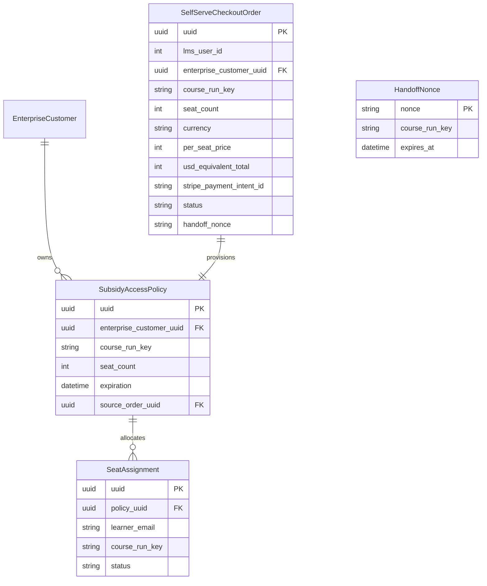
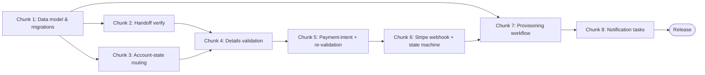

# Implementation Plan: Self-Serve Exec Ed Purchasing — Checkout & Provisioning Backend (V1)

## Document Classification

> **Type:** Plan Document (pre-build intent) + Living Execution Tracker
> Created during Sprint Alignment with pre-build intent. Updated during build with status.
> Becomes historical artifact after release. Retro section appended at sprint end.

> **Scope of this plan.** This plan covers the **checkout → payment → provisioning backend
> path** (tech-spec Phases 0–3, backend). It intentionally does **not** cover: the Checkout
> MFE UI, the Admin Seat Assignments area and its seat-plan/assignment APIs (tech-spec Phase 4,
> R-19–R-29), or dashboards/audit (Phase 5). Each of those is a separate impl-plan — they have
> their own repos, reviewers, and blast radius. **Host service for the checkout backend is
> unresolved (tech-spec OQ-A);** file paths below assume `enterprise-access` as the host and
> must be reconciled before build.

---

## Overview

| Field | Value |
|-------|-------|
| PRD Link | `techspec.txt` |
| Tech Spec Link | `docs/techspec-self-serve-execed-purchasing.md` |
| Engineering Lead | rgopalrao-sonata-png |
| Sprint | — |
| Status | Planning |
| Created | 2026-07-01 |
| Last Updated | 2026-07-01 |

---

## Chunk Summary

| # | Chunk | Status | Owner | Reviewer | Depends On | Unblocks | Est. Size |
|---|-------|--------|-------|----------|------------|----------|-----------|
| 1 | Seat-based data model & migrations | 🔲 Not Started | Eng | Eng Lead | — | Chunk 2, 3, 4, 7 | M |
| 2 | Signed handoff verification endpoint | 🔲 Not Started | Eng | Eng Lead | Chunk 1 | Chunk 4 | M |
| 3 | Account-state routing (Step 1b) endpoint | 🔲 Not Started | Eng | Eng Lead | Chunk 1 | Chunk 4 | M |
| 4 | Checkout-details server-side validation | 🔲 Not Started | Eng | Eng Lead | Chunk 2, 3 | Chunk 5 | M |
| 5 | Payment-intent creation with price re-validation | 🔲 Not Started | Eng | Eng Lead | Chunk 4 | Chunk 6 | M |
| 6 | Stripe webhook ingestion & order state machine | 🔲 Not Started | Eng | Eng Lead | Chunk 5 | Chunk 7 | M |
| 7 | Provisioning Celery workflow | 🔲 Not Started | Eng | Eng Lead | Chunk 1, 6 | Chunk 8 | L |
| 8 | Post-purchase notification tasks (Salesforce + Braze) | 🔲 Not Started | Eng | Eng Lead | Chunk 7 | Release | M |

---

### Chunk 1: Seat-based data model & migrations

| Field | Detail |
|-------|--------|
| Purpose | Establish the persistence layer for the self-serve checkout flow |
| Exit Criteria | All new/extended models migrate cleanly forward and backward with additive, nullable columns only |
| Blast Radius | `enterprise-access` DB (existing `SubsidyAccessPolicy`, assignment tables); nullable additive columns only, no backfill of Learner Credit rows |
| Reviewer | Eng Lead |
| Depends On | None |
| Unblocks | Chunk 2, 3, 4, 7 |
| Estimated Size | M |
| Jira Ticket | — |
| Status | 🔲 Not Started |

#### Exit Criteria (Detailed)

- [ ] `SelfServeCheckoutOrder` table exists with a UNIQUE index on `stripe_payment_intent_id` and a composite index on `(enterprise_customer_uuid, status)`.
- [ ] `SubsidyAccessPolicy` has new **nullable** columns `seat_count`, `course_run_key`, `source_order_uuid`, `currency`, `per_seat_price`, `usd_equivalent`; migration adds no default that rewrites existing rows.
- [ ] `HandoffNonce` table exists with `nonce` as PK/UNIQUE and an `expires_at` column.
- [ ] A DB-level or model-level check rejects `seat_count` outside `[2, 10]`.
- [ ] `migrate` then `migrate <app> <prev>` (reverse) both succeed with zero data loss on a seeded DB.

#### Files to Change

| File | Change | Why |
|------|--------|-----|
| `enterprise_access/apps/checkout/models.py` | New — `SelfServeCheckoutOrder`, `HandoffNonce` | Order-of-record + replay protection (R-36, R-38, R-39) |
| `enterprise_access/apps/subsidy_access_policy/models.py` | Modify — add seat-based nullable fields | Seat policy as subtype over dollar ledger (KD-1, KD-2) |
| `enterprise_access/apps/checkout/migrations/0001_initial.py` | New — create tables | Migration for new models |
| `enterprise_access/apps/subsidy_access_policy/migrations/00XX_seat_fields.py` | New — add nullable columns | Additive migration, reversible |

#### Notes / Decisions During Build

_(Append as you go)_

---

### Chunk 2: Signed handoff verification endpoint

| Field | Detail |
|-------|--------|
| Purpose | Verify the HMAC-signed GetSmarter handoff and open a checkout order |
| Exit Criteria | A tampered, expired, or replayed handoff is rejected; a valid one creates an `initiated` order |
| Blast Radius | New `checkout` API app; `HandoffNonce` writes; shared-secret config |
| Reviewer | Eng Lead |
| Depends On | Chunk 1 |
| Unblocks | Chunk 4 |
| Estimated Size | M |
| Jira Ticket | — |
| Status | 🔲 Not Started |

#### Exit Criteria (Detailed)

- [ ] `POST /api/v1/checkout/handoff/verify` returns HTTP 200 with `{order_uuid, course_run, per_seat_price, currency}` for a valid HMAC-SHA256 signature.
- [ ] A payload with an invalid signature returns HTTP 401 `handoff_invalid`.
- [ ] A payload with `timestamp` older than 30 minutes returns HTTP 401 `handoff_invalid`.
- [ ] A previously consumed `nonce` returns HTTP 401 `handoff_invalid` and no new order is created.
- [ ] Price/currency are read only from the verified payload — never from URL query params.

#### Files to Change

| File | Change | Why |
|------|--------|-----|
| `enterprise_access/apps/checkout/handoff.py` | New — HMAC verify, timestamp + nonce checks | Tamper resistance (R-38) |
| `enterprise_access/apps/checkout/api/v1/views.py` | New — `HandoffVerifyView` | Endpoint entry (R-36) |
| `enterprise_access/apps/checkout/tests/test_handoff.py` | New — sig/expiry/replay tests | Prove rejection paths |

#### Notes / Decisions During Build

_(Append as you go)_

---

### Chunk 3: Account-state routing (Step 1b) endpoint

| Field | Detail |
|-------|--------|
| Purpose | Resolve a buyer's account state into one of four deterministic checkout branches |
| Exit Criteria | Each of the four account states routes to its correct branch, including the Learner-Credit terminal block |
| Blast Radius | Identity/enterprise-admin lookup (auth-adjacent — higher blast); read-only against LMS/enterprise |
| Reviewer | Eng Lead |
| Depends On | Chunk 1 |
| Unblocks | Chunk 4 |
| Estimated Size | M |
| Jira Ticket | — |
| Status | 🔲 Not Started |

#### Exit Criteria (Detailed)

- [ ] `POST /api/v1/checkout/account-state` returns `branch: register` when no edX account exists for the email.
- [ ] Returns `branch: login_non_admin` when an account exists but is not an Enterprise admin.
- [ ] Returns `branch: login_seat_admin` when the buyer is already a seat-based Enterprise admin.
- [ ] Returns `branch: learner_credit_block` when the buyer admins a Learner-Credit account (terminal, no order advance).
- [ ] Account state is resolved only on this call, never inferred from partial typing (R-02).

#### Files to Change

| File | Change | Why |
|------|--------|-----|
| `enterprise_access/apps/checkout/account_state.py` | New — branch resolution logic | Deterministic Step 1b routing (R-09) |
| `enterprise_access/apps/checkout/api/v1/views.py` | Modify — add `AccountStateView` | Endpoint entry |
| `enterprise_access/apps/checkout/tests/test_account_state.py` | New — one test per branch | Prove all four branches |

#### Notes / Decisions During Build

_(Append as you go)_

---

### Chunk 4: Checkout-details server-side validation

| Field | Detail |
|-------|--------|
| Purpose | Enforce server-side validation of buyer/org checkout details on the order |
| Exit Criteria | Seat range, slug uniqueness, and banned-country rules are all rejected server-side regardless of UI |
| Blast Radius | `checkout` app; order writes; `EnterpriseCustomer.slug` uniqueness read |
| Reviewer | Eng Lead |
| Depends On | Chunk 2, 3 |
| Unblocks | Chunk 5 |
| Estimated Size | M |
| Jira Ticket | — |
| Status | 🔲 Not Started |

#### Exit Criteria (Detailed)

- [ ] `POST /api/v1/checkout/orders/{uuid}/details` returns HTTP 400 `invalid_seat_count` for `seat_count` < 2 or > 10.
- [ ] Returns HTTP 400 `banned_country` for an OFAC-listed country even when the UI is bypassed.
- [ ] Returns HTTP 409 `slug_conflict` when the URL slug already exists, preserving other submitted inputs.
- [ ] Slug format is validated: lowercase letters/numbers/dashes, 3–60 chars (R-04).
- [ ] Existing-admin orders skip company/slug entry and persist read-only org values (R-05).

#### Files to Change

| File | Change | Why |
|------|--------|-----|
| `enterprise_access/apps/checkout/api/v1/serializers.py` | New — details serializer + validators | Seat/slug/country rules (R-04, R-10) |
| `enterprise_access/apps/checkout/api/v1/views.py` | Modify — add `OrderDetailsView` | Endpoint entry |
| `enterprise_access/apps/checkout/tests/test_details_validation.py` | New — negative-path tests | Prove UI-bypass rejection |

#### Notes / Decisions During Build

_(Append as you go)_

---

### Chunk 5: Payment-intent creation with price re-validation

| Field | Detail |
|-------|--------|
| Purpose | Create a Stripe PaymentIntent only after re-validating price/currency against the live GetSmarter API |
| Exit Criteria | A drifted price blocks the charge with a recovery payload; a matching price creates a PaymentIntent in the captured currency |
| Blast Radius | Stripe (charge creation), GetSmarter product API (read); order immutability at submit |
| Reviewer | Eng Lead |
| Depends On | Chunk 4 |
| Unblocks | Chunk 6 |
| Estimated Size | M |
| Jira Ticket | — |
| Status | 🔲 Not Started |

#### Exit Criteria (Detailed)

- [ ] `POST /api/v1/checkout/orders/{uuid}/payment-intent` calls the live GetSmarter product API before any Stripe call.
- [ ] When live price ≠ captured price, returns HTTP 409 `price_changed` with `{current, prior}` and creates no PaymentIntent.
- [ ] When price matches, creates a Stripe PaymentIntent with the captured currency and `per_seat_price × seat_count`, returning `client_secret`.
- [ ] A currency outside the 12-currency allowlist returns HTTP 400 `unsupported_currency`.
- [ ] Every price-integrity failure is logged with course-run key, submitted value, live value, and session id.

#### Files to Change

| File | Change | Why |
|------|--------|-----|
| `enterprise_access/apps/checkout/getsmarter_client.py` | New — live price read + short-TTL cache | Re-validation source (R-38, D-04) |
| `enterprise_access/apps/checkout/stripe_client.py` | New — PaymentIntent creation | Charge in captured currency (R-39) |
| `enterprise_access/apps/checkout/api/v1/views.py` | Modify — add `PaymentIntentView` | Endpoint entry |
| `enterprise_access/apps/checkout/tests/test_payment_intent.py` | New — match/mismatch/allowlist tests | Prove integrity gate |

#### Notes / Decisions During Build

_(Append as you go)_

---

### Chunk 6: Stripe webhook ingestion & order state machine

| Field | Detail |
|-------|--------|
| Purpose | Transition an order to `paid` idempotently on the Stripe payment-success webhook |
| Exit Criteria | A duplicate webhook is processed exactly once and enqueues provisioning without double-charging state |
| Blast Radius | Public webhook endpoint; order status transitions; Celery enqueue |
| Reviewer | Eng Lead |
| Depends On | Chunk 5 |
| Unblocks | Chunk 7 |
| Estimated Size | M |
| Jira Ticket | — |
| Status | 🔲 Not Started |

#### Exit Criteria (Detailed)

- [ ] `POST /api/v1/checkout/webhooks/stripe` rejects any event whose Stripe signature fails verification (HTTP 400).
- [ ] A valid `payment_intent.succeeded` transitions the order to `paid` and enqueues the provisioning task exactly once.
- [ ] Re-delivery of the same `payment_intent_id` is a no-op (idempotent on the unique index) and does not re-enqueue.
- [ ] Order status transitions follow `paid → provisioning → provisioned/failed` and reject illegal transitions.
- [ ] A reconciliation command marks orders stuck in `paid` beyond a threshold for retry.

#### Files to Change

| File | Change | Why |
|------|--------|-----|
| `enterprise_access/apps/checkout/api/v1/views.py` | Modify — add `StripeWebhookView` | Webhook entry (KD-4) |
| `enterprise_access/apps/checkout/state.py` | New — order state-machine transitions | Enforce legal transitions (TR-3) |
| `enterprise_access/apps/checkout/management/commands/reconcile_orders.py` | New — stuck-order sweep | Webhook-loss recovery (TR-5) |
| `enterprise_access/apps/checkout/tests/test_webhook.py` | New — signature/idempotency tests | Prove exactly-once |

#### Notes / Decisions During Build

_(Append as you go)_

---

### Chunk 7: Provisioning Celery workflow

| Field | Detail |
|-------|--------|
| Purpose | Provision the portal, seat-based policy, and admin promotion from a paid order |
| Exit Criteria | A paid order deterministically produces one seat-based policy scoped to the course run with the buyer promoted to admin |
| Blast Radius | LMS/`EnterpriseCustomer` writes, `enterprise-access` policy creation, `enterprise-subsidy` ledger; Celery workers |
| Reviewer | Eng Lead |
| Depends On | Chunk 1, 6 |
| Unblocks | Chunk 8 |
| Estimated Size | L |
| Jira Ticket | — |
| Status | 🔲 Not Started |

#### Exit Criteria (Detailed)

- [ ] For a net-new buyer, the task creates admin + learner portals using the order slug and promotes the authenticated edX identity to admin (never creating a new user record).
- [ ] Exactly one `SeatBasedSubsidyAccessPolicy` is created, scoped to a single `course_run_key`, never merged into an existing plan.
- [ ] Policy `expiration` is set to course end date + 6 months.
- [ ] `course_run_key` is written at both the policy (catalog restriction) and each seat-assignment layer (R-18).
- [ ] The task is idempotent: re-running for the same order neither duplicates the policy nor re-promotes the admin; the order ends `provisioned`.

#### Files to Change

| File | Change | Why |
|------|--------|-----|
| `enterprise_access/apps/checkout/tasks.py` | New — `provision_order` Celery task | Async provisioning (KD-4, R-15) |
| `enterprise_access/apps/checkout/provisioning.py` | New — portal/policy/admin steps | Idempotent step logic (R-15–R-18) |
| `enterprise_access/apps/subsidy_access_policy/api.py` | Modify — seat-policy creation helper | One policy per purchase (R-16, R-17) |
| `enterprise_access/apps/checkout/tests/test_provisioning.py` | New — idempotency + scoping tests | Prove exactly-one policy |

#### Notes / Decisions During Build

_(Append as you go)_

---

### Chunk 8: Post-purchase notification tasks (Salesforce + Braze)

| Field | Detail |
|-------|--------|
| Purpose | Fan out retry-safe external notifications after provisioning completes |
| Exit Criteria | Both external calls succeed with retry and neither failure blocks provisioning completion |
| Blast Radius | Salesforce API, Braze API; Celery retry queues; no DB schema change |
| Reviewer | Eng Lead |
| Depends On | Chunk 7 |
| Unblocks | Release |
| Estimated Size | M |
| Jira Ticket | — |
| Status | 🔲 Not Started |

#### Exit Criteria (Detailed)

- [ ] On provisioning success, a Salesforce Opportunity is created with customer id, course run, seat count, transactional amount, and USD-equivalent amount (R-32, R-39).
- [ ] Salesforce failure triggers automatic Celery retry with backoff and does not mark the order `failed`.
- [ ] Braze sends the purchase-confirmation email (order summary + portal URL) within 5 minutes of provisioning (R-33).
- [ ] Braze/Salesforce task failures are isolated — provisioning is already `provisioned` and is not rolled back.
- [ ] Retries exhausted on Salesforce emit a P2 alert for manual RevOps reconciliation.

#### Files to Change

| File | Change | Why |
|------|--------|-----|
| `enterprise_access/apps/checkout/tasks.py` | Modify — add `create_opportunity`, `send_confirmation` tasks | Retry-safe fan-out (R-32, R-33) |
| `enterprise_access/apps/checkout/integrations/salesforce.py` | New — Opportunity client | Dual-amount Opportunity (R-39) |
| `enterprise_access/apps/checkout/integrations/braze.py` | New — confirmation email trigger | Transactional email (R-33) |
| `enterprise_access/apps/checkout/tests/test_notifications.py` | New — retry + isolation tests | Prove non-blocking retry |

#### Notes / Decisions During Build

_(Append as you go)_

---

## Data Model

### New Models

| Model | Fields | Relationships | Constraints | Notes |
|-------|--------|---------------|-------------|-------|
| `SelfServeCheckoutOrder` | `uuid (UUID PK)`, `lms_user_id (int)`, `enterprise_customer_uuid (UUID, null)`, `course_run_key (str)`, `seat_count (int)`, `currency (str)`, `per_seat_price (int)`, `total_amount (int)`, `usd_equivalent_total (int)`, `fx_rate (decimal)`, `fx_rate_source (str)`, `stripe_payment_intent_id (str)`, `status (str)`, `handoff_nonce (str)`, `created`, `modified` | N:1 → `EnterpriseCustomer`; 1:1 → policy | UNIQUE `stripe_payment_intent_id`; `seat_count ∈ [2,10]` | Order of record; price/currency immutable at Step-3 submit (R-36, R-39) |
| `HandoffNonce` | `nonce (str PK)`, `course_run_key (str)`, `consumed_at (dt)`, `expires_at (dt)` | — | UNIQUE `nonce` | Replay protection for signed handoff (R-38) |
| `SubsidyAccessPolicy` (extended) | + `seat_count (int, null)`, `course_run_key (str, null)`, `source_order_uuid (UUID, null)`, `currency (str, null)`, `per_seat_price (int, null)`, `usd_equivalent (int, null)` | N:1 → `EnterpriseCustomer`; 1:N → assignments; 1:1 → ledger | Nullable additive only | Seat semantics over dollar ledger (KD-1, KD-2) |

### ERD

### Migrations

| Migration | Description | Risk | Rollback | Chunk |
|-----------|-------------|------|----------|-------|
| `checkout/0001_initial` | Create `SelfServeCheckoutOrder`, `HandoffNonce` | Low | `migrate checkout zero` | 1 |
| `subsidy_access_policy/00XX_seat_fields` | Add nullable seat-based columns | Med (large table; nullable, no backfill) | `migrate subsidy_access_policy <prev>` | 1 |

---

## Test Plan

### Unit Tests

| Area | Scenarios | Chunk | Owner |
|------|-----------|-------|-------|
| Handoff verify | Valid sig passes; bad sig rejected; expired timestamp rejected; replayed nonce rejected | 2 | Eng |
| Account-state routing | Each of register / login_non_admin / login_seat_admin / learner_credit_block | 3 | Eng |
| Details validation | seat<2/>10 rejected; banned country rejected; slug conflict; slug format | 4 | Eng |
| Payment-intent | Price match creates PI; mismatch → 409; unsupported currency → 400 | 5 | Eng |
| Order state machine | Legal transitions pass; illegal transitions rejected | 6 | Eng |
| Provisioning | Exactly one policy; scoped to run; idempotent re-run | 7 | Eng |
| Notifications | Salesforce retry on failure; Braze isolation | 8 | Eng |

### Integration Tests

| Scenario | Systems Involved | Setup Required | Chunk | Owner |
|----------|-----------------|----------------|-------|-------|
| Full happy path: handoff → details → payment-intent → webhook → provisioned | Checkout backend, Stripe (mock), GetSmarter (mock), Celery | Mock Stripe + GetSmarter; eager Celery | 6, 7 | Eng |
| Webhook idempotency under duplicate delivery | Webhook, order table, Celery | Replay same event twice | 6 | Eng |
| Price-changed recovery at Step 3 | Payment-intent view, GetSmarter mock | GetSmarter returns drifted price | 5 | Eng |
| Provisioning creates SF Opportunity + Braze email | Provisioning task, SF/Braze mocks | Mock external clients | 8 | Eng |

### Edge Case Tests

| Edge Case | Expected Behavior | Test Type | Chunk |
|-----------|------------------|-----------|-------|
| Webhook arrives before payment-intent record committed | Webhook safely no-ops or retries; no orphan | Integration | 6 |
| Two concurrent handoffs reuse the same nonce | Second rejected `handoff_invalid` | Unit | 2 |
| Provisioning task killed mid-run, then retried | Resumes to exactly one policy, order `provisioned` | Integration | 7 |
| GetSmarter product API times out at Step 3 | Charge blocked; retry surfaced; no guessed price | Unit | 5 |
| Slug taken between validation and provisioning | Provisioning fails cleanly; order `failed`; alert | Integration | 4, 7 |

### Test Data Requirements

| Data | Source | Setup Method | Teardown |
|------|--------|--------------|----------|
| Signed handoff payloads (valid/tampered/expired) | Factory | HMAC helper with fixed test secret | In-memory |
| Existing seat-admin / learner-credit-admin users | Fixture | Factory `EnterpriseCustomerUser` | DB rollback |
| Stripe events | Mock | `stripe` test fixtures / responses | none |
| GetSmarter price responses | Mock | `responses`/`httpretty` | none |

---

## Ops Readiness

### Monitoring

| Metric | Dashboard | Alert Threshold | Severity |
|--------|-----------|-----------------|----------|
| Orders stuck in `paid`/`provisioning` | Checkout ops | age > 10 min | P1 |
| Provisioning task failure rate | Checkout ops | > 2% | P2 |
| Price re-validation mismatch rate | Checkout ops | anomalous spike | P2 |
| Salesforce Opportunity creation failures | Integrations | retries exhausted | P2 |
| Handoff signature failure rate | Security | spike | P3 |

### Alerts

| Alert Name | Condition | Who Gets Paged | Response |
|------------|-----------|----------------|----------|
| `order_stuck_paid` | order in `paid` > 10 min | On-call Eng | Run `reconcile_orders`; check webhook + Celery |
| `provisioning_failed` | task exhausts retries | On-call Eng | Inspect step; replay idempotent task |
| `sf_opportunity_failed` | SF retries exhausted | RevOps + Eng | Manual Opportunity reconciliation |

### Runbook

**Symptom:** A buyer paid (Stripe shows a successful charge) but has no admin portal.

Diagnosis steps:
1. Look up the order by `stripe_payment_intent_id`; check `status`.
2. If `paid` and not advancing, confirm the Stripe webhook was received (webhook log) and the provisioning task was enqueued.
3. If `provisioning` and failed, inspect the failed provisioning step in task logs.

Remediation: Re-run `provision_order` for the order UUID (idempotent). If the slug conflicts, resolve the slug and re-run.

Escalation path: On-call Eng → enterprise-access Eng Lead (Kira Miller) → Alexander Dusenbery.

### Rollback Plan

- **Code rollback:** set `self_serve_exec_ed_checkout` flag OFF — checkout endpoints stop accepting new orders; GetSmarter CTA reverts to lead form.
- **Schema rollback:** additive nullable columns/tables are dormant when the flag is OFF; drop only after confirming zero live seat-based policies.
- **External side-effect rollback:** captured Stripe charges are not auto-refunded (no-refund forfeiture policy, RM-03); refunds are a manual RevOps action.

### Feature Flags

| Flag | Default | Chunk | Rollback Behavior |
|------|---------|-------|------------------|
| `self_serve_exec_ed_checkout` | OFF | 2 | OFF disables checkout + provisioning path |
| `ssp_ee_currency_allowlist` | 12 currencies (config) | 5 | Remove a currency without deploy |
| `ssp_ee_banned_countries` | OFAC list (config) | 4 | Update list without deploy |

---

## Dependency Graph

---

## Retro

> Appended at sprint end. Target: 3–5 actionable items.

| Field | Value |
|-------|-------|
| Date | — |
| Participants | — |

**What Went Well** _(fill in at sprint end)_

**What Didn't Go Well** _(fill in at sprint end)_

**What Surprised Us** _(fill in at sprint end)_

### Action Items

| # | Action | Owner | Target | Routed To |
|---|--------|-------|--------|-----------|
| 1 | | | | CLAUDE.md / Skills / Arch MD / KB |

---

## AI Prompts for This Document

### Stage 1 (Sprint Alignment)
> "Generate impl-plan chunks from [source] — each with a single responsibility and testable exit criterion"
> "For each chunk, identify blast radius — what services and components are touched and what could break?"

### Stage 1b (Chunk Review)
> "Pre-screen impl-plan chunks: flag any that touch >2 architectural layers, have ambiguous exit criteria, or are missing reviewer/blast-radius fields"

### Stage 2 (Technical Readiness)
> "Generate ERD from the data model section of impl-plan.md"
> "Generate test plan from exit criteria in impl-plan.md — cover unit, integration, and edge cases"

### Stage 3 (Build)
> "Build Chunk [N] from impl-plan.md. Follow patterns in CLAUDE.md. Run unit tests after each file change."
