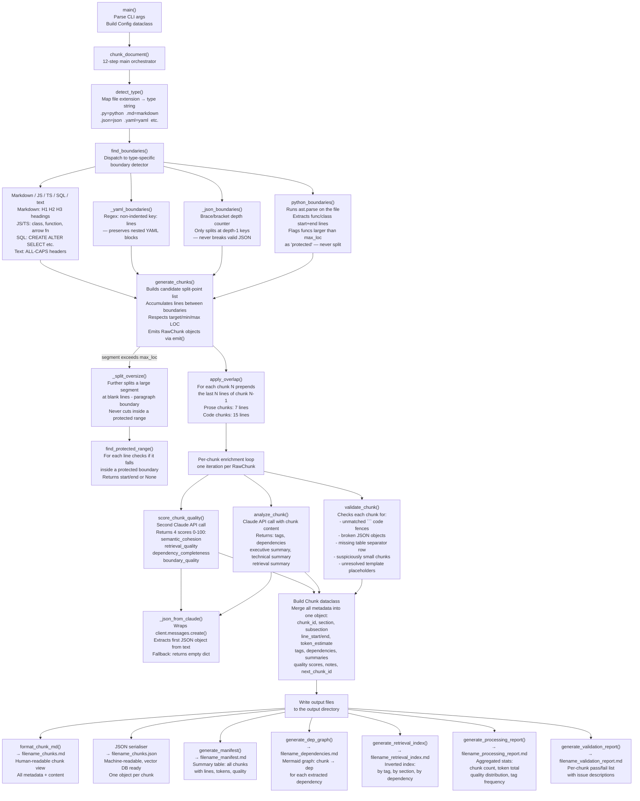

# Technical Specification Chunking Agent

A CLI tool that splits large technical documents into smaller, semantically meaningful pieces ("chunks") ready for use in RAG pipelines, vector databases, or LLM context windows.

---

## How It Works — 12 Steps

```
Document
   │
   ▼
[1] Parse          Detect file type (Markdown, Python, JSON, YAML, JS/TS, SQL, text)
   │
   ▼
[2] Hierarchy      Find headings, functions, classes, top-level keys → boundary list
   │
   ▼
[3] Split points   Candidate line numbers where a chunk can safely start
   │
   ▼
[4] Raw chunks     Slice document at boundaries, respecting target/min/max LOC limits
   │               Large functions (Python AST) are kept intact even if over the limit
   ▼
[5] Overlap        Copy trailing lines of chunk N onto the front of chunk N+1
   │               Prose: 7 lines  |  Code: 15 lines
   ▼
[6-8] Claude API   For each chunk, one API call returns:
   │               - tags (e.g. authentication, api, database)
   │               - dependencies (APIs, classes, env vars referenced)
   │               - 3 summaries: executive / technical / retrieval
   ▼
[9] Validate       Check each chunk for:
   │               - unmatched ``` code fences
   │               - broken JSON objects
   │               - markdown tables missing separator rows
   │               - suspiciously small chunks
   ▼
[10-12] Output     Write 7 files to the output directory (see below)
```

---

## Output Files

| File | Contents |
|------|----------|
| `*_chunks.md` | All chunks in human-readable format with metadata, summaries, tags |
| `*_chunks.json` | Same data as structured JSON — load directly into a vector DB |
| `*_manifest.md` | Table of all chunks: ID, section, line range, tokens, quality score |
| `*_dependencies.md` | Mermaid dependency graph (chunk → external dep) |
| `*_retrieval_index.md` | Index by tag, section, and dependency |
| `*_processing_report.md` | Stats: chunk count, token total, quality distribution |
| `*_validation_report.md` | Per-chunk pass/fail with issue descriptions |

---

## How to Test

### 1. Install the dependency

```bash
pip install anthropic
# or
pip install -r doc-chunker/requirements.txt
```

### 2. Fast test — no API key required

Uses `--no-claude` to skip Claude enrichment. Pure structural chunking only.

```bash
# Test on the repo's own CLAUDE.md
python3 doc-chunker/chunk_agent.py CLAUDE.md -o /tmp/test_output --no-claude

# Test on a Python file
python3 doc-chunker/chunk_agent.py doc-chunker/chunk_agent.py -o /tmp/test_output --no-claude
```

### 3. Full test — requires ANTHROPIC_API_KEY

```bash
export ANTHROPIC_API_KEY=sk-ant-...

# Markdown spec
python3 doc-chunker/chunk_agent.py my-spec.md -o ./chunks/

# Python service file
python3 doc-chunker/chunk_agent.py path/to/service.py -o ./chunks/

# YAML / OpenAPI spec
python3 doc-chunker/chunk_agent.py openapi.yaml -o ./chunks/
```

### 4. Check the output

```bash
# See all 7 output files
ls /tmp/test_output/

# Read the manifest (summary table)
cat /tmp/test_output/*_manifest.md

# Read the validation report
cat /tmp/test_output/*_validation_report.md

# Load JSON into Python for vector DB ingestion
python3 -c "import json; chunks = json.load(open('/tmp/test_output/CLAUDE_chunks.json')); print(len(chunks), 'chunks')"
```

---

## CLI Options

```
python3 doc-chunker/chunk_agent.py <file> [options]

  -o / --output DIR       Output directory (default: chunks_output)
  --target-loc  N         Target lines per chunk     (default: 400)
  --min-loc     N         Minimum lines per chunk    (default: 200)
  --max-loc     N         Maximum lines before split (default: 600)
  --prose-overlap N       Overlap lines for prose    (default: 7)
  --code-overlap  N       Overlap lines for code     (default: 15)
  --no-claude             Skip Claude API — fast, offline, no enrichment
```

---

## Supported File Types

| Extension | Boundary strategy |
|-----------|------------------|
| `.md` | H1 / H2 / H3 headings |
| `.py` | Python AST (function + class start/end lines) |
| `.js` `.ts` `.jsx` `.tsx` | Regex: class, function, arrow function |
| `.json` | Top-level object keys only |
| `.yaml` `.yml` | Top-level keys only |
| `.sql` | CREATE / ALTER / INSERT / SELECT statements |
| `.txt` `.rst` | ALL-CAPS section headers, markdown-style headings |

---

## What Each Chunk Contains (JSON)

```json
{
  "chunk_id": "MYSPEC_0003",
  "source_file": "my-spec.md",
  "document_title": "My Spec",
  "section": "Authentication",
  "subsection": "Token Refresh",
  "line_start": 120,
  "line_end": 198,
  "token_estimate": 420,
  "tags": ["authentication", "api", "jwt"],
  "dependencies": ["AuthService", "REFRESH_SECRET"],
  "summary": {
    "executive": "Describes how tokens are refreshed after expiry.",
    "technical": "Covers the /auth/refresh endpoint, JWT rotation strategy, and Redis TTL handling.",
    "retrieval": "token refresh jwt expiry authentication endpoint redis"
  },
  "quality": {
    "semantic_cohesion": 91,
    "retrieval_quality": 88,
    "dependency_completeness": 85,
    "boundary_quality": 90,
    "overall": 88
  },
  "content": "...",
  "next_chunk_id": "MYSPEC_0004"
}
```

---

## Code Architecture — Flowchart



---

## Code Section Map

| Lines | Section | What it does |
|-------|---------|--------------|
| 30–48 | **Constants** | Default LOC limits, overlap values, file-type suffix map, Claude model ID |
| 51–117 | **Data Classes** | `Config` `Boundary` `RawChunk` `Summaries` `Quality` `Chunk` — typed containers for all pipeline state |
| 119–122 | **detect_type()** | Looks up file extension in `_SUFFIX_MAP`, returns type string |
| 125–234 | **Boundary Detection** | `find_boundaries()` dispatches; `python_boundaries()` uses `ast`; `_json_boundaries()` tracks brace depth; `_yaml_boundaries()` uses regex |
| 237–259 | **Helpers** | `section_context()` — resolves current section/subsection from boundary list; `make_id()` — generates `STEM_NNNN` chunk IDs; `is_code_heavy()` — checks indent ratio |
| 271–279 | **find_protected_range()** | Checks if a given line number falls inside a boundary marked `protected=True` (large Python functions) |
| 282–401 | **Chunk Generation** | `generate_chunks()` — main slicing loop; `_split_oversize()` — paragraph-level fallback for huge segments; `apply_overlap()` — prepends tail lines |
| 404–498 | **Claude Enrichment** | `_json_from_claude()` — shared API wrapper; `analyze_chunk()` — tags/deps/summaries prompt; `score_chunk_quality()` — quality scoring prompt |
| 501–530 | **validate_chunk()** | Five integrity checks — code fences, JSON, tables, size, placeholders |
| 533–749 | **Output Formatters** | `format_chunk_md()`, `generate_manifest()`, `generate_dep_graph()`, `generate_retrieval_index()`, `generate_processing_report()`, `generate_validation_report()` |
| 752–905 | **chunk_document()** | Main orchestrator — runs all 12 steps in sequence, writes 7 output files |
| 908–952 | **main() / CLI** | `argparse` entry point — maps flags to `Config`, calls `chunk_document()` |
