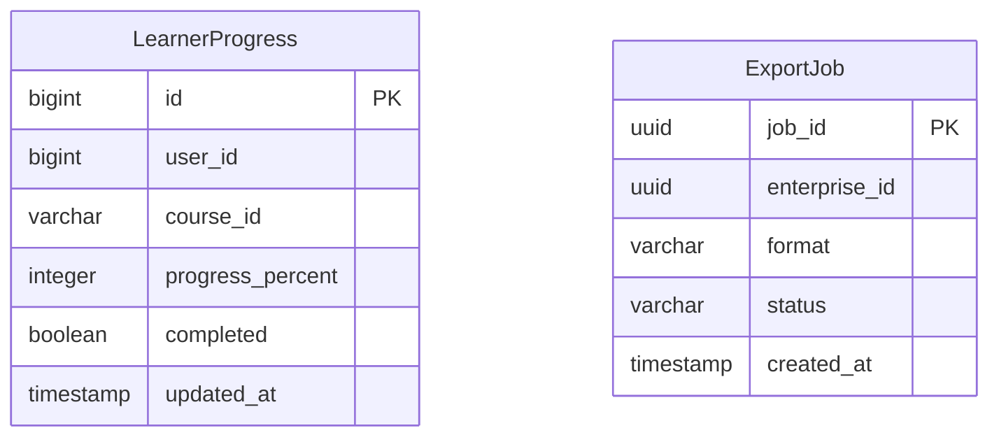
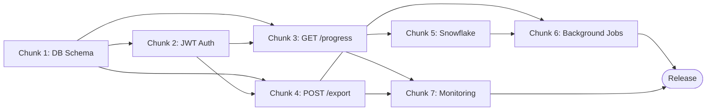

# Implementation Plan: Learning Platform Progress Reporting Service

## Document Classification

> **Type:** Plan Document (pre-build intent) + Living Execution Tracker
> Created during Sprint Alignment with pre-build intent. Updated during build with status.
> Becomes historical artifact after release. Retro section appended at sprint end.

---

## Overview

| Field | Value |
|-------|-------|
| PRD Link | `doc-chunker/skills/doc-chunker/test_document.md` |
| Tech Spec Link | `doc-chunker/skills/doc-chunker/test_document.md` |
| Engineering Lead | rgopalrao-sonata-png |
| Sprint | — |
| Status | Planning |
| Created | 2026-06-22 |
| Last Updated | 2026-06-22 |

---

## Chunk Summary

| # | Chunk | Status | Owner | Reviewer | Depends On | Unblocks | Est. Size |
|---|-------|--------|-------|----------|------------|----------|-----------|
| 1 | Database Schema & Migrations | 🔲 Not Started | Eng | Eng Lead | — | Chunk 2, 3, 4 | S |
| 2 | JWT Authentication | 🔲 Not Started | Eng | Eng Lead | Chunk 1 | Chunk 3, 4 | M |
| 3 | GET /api/v1/progress Endpoint | 🔲 Not Started | Eng | Eng Lead | Chunk 1, 2 | Chunk 5 | M |
| 4 | POST /api/v1/export Endpoint | 🔲 Not Started | Eng | Eng Lead | Chunk 1, 2 | Chunk 6 | M |
| 5 | Snowflake Integration | 🔲 Not Started | Eng | Eng Lead | Chunk 3 | Chunk 6 | L |
| 6 | Background Jobs | 🔲 Not Started | Eng | Eng Lead | Chunk 4, 5 | Release | M |
| 7 | Monitoring & Observability | 🔲 Not Started | Eng | Eng Lead | Chunk 3, 4 | Release | S |

---

## Chunks

### Chunk 1: Database Schema & Migrations

| Field | Detail |
|-------|--------|
| Purpose | Create the `learner_progress` table with all columns, indexes, and constraints |
| Exit Criteria | Migration applies cleanly; `progress_percent` constraints enforced; indexes present on `user_id` and `course_id` |
| Blast Radius | Database only — no application code yet; no impact on running services |
| Reviewer | Eng Lead |
| Depends On | None |
| Unblocks | Chunk 2, 3, 4 |
| Estimated Size | S (< half day) |
| Jira Ticket | — |
| Status | 🔲 Not Started |

#### Exit Criteria (Detailed)

- [ ] Migration creates `learner_progress` table with columns: `id (bigint)`, `user_id (bigint)`, `course_id (varchar)`, `progress_percent (integer)`, `completed (boolean)`, `updated_at (timestamp)`
- [ ] `CHECK` constraint enforces `progress_percent >= 0 AND progress_percent <= 100`
- [ ] `CREATE INDEX idx_user_id ON learner_progress(user_id)` present and verified via `\d learner_progress`
- [ ] `CREATE INDEX idx_course_id ON learner_progress(course_id)` present and verified
- [ ] `python manage.py migrate --check` exits 0 after applying the migration
- [ ] `python manage.py migrate` is reversible — rollback tested with `python manage.py migrate <app> <prev>`

#### Files to Change

| File | Change | Why |
|------|--------|-----|
| `progress/migrations/0001_initial.py` | New migration — `learner_progress` table | Schema must exist before any model or API code is written |
| `progress/models.py` | New `LearnerProgress` Django model with field definitions | ORM model must match the schema |

#### Notes / Decisions During Build

_(Append as you go)_

---

### Chunk 2: JWT Authentication

| Field | Detail |
|-------|--------|
| Purpose | Implement RS256 JWT issuance from API key, 60-minute expiry, 7-day refresh window, and DRF authentication class |
| Exit Criteria | Valid API key returns a JWT; invalid key returns 401; expired JWT returns 401; missing header returns 401 |
| Blast Radius | `auth/` module and DRF settings; no impact on schema or Snowflake |
| Reviewer | Eng Lead |
| Depends On | Chunk 1 (API key must be storable) |
| Unblocks | Chunk 3, 4 |
| Estimated Size | M (1 day) |
| Jira Ticket | — |
| Status | 🔲 Not Started |

#### Exit Criteria (Detailed)

- [ ] `POST /api/v1/auth/token` with valid API key returns `{"token": "<JWT>", "expires_in": 3600}`
- [ ] JWT payload contains `sub`, `customer_uuid`, `roles`, `exp` fields
- [ ] Algorithm is RS256 — verified by decoding the token header (`alg: RS256`)
- [ ] Request with expired JWT to any protected endpoint returns `{"detail": "Token expired"}` with HTTP 401
- [ ] Request with no `Authorization` header returns HTTP 401
- [ ] Request with valid JWT returns HTTP 200 on a protected endpoint
- [ ] `JWT_PRIVATE_KEY_PATH` and `JWT_PUBLIC_KEY_PATH` are read from environment — not hardcoded
- [ ] Rate-limited client (>N requests/min) receives HTTP 429

#### Files to Change

| File | Change | Why |
|------|--------|-----|
| `auth/views.py` | New — `TokenView`: validate API key, issue JWT | Token issuance endpoint |
| `auth/authentication.py` | New — `JWTAuthentication` DRF class: parse and validate Bearer token | All protected endpoints use this class |
| `auth/urls.py` | New — `/api/v1/auth/token` route | URL routing for token endpoint |
| `config/settings.py` | Add `JWT_PRIVATE_KEY_PATH`, `JWT_PUBLIC_KEY_PATH` env reads; add `JWTAuthentication` to `DEFAULT_AUTHENTICATION_CLASSES` | Activate authentication globally |

#### Notes / Decisions During Build

_(Append as you go)_

---

### Chunk 3: GET /api/v1/progress Endpoint

| Field | Detail |
|-------|--------|
| Purpose | Return paginated learner progress data filtered by `enterprise_id` (required) and optionally `course_id` |
| Exit Criteria | Valid request returns paginated JSON; missing `enterprise_id` returns 400; invalid JWT returns 401; unknown enterprise returns 404 |
| Blast Radius | `progress/` app — views, serializers, URLs; reads `learner_progress` table only |
| Reviewer | Eng Lead |
| Depends On | Chunk 1 (table must exist), Chunk 2 (auth must be wired) |
| Unblocks | Chunk 5 |
| Estimated Size | M (1 day) |
| Jira Ticket | — |
| Status | 🔲 Not Started |

#### Exit Criteria (Detailed)

- [ ] `GET /api/v1/progress?enterprise_id=<uuid>` returns `{"count": N, "results": [...]}` with HTTP 200
- [ ] Each result contains `user_id`, `progress`, `completed` fields
- [ ] `GET /api/v1/progress?enterprise_id=<uuid>&course_id=<uuid>` filters results to that course
- [ ] `page` parameter returns the correct page; out-of-range page returns empty results with HTTP 200
- [ ] Missing `enterprise_id` returns HTTP 400 with error detail
- [ ] Unknown `enterprise_id` returns HTTP 404
- [ ] Response time < 200ms for 1,000 records (measured with `pytest-benchmark` or `locust`)
- [ ] Unit tests cover: empty result, single record, > 100 records, course filter applied

#### Files to Change

| File | Change | Why |
|------|--------|-----|
| `progress/views.py` | New — `ProgressListView`: filter queryset, paginate, return serialized data | Core business logic |
| `progress/serializers.py` | New — `LearnerProgressSerializer`: `user_id`, `progress`, `completed` output fields | DRF response shape |
| `progress/urls.py` | New — `/api/v1/progress` route | URL routing |
| `config/urls.py` | Include `progress/urls.py` | Register app URLs |

#### Notes / Decisions During Build

_(Append as you go)_

---

### Chunk 4: POST /api/v1/export Endpoint

| Field | Detail |
|-------|--------|
| Purpose | Accept export requests, enqueue an async Celery job, return `job_id` and status `"queued"` |
| Exit Criteria | Valid request returns `job_id` and `"queued"`; invalid format returns 400; unauthenticated returns 401 |
| Blast Radius | `exports/` app, Celery task queue configuration; no schema change needed beyond export job tracking table |
| Reviewer | Eng Lead |
| Depends On | Chunk 1 (export jobs need storage), Chunk 2 (auth required) |
| Unblocks | Chunk 6 |
| Estimated Size | M (1 day) |
| Jira Ticket | — |
| Status | 🔲 Not Started |

#### Exit Criteria (Detailed)

- [ ] `POST /api/v1/export` with `{"enterprise_id": "123", "format": "csv"}` returns `{"job_id": "<id>", "status": "queued"}` with HTTP 202
- [ ] `job_id` is unique per request
- [ ] Unsupported `format` value returns HTTP 400 with `{"format": ["Value must be one of: csv"]}`
- [ ] Missing `enterprise_id` in body returns HTTP 400
- [ ] Celery task is queued — verifiable via Celery worker logs or `AsyncResult` state check
- [ ] Unit tests cover: valid CSV request, invalid format, missing enterprise_id, auth failure

#### Files to Change

| File | Change | Why |
|------|--------|-----|
| `exports/migrations/0001_initial.py` | New migration — `export_job` table (`job_id`, `enterprise_id`, `format`, `status`, `created_at`) | Must track job state |
| `exports/models.py` | New `ExportJob` model | ORM representation of the export job |
| `exports/views.py` | New — `ExportView`: validate request, create `ExportJob`, enqueue Celery task | Core export logic |
| `exports/tasks.py` | New — `run_export` Celery task: placeholder for CSV generation logic | Async worker |
| `exports/serializers.py` | New — request and response serializers | DRF input/output shape |
| `exports/urls.py` | New — `/api/v1/export` route | URL routing |

#### Notes / Decisions During Build

_(Append as you go)_

---

### Chunk 5: Snowflake Integration

| Field | Detail |
|-------|--------|
| Purpose | Write aggregated progress metrics to `COURSE_PROGRESS_FACT` and `DAILY_ENGAGEMENT_FACT` Snowflake tables |
| Exit Criteria | Aggregated rows appear in Snowflake after a test run; connection uses env-var credentials; no credentials in code |
| Blast Radius | `snowflake/` integration module; does not touch `learner_progress` table or API layer |
| Reviewer | Eng Lead |
| Depends On | Chunk 3 (progress data must be readable before writing to Snowflake) |
| Unblocks | Chunk 6 |
| Estimated Size | L (2–3 days) |
| Jira Ticket | — |
| Status | 🔲 Not Started |

#### Exit Criteria (Detailed)

- [ ] `SnowflakeWriter.write_progress_fact(records)` inserts rows into `ANALYTICS.REPORTING.COURSE_PROGRESS_FACT` with correct columns: `learner_id`, `enterprise_id`, `course_id`, `progress_percent`, `completion_status`
- [ ] `SnowflakeWriter.write_engagement_fact(records)` inserts rows into `ANALYTICS.REPORTING.DAILY_ENGAGEMENT_FACT` with: `learner_id`, `active_minutes`, `session_count`, `event_date`
- [ ] Connection reads `SNOWFLAKE_ACCOUNT`, `SNOWFLAKE_USER`, `SNOWFLAKE_WAREHOUSE` from environment — no credentials in source
- [ ] Writes are idempotent — re-running with the same data does not produce duplicate rows
- [ ] Integration test (using a Snowflake sandbox or mock) confirms row count before and after write

#### Files to Change

| File | Change | Why |
|------|--------|-----|
| `snowflake/client.py` | New — `SnowflakeWriter`: connection setup, `write_progress_fact()`, `write_engagement_fact()` | Encapsulates all Snowflake I/O |
| `config/settings.py` | Add `SNOWFLAKE_ACCOUNT`, `SNOWFLAKE_USER`, `SNOWFLAKE_WAREHOUSE` env reads | Config must not contain credentials |
| `requirements.txt` | Add `snowflake-connector-python` | SDK dependency |

#### Notes / Decisions During Build

_(Append as you go)_

---

### Chunk 6: Background Jobs

| Field | Detail |
|-------|--------|
| Purpose | Implement Daily Aggregation job (every 24h) and Export Cleanup job (every 6h) as Celery beat tasks |
| Exit Criteria | Both tasks are registered in Celery beat schedule; daily aggregation writes to Snowflake; cleanup removes expired export records |
| Blast Radius | `jobs/` module, Celery beat config; triggers `SnowflakeWriter` (Chunk 5) and `ExportJob` model (Chunk 4) |
| Reviewer | Eng Lead |
| Depends On | Chunk 4 (ExportJob model), Chunk 5 (SnowflakeWriter) |
| Unblocks | Release |
| Estimated Size | M (1 day) |
| Jira Ticket | — |
| Status | 🔲 Not Started |

#### Exit Criteria (Detailed)

- [ ] `jobs.tasks.run_daily_aggregation` is registered in `CELERY_BEAT_SCHEDULE` with `crontab(hour=0, minute=0)`
- [ ] `jobs.tasks.run_export_cleanup` is registered with `crontab(minute=0, hour='*/6')`
- [ ] `run_daily_aggregation` reads from `learner_progress`, recalculates metrics, writes to Snowflake via `SnowflakeWriter`
- [ ] `run_export_cleanup` deletes `ExportJob` records older than the configured retention period and archives completed jobs
- [ ] Both tasks are tested with `@pytest.mark.django_db` and mocked Snowflake/Celery dependencies
- [ ] Task failures are logged with structured error output — no silent failures

#### Files to Change

| File | Change | Why |
|------|--------|-----|
| `jobs/tasks.py` | New — `run_daily_aggregation` and `run_export_cleanup` Celery tasks | Core background job logic |
| `config/celery.py` | Add both tasks to `CELERY_BEAT_SCHEDULE` | Schedule the tasks |
| `config/settings.py` | Add `EXPORT_RETENTION_DAYS` env read (default 30) | Cleanup window must be configurable |

#### Notes / Decisions During Build

_(Append as you go)_

---

### Chunk 7: Monitoring & Observability

| Field | Detail |
|-------|--------|
| Purpose | Instrument the four key metrics; configure critical and warning alerts |
| Exit Criteria | All four metrics appear in the monitoring dashboard; critical alert fires when API availability drops below 99% |
| Blast Radius | Metrics middleware and alert config only — no business logic changes |
| Reviewer | Eng Lead |
| Depends On | Chunk 3, Chunk 4 (endpoints must exist to instrument) |
| Unblocks | Release |
| Estimated Size | S (< half day) |
| Jira Ticket | — |
| Status | 🔲 Not Started |

#### Exit Criteria (Detailed)

- [ ] `api_request_count` increments on every request to `/api/v1/progress` and `/api/v1/export`
- [ ] `api_error_count` increments on every 4xx / 5xx response
- [ ] `export_job_count` increments each time an export job is enqueued
- [ ] `aggregation_duration` records elapsed time for `run_daily_aggregation` in seconds
- [ ] Critical alert defined: fires when API availability drops below 99% for 5 consecutive minutes
- [ ] Warning alert defined: fires when export queue delay exceeds 15 minutes

#### Files to Change

| File | Change | Why |
|------|--------|-----|
| `monitoring/middleware.py` | New — `MetricsMiddleware`: count requests and errors per endpoint | Instruments `api_request_count` and `api_error_count` |
| `exports/tasks.py` | Add `export_job_count.inc()` call when job is enqueued | Tracks queue depth |
| `jobs/tasks.py` | Wrap `run_daily_aggregation` with timing — emit `aggregation_duration` | Tracks job performance |
| `monitoring/alerts.yml` | New — alert definitions for critical (availability < 99%) and warning (queue delay > 15 min) | Ops visibility |
| `config/settings.py` | Add `METRICS_ENABLED` env flag (default true) | Allow disabling in local dev |

#### Notes / Decisions During Build

_(Append as you go)_

---

## Data Model

### New Models

| Model | Fields | Relationships | Constraints | Notes |
|-------|--------|---------------|-------------|-------|
| `LearnerProgress` | `id (bigint PK)`, `user_id (bigint)`, `course_id (varchar)`, `progress_percent (integer)`, `completed (boolean)`, `updated_at (timestamp)` | — | `progress_percent` between 0 and 100 | Indexed on `user_id`, `course_id` |
| `ExportJob` | `job_id (uuid PK)`, `enterprise_id (uuid)`, `format (varchar)`, `status (varchar)`, `created_at (timestamp)` | — | `format` in `{'csv'}`, `status` in `{'queued', 'running', 'done', 'failed'}` | Chunk 6 cleanup targets rows older than `EXPORT_RETENTION_DAYS` |

### ERD

### Migrations

| Migration | Description | Risk | Rollback | Chunk |
|-----------|-------------|------|----------|-------|
| `progress/0001_initial` | Create `learner_progress` table with indexes and CHECK constraint | Low — new table | `python manage.py migrate progress zero` | 1 |
| `exports/0001_initial` | Create `export_job` table | Low — new table | `python manage.py migrate exports zero` | 4 |

---

## Test Plan

### Unit Tests

| Area | Scenarios | Chunk | Owner |
|------|-----------|-------|-------|
| JWT Authentication | Valid API key issues token; expired token returns 401; malformed token returns 401; RS256 algorithm used | 2 | Eng |
| `GET /api/v1/progress` | Empty results; single record; > 100 records; course_id filter; missing enterprise_id → 400; unknown enterprise → 404 | 3 | Eng |
| `POST /api/v1/export` | Valid CSV request → 202 + job_id; invalid format → 400; missing enterprise_id → 400 | 4 | Eng |
| `SnowflakeWriter` | Correct columns written to COURSE_PROGRESS_FACT; idempotent re-write does not duplicate rows | 5 | Eng |
| `run_daily_aggregation` | Reads progress records; calls SnowflakeWriter; emits aggregation_duration metric | 6 | Eng |
| `run_export_cleanup` | Deletes records older than retention period; does not delete recent records | 6 | Eng |

### Integration Tests

| Scenario | Systems Involved | Setup Required | Chunk | Owner |
|----------|-----------------|----------------|-------|-------|
| Full auth + progress flow | Auth, Progress API, DB | Seeded `learner_progress` rows, test API key | 3 | Eng |
| Export enqueue + worker pickup | Export API, Celery, DB | Redis broker running locally | 4 | Eng |
| Daily aggregation → Snowflake write | Aggregation job, Snowflake sandbox | Snowflake test account or mock | 5 | Eng |
| Metrics increment on real requests | Metrics middleware, Progress API | None | 7 | Eng |

### Edge Case Tests

| Edge Case | Expected Behavior | Test Type | Chunk |
|-----------|------------------|-----------|-------|
| `progress_percent` = 101 inserted directly | DB rejects with CHECK violation | Unit | 1 |
| JWT with wrong algorithm (HS256) | Returns 401 | Unit | 2 |
| `GET /api/v1/progress` with `page=99999` | Returns empty `results` list, HTTP 200 | Unit | 3 |
| Export request submitted twice with same `enterprise_id` | Two distinct `job_id` values returned | Unit | 4 |
| Snowflake connection times out | `SnowflakeWriter` raises and logs — no silent failure | Unit | 5 |
| Daily aggregation runs when `learner_progress` is empty | Task completes without error; no rows written | Unit | 6 |

### Test Data Requirements

| Data | Source | Setup Method | Teardown |
|------|--------|--------------|----------|
| `LearnerProgress` rows | Factory (e.g. `factory_boy`) | Create in test setup | Rolled back via `@pytest.mark.django_db(transaction=True)` |
| Valid RS256 key pair | Generated at test time | `cryptography.hazmat.primitives.asymmetric.rsa.generate_private_key` in `conftest.py` | In-memory — no file cleanup needed |
| Snowflake mock | `unittest.mock.patch` | Patch `SnowflakeWriter.write_progress_fact` | Automatic on test teardown |

---

## Ops Readiness

### Monitoring

| Metric | Dashboard | Alert Threshold | Severity |
|--------|-----------|-----------------|----------|
| `api_request_count` | API Overview | — | Info |
| `api_error_count` | API Overview | availability < 99% for 5 min | Critical |
| `export_job_count` | Export Queue | queue delay > 15 min | Warning |
| `aggregation_duration` | Background Jobs | duration > 30 min | Warning |

### Alerts

| Alert Name | Condition | Who Gets Paged | Response |
|------------|-----------|----------------|----------|
| API Availability Critical | `api_error_count / api_request_count > 0.01` sustained 5 min | On-call Eng | Check runbook §API-DOWN |
| Aggregation Failure | `run_daily_aggregation` task status = FAILURE | On-call Eng | Check Celery logs; re-trigger manually |
| Export Queue Delay | Queue delay > 15 min | On-call Eng | Check Celery worker count; scale if needed |

### Runbook

**Symptom: API availability drops below 99%**

Diagnosis steps:
1. Check `api_error_count` by endpoint — identify which route is failing.
2. `kubectl logs deployment/progress-reporting-api | grep ERROR` — look for stack traces.
3. Verify DB connectivity: `python manage.py dbshell` — can you connect?

Remediation:
- DB unreachable → check RDS/Cloud SQL health; failover if needed.
- Auth failures spiking → check if JWT private key path is readable; restart pod if rotated.

Escalation path: → Eng Lead → Platform team if DB or infra issue.

**Symptom: Daily aggregation not writing to Snowflake**

Diagnosis steps:
1. Check Celery beat is running: `celery -A config inspect scheduled`.
2. Check task result: `AsyncResult("<task_id>").status`.
3. Check Snowflake credentials: `SNOWFLAKE_ACCOUNT` env var is set.

Remediation: Re-trigger manually — `celery -A config call jobs.tasks.run_daily_aggregation`.

### Rollback Plan

- **Schema rollback:** `python manage.py migrate <app> <prev_migration>` — both migrations are reversible.
- **Code rollback:** `git revert <commit>` or deploy the previous Docker image tag.
- **Snowflake rollback:** Delete rows from `COURSE_PROGRESS_FACT` and `DAILY_ENGAGEMENT_FACT` inserted after the deployment timestamp.

### Feature Flags

| Flag | Default | Chunk | Rollback Behavior |
|------|---------|-------|------------------|
| `enable_csv_export` | `true` | 4 | Set to `false` → `POST /api/v1/export` returns 503 with "Export temporarily disabled" |
| `enable_async_reports` | `true` | 4 | Set to `false` → export runs synchronously (blocks request) |
| `enable_progress_cache` | `false` | 3 | Set to `true` → cache `GET /api/v1/progress` responses for 60s |
| `METRICS_ENABLED` | `true` | 7 | Set to `false` → middleware skips metric emission |

---

## Dependency Graph

---

## Retro

> Appended at sprint end. Target: 3–5 actionable items.

| Field | Value |
|-------|-------|
| Date | — |
| Participants | — |

**What Went Well**

_(fill in at sprint end)_

**What Didn't Go Well**

_(fill in at sprint end)_

**What Surprised Us**

_(fill in at sprint end)_

### Action Items

| # | Action | Owner | Target | Routed To |
|---|--------|-------|--------|-----------|
| 1 | | | | CLAUDE.md / Skills / Arch MD / KB |

---

## AI Prompts for This Document

### Stage 1 (Sprint Alignment)

> "Generate impl-plan chunks from test_document.md — each with a single responsibility and testable exit criterion"

> "For each chunk, identify blast radius — what services and components are touched and what could break?"

### Stage 1b (Chunk Review)

> "Pre-screen impl-plan chunks: flag any that touch >2 architectural layers, have ambiguous exit criteria, or are missing reviewer/blast-radius fields"

### Stage 2 (Technical Readiness)

> "Generate ERD from the data model section of impl-plan.md"

> "Generate test plan from exit criteria in impl-plan.md — cover unit, integration, and edge cases"

### Stage 3 (Build)

> "Build Chunk [N] from impl-plan.md. Follow patterns in CLAUDE.md. Run unit tests after each file change."
