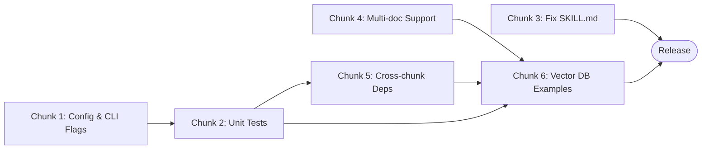

# Implementation Plan: Doc-Chunker Improvements

## Document Classification

> **Type:** Plan Document (pre-build intent) + Living Execution Tracker
> Created during Sprint Alignment with pre-build intent. Updated during build with status.
> Becomes historical artifact after release. Retro section appended at sprint end.

---

## Overview

| Field | Value |
|-------|-------|
| PRD Link | `doc-chunker/HOW_IT_WORKS.md` |
| Tech Spec Link | `doc-chunker/` (7-module codebase) |
| Engineering Lead | rgopalrao-sonata-png |
| Sprint | — |
| Status | Planning |
| Created | 2026-06-22 |
| Last Updated | 2026-06-22 |

---

## Chunk Summary

| # | Chunk | Status | Owner | Reviewer | Depends On | Unblocks | Est. Size |
|---|-------|--------|-------|----------|------------|----------|-----------|
| 1 | Expose Merge Thresholds via CLI | 🔲 Not Started | Eng | Eng Lead | — | Chunk 2 | S |
| 2 | Unit Test Suite | 🔲 Not Started | Eng | Eng Lead | Chunk 1 | Chunk 5 | L |
| 3 | Fix Stale SKILL.md Text | 🔲 Not Started | Eng | Eng Lead | — | Release | S |
| 4 | Multi-Document / Directory Input | 🔲 Not Started | Eng | Eng Lead | — | Chunk 6 | M |
| 5 | Cross-Chunk Dependency Linking | 🔲 Not Started | Eng | Eng Lead | Chunk 2 | Chunk 6 | M |
| 6 | Vector DB Integration Examples | 🔲 Not Started | Eng | Eng Lead | Chunk 2, 4, 5 | Release | M |

---

## Chunks

### Chunk 1: Expose Merge Thresholds via Config and CLI

| Field | Detail |
|-------|--------|
| Purpose | Add `--merge-min-tokens` and `--merge-max-tokens` as CLI flags so users can tune merging without editing source |
| Exit Criteria | Both flags appear in `--help`; lowering `--merge-min-tokens` produces more chunks; raising it produces fewer |
| Blast Radius | `models.py` (Config fields), `chunk_agent.py` (CLI), `chunker.py` (reads Config instead of constants) |
| Reviewer | Eng Lead |
| Depends On | None |
| Unblocks | Chunk 2 |
| Estimated Size | S (< half day) |
| Jira Ticket | — |
| Status | 🔲 Not Started |

#### Exit Criteria (Detailed)

- [ ] `python3 chunk_agent.py --help \| grep merge-min-tokens` returns the flag with its default value (120)
- [ ] `python3 chunk_agent.py test_document.md --no-claude --merge-min-tokens 50` produces more chunks than the default run
- [ ] `python3 chunk_agent.py test_document.md --no-claude --merge-min-tokens 500` produces fewer chunks than the default run
- [ ] `Config` dataclass has `merge_min_tokens: int = MERGE_MIN_TOKENS` and `merge_max_tokens: int = MERGE_MAX_TOKENS`
- [ ] `merge_small_chunks()` in `chunker.py` reads from `cfg` — no longer imports module-level constants directly

#### Files to Change

| File | Change | Why |
|------|--------|-----|
| `doc-chunker/models.py` | Add `merge_min_tokens` and `merge_max_tokens` fields to `Config` | Config is the single source of truth for all tuneable parameters |
| `doc-chunker/chunker.py` | Pass `merge_min` / `merge_max` into `merge_small_chunks()`; remove constant imports | Constants are hardcoded today — cannot be tuned without editing source |
| `doc-chunker/chunk_agent.py` | Add two `p.add_argument` calls; wire into `Config(...)` | Expose the flags at the CLI boundary |

#### Notes / Decisions During Build

_(Append as you go)_

---

### Chunk 2: Unit Test Suite

| Field | Detail |
|-------|--------|
| Purpose | Create a `tests/` directory with one test file per module; pytest must pass with ≥ 70% coverage |
| Exit Criteria | `pytest doc-chunker/tests/ -v` → 0 failures; coverage ≥ 70% on all 5 pipeline modules |
| Blast Radius | New `doc-chunker/tests/` directory only — no production code changes |
| Reviewer | Eng Lead |
| Depends On | Chunk 1 (Config fields must exist before testing them) |
| Unblocks | Chunk 5 |
| Estimated Size | L (2–3 days) |
| Jira Ticket | — |
| Status | 🔲 Not Started |

#### Exit Criteria (Detailed)

- [ ] `pytest doc-chunker/tests/ -v` → 0 failures, 0 errors
- [ ] `pytest --cov=doc-chunker --cov-report=term-missing` → ≥ 70% line coverage on `boundaries.py`, `chunker.py`, `enrichment.py`, `validation.py`, `output.py`
- [ ] `test_boundaries.py` covers: `detect_type`, `find_boundaries` on a 3-heading doc, headings inside fences are skipped, `section_context`
- [ ] `test_chunker.py` covers: raw chunk count ≥ 8 before merge, `merge_small_chunks` merges two 50-token chunks, does NOT merge two 200-token chunks, `_balance_fence_tail` strips until fences balance, `apply_overlap` sets `primary_lines`
- [ ] `test_enrichment.py` covers: `extract_semantic_deps` finds JWT in auth content, `score_chunk_quality_offline` gives cohesion < 80 for a 3-H2 chunk, `extract_no_claude_metadata` does NOT use overlap content
- [ ] `test_validation.py` covers: flags chunk with odd ``` count, passes a clean chunk
- [ ] `test_output.py` covers: `format_chunk_md` includes `🔁 Context Carryover` when `overlap_content` non-empty; `generate_manifest` row count matches chunk count

#### Files to Change

| File | Change | Why |
|------|--------|-----|
| `doc-chunker/tests/__init__.py` | Create empty | Makes `tests/` a Python package |
| `doc-chunker/conftest.py` | `sys.path.insert(0, ...)` to the `doc-chunker/` dir | Modules use relative imports; pytest needs the path set |
| `doc-chunker/tests/test_boundaries.py` | New — test `boundaries.py` | 0 tests exist today |
| `doc-chunker/tests/test_chunker.py` | New — test `chunker.py` | 0 tests exist today |
| `doc-chunker/tests/test_enrichment.py` | New — test `enrichment.py` | 0 tests exist today |
| `doc-chunker/tests/test_validation.py` | New — test `validation.py` | 0 tests exist today |
| `doc-chunker/tests/test_output.py` | New — test `output.py` | 0 tests exist today |

#### Notes / Decisions During Build

_(Append as you go)_

---

### Chunk 3: Fix Stale SKILL.md Troubleshooting Text

| Field | Detail |
|-------|--------|
| Purpose | Remove outdated guidance that tells users code fence warnings are "expected and not a failure" — they are now fixed at the code level |
| Exit Criteria | `grep "This is expected" SKILL.md` → 0 results; updated text describes the real remaining edge case |
| Blast Radius | `doc-chunker/skills/doc-chunker/SKILL.md` only |
| Reviewer | Eng Lead |
| Depends On | None |
| Unblocks | Release |
| Estimated Size | S (< half day) |
| Jira Ticket | — |
| Status | 🔲 Not Started |

#### Exit Criteria (Detailed)

- [ ] `grep -n "This is expected" doc-chunker/skills/doc-chunker/SKILL.md` → 0 lines
- [ ] `grep -n "target-loc 600" doc-chunker/skills/doc-chunker/SKILL.md` → 0 lines (stale workaround removed)
- [ ] Replacement text explains: fence warnings now only appear when the code block is inside the chunk's primary content (not in overlap), and gives a correct fix

#### Files to Change

| File | Change | Why |
|------|--------|-----|
| `doc-chunker/skills/doc-chunker/SKILL.md` | Replace lines 172–173 troubleshooting block | `_balance_fence_tail()` fixes overlap-boundary fences — the old advice is wrong and will mislead users |

#### Notes / Decisions During Build

_(Append as you go)_

---

### Chunk 4: Multi-Document / Directory Input

| Field | Detail |
|-------|--------|
| Purpose | Allow `chunk_agent.py` to accept a directory path and chunk all supported files in one command |
| Exit Criteria | `python3 chunk_agent.py <dir>/ --no-claude` processes all files; prints "Processed N files → M chunks"; writes combined manifest |
| Blast Radius | `chunk_agent.py` (CLI routing), `output.py` (combined manifest column) — no changes to pipeline modules |
| Reviewer | Eng Lead |
| Depends On | None |
| Unblocks | Chunk 6 |
| Estimated Size | M (1 day) |
| Jira Ticket | — |
| Status | 🔲 Not Started |

#### Exit Criteria (Detailed)

- [ ] `python3 chunk_agent.py doc-chunker/skills/doc-chunker/ -o /tmp/multi_out/ --no-claude` exits 0 and prints "Processed N files → M total chunks"
- [ ] Each processed file gets its own subdirectory: `/tmp/multi_out/<stem>/`
- [ ] `/tmp/multi_out/_combined_manifest.md` exists and contains a `Source File` column
- [ ] Unsupported extensions print a warning to stderr and are skipped — never silently ignored
- [ ] `python3 chunk_agent.py /tmp/does_not_exist/ --no-claude` exits non-zero with an error message

#### Files to Change

| File | Change | Why |
|------|--------|-----|
| `doc-chunker/chunk_agent.py` | Detect if `args.input` is a directory; glob supported extensions; loop `chunk_document()` per file | One-file-at-a-time is the only mode today |
| `doc-chunker/output.py` | Add `source_file` column to `generate_manifest`; add `generate_combined_manifest()` | Per-file manifests lack origin; combined manifest needs a new formatter |

#### Notes / Decisions During Build

_(Append as you go)_

---

### Chunk 5: Cross-Chunk Dependency Linking

| Field | Detail |
|-------|--------|
| Purpose | Add a `referenced_by` field to each chunk listing which other chunks reference it; emit chunk-to-chunk edges in the dependency graph |
| Exit Criteria | At least 1 chunk in test output has non-empty `referenced_by`; dep graph contains at least 1 chunk-to-chunk edge |
| Blast Radius | `models.py` (new field), `chunk_agent.py` (post-loop pass), `output.py` (dep graph edges) — additive only |
| Reviewer | Eng Lead |
| Depends On | Chunk 2 (tests must cover the cross-ref logic) |
| Unblocks | Chunk 6 |
| Estimated Size | M (1 day) |
| Jira Ticket | — |
| Status | 🔲 Not Started |

#### Exit Criteria (Detailed)

- [ ] `Chunk` dataclass in `models.py` has `referenced_by: list[str]` field
- [ ] JSON output includes `"referenced_by": [...]` for every chunk
- [ ] `python3 -c "import json; chunks = json.load(open('chunks_output/test_document_chunks.json')); print([c for c in chunks if c['referenced_by']])"` → at least 1 non-empty entry
- [ ] `cat chunks_output/test_document_dependencies.md` shows at least one `CHUNK_X --> CHUNK_Y` edge (not just chunk-to-dep-name edges)
- [ ] `referenced_by` is documented in `HOW_IT_WORKS.md` as "offline: pattern-matched (best-effort)"

#### Files to Change

| File | Change | Why |
|------|--------|-----|
| `doc-chunker/models.py` | Add `referenced_by: list[str] = field(default_factory=list)` to `Chunk` | Field does not exist; JSON consumers expect it |
| `doc-chunker/chunk_agent.py` | Post-loop pass: build `dep_to_chunks` index; populate `referenced_by` on each chunk | Cross-referencing requires all chunks to be processed first |
| `doc-chunker/output.py` | `generate_dep_graph` emits `CHUNK_X --> CHUNK_Y` edges from `referenced_by` lists | Current graph only shows chunk → external dep name edges |

#### Notes / Decisions During Build

_(Append as you go)_

---

### Chunk 6: Vector DB Integration Examples

| Field | Detail |
|-------|--------|
| Purpose | Provide three runnable loader scripts (ChromaDB, pgvector, Pinecone) showing how to ingest `*_chunks.json` into a vector database |
| Exit Criteria | Three `.py` scripts in `examples/`; each embeds `content` only (not `context_carryover`); all parse without syntax errors |
| Blast Radius | New `doc-chunker/examples/` directory only — no production code changes |
| Reviewer | Eng Lead |
| Depends On | Chunk 2, Chunk 4, Chunk 5 |
| Unblocks | Release |
| Estimated Size | M (1 day) |
| Jira Ticket | — |
| Status | 🔲 Not Started |

#### Exit Criteria (Detailed)

- [ ] `ls doc-chunker/examples/` shows `load_chromadb.py`, `load_pgvector.py`, `load_pinecone.py`, `README.md`
- [ ] `grep -n "context_carryover" doc-chunker/examples/load_chromadb.py` → 0 lines (carryover must NOT be embedded)
- [ ] `grep -n 'chunk\["content"\]' doc-chunker/examples/load_chromadb.py` → ≥ 1 line (primary content IS embedded)
- [ ] `python3 -c "import ast; ast.parse(open('doc-chunker/examples/load_chromadb.py').read()); print('ok')"` → `ok` for all three scripts
- [ ] `examples/README.md` explains: embed `content`, pass `context_carryover` to LLM context window only, and why they are separate fields

#### Files to Change

| File | Change | Why |
|------|--------|-----|
| `doc-chunker/examples/load_chromadb.py` | New — ChromaDB loader | Users have JSON chunks but no clear path to a vector DB |
| `doc-chunker/examples/load_pgvector.py` | New — pgvector loader | pgvector is the most common self-hosted option in edX services |
| `doc-chunker/examples/load_pinecone.py` | New — Pinecone loader | Pinecone is the most common managed option |
| `doc-chunker/examples/README.md` | New — explains which field to embed and why | Critical: embedding `context_carryover` would pollute the vector index |

#### Notes / Decisions During Build

_(Append as you go)_

---

## Data Model

### New / Changed Fields

| Model | Field | Type | Default | Notes |
|-------|-------|------|---------|-------|
| `Config` | `merge_min_tokens` | `int` | `120` | Chunk 1 — absorb adjacent chunks below this token count |
| `Config` | `merge_max_tokens` | `int` | `350` | Chunk 1 — reject merge if combined result exceeds this |
| `Chunk` | `referenced_by` | `list[str]` | `[]` | Chunk 5 — chunk IDs that reference this chunk's deps |

### ERD

Not applicable — this is a CLI tool with no database tables. All data lives in the `*_chunks.json` output file.

```mermaid
erDiagram
    %% No database tables — data model is the Chunk dataclass in models.py
```

### Migrations

Not applicable — no database.

| Migration | Description | Risk | Rollback | Chunk |
|-----------|-------------|------|----------|-------|
| — | No DB migrations required | — | — | — |

---

## Test Plan

### Unit Tests

| Area | Scenarios | Chunk | Owner |
|------|-----------|-------|-------|
| `boundaries.py` | `detect_type` for all extensions; `find_boundaries` on 3-heading doc; headings inside fences skipped; `section_context` returns correct pair | 2 | Eng |
| `chunker.py` | Raw chunk count ≥ 8 before merge; merge absorbs 50-token pair; merge rejects 200-token pair; `_balance_fence_tail` balances fences; `apply_overlap` sets `primary_lines` | 2 | Eng |
| `enrichment.py` | `extract_semantic_deps` finds JWT; finds named service; `score_chunk_quality_offline` cohesion < 80 for 3-H2 chunk; boundary < 75 for mid-sentence start; `extract_no_claude_metadata` excludes overlap | 2 | Eng |
| `validation.py` | Flags odd ``` count; passes clean chunk with 0 issues | 2 | Eng |
| `output.py` | `format_chunk_md` includes carryover block when non-empty; excludes when empty; manifest row count matches chunk count | 2 | Eng |
| `Config` flags | `--merge-min-tokens 50` produces more chunks; `--merge-min-tokens 500` produces fewer | 2 | Eng |

### Integration Tests

| Scenario | Systems Involved | Setup Required | Chunk | Owner |
|----------|-----------------|----------------|-------|-------|
| End-to-end `test_document.md` with `--no-claude` | `chunk_agent.py` + all modules | None — uses fixture file | 2 | Eng |
| Directory input processes all `.md` files | `chunk_agent.py`, `output.py` | Temp dir with 2–3 test fixtures | 4 | Eng |
| JSON output loads into ChromaDB | `load_chromadb.py` | `pip install chromadb` | 6 | Eng |

### Edge Case Tests

| Edge Case | Expected Behavior | Test Type | Chunk |
|-----------|------------------|-----------|-------|
| Input file does not exist | Exit 1, error to stderr | Unit | 2 |
| File with zero H2 headings | Single chunk covering entire file | Unit | 2 |
| All code fences unbalanced in overlap | `_balance_fence_tail` corrects; validation flags remaining primary-content fences | Unit | 2 |
| Directory with mixed file types | Supported files processed; unsupported extensions warned, skipped | Integration | 4 |
| Two adjacent chunks both below 120 tokens | Merged into one; result ≤ 350 tokens | Unit | 2 |
| Both merge flags passed | Both respected; Config holds correct values | Unit | 2 |

### Test Data Requirements

| Data | Source | Setup Method | Teardown |
|------|--------|--------------|----------|
| `test_document.md` | Existing fixture in `doc-chunker/skills/doc-chunker/` | Copy to `tests/fixtures/` | None — read-only |
| Synthetic 3-H2 chunk string | Created inline in test | Hardcoded string constant | None |
| Synthetic unbalanced-fence chunk | Created inline in test | Hardcoded string constant | None |

---

## Ops Readiness

### Monitoring

Not applicable — this is a developer CLI tool, not a production service.

| Metric | Dashboard | Alert Threshold | Severity |
|--------|-----------|-----------------|----------|
| — | — | — | — |

### Alerts

Not applicable.

| Alert Name | Condition | Who Gets Paged | Response |
|------------|-----------|----------------|----------|
| — | — | — | — |

### Runbook

**Symptom:** Quality scores all identical, or validation issues spike from 0 to many after a code change.

**Diagnosis steps:**
1. Run `python3 chunk_agent.py test_document.md --no-claude -o /tmp/debug/` — compare chunk count and scores to baseline (7 chunks, avg 89/100).
2. Check `/tmp/debug/test_document_validation_report.md` for new issue categories.
3. `git diff doc-chunker/chunker.py doc-chunker/enrichment.py` — look for regressions in merge/overlap logic.

**Remediation:** Revert the offending commit; re-run to confirm baseline is restored.

**Escalation path:** Tag Eng Lead if regression is in `apply_overlap` or `merge_small_chunks` — those functions have ordering dependencies.

### Rollback Plan

All changes are in `doc-chunker/` with no database migrations and no deployed services.

- Rollback = `git revert <commit>` or `git checkout <prior-sha> -- doc-chunker/`
- No feature flags gate production behaviour — tool is run locally.

### Feature Flags

| Flag | Default | Chunk | Rollback Behavior |
|------|---------|-------|------------------|
| `--no-claude` | Off (Claude enrichment on) | Existing | Offline scoring — already implemented |
| `--merge-min-tokens` | 120 | 1 | Set to 120 to restore default merge behaviour |
| `--merge-max-tokens` | 350 | 1 | Set to 350 to restore default merge behaviour |

---

## Dependency Graph



---

## Retro

> Appended at sprint end. Target: 3–5 actionable items.

| Field | Value |
|-------|-------|
| Date | — |
| Participants | — |

**What Went Well**

_(fill in at sprint end)_

**What Didn't Go Well**

_(fill in at sprint end)_

**What Surprised Us**

_(fill in at sprint end)_

### Action Items

| # | Action | Owner | Target | Routed To |
|---|--------|-------|--------|-----------|
| 1 | | | | CLAUDE.md / Skills / Arch MD / KB |

---

## AI Prompts for This Document

### Stage 1 (Sprint Alignment)

> "Generate impl-plan chunks from the doc-chunker codebase gaps — each with a single responsibility and testable exit criterion"

> "For each chunk, identify blast radius — what modules are touched and what could break?"

### Stage 1b (Chunk Review)

> "Pre-screen impl-plan chunks: flag any that touch >2 modules, have ambiguous exit criteria, or are missing reviewer/blast-radius fields"

### Stage 2 (Technical Readiness)

> "Generate test plan from exit criteria in doc-chunker/impl-plan.md — cover unit, integration, and edge cases"

> "Review this impl-plan against the current doc-chunker codebase. Identify gaps, contradictions, and chunks where the exit criterion cannot be verified without a running database."

### Stage 3 (Build)

> "Build Chunk [N] from doc-chunker/impl-plan.md. Follow patterns in the existing modules. Run `pytest doc-chunker/tests/ -v` after each file change."
