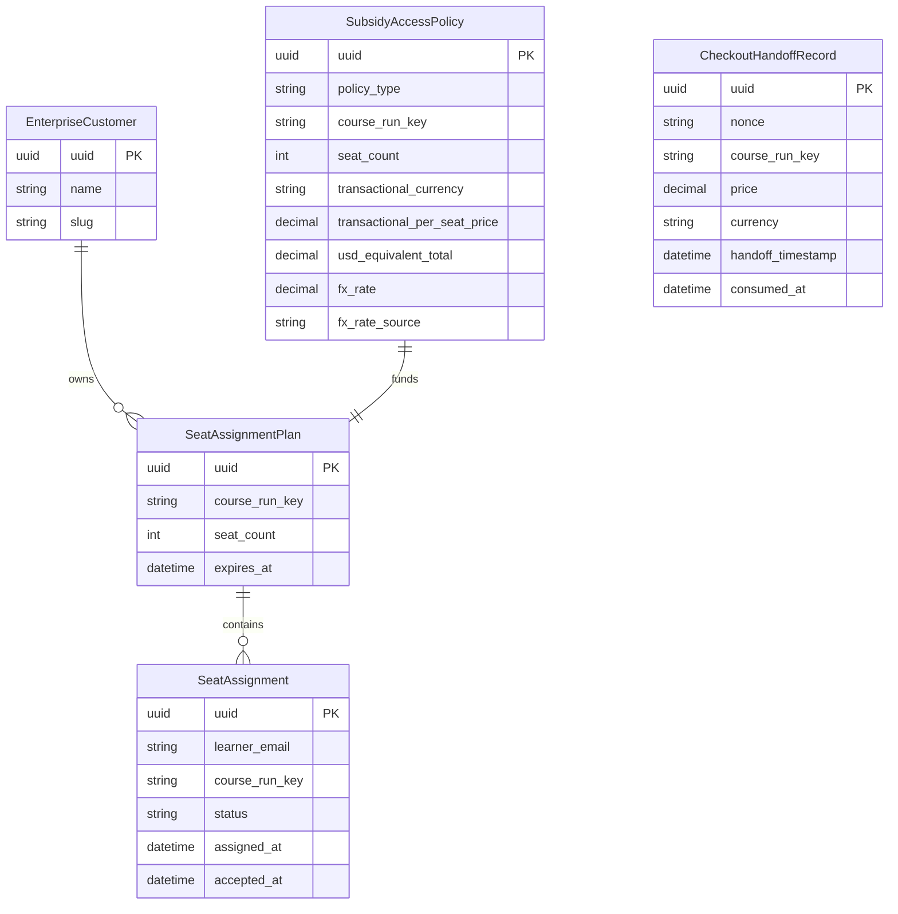
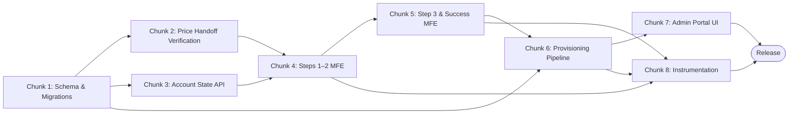

# Implementation Plan: Self-Service Purchasing for Exec Ed Courses

## Document Classification

> **Type:** Plan Document (pre-build intent) + Living Execution Tracker
> Created during Sprint Alignment with pre-build intent. Updated during build with status.
> Becomes historical artifact after release. Retro section appended at sprint end.

---

## Overview

| Field | Value |
|-------|-------|
| PRD Link | `chunks_output/test_chunks.json` (source: `test.txt`) |
| Tech Spec Link | — |
| Engineering Lead | rgopalrao-sonata-png |
| Sprint | — |
| Status | Planning |
| Created | 2026-06-25 |
| Last Updated | 2026-06-25 |

---

## Chunk Summary

| # | Chunk | Status | Owner | Reviewer | Depends On | Unblocks | Est. Size |
|---|-------|--------|-------|----------|------------|----------|-----------|
| 1 | Seat-Based Subsidy Schema & Migrations | 🔲 Not Started | Eng | Eng Lead | — | 2, 3, 6 | M |
| 2 | Price Handoff Verification Service | 🔲 Not Started | Eng | Eng Lead | 1 | 4 | M |
| 3 | Account State Resolution API | 🔲 Not Started | Eng | Eng Lead | 1 | 4 | M |
| 4 | Checkout Steps 1–2 MFE | 🔲 Not Started | Eng | Eng Lead | 2, 3 | 5 | M |
| 5 | Checkout Step 3 & Success Page MFE | 🔲 Not Started | Eng | Eng Lead | 4 | 6, 8 | M |
| 6 | Post-Payment Provisioning Pipeline | 🔲 Not Started | Eng | Eng Lead | 1, 5 | 7, 8 | L |
| 7 | Admin Portal — Seat Assignments UI | 🔲 Not Started | Eng | Eng Lead | 6 | Release | L |
| 8 | Checkout & Provisioning Instrumentation | 🔲 Not Started | Eng | Eng Lead | 4, 5, 6 | Release | S |

---

### Chunk 1: Seat-Based Subsidy Schema & Migrations

| Field | Detail |
|-------|--------|
| Purpose | Extend the subsidy access policy schema to record seat-count, transactional price/currency, FX metadata, and course-run scoping at both the budget and assignment layers |
| Exit Criteria | New fields exist on all affected models; migrations run forwards and backwards without error |
| Blast Radius | `enterprise-access` Django service — model and migration layer only; no view or task code touched |
| Reviewer | Eng Lead |
| Depends On | None |
| Unblocks | Chunks 2, 3, 6 |
| Estimated Size | M |
| Jira Ticket | — |
| Status | 🔲 Not Started |

#### Exit Criteria (Detailed)

- [ ] `SubsidyAccessPolicy` has new fields `seat_count` (PositiveIntegerField, default=0), `transactional_currency` (CharField max_length=3, blank=True), `transactional_per_seat_price` (DecimalField max_digits=12 decimal_places=2, null=True), `usd_equivalent_total` (DecimalField, null=True), `fx_rate` (DecimalField, null=True), `fx_rate_source` (CharField, blank=True), and `course_run_key` (CharField, blank=True) stored at the policy/budget level (separate from any assignment-level field)
- [ ] New model `SeatAssignmentPlan` exists with fields: `uuid` PK, FK to `EnterpriseCustomer`, FK to `SubsidyAccessPolicy`, `course_run_key`, `seat_count`, `expires_at`, `created`, `modified`; no unique-together constraint on `(enterprise_customer, subsidy_access_policy)` — multiple plans per customer are explicitly allowed
- [ ] New model `SeatAssignment` exists with fields: `uuid` PK, FK to `SeatAssignmentPlan`, `learner_email` (EmailField), `course_run_key` (CharField), `status` (choices: pending / accepted / forfeited), `assigned_at`, `accepted_at` (null), `unassigned_at` (null); unique together on `(plan, learner_email)` enforced at DB level
- [ ] New model `CheckoutHandoffRecord` exists with fields: `uuid` PK, `nonce` (CharField, db_index=True, unique=True), `course_run_key`, `price` (DecimalField), `currency` (CharField max_length=3), `handoff_timestamp` (DateTimeField), `consumed_at` (DateTimeField, null=True), `hmac_signature` (CharField)
- [ ] `python manage.py migrate enterprise_access` completes in under 30 seconds on a DB with 100,000 existing `SubsidyAccessPolicy` rows (fields are nullable or have defaults; no full-table rewrite)
- [ ] Running the migration in reverse (`migrate enterprise_access <prior_number>`) drops the new columns and tables without error and without affecting existing policy rows

#### Files to Change

| File | Change | Why |
|------|--------|-----|
| `enterprise_access/apps/subsidy_access_policy/models.py` | Modify — add seat-count, currency, price, FX, and `course_run_key` fields to `SubsidyAccessPolicy` | PRD R-16, R-19, R-37: price and content key must be persisted at the budget layer |
| `enterprise_access/apps/checkout/models.py` | New — `SeatAssignmentPlan`, `SeatAssignment`, `CheckoutHandoffRecord` models | PRD R-17, R-18, R-19, R-39 |
| `enterprise_access/apps/subsidy_access_policy/migrations/0XXX_add_ssp_ee_fields.py` | New — migration for policy-level field additions | Required for schema change |
| `enterprise_access/apps/checkout/migrations/0001_initial.py` | New — initial migration for checkout app models | Required |
| `enterprise_access/apps/checkout/admin.py` | New — Django admin registration for new models | Operational visibility for on-call |

#### Notes / Decisions During Build

_(Append as you go)_

---

### Chunk 2: Price Handoff Verification Service

| Field | Detail |
|-------|--------|
| Purpose | Implement the backend endpoint and service that ingests, verifies, and stores the HMAC-SHA256-signed price-handoff payload from GetSmarter, and re-validates price against the live GetSmarter catalog API before any Stripe charge |
| Exit Criteria | Invalid/replayed/expired payloads are rejected before any state is written; price mismatches return a structured error instead of proceeding to charge |
| Blast Radius | `enterprise-access` service — new checkout API endpoint + service layer; reads Redis (nonce cache) and calls GetSmarter product API (read-only outbound) |
| Reviewer | Eng Lead |
| Depends On | Chunk 1 |
| Unblocks | Chunk 4 |
| Estimated Size | M |
| Jira Ticket | — |
| Status | 🔲 Not Started |

#### Exit Criteria (Detailed)

- [ ] `POST /api/v1/exec-ed-checkout/handoff/` returns HTTP 422 with `{"error": "invalid_signature"}` when the HMAC-SHA256 of `{course_run_key, price, currency, timestamp, nonce}` does not match the `signature` field in the payload using the configured shared secret
- [ ] The endpoint returns HTTP 422 with `{"error": "expired_payload"}` when `handoff_timestamp` is more than 30 minutes before the server's current time
- [ ] The endpoint returns HTTP 422 with `{"error": "replayed_nonce"}` when the `nonce` value matches a previously stored nonce; nonce is stored in Redis with a 31-minute TTL after first successful use
- [ ] On a valid first-use payload the endpoint writes a `CheckoutHandoffRecord` row and returns HTTP 201 with `{"handoff_uuid": "<uuid>", "course_run_key": "...", "price": "...", "currency": "..."}`
- [ ] `POST /api/v1/exec-ed-checkout/validate-price/` (called server-side at Step 3 submit) fetches the live per-seat price from the GetSmarter product API for the stored `course_run_key` and returns HTTP 409 with `{"error": "price_changed", "captured_price": "...", "current_price": "...", "currency": "..."}` when values differ
- [ ] Currency values outside the 12-currency allowlist (`USD GBP ZAR EUR AED SGD HKD SAR INR CAD CHF AUD`) cause the handoff endpoint to return HTTP 422 with `{"error": "unsupported_currency"}`

#### Files to Change

| File | Change | Why |
|------|--------|-----|
| `enterprise_access/apps/checkout/views.py` | New — `HandoffVerificationView`, `PriceValidationView` | Exposes the two verification endpoints |
| `enterprise_access/apps/checkout/services.py` | New — `verify_handoff_payload()`, `validate_price_against_catalog()`, `store_nonce()`, `nonce_already_used()` | Encapsulates HMAC logic, nonce dedup, and catalog API call |
| `enterprise_access/apps/checkout/serializers.py` | New — `HandoffPayloadSerializer`, `PriceValidationSerializer` | Request/response validation |
| `enterprise_access/apps/checkout/urls.py` | New — URL patterns for checkout app | Wires views |
| `enterprise_access/apps/api/v1/urls.py` | Modify — include `checkout.urls` | Registers endpoints under `/api/v1/` |
| `enterprise_access/apps/checkout/tests/test_services.py` | New — unit tests for all HMAC rejection branches, nonce dedup, price validation | Coverage for security-critical path |
| `enterprise_access/apps/checkout/tests/test_views.py` | New — integration tests for both endpoints | API contract verification |

#### Notes / Decisions During Build

_(Append as you go)_

---

### Chunk 3: Account State Resolution API

| Field | Detail |
|-------|--------|
| Purpose | Implement the backend endpoint that resolves a buyer's edX identity post-Step-1 into one of four deterministic routing branches |
| Exit Criteria | All four branches return the correct response shape; the query resolves in a single DB round-trip |
| Blast Radius | `enterprise-access` service — read-only queries against `EnterpriseCustomerUser` and `SubsidyAccessPolicy`; no data written |
| Reviewer | Eng Lead |
| Depends On | Chunk 1 |
| Unblocks | Chunk 4 |
| Estimated Size | M |
| Jira Ticket | — |
| Status | 🔲 Not Started |

#### Exit Criteria (Detailed)

- [ ] `POST /api/v1/exec-ed-checkout/account-state/` with `{"email": "new@example.com"}` returns `{"state": "register"}` when no edX account exists for that email
- [ ] Returns `{"state": "login_non_admin"}` when an edX account exists but the user has no `EnterpriseCustomerUser` record with admin role
- [ ] Returns `{"state": "login_seat_based_admin", "enterprise_customer_uuid": "<uuid>"}` when the user is an admin on an Enterprise customer whose active subsidy policy has `policy_type = SeatBasedAccessPolicy`
- [ ] Returns `{"state": "lc_admin_block"}` when the user is an admin on an Enterprise customer whose active subsidy is `LearnerCreditAccessPolicy`
- [ ] The endpoint resolves state in a single DB round-trip (verified with `assertNumQueries(1)` in the unit test)
- [ ] The response is identical for `register` whether the email is unknown or belongs to a deactivated user — no account-existence leakage

#### Files to Change

| File | Change | Why |
|------|--------|-----|
| `enterprise_access/apps/checkout/views.py` | Modify — add `AccountStateView` | Adds Step 1b resolution endpoint |
| `enterprise_access/apps/checkout/services.py` | Modify — add `resolve_account_state(email)` | 4-branch resolution logic |
| `enterprise_access/apps/checkout/serializers.py` | Modify — add `AccountStateRequestSerializer`, `AccountStateResponseSerializer` | Input validation and typed response |
| `enterprise_access/apps/checkout/tests/test_services.py` | Modify — add tests for all four `resolve_account_state` branches including query-count assertion | Coverage |

#### Notes / Decisions During Build

_(Append as you go)_

---

### Chunk 4: Checkout Steps 1–2 MFE

| Field | Detail |
|-------|--------|
| Purpose | Build the checkout MFE screens for Step 1 (buyer details form), Step 1b (account routing UI states), and Step 2 (organization name/slug collection) |
| Exit Criteria | All form validations fire client-side and are re-enforced server-side; all four Step 1b states render correctly; WCAG 2.1 AA passes via axe-core |
| Blast Radius | `frontend-app-exec-ed-checkout` MFE — new React components and API hooks; reads from Chunks 2 and 3 backend APIs; no backend state written in this chunk |
| Reviewer | Eng Lead |
| Depends On | Chunks 2, 3 |
| Unblocks | Chunk 5 |
| Estimated Size | M |
| Jira Ticket | — |
| Status | 🔲 Not Started |

#### Exit Criteria (Detailed)

- [ ] Step 1 "Continue" button renders with `aria-disabled` and an inline error ("Must be between 2 and 10 seats") when seat count is < 2 or > 10; a direct server call with an out-of-range `seat_count` also returns HTTP 400
- [ ] The country `<select>` field excludes all countries on the configured banned-country list; injecting a banned country value via browser console and submitting is caught server-side with HTTP 400 (tested via Playwright in integration)
- [ ] Authenticated users arrive at Step 1 with name and email pre-filled as read-only `<input readonly>` elements; unauthenticated users see empty editable fields
- [ ] After Step 1 submit, each of the four `AccountStateView` responses renders the correct UI: `register` → registration modal overlay; `login_non_admin` → login modal; `login_seat_based_admin` → login modal that, on success, advances to Step 2 with company name and slug pre-filled read-only; `lc_admin_block` → full-page terminal block with explanation copy and a CTA linking to the Enterprise sales contact form
- [ ] Step 2 slug field fires an inline "This URL is already taken" error within one 300 ms debounce cycle when a conflicting slug is entered (server round-trip, not client-side set)
- [ ] All interactive elements pass axe-core with zero violations: labeled form fields, announced error messages, 4.5:1 contrast ratio on body text, 3:1 on large text and UI components, fully keyboard-navigable tab order

#### Files to Change

| File | Change | Why |
|------|--------|-----|
| `frontend-app-exec-ed-checkout/src/components/Step1BuyerDetails/index.jsx` | New — seat count, name, email, country form using Paragon components | R-02, R-03, R-10, R-12 |
| `frontend-app-exec-ed-checkout/src/components/Step1b/AccountStateRouter.jsx` | New — renders correct branch UI based on account-state API response | R-09 |
| `frontend-app-exec-ed-checkout/src/components/Step2OrgDetails/index.jsx` | New — company name + slug form; read-only variant for existing admins | R-04, R-05 |
| `frontend-app-exec-ed-checkout/src/data/hooks/useAccountState.js` | New — React hook wrapping Chunk 3 API call | Separates data-fetching from UI |
| `frontend-app-exec-ed-checkout/src/data/hooks/useSlugAvailability.js` | New — debounced slug uniqueness check | R-04 |
| `frontend-app-exec-ed-checkout/src/components/Step1BuyerDetails/index.test.jsx` | New — unit tests for seat count range, banned-country, auth pre-fill, axe-core scan | Coverage |
| `frontend-app-exec-ed-checkout/src/components/Step1b/AccountStateRouter.test.jsx` | New — unit tests for all four branch renders | Coverage |

#### Notes / Decisions During Build

_(Append as you go)_

---

### Chunk 5: Checkout Step 3 & Success Page MFE

| Field | Detail |
|-------|--------|
| Purpose | Build the Stripe billing screen (Step 3) and the post-payment success page, including forfeiture disclaimer, price-changed recovery state, and Stripe decline error handling |
| Exit Criteria | Card data never touches edX servers; forfeiture disclaimer shows the captured currency amount; price-changed recovery state renders without proceeding to charge |
| Blast Radius | `frontend-app-exec-ed-checkout` MFE — Stripe Elements integration; calls Chunk 2's price-validation endpoint and Stripe payment-intent API |
| Reviewer | Eng Lead |
| Depends On | Chunk 4 |
| Unblocks | Chunks 6, 8 |
| Estimated Size | M |
| Jira Ticket | — |
| Status | 🔲 Not Started |

#### Exit Criteria (Detailed)

- [ ] A browser Network tab recording during a test purchase shows zero requests from any `edx.org` or `enterprise-access` endpoint containing card numbers or CVVs — all card data goes directly to Stripe's iframe origin
- [ ] The forfeiture disclaimer renders above the T&C checkboxes on Step 3 and references the captured currency amount (e.g., "loss of the full purchase amount of €4,500 with no refund") sourced from the `CheckoutHandoffRecord` stored in Chunk 2, not a USD equivalent
- [ ] When the back-end's `validate-price` endpoint returns `{"error": "price_changed"}`, Step 3 renders a recovery state showing both the prior price and the new price, plus an "Update price and continue" button that patches the captured price and re-enables submission without restarting the checkout
- [ ] On successful Stripe charge, the success page renders: course name, course-run start date, seat count, order total in the captured currency, last-4 card digits, and order ID
- [ ] "Go to admin portal" CTA on the success page routes to `/<enterprise_slug>/seat-assignments/`
- [ ] On Stripe decline, the step renders the `decline_code` (e.g., `insufficient_funds`) and retry guidance; no second `confirmCardPayment` call is made before the user explicitly retries (verified by asserting `stripe.confirmCardPayment` mock was called exactly once per submit click)

#### Files to Change

| File | Change | Why |
|------|--------|-----|
| `frontend-app-exec-ed-checkout/src/components/Step3Billing/index.jsx` | New — Stripe Elements embed, forfeiture disclaimer, T&C checkboxes | R-06, R-30, R-39 |
| `frontend-app-exec-ed-checkout/src/components/Step3Billing/PriceChangedRecovery.jsx` | New — recovery state UI for price-mismatch scenario | R-39 |
| `frontend-app-exec-ed-checkout/src/components/SuccessPage/index.jsx` | New — order summary, portal CTA, receipt download link | R-07, R-08 |
| `frontend-app-exec-ed-checkout/src/data/hooks/useStripePayment.js` | New — wraps `stripe.confirmCardPayment`, handles decline codes | Isolates Stripe.js from component |
| `frontend-app-exec-ed-checkout/src/components/Step3Billing/index.test.jsx` | New — tests for forfeiture disclaimer content, price-changed render, decline error render | Coverage |
| `frontend-app-exec-ed-checkout/src/components/SuccessPage/index.test.jsx` | New — tests that all required order-summary fields are present | Coverage |

#### Notes / Decisions During Build

_(Append as you go)_

---

### Chunk 6: Post-Payment Provisioning Pipeline

| Field | Detail |
|-------|--------|
| Purpose | Implement the Celery tasks that provision a new Enterprise admin portal, learner portal, and seat-based subsidy for new buyers — or a new standalone Seat Assignment Plan for existing admins — and dispatch Salesforce Opportunity creation and Braze confirmation email |
| Exit Criteria | Full provisioning completes within 60 seconds for a new buyer; Salesforce Opportunity is created within 5 minutes; Braze email fires within 5 minutes; the task is idempotent on re-run |
| Blast Radius | `enterprise-access` Celery workers, `edx-enterprise` `EnterpriseCustomer` model (write), Salesforce REST API (write), Braze transactional API (write) |
| Reviewer | Eng Lead |
| Depends On | Chunks 1, 5 |
| Unblocks | Chunks 7, 8 |
| Estimated Size | L |
| Jira Ticket | — |
| Status | 🔲 Not Started |

#### Exit Criteria (Detailed)

- [ ] For a net-new buyer, `provision_ssp_ee_purchase` task creates `EnterpriseCustomer`, `EnterpriseCustomerUser` (admin role), `EnterpriseCustomerCatalog`, `SubsidyAccessPolicy` (seat-based, `course_run_key` set), and `SeatAssignmentPlan` — all inside a single DB transaction that rolls back atomically on any step failure
- [ ] For an existing seat-based admin, the task creates only a new `SeatAssignmentPlan` and a new `SubsidyAccessPolicy` linked to the existing `EnterpriseCustomer`; no existing plan, policy, or admin-user record is modified
- [ ] `SeatAssignmentPlan.expires_at` is set to exactly 183 days after the course run's end date, fetched from the GetSmarter catalog API; if the API call fails, `expires_at` falls back to 183 days from `now()` and an ERROR is logged with the `course_run_key`
- [ ] A Salesforce Opportunity is created within 5 minutes of Stripe payment confirmation; if the Salesforce API call fails, the task retries with exponential back-off up to 3 times before logging ERROR and continuing (Opportunity failure does not roll back provisioning)
- [ ] A Braze `exec_ed_purchase_confirmation` transactional email is sent within 5 minutes of provisioning completion, containing course name, course-run start date, seat count, total in captured currency, admin portal URL, and order ID (verified via Braze message log in staging)
- [ ] Re-running `provision_ssp_ee_purchase` with the same `order_id` returns immediately with the existing plan UUID and writes no duplicate rows (idempotency guard on `order_id`)

#### Files to Change

| File | Change | Why |
|------|--------|-----|
| `enterprise_access/apps/checkout/tasks.py` | New — `provision_ssp_ee_purchase`, `create_salesforce_opportunity`, `send_purchase_confirmation_email` Celery tasks | R-16, R-17, R-33, R-34 |
| `enterprise_access/apps/checkout/services.py` | Modify — add `provision_new_enterprise()`, `provision_existing_admin_plan()` service functions | Separates provisioning logic from Celery boilerplate |
| `enterprise_access/apps/checkout/crm.py` | New — `SalesforceOpportunityClient` wrapping Salesforce REST API with retry logic | R-33 |
| `enterprise_access/apps/checkout/email.py` | New — `send_braze_purchase_confirmation(order_id, ...)` function | R-34 |
| `enterprise_access/apps/checkout/views.py` | Modify — `StripeWebhookView` that calls `provision_ssp_ee_purchase.delay(order_id)` on `payment_intent.succeeded` webhook | Triggers provisioning from Stripe event |
| `enterprise_access/apps/checkout/tests/test_tasks.py` | New — integration tests with mocked external clients; idempotency test; rollback test on mid-task failure | Coverage |

#### Notes / Decisions During Build

_(Append as you go)_

---

### Chunk 7: Admin Portal — Seat Assignments UI

| Field | Detail |
|-------|--------|
| Purpose | Build the Seat Assignments landing page, plan detail page with Activity and Learners tabs, seat-assignment modal, registration-deadline banner, and post-course-start seat-change lock |
| Exit Criteria | All seat operations are enforced both in the UI and server-side; deadline banner escalates correctly through three severity tiers; the locked state is visible and the unassign API returns 403 after course start |
| Blast Radius | `frontend-app-admin-portal` MFE — new route and component tree; calls `SeatAssignmentPlan` and `SeatAssignment` read/write endpoints in `enterprise-access` |
| Reviewer | Eng Lead |
| Depends On | Chunk 6 |
| Unblocks | Release |
| Estimated Size | L |
| Jira Ticket | — |
| Status | 🔲 Not Started |

#### Exit Criteria (Detailed)

- [ ] Seat Assignments landing page renders one card per `SeatAssignmentPlan` owned by the authenticated admin's Enterprise customer, each card displaying: plan title, status badge (Active / Expiring / Expired), expiration date, vendor tag "GetSmarter", "X unassigned" indicator when open seats > 0, and a Balance footer showing Total / Allocated / Open expressed as seat counts — never raw dollar amounts
- [ ] Seat assignment modal accepts a newline-separated list of emails and renders a per-row result table after submission, with exactly one of six outcome labels per row: invite sent, invalid format, duplicate, domain not allowed, banned learner, or over-capacity; over-capacity is checked atomically server-side so concurrent submissions cannot over-assign
- [ ] After the course run's `start_date` has passed: the "Assign seat", "Assign all", "Unassign", and "Resend invite" actions are absent from the Learners tab DOM; a `POST /api/v1/exec-ed-checkout/seat-assignments/<uuid>/unassign/` call returns HTTP 403 with `{"error": "course_started"}` (verified with a direct API call in integration tests with `start_date` patched to the past)
- [ ] Registration-deadline banner renders at Paragon `Alert` variant `warning` when any plan has unassigned seats and its enrollment deadline is ≤ 7 days away; escalates to `danger` at ≤ 3 days; when ≥ 3 plans are at warning or danger severity an aggregate "X unassigned seats across N courses" row is shown; severity is conveyed by icon + text, never by color alone (WCAG 1.4.1)
- [ ] Plan detail page Activity tab renders a table sorted most-recent-first with columns Date, Activity (Purchase / Assignment / Acceptance), Detail, and right-aligned Count; current page and active filter are reflected in the URL query string
- [ ] All monetary-adjacent displays for SSP EE budgets in the admin portal show seat counts (e.g., "8 seats total · 5 assigned · 3 open"); a search for any `$` or `€` symbol in SSP EE plan card and detail DOM nodes finds zero matches

#### Files to Change

| File | Change | Why |
|------|--------|-----|
| `frontend-app-admin-portal/src/components/SeatAssignments/SeatAssignmentsPage.jsx` | New — landing page with plan cards, search, status filter, pagination | R-22 |
| `frontend-app-admin-portal/src/components/SeatAssignments/PlanCard.jsx` | New — individual plan card with seat-count-only display | R-22, R-28 |
| `frontend-app-admin-portal/src/components/SeatAssignments/PlanDetailPage.jsx` | New — breadcrumb, hero block, 3-tab scaffold, URL-reflected active tab | R-23 |
| `frontend-app-admin-portal/src/components/SeatAssignments/tabs/ActivityTab.jsx` | New — paginated chronological activity table | R-24 |
| `frontend-app-admin-portal/src/components/SeatAssignments/tabs/LearnersTab.jsx` | New — open seats section, assigned seats table, post-start lock notice | R-25, R-27, R-29 |
| `frontend-app-admin-portal/src/components/SeatAssignments/modals/AssignSeatModal.jsx` | New — email input, per-row result table | R-20 |
| `frontend-app-admin-portal/src/components/SeatAssignments/banners/DeadlineNotificationBanner.jsx` | New — 3-tier shared deadline banner | R-21, R-26 |
| `frontend-app-admin-portal/src/index.jsx` | Modify — add `/seat-assignments` route | Registers new page |
| `enterprise_access/apps/checkout/views.py` | Modify — add `SeatAssignmentPlanListView`, `SeatAssignmentCreateView`, `SeatUnassignView` | Backend for admin portal UI calls |

#### Notes / Decisions During Build

_(Append as you go)_

---

### Chunk 8: Checkout & Provisioning Instrumentation

| Field | Detail |
|-------|--------|
| Purpose | Emit all required Segment events across the checkout and provisioning flows so that the K-01 through K-08 KPI funnel is queryable from day one without custom SQL |
| Exit Criteria | All eight named Segment events fire with required properties; the K-01 funnel report returns event counts in the Segment workspace |
| Blast Radius | `frontend-app-exec-ed-checkout` MFE (frontend events) and `enterprise-access` Celery tasks (backend events); no new API endpoints and no DB schema changes |
| Reviewer | Eng Lead |
| Depends On | Chunks 4, 5, 6 |
| Unblocks | Release |
| Estimated Size | S |
| Jira Ticket | — |
| Status | 🔲 Not Started |

#### Exit Criteria (Detailed)

- [ ] `exec_ed_teams_cta_clicked` fires on the GetSmarter CTA click with properties `course_run_key` and `anonymous_id` (or `user_id` if authenticated)
- [ ] `checkout_step_1_entered`, `checkout_step_2_entered`, `checkout_step_3_entered` each fire on step component mount with `course_run_key`, `seat_count` (null for step 1 until submitted), and `step` number
- [ ] `checkout_step_3_submitted` fires on `stripe.confirmCardPayment` initiation with `course_run_key`, `seat_count`, `currency`, and `total_amount`
- [ ] `checkout_completed` fires after Stripe success with `order_id`, `course_run_key`, `seat_count`, `currency`, `total_amount`, and `user_id`
- [ ] `checkout_abandoned` fires via a `beforeunload` listener when the user navigates away from any checkout step without completing, carrying `step` and `course_run_key`
- [ ] `provisioning_completed` fires from the Celery task after successful `SeatAssignmentPlan` creation with `order_id`, `enterprise_customer_uuid`, `course_run_key`, `seat_count`, and `buyer_type` (`new` or `existing_admin`)
- [ ] A Segment funnel report "SSP EE Checkout Funnel" exists in the Segment workspace and returns per-step counts for the K-01 funnel without requiring custom SQL (verified by running the report in staging with seeded test events)

#### Files to Change

| File | Change | Why |
|------|--------|-----|
| `frontend-app-exec-ed-checkout/src/data/segment.js` | New — `trackCheckoutEvent(name, properties)` utility wrapping `window.analytics.track` | Single place to enforce required property shapes |
| `frontend-app-exec-ed-checkout/src/components/Step1BuyerDetails/index.jsx` | Modify — call `trackCheckoutEvent('checkout_step_1_entered', ...)` on mount | K-04 |
| `frontend-app-exec-ed-checkout/src/components/Step3Billing/index.jsx` | Modify — call `checkout_step_3_submitted`, `checkout_completed`, `checkout_abandoned` (beforeunload) | K-01, K-05 |
| `enterprise_access/apps/checkout/tasks.py` | Modify — call `track_server_event('provisioning_completed', ...)` after successful plan creation | K-06 |
| `enterprise_access/apps/checkout/segment.py` | New — `track_server_event(event_name, properties)` wrapping the Segment Python client | Encapsulates server-side event emission |

#### Notes / Decisions During Build

_(Append as you go)_

---

## Data Model

### New Models

| Model | Fields | Relationships | Constraints | Notes |
|-------|--------|---------------|-------------|-------|
| `SeatAssignmentPlan` | `uuid` (PK), `course_run_key` (str), `seat_count` (int), `expires_at` (datetime), `created`, `modified` | FK to `EnterpriseCustomer`; FK to `SubsidyAccessPolicy` | No merge constraint — multiple plans per customer allowed | Created fresh per purchase; never merged with existing plans (R-17, R-18) |
| `SeatAssignment` | `uuid` (PK), `learner_email` (email), `course_run_key` (str), `status` (pending/accepted/forfeited), `assigned_at`, `accepted_at` (null), `unassigned_at` (null) | FK to `SeatAssignmentPlan` | Unique `(plan, learner_email)` at DB level | `course_run_key` stored at assignment level for dual content-identifier requirement (R-19) |
| `CheckoutHandoffRecord` | `uuid` (PK), `nonce` (unique str), `course_run_key` (str), `price` (decimal), `currency` (char 3), `handoff_timestamp` (datetime), `consumed_at` (datetime, null), `hmac_signature` (str) | None | `nonce` unique; index on `nonce` | Persists signed GetSmarter payload for replay prevention and pre-charge re-validation (R-39) |

### Modified Models

| Model | New Fields | Reason |
|-------|-----------|--------|
| `SubsidyAccessPolicy` | `seat_count`, `transactional_currency`, `transactional_per_seat_price`, `usd_equivalent_total`, `fx_rate`, `fx_rate_source`, `course_run_key` | Record transactional pricing at budget layer for forfeiture enforcement, price-locking, and V2 secondary purchases (R-16, R-19, R-37) |

### ERD

### Migrations

| Migration | Description | Risk | Rollback | Chunk |
|-----------|-------------|------|----------|-------|
| `enterprise_access/apps/subsidy_access_policy/migrations/0XXX_add_ssp_ee_fields` | Add seat-count, currency, price, FX, and `course_run_key` fields to `SubsidyAccessPolicy` | Low — nullable/default additions, no table rewrite | `migrate enterprise_access <prior>` | 1 |
| `enterprise_access/apps/checkout/migrations/0001_initial` | Create `SeatAssignmentPlan`, `SeatAssignment`, and `CheckoutHandoffRecord` tables | Low — new tables only | `migrate enterprise_access checkout zero` | 1 |

---

## Test Plan

### Unit Tests

| Area | Scenarios | Chunk | Owner |
|------|-----------|-------|-------|
| HMAC verification | Valid signature passes; wrong key fails; expired timestamp (31 min) fails; replayed nonce fails | 2 | Eng |
| Price re-validation | Prices match → 200; price differs → 409 with both values; GetSmarter API timeout → 503 | 2 | Eng |
| Currency allowlist | Valid currency passes; currency outside 12-allowlist → 422 `unsupported_currency` | 2 | Eng |
| Account state resolution | New email → register; known non-admin → login_non_admin; seat-based admin → login_seat_based_admin; LC admin → lc_admin_block; assertNumQueries(1) | 3 | Eng |
| Step 1 form | Seat count 1 blocked; seat count 11 blocked; seat count 2 and 10 pass; banned country injected → server 400 | 4 | Eng |
| Step 1b routing | All 4 API state responses map to correct UI component rendered; lc_admin_block shows no checkout continuation | 4 | Eng |
| Step 3 billing | Stripe decline → `decline_code` shown; `price_changed` → recovery state renders; forfeiture disclaimer contains captured currency symbol | 5 | Eng |
| Provisioning task | New buyer: 5 records created in one transaction; existing admin: new plan only; mid-task failure rolls back; idempotent on same `order_id` | 6 | Eng |
| Seat assignment | Over-capacity blocked server-side; post-start-date unassign → 403; duplicate email → per-row `duplicate` label | 7 | Eng |
| Segment events | All 7 frontend events fire with required properties (mock `window.analytics.track`); `provisioning_completed` emitted by task | 8 | Eng |

### Integration Tests

| Scenario | Systems Involved | Setup Required | Chunk | Owner |
|----------|-----------------|----------------|-------|-------|
| Full checkout — new buyer, single course | Checkout MFE → enterprise-access API → Stripe test mode → Celery → DB | Stripe test key; GetSmarter product API mock; Celery worker | 5, 6 | Eng |
| Full checkout — existing seat-based admin | Same + existing `EnterpriseCustomer` fixture | Same + seeded admin fixture | 6 | Eng |
| LC admin block terminal | Checkout MFE → account-state API | Seeded LC admin fixture | 3, 4 | Eng |
| Seat assignment after provisioning | Admin portal MFE → enterprise-access seat-assignment API | Provisioned plan fixture | 7 | Eng |
| Post-course-start lock | Unassign API call with `start_date` patched to the past | Plan with past `start_date` | 7 | Eng |

### Edge Case Tests

| Edge Case | Expected Behavior | Test Type | Chunk |
|-----------|------------------|-----------|-------|
| Same nonce submitted twice within 31 minutes | Second request returns 422 `replayed_nonce` | Unit | 2 |
| GetSmarter price changes between handoff and Step 3 submit | `price_changed` recovery state shown; no Stripe charge initiated | Integration | 5 |
| Provisioning task crashes after Enterprise creation but before plan creation | DB transaction rolls back; no orphaned `EnterpriseCustomer`; task safe to re-run | Unit (mock) | 6 |
| Two admins submit seat assignments simultaneously for the last remaining seat | One succeeds; the other receives `over-capacity` per-row outcome | Integration | 7 |
| Buyer makes two separate 10-seat purchases for the same course | Both succeed; two distinct `SeatAssignmentPlan` rows created; no cross-transaction enforcement | Integration | 6 |
| Currency outside the 12-currency allowlist in handoff payload | Handoff endpoint returns 422 `unsupported_currency`; checkout blocks with sales CTA | Unit | 2 |

### Test Data Requirements

| Data | Source | Setup Method | Teardown |
|------|--------|--------------|----------|
| `EnterpriseCustomer` (seat-based admin) | Factory | `EnterpriseCustomerFactory(active_subsidy__policy_type='SeatBased')` | Django `TestCase.tearDown` |
| `EnterpriseCustomer` (LC admin) | Factory | `EnterpriseCustomerFactory(active_subsidy__policy_type='LearnerCredit')` | Same |
| GetSmarter product API responses | Mock | `responses` library fixtures in `tests/fixtures/getsmarter_product.json` | N/A (mock) |
| Stripe test payments | Stripe test mode | Test card `4242 4242 4242 4242`; decline card `4000 0000 0000 9995` | N/A (Stripe test mode auto-clears) |
| Signed handoff payload | Factory | `CheckoutHandoffRecordFactory(consumed_at=None)` | Same |

---

## Ops Readiness

### Monitoring

| Metric | Dashboard | Alert Threshold | Severity |
|--------|-----------|-----------------|----------|
| `checkout_completed` event rate | Grafana / SSP EE dashboard | Drop > 50% vs. 1h rolling baseline | P1 |
| `provision_ssp_ee_purchase` Celery task failure rate | Celery Flower / Datadog | > 5 failures in 10 minutes | P1 |
| Payment processing latency (step_3_submitted → checkout_completed) | Grafana | p99 > 30 s | P2 |
| Salesforce Opportunity creation failure rate | Datadog log metric on `crm.py` ERROR | > 3 failures in 5 minutes | P2 |
| HMAC rejection rate (`invalid_signature` + `replayed_nonce` responses) | Datadog | > 10 in 1 minute | P1 — possible replay attack |

### Alerts

| Alert Name | Condition | Who Gets Paged | Response |
|------------|-----------|----------------|----------|
| SSP EE provisioning failure spike | Celery failure rate > 5 in 10 min | On-call engineer | See Runbook: Provisioning Failures |
| HMAC replay attack suspected | > 10 `replayed_nonce` / `invalid_signature` responses in 1 min | Security on-call | Rotate HMAC secret; coordinate with GetSmarter |
| Checkout conversion drop | `checkout_completed` drops > 50% vs. 1h baseline | On-call engineer + PM | Check Stripe status; check GetSmarter product API health |

### Runbook

**Symptom:** Buyer reports completing payment but has no admin portal or Seat Assignment Plan card.

Diagnosis steps:
1. Check Celery Flower or run `celery -A enterprise_access inspect active` — confirm `provision_ssp_ee_purchase` completed for the `order_id`
2. If not in completed list, check Datadog logs filtered on `task=provision_ssp_ee_purchase` for ERROR entries
3. Query `CheckoutHandoffRecord` by `order_id` — confirm `consumed_at` is non-null (payment was received)
4. If `consumed_at` is set but no `SeatAssignmentPlan` exists for that `order_id`, re-trigger: `provision_ssp_ee_purchase.delay(order_id="<uuid>")`

Remediation: Re-running with the same `order_id` is safe — the task is idempotent and returns early if the plan already exists.

Escalation path: If re-trigger fails 3 times, escalate to enterprise-access team lead.

**Symptom:** HMAC rejection rate alert fires (possible price-tampering or replay attack).

Diagnosis steps:
1. Check Datadog for source IPs and user agents triggering `invalid_signature` or `replayed_nonce` responses
2. Check whether spike correlates with a GetSmarter deployment (legitimate payload-format change) vs. anomalous IPs

Remediation: If attack confirmed, rotate the HMAC shared secret immediately and coordinate with GetSmarter to deploy the new secret. All active checkout sessions restart from Step 1.

Escalation path: Security team + VP Engineering.

### Rollback Plan

- **Code rollback:** Feature flag `SSP_EE_SELF_SERVE_ENABLED` defaults to `False`; setting it `False` hides the GetSmarter CTA and returns HTTP 503 from all `/exec-ed-checkout/` endpoints within one config deploy — no code revert required
- **Schema rollback:** `python manage.py migrate enterprise_access <prior>` drops new tables and columns; safe because no other feature reads these models in V1
- **Already-provisioned buyers:** No automated rollback for Enterprise customers already provisioned; the support team handles manual cleanup on a case-by-case basis

### Feature Flags

| Flag | Default | Chunk | Rollback Behavior |
|------|---------|-------|------------------|
| `SSP_EE_SELF_SERVE_ENABLED` | `False` | 1 — set `True` in staging when Chunk 4 is complete | Hides GetSmarter CTA; `/exec-ed-checkout/` returns 503 |
| `SSP_EE_SEAT_ASSIGNMENT_UI_ENABLED` | `False` | 7 — set `True` when Chunk 7 is complete | Hides "Seat Assignments" nav item in admin portal |

---

## Dependency Graph

---

## Retro

> Appended at sprint end. Target: 3–5 actionable items.

| Field | Value |
|-------|-------|
| Date | — |
| Participants | — |

**What Went Well** _(fill in at sprint end)_

**What Didn't Go Well** _(fill in at sprint end)_

**What Surprised Us** _(fill in at sprint end)_

### Action Items

| # | Action | Owner | Target | Routed To |
|---|--------|-------|--------|-----------|
| 1 | | | | CLAUDE.md / Skills / Arch MD / KB |

---

## AI Prompts for This Document

### Stage 1 (Sprint Alignment)
> "Generate impl-plan chunks from [source] — each with a single responsibility and testable exit criterion"
> "For each chunk, identify blast radius — what services and components are touched and what could break?"

### Stage 1b (Chunk Review)
> "Pre-screen impl-plan chunks: flag any that touch >2 architectural layers, have ambiguous exit criteria, or are missing reviewer/blast-radius fields"

### Stage 2 (Technical Readiness)
> "Generate ERD from the data model section of impl-plan.md"
> "Generate test plan from exit criteria in impl-plan.md — cover unit, integration, and edge cases"

### Stage 3 (Build)
> "Build Chunk [N] from impl-plan.md. Follow patterns in CLAUDE.md. Run unit tests after each file change."

