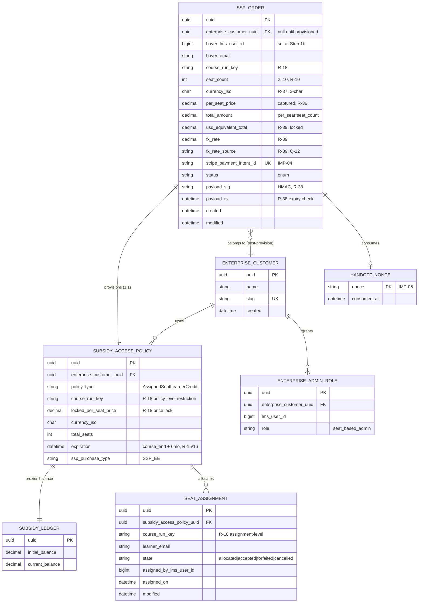
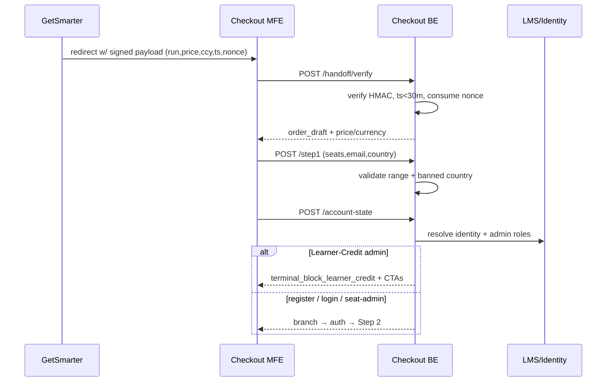
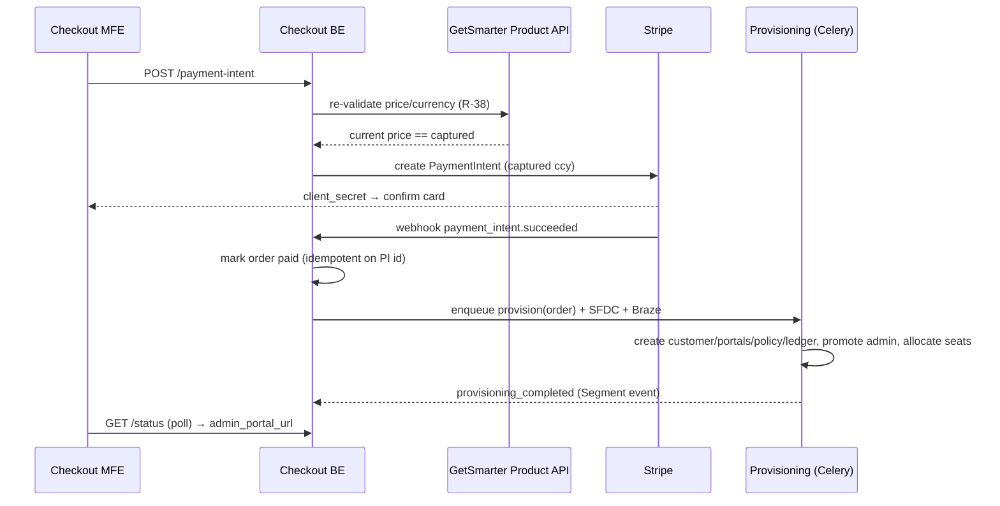
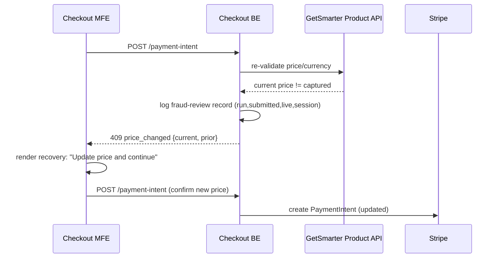
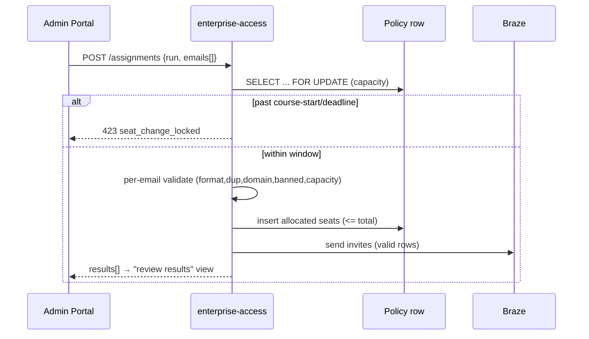
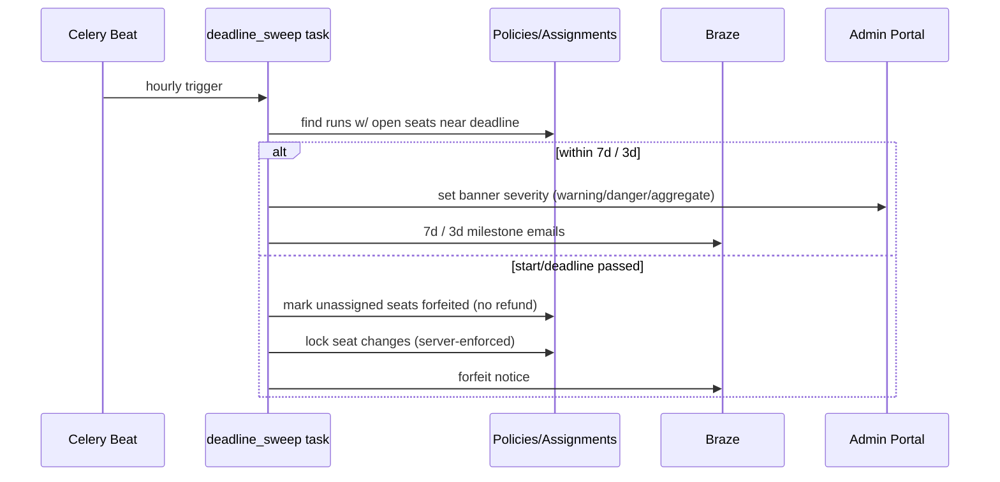

# Techspec — Enterprise Direct: Self-Service Purchasing for Exec Ed Courses (V1)

> Source PRD: `techspec.txt` (PRD: Enterprise Direct — Self-Service Purchasing for Exec Ed Courses, by Alberto Del Toro).
> Feature slug: `self-serve-execed-purchasing`. Release scope: **V1 (MVP)** unless a requirement is tagged V2.

**Grounding note.** This spec is written against this repo's documented edX Enterprise conventions (the `edx-enterprise-backend` skill references), which name the real services and patterns: the `enterprise-access` service/Django app (owns `SubsidyAccessPolicy`, `Assignment`, `AssignmentConfiguration`), `enterprise-subsidy` (the ledger), `enterprise-catalog` (content metadata), JWT-OAuth2 service-to-service via `OAuthAPIClient`, Stripe/Braze via SDK, and model conventions (UUID PK, `TimeStampedModel`, `HistoricalRecords`, `enterprise_customer_uuid` scoping) — cited as `edx-enterprise-backend/skills/...` below. The concrete edX service source is **not** in this repo, so exact `file:line` anchors into `enterprise-access`/`enterprise-subsidy` cannot be given; every structure that would live in those services is marked **new** or **extension** and specified explicitly rather than implied to exist.

---

## 1. Overview

### 1.1 Problem statement
edX Enterprise has no self-serve path for SMB buyers who want to purchase multiple Exec Ed (GetSmarter) seats. The only path today is a "Get for your Team" lead form → SDR callback (multi-day friction). This kills conversion, clogs the SDR pipeline with transactional deals, and leaks Enterprise revenue attribution to B2C. V1 delivers a three-step self-serve checkout: pick a GetSmarter course-run, choose 2–10 seats, pay by credit card, get provisioned into a new-or-existing Enterprise admin portal, and assign seats post-purchase — with no sales contact.

### 1.2 Scope

**In scope (V1).** GetSmarter CTA handoff; 3-step checkout MFE (buyer details → org details → billing) with a Step 1b account-state router; credit-card payment via Stripe in the buyer's captured currency (12 currencies); signed + re-validated price/currency carry-through; provisioning of admin+learner portal, a per-purchase seat-based Seat Assignment Plan scoped to one course run, and admin promotion; Seat Assignments admin area (landing + plan detail with Activity/Learners/Catalog-placeholder tabs); single-modal seat assignment with per-email outcomes; layered enrollment-deadline reminders (in-portal 3-tier banner + Braze 7-day/3-day/forfeit emails); seat-change lock at course start / enrollment deadline; forfeiture (no refund); Segment instrumentation; Salesforce Opportunity creation; purchase-confirmation + CSAT emails; KPI dashboard feed.

**Out of scope (V2, explicitly deferred).** ACH payment (R-06, R-08); multi-course single checkout (R-14, RM-02); portal-native purchase / Catalog-tab browsing (R-30 — placeholder only in V1); Braze abandoned-cart recovery emails (R-13); in-checkout currency switcher (Q-13); automated handling of course cancellation / no-show edge cases (R-29 — disclaimers + manual support only).

### 1.3 Success criteria (from §3 KPIs)
CTA→checkout conversion ≥15% launch / ≥20% steady (K-01); 90-day repeat purchase ≥15% (K-02); ≥40% SDR form deflection (K-03); ≥65% CTA→step-1 (K-04); ≥70% payment success (K-05); ≥60% 7-day admin login (K-06); CSAT ≥4.2 (K-07); ≥70% seats assigned in 14 days (K-08). All feed off Segment funnel events (R-31) + Salesforce joins + admin-portal events.

### 1.4 Requirements table
IDs are adopted verbatim from the PRD (`R-##`, `NFR-##`, `UX-##`) as canonical REQ-IDs. Implied requirements added by this spec are `IMP-##`. `F` = functional, `N` = non-functional.

| REQ-ID | Description | Kind | Priority |
|---|---|---|---|
| R-01 | Multi-seat CTA on GetSmarter → checkout with course-run variant ID in URL | F | P0 |
| R-02 | Step 1 unauth buyer details (seats 2–10, name, email, country; banned countries excluded) | F | P0 |
| R-03 | Step 1 authenticated pre-fill (name/email read-only) | F | P0 |
| R-04 | Step 2 new-org details (company name ≤120; slug 3–60 `[a-z0-9-]`, unique) | F | P0 |
| R-05 | Step 2 existing-admin read-only org display | F | P0 |
| R-06 | Step 3 Stripe billing + T&C; card only (ACH V2); card never touches edX | F | P0 |
| R-07 | Payment success page / decline handling with Stripe code | F | P0 |
| R-08 | Success page: order summary + "Go to admin portal" + receipt; no account fields | F | P0 |
| R-09 | Step 1b account-state router: (a) register (b) login non-admin (c) login seat-admin (d) Learner-Credit-admin terminal block | F | P0 |
| R-10 | Seat range 2–10 enforced UI + server; per-transaction; no cross-txn cap V1 | F | P0 |
| R-11 | Checkout WCAG 2.1 AA (checkout-scoped NFR-01) | N | P0 |
| R-12 | Learner assignment deferred to post-checkout; checkout never asks for learner emails | F | P0 |
| R-13 | Fresh session on return (clear prior data; no recovery email; `checkout_abandoned` event) | F | P1 |
| R-14 | Multi-course single checkout — **V2 deferred** | F | — |
| R-15 | New-buyer provisioning (portals, seat budget scoped to run, admin promotion, no new edX user) | F | P0 |
| R-16 | Standalone Seat Assignment Plan per purchase (never merged) | F | P0 |
| R-17 | Distinct plan card per purchase (course, purchase date, expiry, seat count) | F | P0 |
| R-18 | Content identifier (course-run key) at both budget/policy layer and assignment layer | F | P0 |
| R-19 | Single Assign-Seat modal with per-email outcomes; atomic capacity check | F | P0 |
| R-20 | Layered deadline reminders (7d warning / 3d danger / aggregate) + Braze; forfeit at threshold | F | P0 |
| R-21 | Seat Assignments landing page (mirrors Learner Credit Mgmt; search/filter/pagination) | F | P0 |
| R-22 | Plan detail page + tabs (Activity default / Learners / Catalog placeholder) | F | P0 |
| R-23 | Activity tab (chronological purchases/assignments/acceptances) | F | P1 |
| R-24 | Learners tab (Open by class / Assigned with status pills; unassign lock at threshold) | F | P0 |
| R-25 | Shared deadline banner across landing + detail; 3 tiers; "Assign now" | F | P1 |
| R-26 | Seat-change lock at course start / enrollment deadline — enforced server-side | F | P0 |
| R-27 | Seat-denominated (not dollar) display; course name high hierarchy | F | P0 |
| R-28 | Unassign + reassign before deadline; server-enforced reversibility window | F | P0 |
| R-29 | Forfeiture disclaimers at checkout + portal (in captured currency); Legal sign-off | F | P0 |
| R-30 | In-portal catalog browsing — **V2 deferred** (placeholder tab in V1) | F | — |
| R-31 | Checkout event instrumentation to Segment | F | P0 |
| R-32 | Salesforce Opportunity on purchase (dual amount); auto-retry | F | P0 |
| R-33 | Purchase confirmation email via Braze within 5 min | F | P0 |
| R-34 | Headline KPI dashboards | N | P1 |
| R-35 | Course price hidden from learner portal for SSP EE seats | F | P0 |
| R-36 | Price/currency carry-through from GetSmarter; captured & immutable at Step 3 | F | P0 (blocked Q-14) |
| R-37 | 12-currency support + allowlist (centrally configured); locale formatting; pass to Stripe | F | P0 (blocked Q-14) |
| R-38 | Price/currency tamper-resistance (HMAC-SHA256 signed handoff + server re-validation) | F | P0 (blocked Q-14) |
| R-39 | Charge in captured currency; budget records txn currency + USD-equivalent + FX rate/source | F | P0 (blocked Q-14) |
| NFR-01 | Accessibility WCAG 2.1 AA (NVDA/JAWS/VoiceOver; contrast; reduced-motion) | N | P0 |
| NFR-02 | Scalability under launch + marketing spikes (targets set here) | N | P0 |
| NFR-03 | Browser/device support (latest-2 desktop; iOS/Android; ≥375px) | N | P0 |
| NFR-04 | Paragon-only UI; mirror Learner Credit IA; translation-ready strings | N | P0 |
| UX-01…UX-10 | Checkout/admin UX (wayfinding, inline validation, loading, empty, banner severity, action feedback, seat/currency formatting, responsive, recovery, IA consistency) | N | P0/P1 |
| IMP-01 | Stripe webhook signature verification + idempotent processing (implied by R-06/R-32/R-39) | F | P0 |
| IMP-02 | OFAC banned-country enforcement server-side at Step 1 submit (implied §7.2) | F | P0 |
| IMP-03 | Abandoned-cart PII retention (default 30 days) + deletion job (implied Q-05, §7.2) | N | P1 |
| IMP-04 | Idempotent provisioning keyed on PaymentIntent (implied R-15, exactly-once) | F | P0 |
| IMP-05 | Nonce store for handoff replay protection (implied R-38) | F | P0 (blocked Q-14) |

---

## 2. Component design

Ownership follows the existing edX split. **New** = greenfield; **Ext** = extends an existing service/MFE.

| Component | Kind | One-sentence responsibility |
|---|---|---|
| GetSmarter class-details CTA + handoff signer | Ext (GetSmarter, partner-owned) | Emits the signed `{course_run, price, currency, locale, ts, nonce}` handoff and links to the checkout MFE (R-01, R-36, R-38). |
| **Checkout MFE** (working name `frontend-app-enterprise-checkout`) | New | Renders the 3-step + Step-1b flow, verifies the handoff signature, holds no server-trusted price, submits to the checkout backend (D-07, R-02–R-13, UX-01–UX-09). |
| **Checkout/orders backend** (`enterprise_access.apps.ssp_checkout`) | New app in Ext service | Owns the `SSPOrder` lifecycle: server-side validation (seat range, banned country, slug uniqueness, price re-validation), Stripe PaymentIntent creation, webhook handling, and orchestration of provisioning (R-10, R-38, R-39, R-32, IMP-01/04). |
| **Seat-based policy** (`enterprise_access` SubsidyAccessPolicy proxy) | Ext | New `AssignedSeatLearnerCreditAccessPolicy` proxy type: dollar-backed ledger, single-course-run catalog restriction, locked per-seat price (R-15–R-18, R-27, R-39). |
| **Seat assignment** (`enterprise_access` Assignment/AssignmentConfiguration) | Ext | Extends the existing assignment engine with a course-run-scoped seat assignment carrying `course_run_key`, reversibility window, and forfeiture state (R-19, R-24, R-26, R-28). |
| **Subsidy ledger** (`enterprise-subsidy`) | Ext (consume as-is) | Stores the dollar ledger the seat policy proxies over; transactions on assign/unassign/forfeit. |
| **Provisioning workflow** (Celery in `enterprise_access`) | Ext | Idempotent chained task: create EnterpriseCustomer + portals (slug), create seat policy + ledger, promote admin, allocate seats, emit `provisioning_completed` (R-15, D-10, IMP-04). |
| **Admin portal Seat Assignments** (`frontend-app-admin-portal`) | Ext | New route tree mirroring Learner Credit Management: landing, plan detail, tabs, assign modal, deadline banner (R-21–R-28, UX-04/05/06/10). |
| **Learner portal price suppression** (`frontend-app-learner-portal-enterprise`) | Ext | Hides per-seat price when the subsidy type is SSP EE (R-35). |
| Integration adapters | Ext | Stripe SDK, Braze (`BrazeApiClient`), Salesforce Opportunity client, Segment, GetSmarter product API client (D-04) — all in `enterprise_access.apps.api_client`. |
| KPI dashboard | Ext (Data/Analytics) | Consumes Segment + Salesforce; tool TBD (Q-04). |

**Boundary risks & how they hold.**
- *Price authority leaking to the client.* The MFE displays price but must never be the server's price source. Boundary held by R-38: the backend re-validates against the GetSmarter product API (D-04) and reads price only from the signed server-side `SSPOrder` record — never from URL/localStorage/request body.
- *Seat vs. dollar semantics leaking to the UI.* Backend is dollar-based (learner-credit ledger); every admin surface must show seats. Boundary held by computing `seats = ledger_balance / locked_per_seat_price` in the backend serializer (R-27) so no client does dollar math.
- *Provisioning coupled to payment latency.* Payment confirmation and provisioning are separated: Stripe confirms synchronously; provisioning runs as an idempotent Celery workflow keyed on `payment_intent_id` (IMP-04), and the success page polls provisioning status (UX-03).
- *Assignment merge across purchases.* Each purchase creates its own policy + plan; the assignment layer is always scoped by `subsidy_access_policy_uuid`, so no code path can merge plans (R-16, R-17).

---

## 3. Data architecture

*Addresses R-15–R-18, R-24, R-26–R-28, R-36–R-39, IMP-03/04/05.*

**Storage engine & ownership.** All models are MySQL rows under their owning service (per edX convention). `SSP_ORDER`, `SUBSIDY_ACCESS_POLICY` (proxy), `SEAT_ASSIGNMENT`, `HANDOFF_NONCE`, `ENTERPRISE_ADMIN_ROLE` live in **`enterprise-access`**; `SUBSIDY_LEDGER` lives in **`enterprise-subsidy`** (consumed via `EnterpriseSubsidyApiClient`, cited `edx-enterprise-backend/skills/system-integration-patterns/references/enterprise-clients.md`); `ENTERPRISE_CUSTOMER` is owned by the LMS/edx-enterprise. All new models use a UUID PK + `TimeStampedModel` + `HistoricalRecords` per `base-models.md`, and carry `enterprise_customer_uuid` where enterprise-scoped.

**Keys & critical indexes.**
- `SSP_ORDER`: unique on `stripe_payment_intent_id` (idempotency, IMP-04); index on `(status, created)` for reconciliation; index on `buyer_lms_user_id`.
- `SUBSIDY_ACCESS_POLICY`: index `(enterprise_customer_uuid, ssp_purchase_type)`; index `course_run_key` (forfeiture sweep, R-20).
- `SEAT_ASSIGNMENT`: composite unique `(subsidy_access_policy_uuid, learner_email)` where `state != 'cancelled'` (prevents duplicate active assignment, R-19); index `(subsidy_access_policy_uuid, state)` for open/assigned counts.
- `HANDOFF_NONCE`: PK on `nonce`; TTL cleanup job (30-min window, R-38).

**Invariants enforced at the data/service layer.**
- Seat conservation: `count(state='allocated') + count(state='accepted') + open ≤ total_seats`; capacity check is a `SELECT … FOR UPDATE` on the policy row inside the assign transaction (R-19 atomic).
- Immutability: after `SSP_ORDER.status` reaches `paid`, `currency`, `per_seat_price`, `usd_equivalent_total`, `fx_rate` are frozen (R-36, R-39) — enforced in `save()` and asserted by `HistoricalRecords` audit.
- One policy per order (1:1) — no merge (R-16, R-17).
- Forfeiture is terminal: `allocated`/`accepted`→`forfeited` only via the deadline sweep; no transition out.

**PII classification & retention (IMP-03, §7.2, Q-05).** `buyer_email`, `learner_email`, `buyer_lms_user_id` are PII (annotate with edX `pii` model annotations for the PII checker, cited `edx-enterprise-backend/skills/quality-checks`). Completed-purchase records: standard Enterprise retention. **Abandoned-cart PII** (`SSP_ORDER` never reaching `paid`): default 30-day retention, then a Celery beat job hard-deletes buyer identity fields (**assumption — Q-05 open**). Card data never persists on edX systems (R-06) — only Stripe tokens/PaymentIntent IDs.

**Migration/backfill plan.** All net-new tables — no backfill. Rollout order: (1) create `enterprise-subsidy` ledger support if not present → (2) `enterprise-access` migrations for policy proxy type, `SSPOrder`, `SeatAssignment` extension, `HANDOFF_NONCE` → (3) deploy backend behind a feature flag → (4) deploy MFEs. The `AssignedSeatLearnerCreditAccessPolicy` is a proxy over the existing `SubsidyAccessPolicy` table (added `policy_type` value + nullable columns), so it is an additive migration, not a new table for the policy itself.

---

## 4. API contracts

All edX-internal calls use JWT-OAuth2 via `OAuthAPIClient` (cited `auth-patterns.md`). External calls (Stripe, Braze, Salesforce, GetSmarter product API) use API-key/SDK auth. Base path `/api/v1/ssp-checkout/` on `enterprise-access`. **Versioning:** URL-versioned (`/v1/`); additive fields are non-breaking; removals/renames require `/v2/`. **Pagination:** DRF cursor pagination (`?page`, `?page_size`, default 20) on all list endpoints. **Error taxonomy** (envelope `{ "error_code": "...", "detail": "...", "field_errors": {...} }`):

| error_code | HTTP | Meaning |
|---|---|---|
| `validation_error` | 400 | Field-level validation (seats, email, slug format) |
| `seat_range_out_of_bounds` | 422 | seats <2 or >10 (R-10) |
| `slug_conflict` | 409 | URL slug taken (R-04) |
| `banned_country` | 422 | OFAC country (IMP-02) |
| `unsupported_currency` | 422 | Outside 12-currency allowlist (R-37) |
| `handoff_invalid_signature` | 401 | HMAC mismatch (R-38) |
| `handoff_expired` | 401 | payload ts >30 min (R-38) |
| `handoff_replay` | 409 | nonce already consumed (R-38, IMP-05) |
| `price_changed` | 409 | re-validation mismatch → recovery state (R-38, UX-09) |
| `course_run_unavailable` | 409 | run no longer purchasable (UX-09) |
| `terminal_block_learner_credit` | 403 | Learner-Credit admin blocked (R-09d) |
| `seat_change_locked` | 423 | assign/unassign after threshold (R-26, R-28) |
| `capacity_exceeded` | 409 | over-assign attempt (R-19) |
| `payment_failed` | 402 | Stripe decline (carries `stripe_decline_code`, R-07) |

### Checkout & payment

**`POST /handoff/verify`** — MFE posts the raw handoff payload on landing. Verifies HMAC-SHA256, timestamp (<30 min), and nonce; consumes nonce. *Authz:* none (pre-auth); rate-limited by IP. Returns `{ order_draft_id, course_run_key, per_seat_price, currency, locale, course_metadata }`. Errors: `handoff_invalid_signature|handoff_expired|handoff_replay`. (R-36, R-38, R-01)

**`POST /orders/{draft_id}/step1`** — `{ seat_count, name?, email?, country }` (name/email omitted when authenticated, R-03). Validates seat range (R-10), email format, banned country server-side (IMP-02). Returns `{ next: "step1b" }`. *Idempotent* on `draft_id`. Authz: none yet.

**`POST /orders/{draft_id}/account-state`** (Step 1b, R-09) — resolves the buyer identity (authenticated JWT if present, else email lookup against LMS). Returns one of `{ branch: "register" | "login_non_admin" | "login_seat_admin" | "terminal_block_learner_credit", enterprise?: {name, slug} }`. Branch (d) also returns CTAs. After register/login the MFE re-calls with the authenticated JWT; branch resolves to `login_*` and advances to Step 2.

**`POST /orders/{draft_id}/step2`** — new org: `{ company_name, slug }` → validates slug format + uniqueness (R-04, `slug_conflict`); existing admin: no-op, returns read-only org (R-05). Authz: authenticated buyer.

**`POST /orders/{draft_id}/payment-intent`** (enter Step 3) — server **re-validates** price/currency against GetSmarter product API (D-04, R-38); on mismatch returns `price_changed` with `{ current_price, prior_price }` (UX-09). On match, creates a Stripe PaymentIntent in the captured currency for `per_seat_price × seat_count` (R-39), persists captured values immutably, returns `{ client_secret, order: {...} }`. Authz: authenticated buyer, owns the draft. Idempotency-Key = `draft_id` (prevents duplicate PaymentIntents, UX-03/IMP-01).

**`POST /webhooks/stripe`** (IMP-01) — verifies Stripe signature (`STRIPE_WEBHOOK_SECRET`, Q-10). On `payment_intent.succeeded`: mark `SSPOrder.paid`, enqueue provisioning (idempotent on `payment_intent_id`), enqueue Salesforce + Braze tasks. Returns 200 fast; all downstream work is async. Replays are no-ops (state check). Authz: Stripe signature only.

**`GET /orders/{draft_id}/status`** — success-page poll: `{ payment: "succeeded", provisioning: "pending|completed|failed", admin_portal_url? }` (UX-03, R-08).

### Seat assignment (admin portal → enterprise-access)

**`GET /seat-plans/`** — landing list (R-21). Query: `?search`, `?status=active|expiring|expired`, cursor. Returns plan cards with seat-denominated balances (R-27). Authz: `seat_based_admin` on the enterprise.

**`GET /seat-plans/{uuid}/`** — detail hero + courses-with-open-seats (R-22). **`GET /seat-plans/{uuid}/activity/`** — Activity tab (R-23). **`GET /seat-plans/{uuid}/learners/`** — open (by class) + assigned (R-24).

**`POST /seat-plans/{uuid}/assignments/`** — `{ course_run_key, emails: [...] }` (R-19). Atomic capacity check (`FOR UPDATE`), returns per-email result array `[{ email, outcome: "invited|invalid_format|duplicate|domain_not_allowed|banned_learner|over_capacity" }]`. 207-style body even on partial success. Rejected with `seat_change_locked` (423) if past threshold (R-26). Authz: `seat_based_admin`.

**`POST /assignments/{uuid}/unassign`** / **`/resend-invite`** — reversible actions (R-28). `unassign` re-validates the deadline server-side and returns `seat_change_locked` if past threshold (R-26d/R-28) — enforced in the service layer, not the UI.

**Breaking-change policy.** Handoff payload schema and the `price_integrity` contract are shared with GetSmarter (partner-owned); any change is coordinated + versioned with a dual-accept window; the shared HMAC secret rotates on a 90-day cadence (R-38) with overlapping key IDs so in-flight payloads verify against either key during rotation.

---

## 5. Sequence diagrams

### 5.1 Handoff + Step 1b routing (happy + terminal block) — R-01, R-09, R-36, R-38

### 5.2 Payment + provisioning (happy path) — R-06, R-15, R-32, R-33, R-39, IMP-04

### 5.3 Price re-validation mismatch (failure/recovery) — R-38, UX-09

### 5.4 Seat assignment with per-email outcomes (atomic) — R-19, R-24, R-26

### 5.5 Enrollment-deadline sweep + forfeiture — R-20, R-25, R-26

---

## 6. Platform & deployment

*Addresses NFR-01/02/03/04, R-31–R-34, UX-*, §7.2.*

**Runtime & dependencies.** Backend: Django/DRF in `enterprise-access` + Celery workers/beat (cited `celery-patterns`); MySQL; Redis/broker. External: Stripe (D-05/D-13, 12-currency settlement), Braze (D-16), Salesforce (D-14), Segment (D-15), GetSmarter product API (D-04). Frontend: two MFEs on Paragon (D-17, NFR-04). All service-to-service via `OAuthAPIClient`.

**Scaling model & bottleneck.** Checkout is read-light/write-light per session; the protected bottleneck is (a) the synchronous GetSmarter re-validation call at Step 3 and (b) the Stripe PaymentIntent create — both external. Mitigation: short-timeout + circuit breaker on the GetSmarter client; provisioning is fully async so payment throughput is not gated on portal creation. **Explicit V1 targets (NFR-02 says "defined in tech spec"):** sustain 5 checkouts/sec steady, burst 25/sec for 10 min (marketing spike); p95 API latency <400 ms excluding external calls; provisioning completes p95 <60 s. Autoscale Celery workers on queue depth; provisioning queue isolated from the assignment/notification queue so a spike in one does not starve the other.

**Consistency vs. availability.** Payment→provisioning is eventually consistent (async), reconciled by the PaymentIntent idempotency key (IMP-04) — chosen over synchronous provisioning to keep checkout responsive and to make provisioning retryable. Seat capacity is strongly consistent (`FOR UPDATE`, R-19) — correctness over availability, since over-assignment is a money bug. *(Rejected alternative: synchronous provisioning in the payment webhook — simpler but couples buyer wait to portal-creation latency and makes retries unsafe.)*

**Caching & rate limits.** Course metadata cached from `enterprise-catalog` (short TTL); currency allowlist + FX config centrally configured (R-37, DB/settings, no code change to edit). Rate-limit `/handoff/verify` and `/account-state` per IP (anti-enumeration).

**Observability (metrics/logs/traces/alerts).** Structured logs with `request_id`/`service` context per `observability.md`. Metrics: checkout funnel counts (Segment, R-31: `exec_ed_teams_cta_clicked`→`checkout_completed`, `provisioning_completed`), payment success rate (K-05), provisioning success/latency, forfeiture sweep counts, price-integrity-failure count (R-38 fraud signal). **Alerts/SLOs:** payment-success <70% (K-05 breach); provisioning failure rate >1%; any spike in `handoff_replay`/`price_changed` (fraud); Salesforce Opportunity retry exhaustion (R-32). KPI dashboard (R-34) consumes Segment + Salesforce; tool TBD (Q-04).

**Rollout & rollback.** Feature-flagged (edX Waffle) end-to-end; migration ordering per §3 (additive, backward-compatible). Roll out backend first (dark), then GetSmarter CTA to a pilot cohort (RM-04 A/B). **Rollback:** disable the flag → CTA reverts to lead form; in-flight paid-but-unprovisioned orders are drained by the idempotent provisioning workflow (never dropped). Shared HMAC secret and Stripe webhook secret rotation on documented cadences (R-38 90-day; Q-10). WCAG audit (NFR-01) and Stripe embedded-form independent audit are GA gates.

---

## 7. Open risks & assumptions

| # | Risk / gap | Severity | Resolution / decision needed |
|---|---|---|---|
| 1 | **Q-14 blocks R-36–R-39 + IMP-05.** Transport for GetSmarter price/currency (signed handoff vs. Learner Credit API extension) undecided; also *which layer* re-validates (MFE vs BE). | **Blocker** | This spec commits to **signed HMAC-SHA256 handoff + backend re-validation** (matches R-38's explicit HMAC clause; boring/proven; keeps price authority server-side). *Rejected:* extending the Learner Credit API — heavier coupling, no signing story. Engineering must not start R-36–R-39 until Michael Pfannenstiel + Alexander Dusenbery + GetSmarter Eng ratify. |
| 2 | **Q-12 FX source-of-truth** for USD-equivalent on the budget (Stripe settlement FX vs. Finance feed vs. 3rd-party; and capture timestamp). Blocks R-39 field semantics. | High | Assumed default: capture FX at **charge-creation** time from a single configured provider; must be reconciled with Finance reporting before GA. `fx_rate_source` column already models the choice. |
| 3 | **Q-11 price-increase-before-enrollment** policy (reduce honored seats vs. forfeit delta). Not modeled in V1. | High | Business + Legal decision needed pre-GA; today the locked price (R-18) simply governs — no runtime handling. Flag to RM-03 owner. |
| 4 | **R-29 forfeit policy Legal sign-off** (RM-03) + disclaimer copy (Hamzah/Legal). Also R-33 email copy (Marketing+Legal). | High | Hard GA gate. Prepare rollover-fallback design as contingency (RM-03). |
| 5 | **Q-06 closed → R-09(d)**: Learner-Credit admins are terminally blocked. Confirmed; implemented as `terminal_block_learner_credit`. | Low | Resolved — no action. |
| 6 | **Q-05 abandoned-cart PII retention** (default 30d) not ratified (IMP-03). | Medium | Confirm with Legal/Privacy; deletion job assumes 30 days. |
| 7 | **Q-10 Stripe webhook signing-key rotation / replay policy** (IMP-01). | Medium | Security to finalize; spec assumes signature verification + idempotent state-check dedupe. |
| 8 | **Q-09 threat model** (spend-cap bypass, slug squatting, provisioning replay, webhook spoofing) not yet reviewed by Security. | High | Security review is a GA gate; the design already addresses each (server-side seat cap R-10, slug uniqueness R-04, idempotent provisioning IMP-04, webhook signature IMP-01). |
| 9 | **Q-04 dashboard tool** for R-34 undecided. | Low | Instrumentation (Segment) is tool-agnostic; pick downstream tool independently. |
| 10 | **R-35(b)** unresolved: does accepting an assignment == enrollment, or is a separate enrollment step required? Affects deadline/forfeiture timing semantics. | Medium | Product+Eng to confirm; spec treats "accepted" and "enrolled" as distinct states pending answer. |
| 11 | **NFR-02 concrete throughput** was "defined in tech spec" — values in §6 are proposed defaults, not validated against real launch-traffic data. | Medium | Confirm against Marketing's spike forecast before load-test sign-off. |
| 12 | **Banned-country list (IMP-02)** source (OFAC) not enumerated in PRD. | Medium | Legal/Trade Compliance to supply the authoritative list; enforced UI + server at Step 1 submit. |

**Traceability check.**
REQs covered by dedicated section content: R-01…R-13, R-15…R-29, R-31…R-39, NFR-01…NFR-04, UX-01…UX-10, IMP-01…IMP-05 — all mapped across §2–§6.
REQs deferred by PRD design (documented as V2, not dropped): R-14 (multi-course checkout), R-30 (in-portal catalog) — §1.2 + §4 placeholder.
REQs unaddressed (blocked, cannot be finalized): none dropped — R-36/R-37/R-38/R-39 are specified but **gated on Q-14** (risk #1); the FX (#2), price-increase (#3), and R-35(b) enrollment-semantics (#10) gaps are the only open design questions, all listed above.
