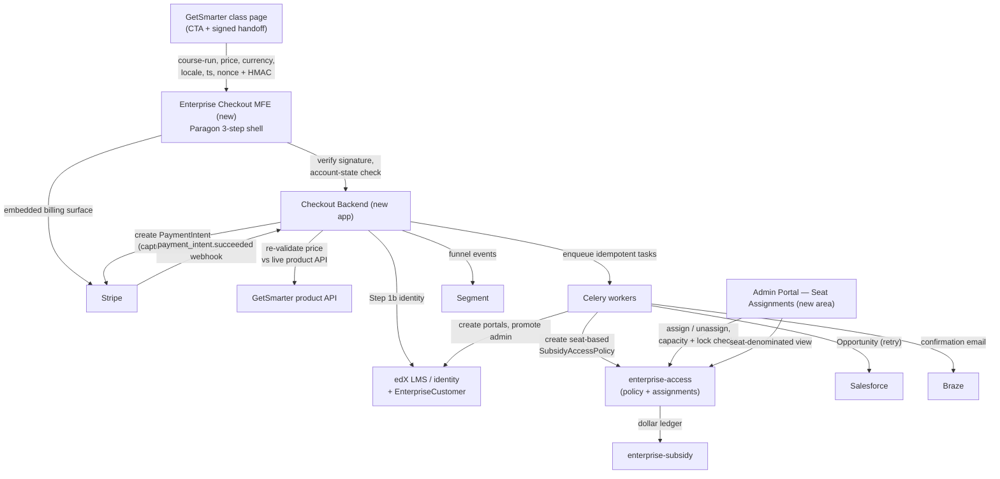
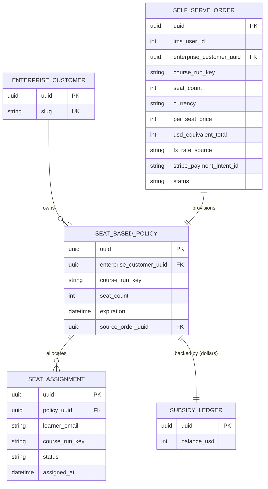
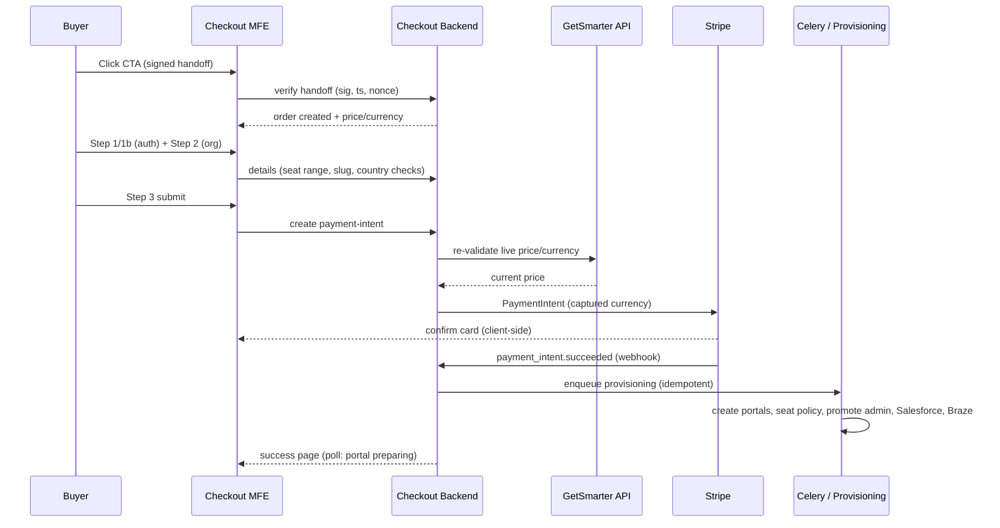
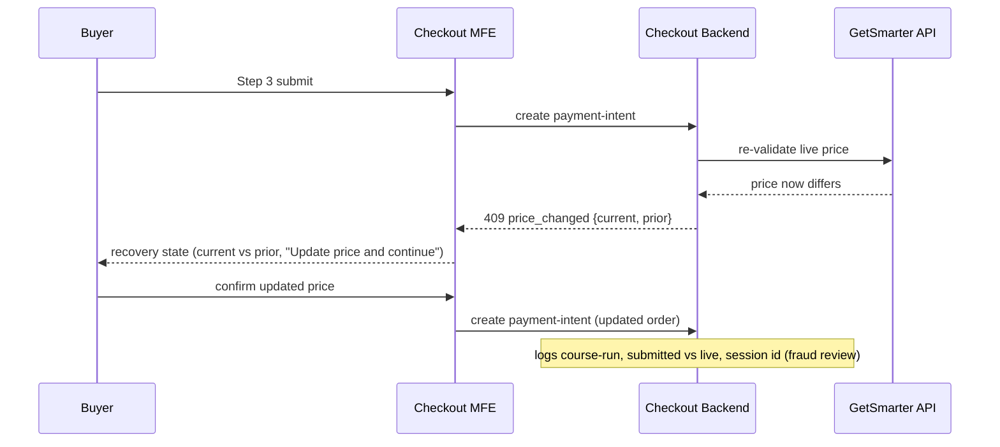

# Tech Spec: Enterprise Direct — Self-Serve Purchasing for Exec Ed Courses (V1)

> **Document Classification — Plan Document (pre-build intent).**
> Captures how we intended to build, before anything was built. Becomes a historical
> artifact after release; post-build truth lives in ADRs.

## Overview

| Field            | Value                                                        |
| ---------------- | ------------------------------------------------------------ |
| Author           | (Engineering — TBD)                                          |
| Status           | Draft                                                        |
| PRD Link         | [techspec.txt](../techspec.txt) (PRD: Enterprise Direct — Self-Serve Exec Ed) |
| Engineering Lead | Kira Miller (enterprise-access); Alexander Dusenbery (architecture) |
| Reviewers        | Troy Sankey (subsidy/budget), Hamzah Ullah (provisioning), Security (TBD), Legal — Bonnie Vanzler |
| Created          | 2026-07-01                                                   |
| Last Updated     | 2026-07-01                                                   |

> **Grounding note.** This spec was written against the PRD and the platform architecture
> the PRD names (enterprise-access Policy framework, enterprise-subsidy ledger, Learner
> Credit Management IA, Celery provisioning, Stripe/Segment/Braze/Salesforce, Paragon). It
> was **not** grounded against the service source (the checkout/admin-portal/enterprise-access
> repos are not in this workspace). Every concrete class/table/endpoint name below marked
> **(new)** or **(extend)** must be reconciled against the real code before build — see
> Open Questions **OQ-A**.

## Background & Context

### Problem Summary
SMB buyers who want to purchase multiple Exec Ed (GetSmarter) seats have no self-serve path:
the only route is a "Get for your Team" lead form that hands off to an SDR, adding days of
friction that kills conversion, clogs the SDR pipeline with transactional deals, and leaks
Enterprise revenue attribution to the B2C channel. V1 delivers a three-step self-serve
checkout (initiated from a GetSmarter CTA) that takes credit-card payment for 2–10 seats of a
single course run, provisions the buyer into a new or existing Enterprise admin portal, and
lets them assign seats to learners from that portal — with no sales contact. See the PRD for
full product context.

### Current State
- Exec Ed multi-seat interest routes through a manual lead form → SDR → manual Salesforce +
  portal configuration. Buyers who bypass it enroll individually through the B2C GetSmarter
  flow, losing Enterprise attribution and any portal relationship.
- The Enterprise platform already runs **Learner Credit**: a *dollar-denominated* subsidy in
  `enterprise-subsidy` (ledgered transactions) fronted by `SubsidyAccessPolicy` records in
  `enterprise-access`, surfaced in the admin portal's **Learner Credit Management** area. There
  is no *seat-denominated* budget type today (D-06).
- Provisioning of new Enterprise customers/portals exists as Celery workflows but is driven by
  sales/ops today, not by a self-serve payment event.

### Relevant Architecture
| System | Role in This Feature | Owner |
| ------ | -------------------- | ----- |
| GetSmarter (getsmarter.com) | Hosts the multi-seat CTA (D-02); **single source of truth for price/currency** (R-36); serves live price re-validation API (D-04) | Partner Eng (Michael Pfannenstiel) |
| Enterprise Checkout MFE **(new)** | Three-step Paragon checkout shell; verifies signed handoff; renders price in captured currency (D-07) | Frontend (TBD) |
| Checkout backend **(new app, host TBD — enterprise-access vs. new service, OQ-A)** | Handoff verification, Stripe PaymentIntent, Step-3 price re-validation, provisioning orchestration, integration fan-out (Salesforce/Segment/Braze) | enterprise-access team |
| `enterprise-access` (Policy framework) | Hosts the **new seat-based subsidy access policy** as a proxy over Learner Credit; assignment records; server-side capacity + lock enforcement | Kira Miller / Alexander Dusenbery |
| `enterprise-subsidy` (ledger) | Dollar-denominated ledger backing each seat-based policy (seats are a UI abstraction over dollars, R-27) | Troy Sankey |
| `edx-enterprise` / LMS | `EnterpriseCustomer`, admin/learner portals, admin role promotion; edX identity (buyer authenticates at Step 1b, R-09) | Provisioning (Hamzah Ullah) |
| `frontend-app-admin-portal` | **Seat Assignments** area, mirroring Learner Credit Management IA (D-08, R-21–R-28) | Frontend (TBD) |
| Stripe | Credit-card PaymentIntent in captured currency; embedded billing surface (D-13, R-06, R-39) | — |
| Salesforce | Opportunity per successful purchase (D-14, R-32) | RevOps |
| Segment | Checkout funnel events (D-15, R-31) | Data |
| Braze | Transactional email — confirmation, reminders, forfeit, CSAT (D-16, R-33, R-20) | Marketing |
| Paragon | Component library for all UI (D-17, NFR-04) | — |

### Requirements
Requirement IDs are carried through **verbatim from the PRD** (R-##, NFR-##, UX-##) so this
spec traces 1:1 to the PRD. Selected load-bearing requirements:

| REQ-ID | Requirement | Type | Priority |
| ------ | ----------- | ---- | -------- |
| R-01…R-13 | Three-step checkout: CTA, buyer details, org details, billing, success, account-state routing (Step 1b), seat-range enforcement, fresh-session-on-return | Functional | V1 must |
| R-09 | Step 1b deterministic account-state routing (register / login non-admin / login seat-admin / **Learner-Credit terminal block**) | Functional | V1 must |
| R-10 | 2–10 seat range enforced **in UI and again server-side**; per-transaction only, no cross-transaction cap in V1 | Functional | V1 must |
| R-15…R-18 | Provisioning: new portals + **seat-based budget scoped to one course run**; standalone plan per purchase (never merged); content key at **both** policy and assignment layers | Functional | V1 must |
| R-19…R-29 | Seat administration: assign modal (atomic capacity), deadline reminders (3-tier + Braze), landing/detail/Activity/Learners tabs, **seat-change lock after course start (server-enforced)**, seat-denominated display, forfeiture disclaimers | Functional | V1 must |
| R-31…R-34 | Instrumentation: Segment events, Salesforce Opportunity (with retry), Braze confirmation, KPI dashboards | Functional | V1 must |
| R-35…R-39 | Pricing/currency: price hidden from learner, price/currency carry-through, 12-currency support, **tamper-resistance (HMAC + server re-validation)**, charge in captured currency + USD-equivalent recording | Functional | V1 must — **blocked on Q-14** |
| NFR-01 | Accessibility WCAG 2.1 AA across checkout + admin portal | NFR | V1 must |
| NFR-02 | Scalability: launch volume + marketing spikes; concrete targets set here | NFR | V1 must |
| NFR-03 | Browser/device support; ≥375px viewport | NFR | V1 must |
| NFR-04 | Paragon-only UI; mirror Learner Credit IA; translation-ready | NFR | V1 must |
| UX-01…UX-10 | Wayfinding, inline validation, loading states, empty states, severity treatment, result feedback, seat/currency formatting, responsive, recovery, IA consistency | UX | V1 must |
| R-14, R-30 | Multi-course single checkout; in-portal catalog browsing | Functional | **V2 — out of scope** |

Full per-requirement acceptance criteria live in the PRD; this spec designs to them and closes
with a Traceability line. **R-14 and R-30 are explicitly out of V1 scope** (single-course-run,
single-budget only; Catalog tab renders a placeholder per R-22/R-30).

## Key Decisions

The choices that are expensive to reverse. A reader who stops here should still understand the
critical trade-offs.

| # | Decision | Why | Rejected Alternative | REQs |
| - | -------- | --- | -------------------- | ---- |
| KD-1 | **Model the seat-based budget as a new `SubsidyAccessPolicy` subtype in `enterprise-access`, backed by the existing dollar ledger in `enterprise-subsidy`. "Seats" is a presentation layer over dollars.** | Reuses the proven Learner Credit ledger, redemption, and assignment machinery; PRD confirms backend uses dollar-based learner-credit logic and the UI abstracts it (R-27). Inventing a parallel seat-ledger doubles the redemption/forfeiture surface. | A net-new seat-native ledger service. Rejected: duplicates transactional integrity work and diverges from Learner Credit; RM-02 explicitly says reduce scope to reuse existing budget semantics. | R-15, R-16, R-18, R-27, R-39 |
| KD-2 | **One purchase = one standalone policy/plan, scoped to exactly one course-run key, never merged.** Content key stored at **both** the policy (catalog restriction) and each assignment. | Enables course-run-level forfeiture, price-locking, and V2 secondary purchases (R-18, decided by Sankey/Dusenbery at kickoff). Merging plans would make per-run forfeiture and price-lock ambiguous. | Pooling seats across a customer's courses into one budget. Rejected: breaks forfeiture-at-run-level and per-purchase price lock. | R-16, R-17, R-18, R-28 |
| KD-3 | **GetSmarter is the sole source of truth for price/currency; the checkout only *consumes, verifies, and persists*. Integrity via HMAC-signed handoff + mandatory server-side re-validation against the live GetSmarter API before any Stripe charge.** | Prevents client-side price tampering (R-38) and price drift; edX never geo-derives price (R-36). Captured price/currency become immutable on the order at Step-3 submit. | Trusting the handoff payload alone, or recomputing price on edX side. Rejected: payload-only is forgeable; recomputing violates single-source-of-truth and risks currency mismatch. | R-36, R-37, R-38, R-39 |
| KD-4 | **Provisioning + integration fan-out (Salesforce, Braze) run as idempotent Celery tasks triggered by the Stripe payment-confirmation webhook, not inline in the request.** Payment success is the durable commit point; everything downstream is retry/replay-safe. | Payment must not block on portal creation; provisioning can be slow. Webhook + idempotent tasks give at-least-once delivery with dedupe. Success page shows "portal being prepared" (UX-03). | Synchronous provisioning inside the checkout submit request. Rejected: couples payment latency to portal creation and has no clean retry path (R-32 requires auto-retry). | R-07, R-08, R-15, R-32, R-33 |
| KD-5 | **Buyer authenticates (register/login) at Step 1b, *before* payment.** Provisioning promotes an existing edX identity to admin and never creates a user record post-payment. | Removes account-creation from the success page (R-08) and guarantees a real identity owns the portal; avoids orphaned payments with no account. | Creating the account on the success page after payment. Rejected: R-08 forbids it; risks paid orders with no owning identity. | R-02, R-03, R-09, R-15 |
| KD-6 | **Seat-change lock (unassign/assign disabled) after `min(course_start, enrollment_deadline)` is enforced server-side, not just hidden in the UI.** | Forfeiture has money consequences (no refund); UI-only gating is bypassable (R-26d, R-28). | UI-only disable. Rejected: direct API calls could unassign after the threshold. | R-24, R-26, R-28 |
| KD-7 | **Ship behind a feature flag with a currency allowlist and banned-country list as runtime config**, not code constants. | Enables dark launch, staged rollout, and add/remove currencies or countries without a deploy (R-37, banned-country control). | Hardcoded lists / no flag. Rejected: no safe rollback and every currency/country change needs a release. | R-10, R-37, NFR-02 |

## Proposed Design

### High-Level Architecture

New components: Checkout MFE, Checkout backend app, seat-based `SubsidyAccessPolicy` subtype,
Seat Assignments admin area. Everything else is an existing system this feature integrates with.

### Data Model

#### New Models / Tables
| Model/Table | Fields | Relationships | Notes |
| ----------- | ------ | ------------- | ----- |
| `SelfServeCheckoutOrder` **(new)** | `uuid` (PK), `lms_user_id`, `enterprise_customer_uuid` (FK, nullable until provisioned), `course_run_key`, `seat_count` (2–10), `currency` (ISO-4217), `per_seat_price` (minor units), `total_amount`, `usd_equivalent_total`, `fx_rate`, `fx_rate_source`, `stripe_payment_intent_id`, `status` (`initiated`→`payment_pending`→`paid`→`provisioning`→`provisioned`/`failed`), `handoff_nonce`, `created`, `modified` | 1:1 → resulting `SubsidyAccessPolicy` after provisioning; N:1 → `EnterpriseCustomer` | The immutable price/currency record of truth (R-36, R-39). PII: buyer email/name captured pre-auth for net-new. |
| `SeatBasedSubsidyAccessPolicy` **(extend `SubsidyAccessPolicy`)** | adds `seat_count`, `course_run_key` (catalog restriction to ONE run), `source_order_uuid`, `expiration = course_end + 6mo`, `currency`, `per_seat_price`, `usd_equivalent` | N:1 → `EnterpriseCustomer`; 1:N → assignments; 1:1 → subsidy ledger | KD-1/KD-2. Seat semantics computed over dollar ledger; never merged (R-16, R-17). |
| `SeatAssignment` **(extend `LearnerContentAssignment`)** | ensure `course_run_key` present per assignment; `status` (`pending`/`accepted`/`forfeited`); `assigned_by`, `assigned_at` | N:1 → policy | Dual content-key implementation (R-18); status pills (R-24). |
| `HandoffNonce` **(new)** | `nonce` (PK), `course_run_key`, `consumed_at`, `expires_at` | — | Replay protection for signed handoff (R-38); reject reused/expired. |

#### Migrations Required
| Migration | Description | Risk (table size, locks) | Rollback Strategy |
| --------- | ----------- | ------------------------ | ----------------- |
| Add `SelfServeCheckoutOrder` | New table | Low — new table, no locks | Drop table; feature flag OFF |
| Extend `SubsidyAccessPolicy` (subtype fields) | Add nullable columns / proxy subtype for seat-based policy | Medium — existing large table; add columns **nullable, no backfill**, no default rewrite | Columns nullable & unused when flag OFF; reversible drop |
| Add `course_run_key` to assignments (if absent) | Nullable column + backfill only for new seat assignments | Medium — assignment table may be large; **no backfill of historical Learner Credit rows** | Nullable column; drop on rollback |
| Add `HandoffNonce` | New table + TTL cleanup job | Low | Drop table |

Additive, nullable-column migrations only; no rewrite of existing Learner Credit rows. Order:
create tables/columns **before** enabling the flag.

#### ERD

Storage: MySQL (existing enterprise-access/subsidy engine). Critical indexes:
`SelfServeCheckoutOrder(stripe_payment_intent_id)` unique (webhook idempotency),
`SelfServeCheckoutOrder(enterprise_customer_uuid, status)`, `SeatAssignment(policy_uuid, status)`,
`SeatBasedPolicy(enterprise_customer_uuid)`, `HandoffNonce(nonce)` unique, `EnterpriseCustomer(slug)`
unique. Invariants the data layer enforces: seat_count ∈ [2,10]; `assigned + open = seat_count`
(capacity check atomic per KD-6); slug globally unique (R-04); one policy per order.

### API Contracts
All endpoints are new and served by the checkout backend unless noted. Auth: JWT (edX identity)
except the pre-auth handoff-verify and Stripe webhook. Idempotency via `Idempotency-Key` header
on mutating calls; the Stripe webhook dedupes on `payment_intent_id`.

#### New Endpoints
| Method | Path | Request Body | Response | Auth | Notes |
| ------ | ---- | ------------ | -------- | ---- | ----- |
| POST | `/api/v1/checkout/handoff/verify` | `{signed_payload, signature}` | `{order_uuid, course_run, per_seat_price, currency}` or `4xx` | None (pre-auth); HMAC-verified | Verifies signature, timestamp <30m, unused nonce (R-38); creates `initiated` order |
| POST | `/api/v1/checkout/account-state` | `{email}` (unauth) or JWT | `{branch: register\|login_non_admin\|login_seat_admin\|learner_credit_block}` | Optional JWT | Step 1b routing (R-09); identity resolved only on submit (R-02) |
| POST | `/api/v1/checkout/orders/{uuid}/details` | `{seat_count, country, company_name?, slug?}` | `200` / `409 slug_conflict` | JWT | Steps 1–2; server re-checks seat range (R-10) + banned country + slug uniqueness (R-04) |
| POST | `/api/v1/checkout/orders/{uuid}/payment-intent` | — | `{client_secret, amount, currency}` | JWT | **Re-validates price/currency vs live GetSmarter API** before creating PaymentIntent (R-38, R-39); `409 price_changed` with `{current, prior}` |
| POST | `/api/v1/checkout/webhooks/stripe` | Stripe event | `200` | Stripe signature | `payment_intent.succeeded` → mark `paid`, enqueue provisioning (KD-4); idempotent on PI id |
| GET | `/api/v1/checkout/orders/{uuid}` | — | order + provisioning status | JWT | Success-page polling ("portal being prepared", UX-03) |
| POST | `/api/v1/seat-plans/{uuid}/assignments` | `{emails: []}` | per-email results `[{email, outcome}]` | JWT (seat-admin) | **Atomic capacity check** (R-19); outcomes: sent/invalid/duplicate/domain_blocked/banned/over_capacity |
| DELETE | `/api/v1/seat-plans/{uuid}/assignments/{id}` | — | `200` / `403 locked` | JWT (seat-admin) | Unassign; **server rejects after `min(start, deadline)`** (R-26, R-28) |
| GET | `/api/v1/seat-plans?status=&search=&page=` | — | paginated plan cards | JWT (seat-admin) | Landing page (R-21); seat-denominated (R-27) |
| GET | `/api/v1/seat-plans/{uuid}` | — | plan detail + tabs data | JWT (seat-admin) | Detail (R-22–R-24) |

#### Modified Endpoints
| Method | Path | Change | Breaking? | Migration Path |
| ------ | ---- | ------ | --------- | -------------- |
| GET | learner portal course-info endpoint | Suppress per-seat price when subsidy type is seat-based (R-35) | No — additive conditional | Gate on subsidy type; default unchanged for Learner Credit |
| GET | existing `SubsidyAccessPolicy` list/detail (admin) | Return seat-denominated fields for seat-based subtype | No — new fields | Consumers ignore unknown fields |

#### API Error Codes
| Code | Condition | Client Action |
| ---- | --------- | ------------- |
| `400 invalid_seat_count` | seats <2 or >10 (R-10) | Inline error; block progression |
| `400 unsupported_currency` | currency outside 12-allowlist (R-37) | Inline error + "contact Sales" CTA |
| `400 banned_country` | OFAC country submitted | Inline error; country not selectable in UI |
| `401 handoff_invalid` | bad signature / expired / reused nonce (R-38) | Restart from GetSmarter CTA |
| `409 slug_conflict` | slug taken (R-04) | Edit slug, retry; preserve other inputs (UX-09) |
| `409 price_changed` | live price ≠ captured (R-38) | Show recovery state: current vs prior + "Update price and continue" (UX-09) |
| `403 assignment_locked` | unassign after `min(start, deadline)` (R-26) | Hide/disable actions; show locked notice |
| `422 over_capacity` | assign would exceed open seats (R-19) | Per-row result; no partial over-assign |

### Sequence Diagrams

**Happy path — checkout → payment → provisioning (net-new buyer):**

**Error path — price changed at Step 3 (R-38 / UX-09):**

### Integration Points
| External System | Protocol | Contract | Failure Mode | Fallback |
| --------------- | -------- | -------- | ------------ | -------- |
| GetSmarter handoff | Signed URL/payload (HMAC-SHA256, 90-day rotated secret) | R-36/R-38 field set | Bad/expired/replayed signature | Reject → restart from CTA |
| GetSmarter product API | REST (read) | course-run → live price/currency (D-04) | Timeout / 5xx at Step 3 | Block charge, show retry; do **not** guess price |
| Stripe | REST + webhook | PaymentIntent (captured currency); `payment_intent.succeeded` | Decline / webhook loss | Show decline code + retry (R-07); webhook reconciliation job |
| Salesforce | REST | Opportunity w/ dual amount (R-32, R-39) | 5xx / rate limit | **Auto-retry** Celery task w/ backoff (R-32) |
| Segment | Event API | funnel events (R-31) | Drop | Best-effort; non-blocking |
| Braze | REST | transactional templates (R-33, R-20) | 5xx | Retry task; email non-blocking to provisioning |

### Event / Message Contracts
| Event Name | Producer | Consumer(s) | Schema | Ordering Guarantee |
| ---------- | -------- | ----------- | ------ | ------------------ |
| `exec_ed_teams_cta_clicked`, `checkout_step_{1,2,3}_entered`, `checkout_step_3_submitted`, `checkout_abandoned`, `checkout_completed`, `provisioning_completed` | MFE / Backend | Segment → dashboards (R-34) | UTM, user_id, course_run_id, seat_count, step, outcome (R-31) | None required (analytics; funnel ordered by timestamp) |
| Stripe `payment_intent.succeeded` | Stripe | Checkout backend webhook | Stripe event schema | Dedupe on PI id (idempotent); no ordering dependency |

## Non-Functional Design

### Performance Budget
Concrete targets set here per NFR-02 (PRD defers throughput to the tech spec).

| Metric | Target | Measurement | Current Baseline |
| ------ | ------ | ----------- | ---------------- |
| Checkout step render (p50) | ≤ 400 ms | RUM / Segment step timing | New flow — n/a |
| Checkout API (p99) | ≤ 800 ms (excl. Stripe/GetSmarter round-trips) | APM server timing | n/a |
| Payment-intent incl. price re-validation (p99) | ≤ 2.5 s (GetSmarter API budget ≤ 1.5 s) | APM span | n/a |
| Provisioning completion (async) | ≤ 60 s p95 from webhook to `provisioned` | Task duration metric | n/a |
| Sustained throughput | ≥ 20 checkouts/min; burst ≥ 100/min for 5 min (marketing spike) | Load test | n/a |

### Scalability Considerations
At 10× launch volume the first pressure point is **synchronous external calls in the
payment-intent path** (GetSmarter re-validation + Stripe). These are per-request and bounded by
those services' rate limits — mitigate with short timeouts, circuit breaker, and a short-TTL
cache on GetSmarter price (seconds) keyed by course-run. Provisioning is async (KD-4) so it
absorbs spikes via the Celery queue; watch worker pool depth and Salesforce rate limits
(batch/retry). The dollar-ledger capacity check on assignment (R-19) must stay atomic under
concurrency — row-level locking on the policy, not read-modify-write.

### Security Design
| Concern | Approach | Validation |
| ------- | -------- | ---------- |
| Authentication | edX JWT for all authed endpoints; buyer authenticates at Step 1b before payment (KD-5) | Auth tests; no post-payment account creation (R-08) |
| Authorization | Seat-admin role scoped to owning `EnterpriseCustomer`; server enforces on every seat-plan endpoint; Learner-Credit admins terminal-blocked (R-09d) | Authz tests per branch; cross-tenant access denied |
| Price/currency integrity | HMAC-SHA256 signed handoff (90-day rotated secret), timestamp <30m, single-use nonce; **mandatory server re-validation** before charge; price never read from URL/localStorage/client (R-38) | Threat-model review (Q-09); tamper tests; all integrity failures logged for fraud review |
| Data at rest | Order PII in MySQL (existing encryption posture); **card data never touches edX** (Stripe embedded, R-06) | PCI scope confined to Stripe |
| Data in transit | TLS everywhere; Stripe webhook signature verified | Webhook signature test |
| Input validation | Seat range, slug format, email, country allow/deny, currency allowlist — all **server-side** (R-04, R-10, R-37) | Negative tests; UI bypass rejected server-side |
| PII handling | Abandoned-cart PII retention default 30 days (Q-05 open); completed-purchase PII on standard Enterprise retention; DPA in place for Stripe/Segment/Braze/Salesforce | Legal review (Bonnie Vanzler) |
| Banned countries | Excluded in UI **and** enforced on Step-1 submit server-side (OFAC) | Server-side denial test |

### Accessibility Impact
New UI in both the checkout MFE and admin portal → NFR-01/R-11 apply. Built exclusively with
Paragon (NFR-04). WCAG 2.1 AA: labeled fields, errors announced to AT and rendered as Paragon
Alerts, logical focus order, 4.5:1 / 3:1 contrast, full keyboard nav, reduced-motion respected,
**meaning never by color alone** (severity by icon+text+treatment, UX-05/R-25). Stripe's embedded
surface inherits Stripe's conformance; an accessible fallback is required if it fails audit.
Screen-reader verification on NVDA/JAWS/VoiceOver; independent audit before GA.

## Alternatives Considered
| # | Alternative | Pros | Cons | Why Not Chosen |
| - | ----------- | ---- | ---- | -------------- |
| 1 | Net-new seat-native ledger service (not layered on Learner Credit) | Clean seat semantics; no dollar↔seat abstraction | Duplicates redemption/forfeiture/assignment; diverges from proven Learner Credit; large scope | KD-1 — reuse dollar ledger; RM-02 says reduce scope, don't grow it |
| 2 | Synchronous provisioning inside the checkout submit | Simpler; portal ready on success page | Couples payment latency to portal creation; no clean retry; fragile under spikes | KD-4 — async Celery on webhook is retry-safe |
| 3 | Trust the signed handoff payload without server re-validation | Fewer external calls; faster Step 3 | Payload can be stale/forged; price drift risk | KD-3 — mandatory live re-validation is the integrity guarantee (R-38) |
| 4 | Pool seats across a customer's courses into one budget | Fewer plan records; simpler list | Breaks per-run forfeiture + price-lock; blocks V2 secondary purchases | KD-2 — one policy per course-run per purchase (R-18) |

> After release, KD-1…KD-4 and these alternatives should be captured as ADRs.

## Risks & Open Questions

### Technical Risks
| # | Risk | Likelihood | Impact | Mitigation |
| - | ---- | ---------- | ------ | ---------- |
| TR-1 | Q-14 (price/currency transport) unresolved blocks R-36–R-39, the whole pricing layer | H | H | Sequence Q-14 as the first decision; design isolates transport behind the handoff-verify + re-validate seam so either option (signed payload vs. Learner Credit API extension) fits KD-3 |
| TR-2 | Seat-over-dollar abstraction leaks (rounding, FX) so admins/receipts show wrong money | M | H | USD-equivalent locked at charge time (R-39); admin sees seats only (R-27); receipts in transactional currency; reconciliation tests |
| TR-3 | Provisioning partial failure leaves paid order without portal | M | H | Idempotent, resumable Celery steps; order `status` state machine; reconciliation job; alert on stuck `provisioning` |
| TR-4 | Atomic capacity check races under concurrent assign (over-assignment) | M | M | Row-level lock on policy during assign; server-authoritative capacity (R-19) |
| TR-5 | Stripe webhook loss → order stuck `paid`, never provisioned | M | H | Periodic reconciliation against Stripe; idempotent replay; dead-letter alert |
| TR-6 | Legal rejects forfeit-on-start (RM-03) forcing refund/rollover redesign | M | H | Early Legal review; keep forfeiture logic behind policy so a rollover fallback is a config/logic swap, not a data-model change |

### Open Questions
| # | Question | Impact on Design | Owner | Target Date |
| - | -------- | ---------------- | ----- | ----------- |
| Q-14 | GetSmarter → checkout price/currency **transport** (signed payload vs. Learner Credit API extension); which layer re-validates | **Blocks R-36–R-39** (contract + validation layer); gates back-end start | Pfannenstiel + Dusenbery + GS Eng | Before pricing build |
| Q-12 | FX rate source + capture timestamp for USD-equivalent (R-39) | Determines `fx_rate_source` and when USD is locked on order/policy | Finance + Eng | Before R-39 build |
| OQ-A (new) | Reconcile every **(new)/(extend)** name here against real enterprise-access/subsidy/checkout code; confirm host service for the checkout backend | Confirms concrete classes/tables/endpoints; prevents parallel structures | Eng leads | Before build |
| OQ-B (new) | Does "accepting an assignment" equal enrollment, or is a separate enrollment step required? (R-35b) | Affects assignment→enrollment flow + learner messaging | Eng (Hamzah Ullah) | Before Learners-tab build |
| Q-09 | Threat-model review (spend-cap bypass, slug-squatting, provisioning replay, webhook spoofing) | May add controls to §Security | Security (TBD) | Before GA |
| Q-05 | Abandoned-cart PII retention window (default 30d) | Retention job + privacy sign-off | Legal | Before GA |
| Q-11 | Provider price increase between purchase and enrollment: reduce honored seats vs. forfeit delta | Forfeiture/allocation logic on the policy | Product + Legal | Before GA |

### Dependencies
| Dependency | Type | Owner | What We Need | By When | Status |
| ---------- | ---- | ----- | ------------ | ------- | ------ |
| GetSmarter CTA + signed handoff (D-02, D-03) | External | Partner Eng | CTA replacing "Get for your Team"; transport per Q-14 | Before checkout build | Blocked on Q-14 |
| GetSmarter live product API (D-04) | External | Partner Eng | Read endpoint: course-run → live price/currency | Before R-38 build | Open |
| Stripe multi-currency config (D-05) | External | RevOps/Eng | Accept+settle all 12 currencies; country/currency matrix | Before pricing build | Open |
| Seat-based budget type (D-06) | Internal | enterprise-access | New policy subtype over dollar ledger (KD-1) | Phase 2 | Design |
| Exec Ed catalog feed (D-01) | External | Exec Ed Eng | Course-run variant IDs, pricing, dates | Phase 1 | Open (RM-01) |

## Operational Design

### Monitoring & Alerting
| Metric / Alert | Condition | Severity | Response |
| -------------- | --------- | -------- | -------- |
| Payment success rate (R-05/K-05) | < 70% over 1h | P2 | Investigate Stripe / decline codes |
| Orders stuck in `paid`/`provisioning` | age > 10 min | P1 | Trigger reconciliation; check webhook + Celery |
| Provisioning task failure rate | > 2% | P2 | Inspect failed step; replay idempotent task |
| Price re-validation mismatch rate (R-38) | anomalous spike | P2 | Possible GS price change or tampering; fraud-log review |
| Salesforce Opportunity creation failures (R-32) | retries exhausted | P2 | Manual RevOps reconciliation |
| Handoff signature failures | spike | P3 | Possible secret-rotation issue or probing |

### Feature Flags
| Flag Name | Default | Controls | Rollback Behavior |
| --------- | ------- | -------- | ----------------- |
| `self_serve_exec_ed_checkout` | OFF | Entire checkout + provisioning path | OFF hides CTA route; new tables/columns dormant |
| `ssp_ee_currency_allowlist` | 12 currencies (config) | Accepted currencies (R-37) | Remove a currency without deploy |
| `ssp_ee_banned_countries` | OFAC list (config) | Blocked countries | Update list without deploy |

### Rollback Plan
1. Set `self_serve_exec_ed_checkout` OFF — CTA route and checkout endpoints stop accepting new
   orders; GetSmarter CTA can revert to the lead form.
2. Let in-flight `paid` orders finish provisioning (do **not** drop tables with live orders);
   reconciliation job drains the queue.
3. If a data-layer defect: additive columns/tables are nullable and unused when flag OFF — leave
   in place; only drop after confirming zero live seat-based policies.
4. Stripe: no code rollback needed for already-captured charges; refunds are a manual RevOps
   action (forfeiture policy is no-refund by design, RM-03).

## Build Phases (High-Level)
Sequencing only — detailed chunking lives in `impl-plan.md`.

| Phase | What's Built | Depends On | Enables |
| ----- | ------------ | ---------- | ------- |
| 0 | Resolve **Q-14** (transport) + OQ-A grounding; feature flag + config scaffolding | — | All pricing work (Phase 3) |
| 1 | Checkout MFE shell (3 steps, wayfinding, a11y), account-state routing (R-01–R-13), server-side validations | Phase 0 | Payment + provisioning |
| 2 | Seat-based `SubsidyAccessPolicy` subtype + provisioning Celery workflow (R-15–R-18); Salesforce/Braze/Segment fan-out (R-31–R-33) | Phase 1 | Admin experience |
| 3 | Pricing/currency integrity: signed handoff, re-validation, Stripe multi-currency, USD-equivalent (R-36–R-39) | Phase 0 (Q-14), Phase 1 | GA-ready checkout |
| 4 | Admin Seat Assignments area: landing/detail/Activity/Learners, assign modal, deadline banners, lock, seat-denominated display (R-19–R-29, UX-\*) | Phase 2 | Full V1 |
| 5 | KPI dashboards (R-34), a11y audit, load test (NFR-02), threat model (Q-09) | Phases 1–4 | GA |

## Traceability
**REQs covered:** R-01…R-13, R-15…R-29, R-31…R-39, NFR-01…04, UX-01…10 — all designed to above.
**REQs deferred (out of V1 scope, per PRD):** R-14 (multi-course single checkout), R-30 (in-portal
catalog browsing) — V2.
**REQs blocked pending decision:** R-36…R-39 designed but **cannot start until Q-14 resolves**
(see TR-1); R-35(b) enrollment semantics open (OQ-B).
**Unaddressed:** none silently dropped — every deferred/blocked item appears in Open Questions or
the Build Phases.
