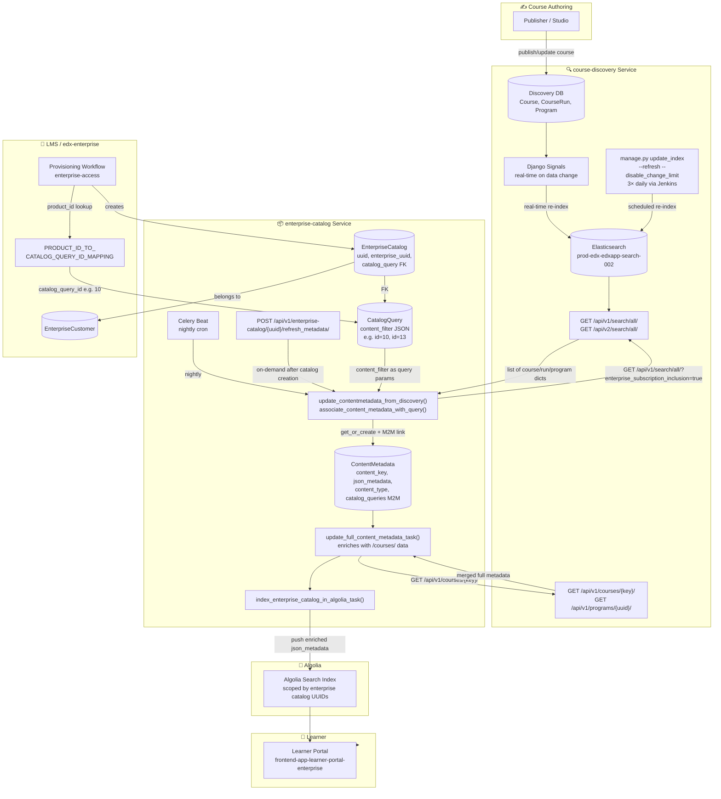

# Discovery → Enterprise Catalog: How Published Courses Are Reflected

> **Sources:**
> - [Discovery - Enterprise Course Catalog Integration](https://openedx.atlassian.net/wiki/spaces/EDUCATOR/pages/discovery-enterprise-catalog-integration)
> - [Discovery Indexes: ElasticSearch & Algolia](https://openedx.atlassian.net/wiki/spaces/EDUCATOR/pages/discovery-indexes)
> - [Data Engineering Alignment for Product & Course Data Sources](https://openedx.atlassian.net/wiki/spaces/DE/pages/data-engineering-alignment)
> - [[Discovery] Ingesting and consuming content metadata for consumption within edX for Business](https://openedx.atlassian.net/wiki/spaces/EDUCATOR/pages/discovery-ingesting-content-metadata)

---

## 0. Core Flow (TL;DR)

```
Publisher / Studio
      │  creates/publishes course
      ▼
course-discovery  (source of truth for all course metadata)
      │  indexes to Elasticsearch  (3× daily + real-time on changes)
      ▼
Elasticsearch
      │  queried by enterprise-catalog via /api/v1/search/all
      ▼
enterprise-catalog  (daily cron: update_content_metadata)
      │  stores as ContentMetadata records, filtered by CatalogQuery
      ▼
Algolia  (reindex_algolia task — powers Learner Portal search)
      │
      ▼
Learner Portal search results
```

The **key link** between the two systems is the **content key**
(e.g., `course-v1:edX+DemoX+T2024`) — the same identifier used in both
Discovery and Enterprise Catalog.

---

## 0.1 Architecture Diagram



---

## 1. The Relationship at a Glance

```
course-discovery DB                     enterprise-catalog DB
──────────────────                      ──────────────────────
Course (published)                      ContentMetadata
  ├── key: "course-v1:edX+DemoX"   ──► ├── content_key: "course-v1:edX+DemoX"
  ├── title, description, ...           ├── json_metadata (full blob from discovery)
  └── course_runs                       ├── content_type: COURSE / COURSE_RUN / PROGRAM
                                        └── catalog_queries (M2M ──► CatalogQuery)
                                                                          │
                                                                          │ FK
                                                                          ▼
                                                                   CatalogQuery
                                                                   ├── id (e.g. 10)
                                                                   └── content_filter (JSON)
                                                                          │
                                                                          │ FK
                                                                          ▼
                                                                   EnterpriseCatalog
                                                                   ├── uuid
                                                                   └── enterprise_uuid
```

A course in discovery does **not** automatically appear in `ContentMetadata`.
It must be **pulled in** by a sync process that queries discovery's `/search/all` endpoint
using the `content_filter` of each `CatalogQuery`.

---

## 2. Discovery's Own Indexing (Before Enterprise Catalog Runs)

Before enterprise-catalog can sync, Discovery must have the course indexed in **Elasticsearch**:

| Trigger | Frequency | What happens |
|---------|-----------|-------------|
| Course published/updated in Studio or Publisher | Real-time | Discovery updates its DB + queues an Elasticsearch re-index |
| Scheduled Elasticsearch index rebuild | 3× daily | Full or incremental re-index of all courses in Discovery |

Enterprise-catalog queries Discovery's **Elasticsearch-backed** `/api/v1/search/all` endpoint — so a course must be in Elasticsearch first before it can be picked up by enterprise-catalog's sync.

---

## 3. Enterprise Catalog Sync — Two Triggers

### Trigger 1: Celery Beat (Scheduled, periodic)

A management command runs on a schedule (typically nightly via Celery Beat):

```
management command: update_content_metadata
      │
      ├─ For every active CatalogQuery in the DB:
      │       └─ calls update_contentmetadata_from_discovery(catalog_query)
      │           └─ hits Discovery /api/v1/search/all with content_filter
      │
      └─ Then:
              └─ update_full_content_metadata_task()  (enriches with /courses/ data)
              └─ reindex_algolia / index_enterprise_catalog_in_algolia_task()
```

### Trigger 2: On-Demand API Refresh (Event-driven)

When a new `EnterpriseCatalog` is created (e.g., during provisioning), the LMS calls:

```
POST /api/v1/enterprise-catalog/{uuid}/refresh_metadata/
      │
      └─ Triggers a Celery chain:
              1. update_catalog_metadata_task(catalog_query_id)
              2. update_full_content_metadata_task()
              3. index_enterprise_catalog_in_algolia_task()
```

View: `enterprise_catalog/apps/api/v1/views/enterprise_catalog_refresh_data_from_discovery.py`

---

## 4. The `enterprise_subscription_inclusion` Flag (Catalog Query Filter)

The `CatalogQuery.content_filter` is the JSON filter passed to Discovery's `/search/all` endpoint.
The most important field for enterprise subscription catalogs is `enterprise_subscription_inclusion`.

### Flag hierarchy

```
Discovery Course
  └── enterprise_subscription_inclusion (bool, set per course in Publisher/Studio)
        │
        ├── true  → course is eligible to appear in subscription catalogs
        └── false → course is excluded, even if it matches other filter criteria
```

This flag is set on the Discovery side and propagated to enterprise-catalog via the sync.

### Typical CatalogQuery content_filter for subscription catalogs

```json
{
  "enterprise_subscription_inclusion": true,
  "content_type": ["course", "courserun", "program"],
  "partner": "edx"
}
```

When `update_contentmetadata_from_discovery()` runs, it passes these as query params to:
```
GET {DISCOVERY_URL}/api/v1/search/all/?enterprise_subscription_inclusion=true&content_type=course&...
```

Only courses with `enterprise_subscription_inclusion=true` in Discovery's Elasticsearch index
will be returned and stored as `ContentMetadata`.

---

## 5. Step-by-Step Sync Flow

```
Step 1 — CatalogQuery has a content_filter (JSON)
         e.g. {"content_type": ["course"], "partner": "edx"}

         ┌──────────────────────────────────────────────────┐
         │  CatalogQuery(id=10)                             │
         │    content_filter: {"content_type": ["course"]}  │
         └──────────────────────────────────────────────────┘

Step 2 — update_contentmetadata_from_discovery(catalog_query)
         calls CatalogQueryMetadata(catalog_query).metadata
         which hits:

         GET {DISCOVERY_URL}/api/v1/search/all/
             ?content_type=course
             &partner=edx
             &...  (content_filter as query params)

         Returns a list of course/program/run metadata dicts.

Step 3 — associate_content_metadata_with_query(metadata, catalog_query)
         For each item returned:
           • get_or_create ContentMetadata(content_key=...)
           • set ContentMetadata.json_metadata = the discovery dict
           • ContentMetadata.catalog_queries.add(catalog_query)  ← M2M link

Step 4 — update_full_content_metadata_task()
         For each ContentMetadata of type COURSE:
           • GET {DISCOVERY_URL}/api/v1/courses/{key}/
           • Merges the full course data (reviews, programs, runs) into json_metadata

Step 5 — index_enterprise_catalog_in_algolia_task()
         Pushes enriched json_metadata into Algolia search index,
         scoped by enterprise catalog UUIDs.
```

---

## 6. The Key Tables / Models

| Model | Table | Purpose |
|-------|-------|---------|
| `CatalogQuery` | `catalog_catalogquery` | Stores the `content_filter` JSON used to query discovery |
| `ContentMetadata` | `catalog_contentmetadata` | One row per course/run/program; stores the full JSON blob from discovery |
| `EnterpriseCatalog` | `catalog_enterprisecatalog` | One catalog per enterprise customer; FK to `CatalogQuery` |
| `ContentMetadata.catalog_queries` | `catalog_contentmetadata_catalog_queries` | M2M join — which queries include this content |

---

## 7. When Does a Newly Published Course Appear?

```
course-discovery
  Publisher marks course as "Published"
        │
        │  (discovery DB is updated immediately)
        │
        ▼
enterprise-catalog does NOT know yet.
It will pick it up on the NEXT sync:

  Option A — Scheduled sync  → next nightly Celery Beat run
  Option B — Manual trigger  → POST /api/v1/enterprise-catalog/{uuid}/refresh_metadata/
  Option C — Management cmd  → ./manage.py update_content_metadata
```

**Typical lag: up to 24 hours** unless manually triggered.

---

## 8. Relevant API Endpoints

### Discovery API

| Endpoint | Purpose |
|----------|---------|
| `GET /api/v1/search/all/?enterprise_subscription_inclusion=true` | Main endpoint enterprise-catalog queries to sync content |
| `GET /api/v1/courses/{key}/` | Full course metadata (used by `update_full_content_metadata_task`) |
| `GET /api/v1/programs/{uuid}/` | Full program metadata |
| `GET /api/v1/course_runs/{key}/` | Full course run metadata |

### Enterprise Catalog API

| Endpoint | Purpose |
|----------|---------|
| `POST /api/v1/enterprise-catalog/{uuid}/refresh_metadata/` | On-demand sync: pulls from discovery + re-indexes Algolia |
| `GET /api/v1/enterprise-catalogs/{uuid}/contains_content_items/?course_run_ids=...` | Check if a course is in a specific catalog |
| `GET /api/v1/catalogs/{uuid}/get_content_metadata/` | List all `ContentMetadata` in a catalog |
| `GET /api/v1/enterprise-catalogs/?enterprise_customer={uuid}&enterprise_catalog_query={id}` | Find catalogs for a customer + query combo (via LMS proxy) |

---

## 9. How to Check If a Course Is in a Catalog

### Via Django ORM (inside enterprise-catalog)

```python
from enterprise_catalog.apps.catalog.models import ContentMetadata, CatalogQuery

# Does course exist in ContentMetadata at all?
cm = ContentMetadata.objects.filter(content_key='course-v1:edX+DemoX').first()

# Which CatalogQueries include it?
cm.catalog_queries.values_list('id', 'title')

# Is it in a specific catalog?  (catalog_query_id=10)
from enterprise_catalog.apps.catalog.models import EnterpriseCatalog
catalog = EnterpriseCatalog.objects.get(uuid='...')
ContentMetadata.objects.filter(
    content_key='course-v1:edX+DemoX',
    catalog_queries=catalog.catalog_query,
)
```

### Via SQL

```sql
-- Is course in a specific catalog_query?
SELECT cm.content_key, cm.content_type, cq.id AS catalog_query_id, cq.title
FROM catalog_contentmetadata cm
JOIN catalog_contentmetadata_catalog_queries link ON link.contentmetadata_id = cm.id
JOIN catalog_catalogquery cq ON cq.id = link.catalogquery_id
WHERE cm.content_key = 'course-v1:edX+DemoX'
  AND cq.id = 10;

-- All content in a specific enterprise catalog
SELECT cm.content_key, cm.content_type
FROM catalog_contentmetadata cm
JOIN catalog_contentmetadata_catalog_queries link ON link.contentmetadata_id = cm.id
JOIN catalog_enterprisecatalog ec ON ec.catalog_query_id = link.catalogquery_id
WHERE ec.enterprise_uuid = 'your-enterprise-uuid';
```

### Via API

```
GET /api/v1/enterprise-catalogs/{catalog_uuid}/contains_content_items/?course_run_ids=course-v1:edX+DemoX
```

---

## 10. Manual Sync Commands

Use these when you need to force a sync without waiting for the nightly cron:

```bash
# Inside the enterprise-catalog container / k8s pod:

# Sync all CatalogQueries from discovery (full re-sync)
./manage.py update_content_metadata

# Sync a specific CatalogQuery by ID
./manage.py update_content_metadata --catalog_query_ids 10 13

# Dry-run (logs what would change, does not write to DB)
./manage.py update_content_metadata --dry_run

# On-demand via API (triggers async Celery chain):
curl -X POST https://enterprise-catalog.stage.edx.org/api/v1/enterprise-catalog/{catalog_uuid}/refresh_metadata/ \
  -H "Authorization: Bearer <token>"
```

---

## 11. Full Ownership Chain (Summary)

```
course-discovery publishes course
        │
        │ (sync via /search/all + /courses/ API calls)
        ▼
ContentMetadata.json_metadata  ← stores full course blob
ContentMetadata.catalog_queries (M2M) ← linked by CatalogQuery.content_filter match
        │
        │ (via CatalogQuery FK)
        ▼
EnterpriseCatalog.catalog_query ← each enterprise catalog points to a CatalogQuery
        │
        │ (via enterprise_uuid)
        ▼
EnterpriseCustomer gets access to the course through their catalog
```

---

## 12. Repo Reference

| Component | Repo | Path |
|-----------|------|------|
| `CatalogQuery` model | `enterprise-catalog` | `enterprise_catalog/apps/catalog/models.py` |
| `ContentMetadata` model | `enterprise-catalog` | `enterprise_catalog/apps/catalog/models.py` |
| `update_contentmetadata_from_discovery()` | `enterprise-catalog` | `enterprise_catalog/apps/catalog/models.py` |
| `CatalogQueryMetadata` (calls discovery) | `enterprise-catalog` | `enterprise_catalog/apps/api_client/discovery.py` |
| Celery tasks (sync chain) | `enterprise-catalog` | `enterprise_catalog/apps/api/tasks.py` |
| On-demand refresh view | `enterprise-catalog` | `enterprise_catalog/apps/api/v1/views/enterprise_catalog_refresh_data_from_discovery.py` |
| Management command | `enterprise-catalog` | `enterprise_catalog/apps/catalog/management/commands/update_content_metadata.py` |
