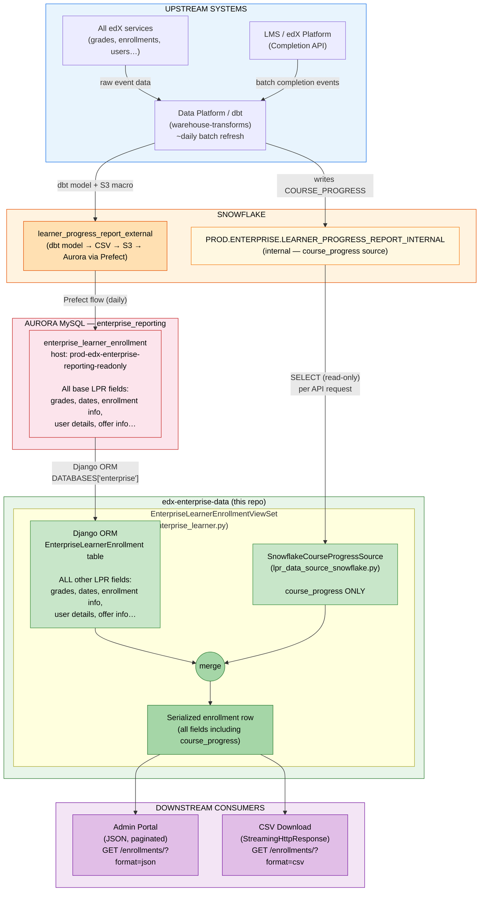
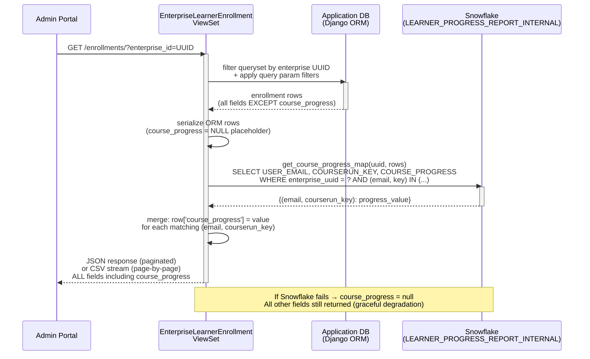

# Learner Progress Report — `course_progress` Field: Full Technical History & Current State

> **Audience:** Engineering, Product, Data Platform, Snowflake Admins  
> **Related tickets:** [ENT-5795](https://2u-internal.atlassian.net/browse/ENT-5795) (original discovery, ~2022), [ENT-9207](https://2u-internal.atlassian.net/browse/ENT-9207) (second discovery), [ENT-11183](https://2u-internal.atlassian.net/browse/ENT-11183) (implementation), [DPSD-8550](https://2u-internal.atlassian.net/browse/DPSD-8550) (Data Platform — Snowflake table), [ENT0-9531](https://2u-internal.atlassian.net/browse/ENT0-9531) (caching initiative), [ENT-11788](https://2u-internal.atlassian.net/browse/ENT-11788) (cache implementation subtask to reduce frequent Snowflake reads)  
> **Data Platform PR:** [warehouse-transforms#7163](https://github.com/edx/warehouse-transforms/pull/7163/changes)  
> **Status as of May 2026:** `course_progress` is live in production, reading from `PROD.ENTERPRISE.LEARNER_PROGRESS_REPORT_INTERNAL`. Snowflake auth migration to key pair is pending (deadline: end of August 2026).  
> **Origin:** Slack thread initiated by Dave Wolf (Snowflake team) regarding `ENTERPRISE_SERVICE_USER` still authenticating via username/password.

---

## Executive Summary

- `course_progress` is a **customer-visible requirement** because enterprise admins expect to see the same completion percentage learners already see in the LMS.
- Two earlier approaches failed: (1) recalculating the percentage in the warehouse did not match LMS behavior, and (2) calling the LMS endpoint directly was not scalable for enterprise reporting.
- The production solution is to read the **LMS-calculated value** from Snowflake table `PROD.ENTERPRISE.LEARNER_PROGRESS_REPORT_INTERNAL` and merge it into the LPR response at request time.
- All other LPR fields continue to flow through the standard **Snowflake → S3 → Aurora → Django ORM** batch pipeline.
- The integration is **read-only** and **gracefully degrading**: if Snowflake is unavailable, only `course_progress` becomes `null`; the rest of the report still returns successfully.
- The main operational follow-up is reducing repeated request-time reads via [ENT0-9531](https://2u-internal.atlassian.net/browse/ENT0-9531), with implementation will be  tracked in  [ENT-11788](https://2u-internal.atlassian.net/browse/ENT-11788), and completing the pending Snowflake key-pair authentication migration will be implemented in [ENT-11804](https://2u-internal.atlassian.net/browse/ENT-11804)

---

## Table of Contents

0. [Executive Summary](#executive-summary)
1. [Business Context & Customer Need](#1-business-context--customer-need)
2. [Previous Discovery Attempts & Why They Failed](#2-previous-discovery-attempts--why-they-failed)
    - [2.5 Why `course_progress` Doesn't Travel Through the Standard Pipeline](#25-why-course_progress-doesnt-travel-through-the-standard-pipeline)
3. [How We Solved It — Current Implementation (ENT-11183)](#3-how-we-solved-it--current-implementation-ent-11183)
4. [Architecture & Data Flow](#4-architecture--data-flow)
    - [4.0 Base LPR Batch Pipeline](#40-base-lpr-batch-pipeline)
    - [4.1 High-Level System Architecture (including course_progress enrichment)](#41-high-level-system-architecture)
    - [4.2 Request-Time Sequence](#42-request-time-sequence)
5. [Code Walkthrough](#5-code-walkthrough)
6. [Query Frequency Explained](#6-query-frequency-explained)
7. [Graceful Degradation](#7-graceful-degradation)
8. [Summary for Snowflake Admin (Dave Wolf)](#8-summary-for-snowflake-admin-dave-wolf)
9. [Open Questions & Change Guidance](#9-open-questions--change-guidance)

---

## 1. Business Context & Customer Need

For several years, enterprise customers — including GoLearning and others — have requested the ability to see **how far a learner has progressed through a course** in the Learner Progress Report (LPR).

The existing `current_grade` field does not satisfy this need because:

- Grade only reflects graded assignments. If a course's assessed work is concentrated at the end, all learners will show `0%` grade until they reach those assignments — even if they have consumed 80% of the course content.
- Learners **can** see their own course progress percentage in the LMS learning experience (powered by the Completion API). Enterprise admins cannot see the same data. This mismatch frustrates customers and leads to escalations, because from their perspective the data exists but is being withheld.
- In the past, workarounds included learners sending screenshots of their progress to their enterprise admin — clearly not scalable.

**Customer expectation:** The LPR should expose the same completion percentage that learners already see inside the LMS.

---

## 2. Previous Discovery Attempts & Why They Failed

A discovery effort was carried out (tracked in **[ENT-9207](https://2u-internal.atlassian.net/browse/ENT-9207)**). The original acceptance criteria asked:

1. Can we replicate the Completion API representation of course progress that learners see in the LMS?
2. Can we call the API directly that generates the progress visualization, so we stay in sync with the numbers learners see?
3. If not, can we calculate it from Completion API data and match the results? (Harder — even minor errors would cause issues.)
4. If none of the above, can we document what architectural work would be required to become consumers of that API?

Two approaches were explored:

| Approach | Steps Tried | Why It Failed |
|---|---|---|
| **Calculate it ourselves** | Derive the progress % from raw Completion API data already in our pipeline | Could not reliably match the numbers learners see in the LMS. Even minor discrepancies would cause ongoing support burden. |
| **Call the LMS API directly** | Fetch the same endpoint that renders the progress visualization in the LMS | Architecturally not feasible — our data pipeline runs as a batch process and cannot call user-context LMS endpoints at scale. |

**Outcome of ENT-9207:** The effort was suspended. The problems were documented and a shared understanding was reached that the feature would need Data Platform involvement to surface the already-calculated value from within the warehouse.

**Key grooming discussion (documented for posterity):**

> *Ammar: LPR data lags real time by one day. So if we add the progress into the LPR pipeline, it can create confusion — the data in the LPR is a day old, but the learner sees the latest progress in the LMS.*
>
> *NR: We can defend a data lag as long as the data provenance is good. It would be preferable if we can inherit the progress calculated in the LMS chart rather than recalculating it ourselves.*
>
> *Clarification from NR: We do NOT want to show the course completion percentage visualization in the LPR table. We want the % value as a field. Any references to the "visual API" should be read as: "is there a way to fetch this value from the same API that renders the progress image in the LMS, so we skip trying to calculate it ourselves?"*

---

## 2.5 Why `course_progress` Doesn't Travel Through the Standard Pipeline

Question is: *If most LPR data flows through the Snowflake → S3 → Aurora batch pipeline, why does `course_progress` bypass that path and get fetched from Snowflake at request time?* The answer is rooted in two failed earlier approaches and one core design principle: this field must match the learner-facing LMS value closely enough that provenance matters more than architectural uniformity.

### The Standard Pipeline Has a ~1-Day Lag

The batch pipeline (dbt → S3 → Aurora) is designed for throughput and operational simplicity, not freshness. In practice, it runs about a day behind what learners see in the LMS. For most LPR fields — grades, enrollment dates, user attributes, commercial metadata — that lag is acceptable. For `course_progress`, however, customers can directly compare the admin-facing value with what the learner sees in-course, so both freshness and source fidelity are more important.

> *"LPR data lags real time by one day. So if we add the progress into the LPR pipeline, it can create confusion — the data in the LPR is a day old, but the learner sees the latest progress in the LMS."* — Ammar (ENT-9207 grooming)
>
> *"We can defend a data lag as long as the data provenance is good."* — NR (Product)

### Attempt 1 (around 2022) — Calculate it in the Warehouse

Ticket [ENT-5795](https://2u-internal.atlassian.net/browse/ENT-5795) attempted to derive the progress percentage from block-level completion data already available in Snowflake. The problem was that `course_progress` is not a raw source field — it is a **computed LMS metric**. The LMS applies its own rules for block weighting, exclusions, visibility, and course structure before producing the learner-visible percentage. Re-implementing that logic in dbt SQL produced values that did not consistently match what learners saw in-course. Even small discrepancies (~1–2%) are expensive here because enterprise admins compare the report directly with learner screenshots and learner-reported values. That made this option operationally unsafe.

### Attempt 2 (ENT-9207) — Call the LMS API Directly

The outcome of ENT-9207 was to use the LMS Completion API endpoint directly at query time:

```
{LMS_BASE_URL}/api/course_home/progress/{courseId}/{targetUserId}/
```

This was attractive because it would have used the **same source of truth the learner sees**, eliminating calculation mismatch. However, it also failed for architectural reasons:

- The LMS endpoint requires user context and was not designed for bulk, unauthenticated machine-to-machine calls.
- Our batch pipeline has no mechanism to fan out thousands of LMS API calls per enterprise per day.
- At scale (large enterprises, thousands of enrollments) this would have hammered the LMS and likely caused rate-limit failures.

So while this option was correct from a fidelity standpoint, it was not safe or scalable as a reporting integration pattern.

### Why Real-Time Snowflake Is the Right Answer

The breakthrough in [ENT-11183](https://2u-internal.atlassian.net/browse/ENT-11183) and [DPSD-8550](https://2u-internal.atlassian.net/browse/DPSD-8550) was the Data Platform team surfacing the pre-calculated `COURSE_PROGRESS` value — the LMS's own computed number — directly into `PROD.ENTERPRISE.LEARNER_PROGRESS_REPORT_INTERNAL`. This solved both prior blockers:

| Blocker | How Snowflake Solves It |
|---|---|
| Can't calculate it ourselves accurately | Data Platform brings the LMS-calculated value into Snowflake — we SELECT it, we don't compute it |
| Can't call the LMS API at scale | Data Platform handles the upstream collection and publication work; the application only reads the published result |
| Pipeline lag concern | Snowflake is queried at request time — admins always get the freshest value the Data Platform has written, not a further-delayed copy in Aurora |

The reason it is **not** pushed through the full Aurora pipeline is pragmatic: adding it to Aurora would introduce another daily copy hop for the single field where additional delay is least acceptable. Querying Snowflake at request time means the API serves the freshest value currently published by Data Platform without adding another replication layer. Put simply: Aurora remains the right store for stable batch-reporting fields, while Snowflake is the right read path for this one high-sensitivity metric.

### Observed Query Volume (DataDog snapshot, ~May 2026)

| Signal | Approximate count/day |
|---|---|
| Snowflake-connectivity log events | ~11,000 |
| Enrollment API log events | ~8,000 |

These are operational log lines, not 1:1 SQL statement counts — a single API request may produce multiple connection and query log entries. Even so, they are directionally useful: the traffic profile is consistent with interactive Admin Portal usage (page loads, pagination, CSV exports) plus any downstream polling integrations. The planned caching layer ([ENT0-9531](https://2u-internal.atlassian.net/browse/ENT0-9531)) should materially reduce repeat reads inside the same refresh window without changing the underlying data contract. Implementation of that query-reduction work will be tracked in [ENT-11788](https://2u-internal.atlassian.net/browse/ENT-11788).

---

## 3. How We Solved It — Current Implementation (ENT-11183)

The breakthrough came when the Data Platform team (ticket **[DPSD-8550](https://2u-internal.atlassian.net/browse/DPSD-8550)**) confirmed they could surface the pre-calculated `COURSE_PROGRESS` value — the same value the LMS exposes to learners — directly in a Snowflake table: `PROD.ENTERPRISE.LEARNER_PROGRESS_REPORT_INTERNAL`. The Data Platform's work was delivered via [warehouse-transforms#7163](https://github.com/edx/warehouse-transforms/pull/7163/changes).

This bypassed both failed approaches from ENT-9207:
- We no longer need to recalculate the value ourselves.
- We no longer need to call the LMS API. The Data Platform pipeline does that work, and we consume the result.

**ENT-11183** implemented the integration:

- Added a `course_progress` field to the LPR API response and CSV download.
- The field is populated at request time by querying Snowflake's internal table.
- All other LPR fields continue to come from the Django ORM (application database) — only `course_progress` comes from Snowflake.
- If Snowflake is unavailable, the API degrades gracefully: `course_progress` is `null` but the full LPR response is still returned.

---

## 4. Architecture & Data Flow

### 4.0 Base LPR Batch Pipeline

The vast majority of LPR fields — grades, enrollment dates, user details, offer info — travel through a **daily batch pipeline** that is completely separate from the Snowflake enrichment described in the rest of this document. Understanding this pipeline is essential context for any schema change or new column addition.

```mermaid
flowchart LR
    SVC["All edX services\ngrades, enrollments, users, offers"] --> RAW["Snowflake\nraw warehouse data"]
    RAW --> DBT["warehouse-transforms (dbt)\nlearner_progress_report_external.sql"]
    DBT --> S3["S3 CSV export\nperform_s3_transfers macro"]
    S3 --> PF["Prefect flow\nload_enterprise_tables_from_s3_to_aurora\nprod.toml lines 137–190"]
    PF --> ADB["Aurora MySQL\nenterprise_reporting DB"]
    ADB --> TBL["enterprise_learner_enrollment"]
    TBL --> ORM["Django ORM\nEnterpriseLearnerEnrollment"]

    style SVC fill:#dbeafe,stroke:#1a73e8,color:#000
    style RAW fill:#ffe0b2,stroke:#e65100,color:#000
    style DBT fill:#ffe0b2,stroke:#e65100,color:#000
    style S3 fill:#c8e6c9,stroke:#2e7d32,color:#000
    style PF fill:#c8e6c9,stroke:#2e7d32,color:#000
    style ADB fill:#f8bbd0,stroke:#c62828,color:#000
    style TBL fill:#f8bbd0,stroke:#c62828,color:#000
    style ORM fill:#f8bbd0,stroke:#c62828,color:#000
```



**Flow summary:** All non-`course_progress` LPR fields are modeled in dbt, exported to S3, loaded into Aurora by Prefect, and then served through the Django ORM.

#### Key pipeline facts

| Property | Detail |
|---|---|
| **Refresh cadence** | Daily — the dbt macro has no explicit schedule tag beyond the daily run |
| **Table lifecycle** | The `enterprise_learner_enrollment` table is effectively **truncated and reloaded** each day by the Prefect flow |
| **Schema management** | Adding a new column requires: (1) updating the dbt model SQL, (2) updating the Prefect `.toml` loading config, (3) updating the `EnterpriseLearnerEnrollment` Django model field, (4) updating API serialization. Django migrations exist for local dev but the prod DB schema is driven by the Prefect load definition — confirm whether `django_migrations` table exists in `enterprise_reporting` before assuming ORM migrations run in prod |
| **Read-only DB** | The Django app connects to a read-replica; only the Prefect flow writes to this DB |
| **Source of truth refs** | [warehouse-transforms base models](https://github.com/edx/warehouse-transforms/tree/ab8dd5fd305b80f07e47c807c02c54a8a202112f/projects/reporting/models/data_marts/enterprise/base) · [learner_progress_report_external.sql](https://github.com/edx/warehouse-transforms/blob/ab8dd5fd305b80f07e47c807c02c54a8a202112f/projects/reporting/models/data_marts/enterprise/admin_dash/learner_progress_report_external.sql) · [perform_s3_transfers.sql](https://github.com/edx/warehouse-transforms/blob/master/projects/reporting/macros/perform_s3_transfers.sql) · [Prefect flow prod.toml L137-190](https://github.com/edx/prefect-flows/blob/7d726b79ad8300434d6ddd5ccbd86940485368ed/flows/load_enterprise_tables_from_s3_to_aurora/prod.toml#L137-L190) |

---

### 4.1 High-Level System Architecture



### 4.2 Request-Time Sequence



**Key design properties:**
- **Data lag:** `COURSE_PROGRESS` reflects a ~daily refresh by the Data Platform pipeline — consistent with the rest of the LPR.
- **Read-only:** The application never writes to Snowflake. Data flows strictly one-way: Snowflake → application → API response.
- **Single field from Snowflake:** Only `course_progress` comes from Snowflake. Every other LPR field comes from the application database.
- **Tight query scope:** Each Snowflake call is scoped to one enterprise UUID and only the `(user_email, courserun_key)` pairs on the current page — no full-table scans.

---

## 5. Code Walkthrough

### 5.1 View — `EnterpriseLearnerEnrollmentViewSet`

File: `enterprise_data/api/v1/views/enterprise_learner.py`

The `list()` method handles both JSON API responses and streaming CSV downloads. In both paths, after fetching enrollment records from the ORM, it calls `_enrich_course_progress_rows()`.

```python
def list(self, request, *args, **kwargs):
    if request.accepted_renderer.format == 'csv':
        return StreamingHttpResponse(
            EnrollmentsCSVRenderer().render(self._stream_serialized_data()),
            ...
        )
    response = super().list(request, *args, **kwargs)
    self._enrich_course_progress(response)
    return response
```

The enrichment method calls Snowflake and merges the result:

```python
def _enrich_course_progress_rows(self, rows):
    try:
        enterprise_uuid = self.kwargs['enterprise_id']
        progress_map = SnowflakeCourseProgressSource().get_course_progress_map(enterprise_uuid, rows)
        for row in rows:
            key = (row.get('user_email', '').strip(), row.get('courserun_key', '').strip())
            if key in progress_map:
                row['course_progress'] = progress_map[key]
        return rows
    except Exception:
        LOGGER.warning('Could not enrich course_progress from Snowflake', exc_info=True)
        return rows  # graceful degradation: return rows unchanged, course_progress stays null
```

A synthetic `NULL` placeholder is added to the ORM queryset so the serializer shape always includes the field:

```python
enrollments = EnterpriseLearnerEnrollment.objects.filter(
    enterprise_customer_uuid=enterprise_customer_uuid
).extra(select={'course_progress': 'NULL'})
```

### 5.2 Snowflake Client — `SnowflakeCourseProgressSource`

File: `enterprise_data/api/v1/views/lpr_data_source_snowflake.py`

Executes a single, parameterised SQL query scoped to the enterprise UUID and the exact `(user_email, courserun_key)` pairs on the current page:

```sql
SELECT USER_EMAIL, COURSERUN_KEY, COURSE_PROGRESS
FROM PROD.ENTERPRISE.LEARNER_PROGRESS_REPORT_INTERNAL
WHERE LOWER(REPLACE(TO_VARCHAR(ENTERPRISE_CUSTOMER_UUID), '-', '')) = ?
  AND (USER_EMAIL, COURSERUN_KEY) IN ((?, ?), (?, ?), ...)
```

Returns a `{ (user_email, courserun_key): course_progress }` dict. Connections are opened and closed per call (no persistent connection pool at this time).

### 5.3 Shared Contracts — `LPRSerializerShapeMixin`

File: `enterprise_data/api/v1/views/lpr_data_source_base.py`

Defines the canonical list of LPR API fields (`SERIALIZER_FIELDS`), including `course_progress`. Any future Snowflake or ORM-backed source should conform to this contract.

### 5.4 Separate Reporting Client — `SnowflakeClient`

File: `enterprise_reporting/clients/snowflake.py`

An **independent** Snowflake client used by scheduled batch reporting jobs in `enterprise_reporting/`. It uses separate credentials (`SNOWFLAKE_USERNAME` / `SNOWFLAKE_PASSWORD` env vars) and is unrelated to the LPR enrichment flow described above.

---

## 6. Query Frequency Explained

### 6.1 Who triggers the queries?

The Snowflake queries Dave Wolf observed in query history are triggered by **enterprise admin users** (employees of enterprise customers such as GoLearning) using the **Admin Portal** web application. When an admin navigates to the Learner Progress Report page, the frontend calls our API, and our API calls Snowflake.

These are **not** automated batch jobs or cron-triggered exports. They are real-time, user-initiated API requests.

### 6.2 Why so frequent?

The current implementation queries Snowflake on every LPR API request to ensure enterprise admins always receive the **most up-to-date** `course_progress` values available in the warehouse. Each query is scoped tightly to one enterprise UUID and only the exact `(user_email, courserun_key)` pairs on the current page — no full-table scans.

| Trigger | When it fires |
|---|---|
| Admin Portal loads the LPR table | Once per page load, once per pagination event |
| Admin Portal CSV export | Once per `ENROLLMENTS_PAGE_SIZE` rows streamed |
| API integrations / automated tooling | Depends on the polling interval of the client |

**Planned improvement — [ENT0-9531](https://2u-internal.atlassian.net/browse/ENT0-9531):** We have already identified and scoped a caching layer to sit in front of the Snowflake call. Since `COURSE_PROGRESS` data refreshes only ~daily, a short-lived cache keyed per enterprise will eliminate redundant queries within the same refresh window, significantly reducing observed query volume while keeping the data as fresh as the underlying pipeline allows. The implementation for this task is [ENT-11788](https://2u-internal.atlassian.net/browse/ENT-11788).

---

## 7. Graceful Degradation

If the Snowflake call fails for any reason — wrong credentials, network timeout, table unavailable — the application **does not return an error to the caller**. Instead:

- All other LPR fields are served from the application database as normal.
- `course_progress` is `null` for all rows on that response.
- A `WARNING` is logged with full traceback for observability.

This design means:
- Any future auth or connectivity change (including the key pair migration) can be deployed and validated in staging without risking the production LPR API.
- Any Snowflake outage has a bounded, predictable impact — `course_progress` degrades to `null` for the duration, nothing else breaks.
- The caching improvement ([ENT0-9531](https://2u-internal.atlassian.net/browse/ENT0-9531)), now being implemented in [ENT-11788](https://2u-internal.atlassian.net/browse/ENT-11788), can be introduced safely because the fallback path already exists.

---

## 8. Summary for Dave Wolf

### 8.1 Answers to Dave's questions

| Question | Answer |
|---|---|
| **Is this flow still needed?** | Yes. It powers the `course_progress` field in the LPR — a top customer request. Disabling it would regress the feature to `null` for all enterprises. |
| **Is this a reverse ETL?** | No. The application is strictly read-only. It SELECTs one column (`COURSE_PROGRESS`) and never writes back. |
| **Who requests these reports?** | Enterprise admin users (employees of enterprise customers) using the Admin Portal. Each page load or CSV export triggers a Snowflake query. |
| **Why so frequently?** | Each page load and CSV export triggers a request-time Snowflake read so admins see the freshest value currently published by Data Platform. We have already scoped a caching layer ([ENT0-9531](https://2u-internal.atlassian.net/browse/ENT0-9531)); the implementation work is now tracked in [ENT-11788](https://2u-internal.atlassian.net/browse/ENT-11788), which should eliminate redundant reads within each ~daily refresh window and materially reduce query volume. |
| **Who would do the key pair migration?** | The Lakshy team (this repo). The code change is straightforward — swap `password` for `private_key` in the connector call. The prerequisite is for the Snowflake team to generate the RSA key pair and register the public key against `ENTERPRISE_SERVICE_USER`.It will be implemented in the ticket [ENT-11804](https://2u-internal.atlassian.net/browse/ENT-11804) |


