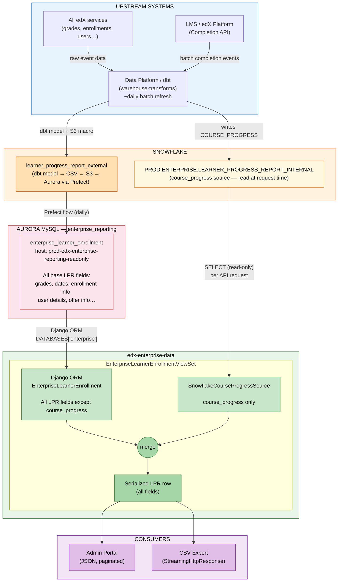
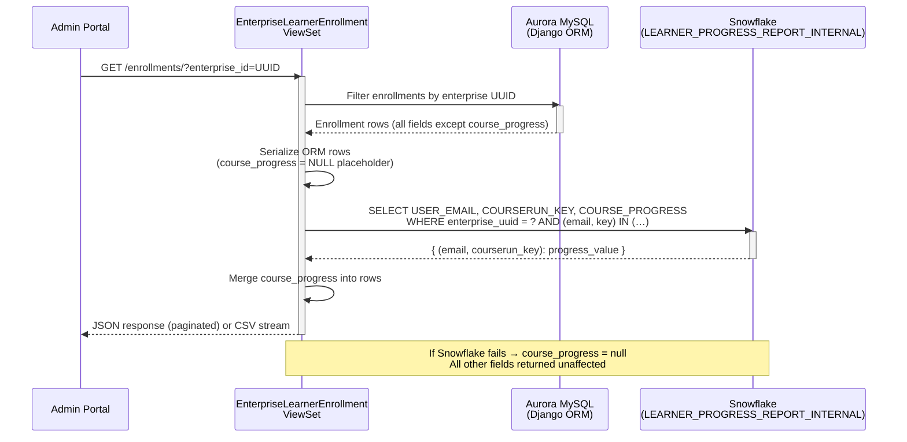

# Learner Progress Report — `course_progress` Field: Full Technical History & Current State

> **Audience:** Engineering, Product, Data Platform, Snowflake Admins
> **Related tickets:** [ENT-5795](https://2u-internal.atlassian.net/browse/ENT-5795) (original discovery, ~2022), [ENT-9207](https://2u-internal.atlassian.net/browse/ENT-9207) (second discovery), [ENT-11183](https://2u-internal.atlassian.net/browse/ENT-11183) (implementation), [DPSD-8550](https://2u-internal.atlassian.net/browse/DPSD-8550) (Data Platform — Snowflake table), [ENT0-9531](https://2u-internal.atlassian.net/browse/ENT0-9531) (caching)
> **Data Platform PR:** [warehouse-transforms#7163](https://github.com/edx/warehouse-transforms/pull/7163/changes)
> **Status as of May 2026:** `course_progress` is live in production, reading from `PROD.ENTERPRISE.LEARNER_PROGRESS_REPORT_INTERNAL`. Snowflake auth migration to key pair is pending (deadline: end of August 2026).
> **Origin:** Slack thread initiated by Dave Wolf (Snowflake team) regarding `ENTERPRISE_SERVICE_USER` still authenticating via username/password.

---

## Table of Contents

1. [Business Context & Customer Need](#1-business-context--customer-need)
2. [Previous Discovery Attempts & Why They Failed](#2-previous-discovery-attempts--why-they-failed)
    - [2.5 Why `course_progress` Doesn't Travel Through the Standard Pipeline](#25-why-course_progress-doesnt-travel-through-the-standard-pipeline)
3. [How We Solved It — Current Implementation (ENT-11183)](#3-how-we-solved-it--current-implementation-ent-11183)
4. [Architecture & Data Flow](#4-architecture--data-flow)
    - [4.0 Full LPR Base Data Pipeline](#40-full-lpr-base-data-pipeline-all-fields-except-course_progress)
    - [4.1 High-Level System Architecture](#41-high-level-system-architecture)
    - [4.2 Request-Time Sequence](#42-request-time-sequence)
5. [Code Walkthrough](#5-code-walkthrough)
6. [Query Frequency Explained](#6-query-frequency-explained)
7. [Graceful Degradation](#7-graceful-degradation)
8. [Summary for Dave Wolf](#8-summary-for-dave-wolf)
9. [Open Questions & Change Guidance](#9-open-questions--change-guidance)

---

## 1. Business Context & Customer Need

For several years, enterprise customers — including GoLearning and others — have requested the ability to see **how far a learner has progressed through a course** in the Learner Progress Report (LPR).

The existing `current_grade` field does not satisfy this need because:

- Grade only reflects graded assignments. If a course's assessed work is concentrated at the end, all learners will show `0%` grade until they reach those assignments — even if they have consumed 80% of the course content.
- Learners **can** see their own course progress percentage in the LMS learning experience (powered by the Completion API). Enterprise admins cannot see the same data. This mismatch frustrates customers and leads to escalations.
- In the past, workarounds included learners sending screenshots of their progress to their enterprise admin — clearly not scalable.

**Customer expectation:** The LPR should expose the same completion percentage that learners already see inside the LMS.

---

## 2. Previous Discovery Attempts & Why They Failed

A discovery effort was carried out (tracked in **[ENT-9207](https://2u-internal.atlassian.net/browse/ENT-9207)**). The original acceptance criteria asked:

1. Can we replicate the Completion API representation of course progress that learners see in the LMS?
2. Can we call the API directly that generates the progress visualization, so we stay in sync?
3. If not, can we calculate it from Completion API data and match the results?
4. If none of the above, can we document what architectural work would be required?

Two approaches were explored:

| Approach | Steps Tried | Why It Failed |
|---|---|---|
| **Calculate it ourselves** | Derive the progress % from raw Completion API data in our pipeline | Could not reliably match the numbers learners see in the LMS. Even minor discrepancies caused ongoing support burden. |
| **Call the LMS API directly** | Fetch the same endpoint that renders the progress visualization in the LMS | Not feasible — our pipeline runs as a batch process and cannot call user-context LMS endpoints at scale. |

**Outcome of ENT-9207:** The effort was suspended. A shared understanding was reached that the feature would need Data Platform involvement to surface the already-calculated value from within the warehouse.

**Key grooming discussion:**

> *Ammar: LPR data lags real time by one day. So if we add the progress into the LPR pipeline, it can create confusion — the data in the LPR is a day old, but the learner sees the latest progress in the LMS.*
>
> *NR: We can defend a data lag as long as the data provenance is good. It would be preferable if we can inherit the progress calculated in the LMS chart rather than recalculating it ourselves.*

---

## 2.5 Why `course_progress` Doesn't Travel Through the Standard Pipeline

A question that comes up regularly: *If most LPR data flows through the Snowflake → S3 → Aurora batch pipeline, why does `course_progress` bypass that pipeline and get fetched real-time?* The answer is rooted in two prior failed attempts and a data provenance constraint.

### The Standard Pipeline Has a ~1-Day Lag

The batch pipeline (dbt → S3 → Aurora) is designed for throughput, not freshness. Data is a full calendar day behind what learners see in the LMS at any given moment. For most LPR fields (grades, enrollment dates, offer info) this is acceptable. For course progress it was debated:

> *"LPR data lags real time by one day. So if we add the progress into the LPR pipeline, it can create confusion — the data in the LPR is a day old, but the learner sees the latest progress in the LMS."* — Ammar (ENT-9207 grooming)
>
> *"We can defend a data lag as long as the data provenance is good."* — NR (Product)

### Attempt 1 (circa 2022, ENT-5795) — Calculate it in the Warehouse

Ticket [ENT-5795](https://2u-internal.atlassian.net/browse/ENT-5795) attempted to derive the progress percentage from block-level completion data already in Snowflake. The problem: `course_progress` isn't a raw event — it's a **calculated metric**. The LMS applies course-specific weighting, block-type exclusions, and visibility rules to produce the number a learner sees. Replicating that logic in dbt SQL produced results that didn't match what learners saw in-course. Even small discrepancies (~1–2%) cause support escalations because admins and learners compare notes directly. The attempt was abandoned.

### Attempt 2 (ENT-9207) — Call the LMS API Directly

The outcome of ENT-9207 was to use the LMS Completion API endpoint directly at query time:

```
{LMS_BASE_URL}/api/course_home/progress/{courseId}/{targetUserId}/
```

This was chosen because it is the **same source of truth the learner sees** — no calculation mismatch possible. However, this approach also hit a wall:

- The LMS endpoint requires user context and was not designed for bulk, unauthenticated machine-to-machine calls.
- Our batch pipeline has no mechanism to fan out thousands of LMS API calls per enterprise per day.
- At scale (large enterprises, thousands of enrollments) this would have hammered the LMS and likely caused rate-limit failures.

The effort was suspended again.

### Why Real-Time Snowflake Is the Right Answer

The breakthrough (ENT-11183 / DPSD-8550) was the Data Platform team surfacing the pre-calculated `COURSE_PROGRESS` value — the LMS's own computed number — directly into `PROD.ENTERPRISE.LEARNER_PROGRESS_REPORT_INTERNAL`. This solved both prior blockers:

| Blocker | How Snowflake Solves It |
|---|---|
| Can't calculate it ourselves accurately | Data Platform brings the LMS-calculated value into Snowflake — we SELECT it, we don't compute it |
| Can't call the LMS API at scale | The Data Platform pipeline does that work in batch; we just query the result |
| Pipeline lag concern | Snowflake is queried at request time — admins always get the freshest value the Data Platform has written, not a further-delayed copy in Aurora |

The reason it is **not** pushed through the full Aurora pipeline is pragmatic: adding it to Aurora would introduce an **additional** ~24-hour lag on top of the Data Platform's refresh cadence. Querying Snowflake directly at request time means admins get the value as soon as the Data Platform has written it — with no extra copy delay.

### Observed Query Volume (DataDog snapshot, ~May 2026)

| Signal | Approximate count/day | Notes |
|---|---|---|
| Snowflake connectivity log events | ~11,000 | App log lines per connection lifecycle — not 1:1 with SQL statements |
| Enrollment API log events | ~8,000 | Inbound LPR API requests |

All traffic is **user-driven** (Admin Portal page loads, pagination, CSV exports). No batch jobs or cron processes.

### How to Reduce Query Volume

| Option | Approach | Impact | Effort |
|---|---|---|---|
| **A — Cache (recommended)** | Cache the progress map per enterprise in Redis, TTL ~24h ([ENT0-9531](https://2u-internal.atlassian.net/browse/ENT0-9531)) | ~80–90% query reduction; N page loads → 1 Snowflake query per enterprise per day | Low — graceful degradation already in place |
| **B — Push through Aurora** | Join `COURSE_PROGRESS` into the dbt model, load via Prefect, serve from Aurora | Eliminates all real-time queries | High — 5-layer change (dbt, Prefect toml, Django model, migration, serializer); adds ~24h extra lag |
| **C — Hybrid** | Option A + diff-only fetches for changed rows | Marginal gain over A alone | High complexity for small benefit |

**Recommendation: ship Option A first.** Option B is viable only if product accepts a 2-day data lag for `course_progress`.

---

## 3. How We Solved It — Current Implementation (ENT-11183)

The breakthrough came when the Data Platform team (ticket **[DPSD-8550](https://2u-internal.atlassian.net/browse/DPSD-8550)**) confirmed they could surface the pre-calculated `COURSE_PROGRESS` value — the same value the LMS exposes to learners — directly in a Snowflake table: `PROD.ENTERPRISE.LEARNER_PROGRESS_REPORT_INTERNAL`. The Data Platform's work was delivered via [warehouse-transforms#7163](https://github.com/edx/warehouse-transforms/pull/7163/changes).

**ENT-11183** implemented the integration:

- Added a `course_progress` field to the LPR API response and CSV download.
- The field is populated at request time by querying Snowflake's internal table.
- All other LPR fields continue to come from the Django ORM — only `course_progress` comes from Snowflake.
- If Snowflake is unavailable, the API degrades gracefully: `course_progress` is `null` but the full LPR response is still returned.

---

## 4. Architecture & Data Flow

### 4.0 Full LPR Base Data Pipeline (All Fields Except `course_progress`)

The vast majority of LPR fields — grades, enrollment dates, user details, offer info — travel through a **daily batch pipeline** entirely separate from the Snowflake enrichment described elsewhere in this document.

<div align="center">

```svg
<svg xmlns="http://www.w3.org/2000/svg" width="720" height="580" font-family="Segoe UI, Arial, sans-serif" font-size="13">
  <!-- Background -->
  <rect width="720" height="580" fill="#f8f9fa" rx="12"/>

  <!-- Title -->
  <text x="360" y="32" text-anchor="middle" font-size="15" font-weight="bold" fill="#1a1a2e">LPR Base Data Pipeline — Daily Batch (All Fields Except course_progress)</text>

  <!-- Box 1: edX Services -->
  <rect x="40" y="60" width="180" height="60" rx="8" fill="#e8f4fd" stroke="#1a73e8" stroke-width="1.5"/>
  <text x="130" y="84" text-anchor="middle" font-weight="bold" fill="#1a1a2e">All edX Services</text>
  <text x="130" y="102" text-anchor="middle" font-size="11" fill="#444">grades, enrollments, users…</text>

  <!-- Arrow 1 -->
  <line x1="130" y1="120" x2="130" y2="148" stroke="#888" stroke-width="1.5" marker-end="url(#arr)"/>
  <text x="145" y="140" font-size="10" fill="#888">raw events</text>

  <!-- Box 2: Snowflake Raw -->
  <rect x="40" y="148" width="180" height="60" rx="8" fill="#fff3e0" stroke="#e65100" stroke-width="1.5"/>
  <text x="130" y="172" text-anchor="middle" font-weight="bold" fill="#1a1a2e">Snowflake</text>
  <text x="130" y="190" text-anchor="middle" font-size="11" fill="#444">Raw data warehouse</text>

  <!-- Arrow 2 -->
  <line x1="130" y1="208" x2="130" y2="236" stroke="#888" stroke-width="1.5" marker-end="url(#arr)"/>

  <!-- Box 3: dbt -->
  <rect x="40" y="236" width="180" height="76" rx="8" fill="#fff3e0" stroke="#e65100" stroke-width="1.5"/>
  <text x="130" y="258" text-anchor="middle" font-weight="bold" fill="#1a1a2e">warehouse-transforms (dbt)</text>
  <text x="130" y="276" text-anchor="middle" font-size="11" fill="#444">learner_progress_report</text>
  <text x="130" y="291" text-anchor="middle" font-size="11" fill="#444">_external.sql</text>
  <text x="130" y="306" text-anchor="middle" font-size="11" fill="#777">perform_s3_transfers macro</text>

  <!-- Arrow 3 -->
  <line x1="130" y1="312" x2="130" y2="340" stroke="#888" stroke-width="1.5" marker-end="url(#arr)"/>
  <text x="145" y="332" font-size="10" fill="#888">CSV → S3</text>

  <!-- Box 4: Prefect -->
  <rect x="40" y="340" width="180" height="60" rx="8" fill="#e8f5e9" stroke="#2e7d32" stroke-width="1.5"/>
  <text x="130" y="364" text-anchor="middle" font-weight="bold" fill="#1a1a2e">Prefect Flow</text>
  <text x="130" y="382" text-anchor="middle" font-size="11" fill="#444">load_enterprise_tables</text>

  <!-- Arrow 4 -->
  <line x1="130" y1="400" x2="130" y2="428" stroke="#888" stroke-width="1.5" marker-end="url(#arr)"/>
  <text x="145" y="420" font-size="10" fill="#888">daily load</text>

  <!-- Box 5: Aurora -->
  <rect x="40" y="428" width="180" height="76" rx="8" fill="#fce4ec" stroke="#c62828" stroke-width="1.5"/>
  <text x="130" y="450" text-anchor="middle" font-weight="bold" fill="#1a1a2e">Aurora MySQL</text>
  <text x="130" y="467" text-anchor="middle" font-size="11" fill="#444">enterprise_reporting DB</text>
  <text x="130" y="482" text-anchor="middle" font-size="10" fill="#777">enterprise_learner_enrollment</text>
  <text x="130" y="496" text-anchor="middle" font-size="10" fill="#777">(read-replica)</text>

  <!-- Divider -->
  <line x1="260" y1="60" x2="260" y2="540" stroke="#ccc" stroke-width="1" stroke-dasharray="6,4"/>

  <!-- Right side: course_progress path -->
  <text x="490" y="32" text-anchor="middle" font-size="13" font-weight="bold" fill="#e65100">course_progress — Real-Time Path</text>

  <!-- LMS box -->
  <rect x="380" y="60" width="160" height="60" rx="8" fill="#e8f4fd" stroke="#1a73e8" stroke-width="1.5"/>
  <text x="460" y="84" text-anchor="middle" font-weight="bold" fill="#1a1a2e">LMS / edX Platform</text>
  <text x="460" y="102" text-anchor="middle" font-size="11" fill="#444">Completion API</text>

  <!-- Arrow LMS → DP -->
  <line x1="460" y1="120" x2="460" y2="148" stroke="#888" stroke-width="1.5" marker-end="url(#arr)"/>
  <text x="475" y="140" font-size="10" fill="#888">batch events</text>

  <!-- Data Platform box -->
  <rect x="380" y="148" width="160" height="60" rx="8" fill="#fff3e0" stroke="#e65100" stroke-width="1.5"/>
  <text x="460" y="172" text-anchor="middle" font-weight="bold" fill="#1a1a2e">Data Platform</text>
  <text x="460" y="190" text-anchor="middle" font-size="11" fill="#444">dbt / DPSD-8550</text>

  <!-- Arrow DP → SF_INT -->
  <line x1="460" y1="208" x2="460" y2="268" stroke="#888" stroke-width="1.5" marker-end="url(#arr)"/>
  <text x="475" y="244" font-size="10" fill="#888">writes COURSE_PROGRESS</text>

  <!-- Snowflake Internal table -->
  <rect x="360" y="268" width="200" height="76" rx="8" fill="#fff8e1" stroke="#f57f17" stroke-width="2"/>
  <text x="460" y="290" text-anchor="middle" font-weight="bold" fill="#1a1a2e">Snowflake</text>
  <text x="460" y="308" text-anchor="middle" font-size="11" fill="#444">LEARNER_PROGRESS_REPORT</text>
  <text x="460" y="323" text-anchor="middle" font-size="11" fill="#444">_INTERNAL</text>
  <text x="460" y="338" text-anchor="middle" font-size="10" fill="#e65100">course_progress only</text>

  <!-- Arrow SF → API -->
  <line x1="460" y1="344" x2="460" y2="400" stroke="#f57f17" stroke-width="2" marker-end="url(#arr2)" stroke-dasharray="5,3"/>
  <text x="475" y="378" font-size="10" fill="#e65100">SELECT per request</text>

  <!-- API box (shared) -->
  <rect x="270" y="400" width="380" height="60" rx="8" fill="#e8f5e9" stroke="#2e7d32" stroke-width="1.5"/>
  <text x="460" y="424" text-anchor="middle" font-weight="bold" fill="#1a1a2e">edx-enterprise-data API</text>
  <text x="460" y="442" text-anchor="middle" font-size="11" fill="#444">EnterpriseLearnerEnrollmentViewSet — merges both sources</text>

  <!-- Arrow from Aurora to API -->
  <line x1="220" y1="466" x2="270" y2="440" stroke="#888" stroke-width="1.5" marker-end="url(#arr)"/>
  <text x="225" y="438" font-size="10" fill="#888">ORM query</text>

  <!-- Arrow API → Consumer -->
  <line x1="460" y1="460" x2="460" y2="500" stroke="#888" stroke-width="1.5" marker-end="url(#arr)"/>

  <!-- Consumer box -->
  <rect x="310" y="500" width="300" height="50" rx="8" fill="#f3e5f5" stroke="#7b1fa2" stroke-width="1.5"/>
  <text x="460" y="522" text-anchor="middle" font-weight="bold" fill="#1a1a2e">Admin Portal / CSV Export</text>
  <text x="460" y="540" text-anchor="middle" font-size="11" fill="#444">all LPR fields including course_progress</text>

  <!-- Arrowhead markers -->
  <defs>
    <marker id="arr" markerWidth="8" markerHeight="8" refX="6" refY="3" orient="auto">
      <path d="M0,0 L0,6 L8,3 z" fill="#888"/>
    </marker>
    <marker id="arr2" markerWidth="8" markerHeight="8" refX="6" refY="3" orient="auto">
      <path d="M0,0 L0,6 L8,3 z" fill="#f57f17"/>
    </marker>
  </defs>
</svg>
```

</div>

#### Key pipeline facts

| Property | Detail |
|---|---|
| **Refresh cadence** | Daily — the dbt macro has no explicit schedule tag beyond the daily run |
| **Table lifecycle** | `enterprise_learner_enrollment` is **truncated and reloaded** each day by the Prefect flow |
| **Schema management** | Adding a new column requires: (1) updating the dbt model SQL, (2) updating the Prefect `.toml` loading config, (3) updating the `EnterpriseLearnerEnrollment` Django model field, (4) updating API serialization |
| **Read-only DB** | The Django app connects to a read-replica; only the Prefect flow writes to this DB |
| **Source of truth refs** | [warehouse-transforms base models](https://github.com/edx/warehouse-transforms/tree/ab8dd5fd305b80f07e47c807c02c54a8a202112f/projects/reporting/models/data_marts/enterprise/base) · [learner_progress_report_external.sql](https://github.com/edx/warehouse-transforms/blob/ab8dd5fd305b80f07e47c807c02c54a8a202112f/projects/reporting/models/data_marts/enterprise/admin_dash/learner_progress_report_external.sql) · [Prefect flow prod.toml L137-190](https://github.com/edx/prefect-flows/blob/7d726b79ad8300434d6ddd5ccbd86940485368ed/flows/load_enterprise_tables_from_s3_to_aurora/prod.toml#L137-L190) |

---

### 4.1 High-Level System Architecture



### 4.2 Request-Time Sequence



---

## 5. Code Walkthrough

### 5.1 View — `EnterpriseLearnerEnrollmentViewSet`

**File:** `enterprise_data/api/v1/views/enterprise_learner.py`

```python
def list(self, request, *args, **kwargs):
    if request.accepted_renderer.format == 'csv':
        return StreamingHttpResponse(
            EnrollmentsCSVRenderer().render(self._stream_serialized_data()),
            ...
        )
    response = super().list(request, *args, **kwargs)
    self._enrich_course_progress(response)
    return response
```

The enrichment method merges the Snowflake result into each serialized row:

```python
def _enrich_course_progress_rows(self, rows):
    try:
        enterprise_uuid = self.kwargs['enterprise_id']
        progress_map = SnowflakeCourseProgressSource().get_course_progress_map(enterprise_uuid, rows)
        for row in rows:
            key = (row.get('user_email', '').strip(), row.get('courserun_key', '').strip())
            if key in progress_map:
                row['course_progress'] = progress_map[key]
        return rows
    except Exception:
        LOGGER.warning('Could not enrich course_progress from Snowflake', exc_info=True)
        return rows  # graceful degradation
```

A synthetic `NULL` placeholder ensures the field is always present in the serializer output:

```python
enrollments = EnterpriseLearnerEnrollment.objects.filter(
    enterprise_customer_uuid=enterprise_customer_uuid
).extra(select={'course_progress': 'NULL'})
```

### 5.2 Snowflake Client — `SnowflakeCourseProgressSource`

**File:** `enterprise_data/api/v1/views/lpr_data_source_snowflake.py`

```sql
SELECT USER_EMAIL, COURSERUN_KEY, COURSE_PROGRESS
FROM PROD.ENTERPRISE.LEARNER_PROGRESS_REPORT_INTERNAL
WHERE LOWER(REPLACE(TO_VARCHAR(ENTERPRISE_CUSTOMER_UUID), '-', '')) = ?
  AND (USER_EMAIL, COURSERUN_KEY) IN ((?, ?), (?, ?), ...)
```

Returns `{ (user_email, courserun_key): course_progress }`. Connections are opened and closed per call — no persistent connection pool at this time.

### 5.3 Shared Contracts — `LPRSerializerShapeMixin`

**File:** `enterprise_data/api/v1/views/lpr_data_source_base.py`

Defines the canonical `SERIALIZER_FIELDS` list for the LPR API, including `course_progress`. All data sources must conform to this contract.

### 5.4 Separate Reporting Client — `SnowflakeClient`

**File:** `enterprise_reporting/clients/snowflake.py`

An **independent** Snowflake client used by scheduled batch reporting jobs in `enterprise_reporting/`. Uses separate credentials (`SNOWFLAKE_USERNAME` / `SNOWFLAKE_PASSWORD`) and is **unrelated** to the LPR enrichment flow above.

---

## 6. Query Frequency Explained

### 6.1 Who triggers the queries?

Snowflake queries are triggered by **enterprise admin users** using the Admin Portal. These are real-time, user-initiated API requests — not automated batch jobs or cron-triggered exports.

### 6.2 Why so frequent?

| Trigger | When it fires |
|---|---|
| Admin Portal loads the LPR table | Once per page load, once per pagination event |
| Admin Portal CSV export | Once per `ENROLLMENTS_PAGE_SIZE` rows streamed |
| API integrations / automated tooling | Depends on client polling interval |

**Planned improvement — [ENT0-9531](https://2u-internal.atlassian.net/browse/ENT0-9531):** A per-enterprise cache (TTL ~24h) will eliminate redundant queries within each daily refresh window — estimated 80–90% query volume reduction.

---

## 7. Graceful Degradation

If the Snowflake call fails for any reason — wrong credentials, network timeout, table unavailable:

- All other LPR fields are served from the application database as normal.
- `course_progress` is `null` for all rows on that response.
- A `WARNING` is logged with full traceback for observability.

This means:
- The pending RSA key pair migration can be deployed and validated in staging without risk to the production LPR API.
- Any Snowflake outage has bounded, predictable impact — `course_progress` degrades to `null`, nothing else breaks.
- The caching improvement (ENT0-9531) can be introduced safely because the fallback path already exists.

---

## 8. Summary for Dave Wolf

### 8.1 Answers to Dave's questions

| Question | Answer |
|---|---|
| **Is this flow still needed?** | Yes. It powers `course_progress` in the LPR — a top customer request. Disabling it would regress to `null` for all enterprises. |
| **Is this a reverse ETL?** | No. The application is strictly read-only. It SELECTs one column (`COURSE_PROGRESS`) and never writes back. |
| **Who requests these reports?** | Enterprise admin users (employees of enterprise customers) using the Admin Portal. Each page load or CSV export triggers a Snowflake query. |
| **Why so frequently?** | Each page load and CSV export triggers a real-time Snowflake query. The planned caching layer (ENT0-9531) will eliminate redundant queries within each ~daily refresh window. |
| **Who would do the key pair migration?** | The Lakshy team (this repo). The code change is straightforward — swap `password` for `private_key` in the connector call. The prerequisite is for the Snowflake team to generate the RSA key pair and register the public key against `ENTERPRISE_SERVICE_USER`. |

---

## 9. Open Questions & Change Guidance

> Carried over from: [LPR data flow discovery](https://2u-internal.atlassian.net/wiki/spaces/SOL/pages/57639011/Learner+Progress+Report+data+flow+discovery) · [Improving LPR Data Lineage](https://2u-internal.atlassian.net/wiki/spaces/SOL/pages/15146058/Improving+the+Learner+Progress+Report+s+Data+Lineage)

### 9.1 Sync Cadence & Table Lifecycle

| Question | Current Understanding |
|---|---|
| How often is data synced Snowflake → S3 → Aurora? | **Daily.** No explicit intra-day schedule. Muhammad Ammar (Data Platform) is the authority. |
| Is `enterprise_learner_enrollment` truncated daily? | **Yes.** Full reload per Prefect run — not append-only. |

### 9.2 Adding New Columns to the LPR

1. **dbt model** — update `learner_progress_report_external.sql` and upstream `base/` models for the new value
2. **Prefect `.toml`** — add column to field list in `prod.toml` (L137–190)
3. **Django model** — add field to `EnterpriseLearnerEnrollment` + create migration
4. **API serializer** — expose field in enrollment serializer
5. **Validate** — confirm column populated after next daily Prefect run

### 9.3 Production Schema Management

Unconfirmed: do Django ORM migrations run against `enterprise_reporting` Aurora in production?

**Action required:** Check for a `django_migrations` table in `enterprise_reporting` on the prod read-replica. If absent, schema changes must be coordinated as explicit DDL alongside the Prefect config update.

### 9.4 Proposed Future Tables

| Table | Purpose | Work Required |
|---|---|---|
| Per-enterprise aggregations | Remaining spend source of truth | New dbt model → Prefect `.toml` → new Django model → new API endpoint |
| Per-user aggregations | User-level spend filtering for LPR search | Same pattern; MVP nice-to-have |
