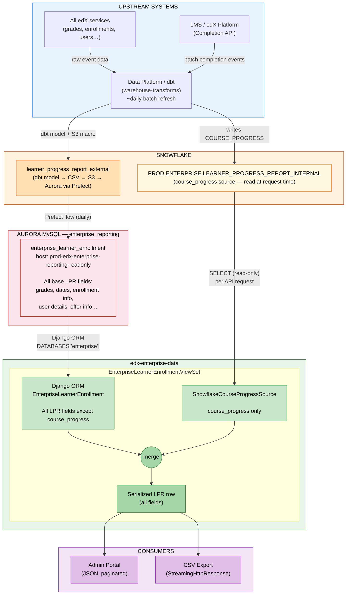
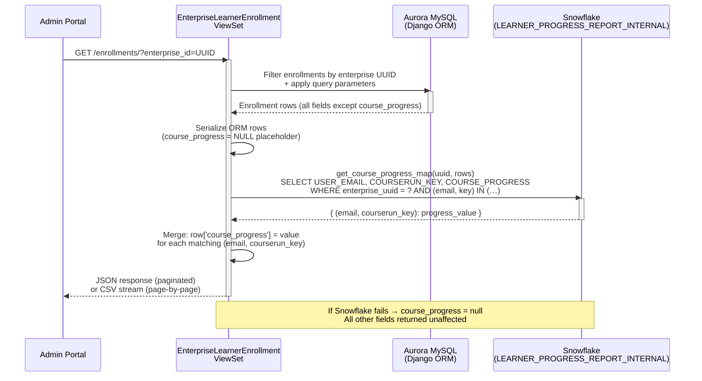

# Learner Progress Report — `course_progress` Field: Architecture, History & Operational Context

> **Audience:** Engineering Leadership, Product, Data Platform, Snowflake Administration
>
> **Related tickets:**
> [ENT-5795](https://2u-internal.atlassian.net/browse/ENT-5795) (original discovery, ~2022) ·
> [ENT-9207](https://2u-internal.atlassian.net/browse/ENT-9207) (second discovery) ·
> [ENT-11183](https://2u-internal.atlassian.net/browse/ENT-11183) (implementation) ·
> [DPSD-8550](https://2u-internal.atlassian.net/browse/DPSD-8550) (Data Platform — Snowflake table) ·
> [ENT0-9531](https://2u-internal.atlassian.net/browse/ENT0-9531) (planned caching improvement)
>
> **Data Platform PR:** [warehouse-transforms#7163](https://github.com/edx/warehouse-transforms/pull/7163/changes)
>
> **Production status (May 2026):** `course_progress` is live, reading from `PROD.ENTERPRISE.LEARNER_PROGRESS_REPORT_INTERNAL`. Snowflake authentication migration to RSA key pair is in progress (deadline: end of August 2026).
>
> **Document origin:** Dave Wolf (Snowflake team) raised a question about `ENTERPRISE_SERVICE_USER` still authenticating via username/password and asked for context on the query volume and purpose. This document consolidates the full history and current state.

---

## Table of Contents

1. [Executive Summary](#1-executive-summary)
2. [Business Context & Customer Need](#2-business-context--customer-need)
3. [Why `course_progress` Uses a Different Data Path](#3-why-course_progress-uses-a-different-data-path)
   - [3.1 The Standard LPR Pipeline (All Other Fields)](#31-the-standard-lpr-pipeline-all-other-fields)
   - [3.2 Discovery History — Three Attempts Before the Current Solution](#32-discovery-history--three-attempts-before-the-current-solution)
   - [3.3 Why Real-Time Snowflake Is the Correct Trade-off](#33-why-real-time-snowflake-is-the-correct-trade-off)
4. [Current Implementation (ENT-11183)](#4-current-implementation-ent-11183)
5. [Architecture & Data Flow](#5-architecture--data-flow)
   - [5.1 Full System Architecture](#51-full-system-architecture)
   - [5.2 Request-Time Sequence](#52-request-time-sequence)
6. [Code Reference](#6-code-reference)
7. [Operational Characteristics](#7-operational-characteristics)
   - [7.1 Query Volume & Triggers](#71-query-volume--triggers)
   - [7.2 Graceful Degradation](#72-graceful-degradation)
8. [Stakeholder Q&A — Snowflake Administration](#8-stakeholder-qa--snowflake-administration)
9. [Open Questions & Engineering Change Guidance](#9-open-questions--engineering-change-guidance)

---

## 1. Executive Summary

The Learner Progress Report (LPR) exposes a `course_progress` field — the course completion percentage that enterprise admins see for each enrolled learner. This field has a different data path from every other LPR field, and that difference is intentional and well-reasoned.

**The standard LPR pipeline** (covering all other fields) runs as a daily batch job: data is transformed in Snowflake via dbt, exported to S3 as CSV, and loaded into an Aurora MySQL database (`enterprise_reporting`). The API serves data from Aurora.

**`course_progress` is different.** It is queried at request time directly from Snowflake's `PROD.ENTERPRISE.LEARNER_PROGRESS_REPORT_INTERNAL` table. This design was arrived at after two prior failed attempts (~2022 and 2023) to deliver this value through the standard pipeline. The core constraints are:

1. `course_progress` is a **calculated metric** computed by the LMS using course-specific rules — it cannot be accurately replicated in dbt SQL.
2. Routing it through the Aurora pipeline would add a **second day of lag** on top of the Data Platform's refresh, which is unacceptable for a field admins and learners compare in real time.

The Snowflake query is read-only, scoped to one enterprise and one page of results (no full-table scans), and fails gracefully — if Snowflake is unavailable, the full LPR response is still returned with `course_progress` set to `null`.

**Observed volume (DataDog, ~May 2026):** ~11,000 Snowflake log events/day and ~8,000 Enrollment API log events/day. These are driven by enterprise admin users interacting with the Admin Portal, not automated jobs. A caching improvement ([ENT0-9531](https://2u-internal.atlassian.net/browse/ENT0-9531)) is scoped and will substantially reduce query volume once delivered.

---

## 2. Business Context & Customer Need

Enterprise customers — including GoLearning and others — have long requested visibility into **how far each learner has progressed through a course** in the LPR. This is distinct from the `current_grade` field already present:

- **Grade** reflects only graded assessments. If a course concentrates its graded work at the end, all learners will show 0% grade even if they have consumed 80% of the course content.
- **Progress** reflects block-level content completion — the same percentage a learner sees on the LMS learning page. Enterprise admins lacked access to this figure, creating a frustrating asymmetry: learners could see their own progress, but admins could not.

Without this feature, enterprise admins had no scalable way to track learner engagement beyond grades. Providing admins with the same progress visibility that learners have was a top request across multiple enterprise accounts.

---

## 3. Why `course_progress` Uses a Different Data Path

### 3.1 The Standard LPR Pipeline (All Other Fields)

All base LPR fields — grades, enrollment dates, user details, offer information — travel through a **daily batch pipeline**:

```
All edX services
      │
      ▼
Snowflake (raw data)
      │
      ▼
warehouse-transforms (dbt)
  └─ learner_progress_report_external.sql   ← admin_dash dbt model
  └─ perform_s3_transfers macro             ← writes CSV to S3
      │
      ▼
Prefect flow: load_enterprise_tables_from_s3_to_aurora
  (prod.toml lines 137–190)
      │
      ▼
Aurora MySQL — enterprise_reporting DB
  host:  prod-edx-enterprise-reporting-readonly
  table: enterprise_learner_enrollment
      │
      ▼
Django ORM (EnterpriseLearnerEnrollment model)
  DATABASES alias: 'enterprise'
  defined in: edx-analytics-data-api settings/base.py
      │
      ▼
LPR API → Admin Portal / CSV export
```

**Key characteristics:**

| Property | Detail |
|---|---|
| **Refresh cadence** | Daily — the dbt macro carries no explicit intra-day schedule |
| **Table lifecycle** | `enterprise_learner_enrollment` is truncated and fully reloaded on each Prefect run |
| **Data lag** | Approximately one calendar day behind real-time LMS state |
| **Write access** | The Django application connects to a read-replica; only the Prefect flow writes to this database |
| **Source of truth refs** | [warehouse-transforms base models](https://github.com/edx/warehouse-transforms/tree/ab8dd5fd305b80f07e47c807c02c54a8a202112f/projects/reporting/models/data_marts/enterprise/base) · [learner_progress_report_external.sql](https://github.com/edx/warehouse-transforms/blob/ab8dd5fd305b80f07e47c807c02c54a8a202112f/projects/reporting/models/data_marts/enterprise/admin_dash/learner_progress_report_external.sql) · [Prefect flow prod.toml L137–190](https://github.com/edx/prefect-flows/blob/7d726b79ad8300434d6ddd5ccbd86940485368ed/flows/load_enterprise_tables_from_s3_to_aurora/prod.toml#L137-L190) |

### 3.2 Discovery History — Three Attempts Before the Current Solution

The path to getting `course_progress` into the LPR spanned approximately three years and two failed approaches.

#### Attempt 1 — Calculate it in the Warehouse (~2022, ENT-5795)

The team attempted to derive the progress percentage from block-level completion data already present in Snowflake. This failed because `course_progress` is **not a raw data point** — it is a calculated metric. The LMS applies course-specific block weighting, content-visibility rules, and completion-type exclusions when computing the figure a learner sees. Replicating this logic in dbt SQL proved infeasible. Even small discrepancies (1–2 percentage points) caused customer support escalations because admins and learners compare their numbers directly. The attempt was abandoned.

#### Attempt 2 — Call the LMS Completion API Directly (~2023, ENT-9207)

The second discovery proposed calling the LMS endpoint that generates the progress figure at query time:

```
{LMS_BASE_URL}/api/course_home/progress/{courseId}/{targetUserId}/
```

This would have guaranteed data provenance — the application would read exactly the same value the learner sees. However, this approach was also not viable:

- The endpoint requires per-user authentication context and was not designed for bulk, unauthenticated machine-to-machine calls.
- A large enterprise may have tens of thousands of active enrollments. Fanning out that many per-user LMS API calls per day would impose unacceptable load on the LMS.
- The existing batch pipeline architecture has no mechanism to execute per-user API calls at this scale.

The effort was suspended a second time. The following product alignment was captured during ENT-9207 grooming:

> *"LPR data lags real time by one day. Adding course progress through the pipeline means admins see yesterday's number while learners see today's — that creates confusion."* — Ammar
>
> *"We can accept a data lag as long as the data provenance is sound. The priority is that the number matches what the learner sees — we should not recalculate it ourselves."* — NR (Product)

#### Breakthrough — Data Platform Surfaces the Value in Snowflake (DPSD-8550)

The Data Platform team confirmed they could publish the LMS-calculated `COURSE_PROGRESS` value — the identical figure the LMS exposes to learners — directly to `PROD.ENTERPRISE.LEARNER_PROGRESS_REPORT_INTERNAL` via [warehouse-transforms#7163](https://github.com/edx/warehouse-transforms/pull/7163/changes). This resolved both prior blockers:

- No warehouse recalculation required — the LMS-computed value is written to Snowflake by the Data Platform pipeline.
- No per-user LMS API calls required — the application simply reads the pre-calculated result.

### 3.3 Why Real-Time Snowflake Is the Correct Trade-off

A natural follow-on question: *could `course_progress` now be routed through the Aurora pipeline like other fields?*

Technically yes — but it would degrade the product:

| Factor | Direct Snowflake Query (current) | Route Through Aurora Pipeline |
|---|---|---|
| **Data freshness** | Serves the latest value as soon as the Data Platform writes it | Introduces a second ~24-hour copy delay on top of the Data Platform's refresh |
| **Data provenance** | Value comes directly from the LMS-authoritative Snowflake table | Same authoritative value, but stale by an additional pipeline cycle |
| **Operational complexity** | One scoped query per API request, gracefully degrading | Requires dbt model change, Prefect `.toml` update, Django model change, migration, and serializer update |
| **Failure isolation** | Snowflake failure degrades only `course_progress` | Schema change touches the primary enrollment table shared by all LPR fields |

Given that `course_progress` is the one field where admins and learners directly compare numbers, any additional lag would undermine confidence in the data. The direct Snowflake query is the correct design for this constraint.

---

## 4. Current Implementation (ENT-11183)

[ENT-11183](https://2u-internal.atlassian.net/browse/ENT-11183) delivered the following:

- Added `course_progress` to the LPR API response payload and CSV download.
- At request time, after fetching all other enrollment fields from Aurora via the Django ORM, the API executes a single read-only Snowflake query scoped to the requesting enterprise and the exact `(user_email, courserun_key)` pairs on the current page.
- The returned progress values are merged into the serialized response rows before they are returned to the caller.
- If the Snowflake call fails for any reason, the full response is returned with `course_progress = null` for all rows — no error is surfaced to the caller.

**Design invariants:**

- The application **never writes to Snowflake**. Data flow is strictly unidirectional: Snowflake → application → API response.
- Only one field (`course_progress`) comes from Snowflake. Every other LPR field comes from Aurora.
- All queries are scoped per enterprise and per page — no full-table scans.

---

## 5. Architecture & Data Flow

### 5.1 Full System Architecture



### 5.2 Request-Time Sequence



**Key design properties:**

| Property | Detail |
|---|---|
| **Data currency** | `course_progress` reflects the most recent Data Platform write — no additional copy lag |
| **Write isolation** | The application never writes to Snowflake; data flows strictly one-way |
| **Query scope** | Each query is bounded to one enterprise UUID and the exact enrollment pairs on the current page |
| **Failure mode** | Snowflake failure degrades only `course_progress`; the full LPR response is always returned |

---

## 6. Code Reference

### 6.1 View — `EnterpriseLearnerEnrollmentViewSet`

**File:** `enterprise_data/api/v1/views/enterprise_learner.py`

The `list()` method handles both the paginated JSON API and the streaming CSV export. In both paths, after fetching enrollment rows from the ORM, it calls `_enrich_course_progress_rows()` to merge in the Snowflake data.

```python
def list(self, request, *args, **kwargs):
    if request.accepted_renderer.format == 'csv':
        return StreamingHttpResponse(
            EnrollmentsCSVRenderer().render(self._stream_serialized_data()),
            ...
        )
    response = super().list(request, *args, **kwargs)
    self._enrich_course_progress(response)
    return response
```

The enrichment method merges the Snowflake result into the serialized rows:

```python
def _enrich_course_progress_rows(self, rows):
    try:
        enterprise_uuid = self.kwargs['enterprise_id']
        progress_map = SnowflakeCourseProgressSource().get_course_progress_map(enterprise_uuid, rows)
        for row in rows:
            key = (row.get('user_email', '').strip(), row.get('courserun_key', '').strip())
            if key in progress_map:
                row['course_progress'] = progress_map[key]
        return rows
    except Exception:
        LOGGER.warning('Could not enrich course_progress from Snowflake', exc_info=True)
        return rows  # graceful degradation — course_progress remains null
```

A synthetic `NULL` placeholder is added to the ORM queryset to ensure `course_progress` is always present in the serializer output, regardless of whether the Snowflake call succeeds:

```python
enrollments = EnterpriseLearnerEnrollment.objects.filter(
    enterprise_customer_uuid=enterprise_customer_uuid
).extra(select={'course_progress': 'NULL'})
```

### 6.2 Snowflake Client — `SnowflakeCourseProgressSource`

**File:** `enterprise_data/api/v1/views/lpr_data_source_snowflake.py`

Executes a single parameterised query scoped to the enterprise and the exact enrollment pairs on the current page:

```sql
SELECT USER_EMAIL, COURSERUN_KEY, COURSE_PROGRESS
FROM PROD.ENTERPRISE.LEARNER_PROGRESS_REPORT_INTERNAL
WHERE LOWER(REPLACE(TO_VARCHAR(ENTERPRISE_CUSTOMER_UUID), '-', '')) = ?
  AND (USER_EMAIL, COURSERUN_KEY) IN ((?, ?), (?, ?), ...)
```

Returns `{ (user_email, courserun_key): course_progress }`. Connections are opened and closed per call; a persistent connection pool is not implemented at this time.

### 6.3 Shared Field Contract — `LPRSerializerShapeMixin`

**File:** `enterprise_data/api/v1/views/lpr_data_source_base.py`

Defines the canonical `SERIALIZER_FIELDS` list for the LPR API, including `course_progress`. All current and future data sources must conform to this contract.

### 6.4 Unrelated Snowflake Client — `SnowflakeClient`

**File:** `enterprise_reporting/clients/snowflake.py`

A separate Snowflake client used exclusively by scheduled batch reporting jobs in `enterprise_reporting/`. It uses independent credentials (`SNOWFLAKE_USERNAME` / `SNOWFLAKE_PASSWORD` environment variables) and has no connection to the LPR enrichment flow described in this document.

---

## 7. Operational Characteristics

### 7.1 Query Volume & Triggers

Snowflake queries are triggered exclusively by **user-initiated actions** — enterprise admin users interacting with the Admin Portal. There are no automated batch jobs, cron processes, or background polling tasks driving this traffic.

| Trigger | Frequency |
|---|---|
| Admin Portal — LPR page load | One query per page load; one per pagination event |
| Admin Portal — CSV export | One query per page of streamed rows (`ENROLLMENTS_PAGE_SIZE`) |
| External API integrations | Varies by client polling interval |

**Observed volume (DataDog snapshot, ~May 2026):**

| Signal | Approximate count / day |
|---|---|
| Snowflake connectivity log events | ~11,000 |
| Enrollment API log events | ~8,000 |

> **Note:** These are application log-line counts, not 1:1 SQL statement counts. A single API request may emit multiple log lines across middleware and the connector layer. The figures are operational proxies, not exact Snowflake query counts.

**Planned reduction — [ENT0-9531](https://2u-internal.atlassian.net/browse/ENT0-9531):** A caching layer is scoped and ready for implementation. Because `COURSE_PROGRESS` is refreshed only once per day by the Data Platform, a short-lived per-enterprise cache will eliminate redundant queries within each refresh window — substantially reducing the volumes above while keeping data as fresh as the underlying pipeline allows.

### 7.2 Graceful Degradation

If the Snowflake call fails for any reason — credential error, network timeout, or table unavailability — the application does not surface an error to the caller:

- All other LPR fields are returned normally from the Aurora database.
- `course_progress` is `null` for all rows in the affected response.
- A `WARNING`-level log entry with full traceback is emitted for observability.

This design provides three operational guarantees:

1. **Safe auth migration** — Credential changes, including the pending RSA key pair migration, can be deployed and validated in staging without risk to the production LPR API.
2. **Bounded Snowflake outage impact** — A Snowflake outage degrades exactly one field for its duration; no other LPR functionality is affected.
3. **Safe introduction of caching** — ENT0-9531 can be implemented without risk because the graceful fallback path is already established.

---

## 8. Stakeholder Q&A — Snowflake Administration

The following questions were raised by the Snowflake administration team (Dave Wolf) upon observing `ENTERPRISE_SERVICE_USER` activity in Snowflake query history.

| Question | Answer |
|---|---|
| **Is this query traffic still needed?** | Yes. It powers the `course_progress` field in the LPR — a high-priority enterprise customer requirement. Disabling it would cause `course_progress` to return `null` for all enterprises. |
| **Is this a reverse ETL or write-back operation?** | No. The application is strictly read-only with respect to Snowflake. It issues `SELECT` queries against one table and never writes, updates, or deletes any data. |
| **Who is generating the queries?** | Enterprise admin users (employees of enterprise customers such as GoLearning) accessing the Admin Portal. Each LPR page load and CSV export triggers a Snowflake query. |
| **Why is the query volume this high?** | Each page load and paginated navigation event issues a scoped Snowflake query in real time. The planned caching improvement (ENT0-9531) will eliminate redundant queries within each ~daily data refresh window, substantially reducing volume. |
| **Who owns the RSA key pair migration?** | The Lakshy engineering team (owners of this repo). The code change is a straightforward credential swap in the Snowflake connector configuration. The prerequisite is for the Snowflake administration team to generate the RSA key pair and register the public key against `ENTERPRISE_SERVICE_USER`. |

---

## 9. Open Questions & Engineering Change Guidance

> The items below are carried over from the original discovery documentation: [LPR data flow discovery](https://2u-internal.atlassian.net/wiki/spaces/SOL/pages/57639011/Learner+Progress+Report+data+flow+discovery) and [Improving LPR Data Lineage](https://2u-internal.atlassian.net/wiki/spaces/SOL/pages/15146058/Improving+the+Learner+Progress+Report+s+Data+Lineage).

### 9.1 Sync Cadence & Table Lifecycle

| Question | Current Understanding |
|---|---|
| How often does the Snowflake → S3 → Aurora sync run? | **Daily.** The dbt `perform_s3_transfers` macro has no explicit intra-day schedule. Muhammad Ammar (Data Platform) is the authority on the dbt run cadence. |
| Is `enterprise_learner_enrollment` truncated and rebuilt on each run? | **Yes.** The Prefect load configuration implies a full reload per run. This table should not be treated as append-only. |

### 9.2 Adding New Columns to the LPR

Adding a column (for example, `offer_id`) to the LPR requires coordinated changes across five layers:

1. **dbt model** — Update `learner_progress_report_external.sql` and any upstream `base/` dim/fact models required to source the new value. Requires a Data Platform domain expert to identify the correct join path.
2. **Prefect `.toml`** — Add the new column to the field list in [`load_enterprise_tables_from_s3_to_aurora/prod.toml` (L137–190)](https://github.com/edx/prefect-flows/blob/7d726b79ad8300434d6ddd5ccbd86940485368ed/flows/load_enterprise_tables_from_s3_to_aurora/prod.toml#L137-L190).
3. **Django model** — Add the field to `EnterpriseLearnerEnrollment` in `enterprise_data/models.py` and create a migration.
4. **API serializer** — Expose the field in the enrollment serializer within `edx-enterprise-data`.
5. **End-to-end validation** — After the next daily Prefect run, confirm the column is populated correctly in `enterprise_learner_enrollment`.

### 9.3 Production Schema Management

It remains unconfirmed whether Django ORM migrations run against the `enterprise_reporting` Aurora database in production. Migrations are present in the repository for local development purposes, but the production database is written to exclusively by the Prefect flow.

**Action required:** Confirm whether a `django_migrations` table exists in `enterprise_reporting` on the production read-replica. If it exists and is populated, ORM migrations apply in production. If not, schema changes must be delivered as explicit DDL aligned with the Prefect loading configuration update.

### 9.4 Proposed Future Tables

| Table | Purpose | Work Required |
|---|---|---|
| Per-enterprise aggregations | Remaining spend — source of truth for budgeting features | New dbt model → Prefect `.toml` entry → new Django model → new API endpoint |
| Per-user aggregations | User-level spend filtering for LPR search | Same pattern; classified as MVP nice-to-have rather than a hard requirement |
