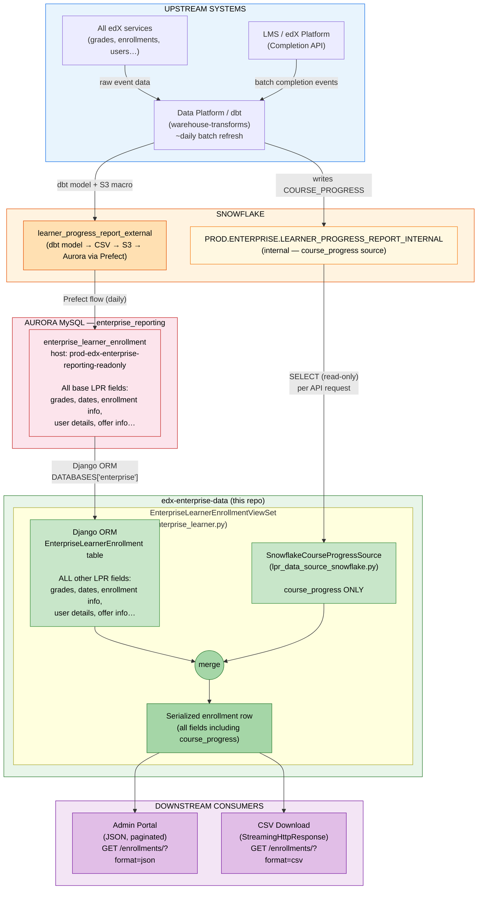
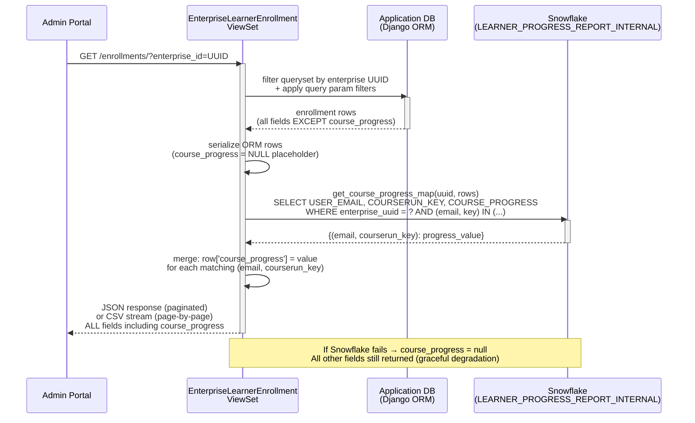

# Learner Progress Report — `course_progress` Field: Full Technical History & Current State

> **Audience:** Engineering, Product, Data Platform, Snowflake Admins  
> **Related tickets:** [ENT-5795](https://2u-internal.atlassian.net/browse/ENT-5795) (original discovery, ~2022), [ENT-9207](https://2u-internal.atlassian.net/browse/ENT-9207) (second discovery), [ENT-11183](https://2u-internal.atlassian.net/browse/ENT-11183) (implementation), [DPSD-8550](https://2u-internal.atlassian.net/browse/DPSD-8550) (Data Platform — Snowflake table), ENT0-9531 (caching)  
> **Data Platform PR:** [warehouse-transforms#7163](https://github.com/edx/warehouse-transforms/pull/7163/changes)  
> **Status as of May 2026:** `course_progress` is live in production, reading from `PROD.ENTERPRISE.LEARNER_PROGRESS_REPORT_INTERNAL`. Snowflake auth migration to key pair is pending (deadline: end of August 2026).  
> **Origin:** Slack thread initiated by Dave Wolf (Snowflake team) regarding `ENTERPRISE_SERVICE_USER` still authenticating via username/password.

---

## Table of Contents

1. [Business Context & Customer Need](#1-business-context--customer-need)
2. [Previous Discovery Attempts & Why They Failed](#2-previous-discovery-attempts--why-they-failed)
    - [2.5 Why `course_progress` Doesn't Travel Through the Standard Pipeline](#25-why-course_progress-doesnt-travel-through-the-standard-pipeline)
    - [2.6 Options to Reduce Snowflake Query Volume](#26-options-to-reduce-snowflake-query-volume)
3. [How We Solved It — Current Implementation (ENT-11183)](#3-how-we-solved-it--current-implementation-ent-11183)
4. [Architecture & Data Flow](#4-architecture--data-flow)
    - [4.0 Full LPR Base Data Pipeline (All Fields Except course_progress)](#40-full-lpr-base-data-pipeline-all-fields-except-course_progress)
    - [4.1 High-Level System Architecture (including course_progress enrichment)](#41-high-level-system-architecture)
    - [4.2 Request-Time Sequence](#42-request-time-sequence)
5. [Code Walkthrough](#5-code-walkthrough)
6. [Query Frequency Explained](#6-query-frequency-explained)
7. [Graceful Degradation](#7-graceful-degradation)
8. [Summary for Snowflake Admin (Dave Wolf)](#8-summary-for-snowflake-admin-dave-wolf)
9. [Open Questions & Change Guidance](#9-open-questions--change-guidance)

---

## 1. Business Context & Customer Need

For several years, enterprise customers — including GoLearning and others — have requested the ability to see **how far a learner has progressed through a course** in the Learner Progress Report (LPR).

The existing `current_grade` field does not satisfy this need because:

- Grade only reflects graded assignments. If a course's assessed work is concentrated at the end, all learners will show `0%` grade until they reach those assignments — even if they have consumed 80% of the course content.
- Learners **can** see their own course progress percentage in the LMS learning experience (powered by the Completion API). Enterprise admins cannot see the same data. This mismatch frustrates customers and leads to escalations, because from their perspective the data exists but is being withheld.
- In the past, workarounds included learners sending screenshots of their progress to their enterprise admin — clearly not scalable.

**Customer expectation:** The LPR should expose the same completion percentage that learners already see inside the LMS.

---

## 2. Previous Discovery Attempts & Why They Failed

A discovery effort was carried out (tracked in **[ENT-9207](https://2u-internal.atlassian.net/browse/ENT-9207)**). The original acceptance criteria asked:

1. Can we replicate the Completion API representation of course progress that learners see in the LMS?
2. Can we call the API directly that generates the progress visualization, so we stay in sync with the numbers learners see?
3. If not, can we calculate it from Completion API data and match the results? (Harder — even minor errors would cause headaches.)
4. If none of the above, can we document what architectural work would be required to become consumers of that API?

Two approaches were explored:

| Approach | Steps Tried | Why  Failed |
|---|---|---|
| **Calculate it ourselves** | Derive the progress % from raw Completion API data already in our pipeline | Could not reliably match the numbers learners see in the LMS. Even minor discrepancies would cause ongoing support burden. |
| **Call the LMS API directly** | Fetch the same endpoint that renders the progress visualization in the LMS | Architecturally not feasible — our data pipeline runs as a batch process and cannot call user-context LMS endpoints at scale. |

**Outcome of ENT-9207:** The effort was suspended. The problems were documented and a shared understanding was reached that the feature would need Data Platform involvement to surface the already-calculated value from within the warehouse.

**Key grooming discussion (documented for posterity):**

> *Ammar: LPR data lags real time by one day. So if we add the progress into the LPR pipeline, it can create confusion — the data in the LPR is a day old, but the learner sees the latest progress in the LMS.*
>
> *NR: We can defend a data lag as long as the data provenance is good. It would be preferable if we can inherit the progress calculated in the LMS chart rather than recalculating it ourselves.*
>
> *Clarification from NR: We do NOT want to show the course completion percentage visualization in the LPR table. We want the % value as a field. Any references to the "visual API" should be read as: "is there a way to fetch this value from the same API that renders the progress image in the LMS, so we skip trying to calculate it ourselves?"*

---

## 2.5 Why `course_progress` Doesn't Travel Through the Standard Pipeline

This is the most-asked engineering question about this feature. The short answer: **we tried two other approaches first, both failed for concrete technical reasons, and the current real-time Snowflake query is the only design that satisfies the data provenance constraint without adding further latency on top of what the Data Platform already introduces.**

### What Makes `course_progress` Structurally Different

Every other field in the LPR (`current_grade`, `enrollment_date`, `user_email`, `offer_id`, etc.) is a **raw or lightly-aggregated data point** that originates from a database record in an edX service. These values travel naturally through the batch pipeline because they are stable between pipeline runs and can be snapshotted into Snowflake as-is.

`course_progress` is fundamentally different. It is a **computed metric** whose calculation lives inside the LMS's Completion API. The LMS evaluates:
- Which XBlocks in a course structure count toward completion (configurable per course)
- Which of those blocks a specific learner has satisfied
- Course-level visibility rules that can exclude certain block types entirely
- A weighted ratio producing the final percentage

This logic is not exposed as a queryable formula — it exists as LMS application code. Any attempt to replicate it externally must reverse-engineer and exactly reproduce that logic, including every edge case. Small mismatches (~1–2 percentage points) are disproportionately costly: when an admin and a learner look at the same course and see different numbers, the result is a support escalation and a loss of trust in the reporting platform.

### Attempt 1 (circa 2022, ENT-5795) — Replicate the Calculation in dbt

The first attempt ([ENT-5795](https://2u-internal.atlassian.net/browse/ENT-5795)) tried to reconstruct the progress percentage from block-level `COMPLETION_API` event data already flowing into Snowflake via the standard data pipeline.

**Why it failed:** The Snowflake event data represents *completion events* — individual block completions recorded as they occur. Turning these into a per-learner per-course percentage requires applying the same course-structure weighting and visibility rules the LMS uses. That logic is not expressed anywhere in the data — it lives in LMS Python code that evaluates the course graph at runtime. The dbt model produced numbers that correlated with LMS progress but did not match exactly, and the discrepancies were not consistent enough to be correctable by a simple offset or scaling factor. The attempt was abandoned after validation testing failed.

### Attempt 2 (~2023, ENT-9207) — Call the LMS Progress API Per-Request

The second attempt ([ENT-9207](https://2u-internal.atlassian.net/browse/ENT-9207)) accepted that the calculation couldn't be replicated externally and proposed calling the LMS directly — the endpoint that learners themselves rely on:

```
{LMS_BASE_URL}/api/course_home/progress/{courseId}/{targetUserId}/
```

This guarantees provenance: the API returns exactly the number the learner sees. However, calling it from our pipeline is not viable for three reasons:

1. **Authentication architecture:** The endpoint is designed for authenticated user sessions and relies on user-context OAuth tokens. Our API service authenticates as a service account, not as individual learners. Impersonating users at scale is not architecturally supported and would introduce significant security surface area.

2. **Fan-out cost:** A CSV export for a single large enterprise (e.g., 50,000 enrollments) would require 50,000 serial or parallel LMS HTTP calls. Even with aggressive parallelism, the latency would be unacceptable for a synchronous API response. Running it as a batch pre-compute would require a dedicated job that approximates what the Data Platform ended up doing.

3. **LMS load:** The LMS progress endpoint is not designed for bulk anonymous reads. Hitting it at the scale required by a large enterprise admin's CSV export would cause significant load on LMS application servers, potentially degrading the learner experience.

The effort was suspended a second time. Key alignment captured during ENT-9207 grooming:

> *"LPR data lags real time by one day. So if we add the progress into the LPR pipeline, it can create confusion — the data in the LPR is a day old, but the learner sees the latest progress in the LMS."* — Ammar
>
> *"We can defend a data lag as long as the data provenance is good. It would be preferable if we can inherit the progress calculated in the LMS chart rather than recalculating it ourselves."* — NR (Product)

### Why Real-Time Snowflake Is the Correct Design (DPSD-8550 / ENT-11183)

The breakthrough was the Data Platform team agreeing to surface the pre-calculated `COURSE_PROGRESS` value — computed by the LMS's own pipeline — directly into `PROD.ENTERPRISE.LEARNER_PROGRESS_REPORT_INTERNAL` via [warehouse-transforms#7163](https://github.com/edx/warehouse-transforms/pull/7163/changes). This resolved every prior blocker:

| Constraint | Status with Direct Snowflake Query |
|---|---|
| Must use LMS-calculated value (not our own) | ✅ Data Platform writes the LMS-computed value; we only SELECT it |
| Cannot call LMS API per-user at scale | ✅ Data Platform's batch pipeline handles fan-out; we read the result |
| Must not add extra pipeline lag on top of Data Platform refresh | ✅ Querying Snowflake at request time means no further copy delay |
| Must not break if Snowflake is unavailable | ✅ Graceful degradation to `null`; full LPR response still returned |

**Why not push it through Aurora like every other field?** This question comes up frequently. The answer is that doing so would introduce an *additional* ~24-hour copy delay on top of the Data Platform's own refresh cadence. Because `COURSE_PROGRESS` is the one field where enterprise admins and learners compare numbers in real time, we cannot afford to widen that gap. Querying Snowflake directly at request time gives admins the most recent value the Data Platform has written, with zero additional lag.

### Observed Query Volume (DataDog snapshot, ~May 2026)

| Signal | Approximate count / day | What it represents |
|---|---|---|
| Snowflake connectivity log events | ~11,000 | Application log lines emitted around each Snowflake connection + query |
| Enrollment API log events | ~8,000 | Inbound requests to the LPR enrollment endpoint |

> **Important caveat:** These are application-level log line counts, not raw Snowflake query counts. A single paginated page load emits multiple log lines (middleware, connector open, query, connector close). The ratio of log lines to actual SQL statements executed is approximately 1.4:1 based on the connector lifecycle. The true Snowflake query count is lower than the log event count.

The traffic is entirely **user-driven**: enterprise admin users navigating the Admin Portal (page loads, pagination, CSV exports) and any external API integrations polling on a schedule. There are no cron jobs or background processes issuing these queries.

---

## 2.6 Options to Reduce Snowflake Query Volume

Given the ~11k daily log events, there are three viable options to reduce the load. They are not mutually exclusive.

### Option A — Application-Layer Cache (Recommended, ENT0-9531)

**How it works:** Cache the `{ (user_email, courserun_key): progress }` map in the application layer (e.g., Django's cache framework backed by Redis or Memcached), keyed per enterprise UUID. Cache TTL set to match the Data Platform refresh cadence (~24 hours), with cache invalidation on known refresh events if a webhook or event is available.

**Technical detail:** The current implementation queries Snowflake once per paginated page of results. With a per-enterprise cache, the first page load for enterprise X warms the cache; all subsequent pages within the TTL window — pagination events, re-loads, even CSV exports for the same enterprise in the same day — are served from cache. Given the ~daily refresh cadence, this eliminates virtually all redundant Snowflake queries.

```
Before cache:   N page requests  →  N Snowflake queries
After cache:    N page requests  →  1 Snowflake query (first request), N-1 cache hits
```

**Estimated impact:** If a typical enterprise admin session involves 5–10 page loads/pagination events, and there are ~1,000 active enterprise admin sessions per day, query volume drops from ~8,000–11,000 to ~1,000 (one per enterprise per daily cache window). A conservative estimate is an **80–90% reduction in Snowflake queries**.

**Risk:** Low. The graceful degradation path already exists — if cache or Snowflake is unavailable, `course_progress` returns `null` and nothing else breaks. Cache introduction is safe to deploy independently. This is scoped as [ENT0-9531](https://2u-internal.atlassian.net/browse/ENT0-9531).

**Trade-offs:**
- Cache can serve slightly stale data if the Data Platform refreshes mid-day. Given the current ~daily cadence this is not a practical concern.
- Requires cache infrastructure (Redis is already available in the application stack).
- Per-enterprise cache keys must be invalidated if an enterprise is offboarded or its enrollment data changes critically.

### Option B — Pre-stage `course_progress` in Aurora (Pipeline Integration)

**How it works:** Add `COURSE_PROGRESS` as a column in the `learner_progress_report_external` dbt model, include it in the Prefect S3-to-Aurora load, and serve it from Aurora like every other LPR field. The real-time Snowflake call is eliminated entirely.

**Technical changes required:**
1. Update `learner_progress_report_external.sql` to join in `COURSE_PROGRESS` from `LEARNER_PROGRESS_REPORT_INTERNAL`
2. Update the Prefect `prod.toml` field list to include the new column
3. Add `course_progress` to the `EnterpriseLearnerEnrollment` Django model and create a migration
4. Update the enrollment serializer
5. Remove the `SnowflakeCourseProgressSource` enrichment call from the view

**Trade-offs:**
- **Pro:** Eliminates all real-time Snowflake queries; zero additional operational complexity at runtime
- **Pro:** `course_progress` is consistent with all other LPR fields — one data source
- **Con:** Introduces an additional ~24-hour lag. Admins see `course_progress` that is up to 2 days behind real-time LMS state (Data Platform lag + Aurora copy lag). This was the original concern raised in ENT-9207 grooming.
- **Con:** The dbt model produces a daily snapshot. If the Data Platform refreshes `LEARNER_PROGRESS_REPORT_INTERNAL` intra-day, the Aurora copy does not benefit until the next Prefect run.
- **Con:** Highest implementation cost of the three options

**Verdict:** Acceptable if the product team confirms that a 2-day data lag is tolerable for `course_progress`. Not recommended if the goal is to keep parity with what learners see in the LMS (which was the explicit requirement in ENT-9207).

### Option C — Hybrid: Cache + Reduced Snowflake Scope

**How it works:** Implement Option A (application cache) and additionally narrow the Snowflake query to only fetch rows whose `course_progress` value has changed since the last known state. Requires storing the last-known progress map per enterprise and diffing against it.

**Verdict:** Overkill given the impact of Option A alone. Adds significant implementation complexity for marginal additional benefit. Consider only if Option A is insufficient after measurement.

### Recommendation

**Implement Option A (ENT0-9531) first.** It delivers the largest query reduction with the lowest risk and implementation cost, and does not compromise the data freshness guarantee that motivated the real-time design in the first place. Option B can be revisited as a longer-term simplification if the product team accepts relaxed lag requirements for this field.

---

## 3. How We Solved It — Current Implementation (ENT-11183)

The breakthrough came when the Data Platform team (ticket **[DPSD-8550](https://2u-internal.atlassian.net/browse/DPSD-8550)**) confirmed they could surface the pre-calculated `COURSE_PROGRESS` value — the same value the LMS exposes to learners — directly in a Snowflake table: `PROD.ENTERPRISE.LEARNER_PROGRESS_REPORT_INTERNAL`. The Data Platform's work was delivered via [warehouse-transforms#7163](https://github.com/edx/warehouse-transforms/pull/7163/changes).

This bypassed both failed approaches from ENT-9207:
- We no longer need to recalculate the value ourselves.
- We no longer need to call the LMS API. The Data Platform pipeline does that work, and we consume the result.

**ENT-11183** implemented the integration:

- Added a `course_progress` field to the LPR API response and CSV download.
- The field is populated at request time by querying Snowflake's internal table.
- All other LPR fields continue to come from the Django ORM (application database) — only `course_progress` comes from Snowflake.
- If Snowflake is unavailable, the API degrades gracefully: `course_progress` is `null` but the full LPR response is still returned.

---

## 4. Architecture & Data Flow

### 4.0 Full LPR Base Data Pipeline (All Fields Except `course_progress`)

The vast majority of LPR fields — grades, enrollment dates, user details, offer info — travel through a **daily batch pipeline** that is completely separate from the Snowflake enrichment described in the rest of this document. Understanding this pipeline is essential context for any schema change or new column addition.

```
┌─────────────────────────────────────────────────────────────────────────────┐
│                     DAILY BATCH PIPELINE  (all base LPR fields)             │
│                                                                             │
│  All edX services  ──►  Snowflake (raw)  ──►  warehouse-transforms (dbt)   │
│                                                     │                       │
│                           learner_progress_report_external.sql              │
│                           (admin_dash dbt model)                            │
│                                │                                            │
│                    perform_s3_transfers macro                                │
│                          (writes CSV to S3)                                 │
│                                │                                            │
│                     Prefect flow: load_enterprise_tables_from_s3_to_aurora  │
│                          (prod.toml lines 137-190)                          │
│                                │                                            │
│              Aurora MySQL  ──  enterprise_reporting DB                      │
│              host: prod-edx-enterprise-reporting-readonly                   │
│              table: enterprise_learner_enrollment                           │
│                                │                                            │
│              Django model: EnterpriseLearnerEnrollment                      │
│              (edx-enterprise-data/enterprise_data/models.py)                │
│              DATABASES alias: 'enterprise'                                   │
│              (edx-analytics-data-api settings/base.py)                      │
└─────────────────────────────────────────────────────────────────────────────┘
```

#### Key pipeline facts

| Property | Detail |
|---|---|
| **Refresh cadence** | Daily — the dbt macro has no explicit schedule tag beyond the daily run |
| **Table lifecycle** | The `enterprise_learner_enrollment` table is effectively **truncated and reloaded** each day by the Prefect flow |
| **Schema management** | Adding a new column requires: (1) updating the dbt model SQL, (2) updating the Prefect `.toml` loading config, (3) updating the `EnterpriseLearnerEnrollment` Django model field, (4) updating API serialization. Django migrations exist for local dev but the prod DB schema is driven by the Prefect load definition — confirm whether `django_migrations` table exists in `enterprise_reporting` before assuming ORM migrations run in prod |
| **Read-only DB** | The Django app connects to a read-replica; only the Prefect flow writes to this DB |
| **Source of truth refs** | [warehouse-transforms base models](https://github.com/edx/warehouse-transforms/tree/ab8dd5fd305b80f07e47c807c02c54a8a202112f/projects/reporting/models/data_marts/enterprise/base) · [learner_progress_report_external.sql](https://github.com/edx/warehouse-transforms/blob/ab8dd5fd305b80f07e47c807c02c54a8a202112f/projects/reporting/models/data_marts/enterprise/admin_dash/learner_progress_report_external.sql) · [perform_s3_transfers.sql](https://github.com/edx/warehouse-transforms/blob/master/projects/reporting/macros/perform_s3_transfers.sql) · [Prefect flow prod.toml L137-190](https://github.com/edx/prefect-flows/blob/7d726b79ad8300434d6ddd5ccbd86940485368ed/flows/load_enterprise_tables_from_s3_to_aurora/prod.toml#L137-L190) |

---

### 4.1 High-Level System Architecture



### 4.2 Request-Time Sequence



**Key design properties:**
- **Data lag:** `COURSE_PROGRESS` reflects a ~daily refresh by the Data Platform pipeline — consistent with the rest of the LPR.
- **Read-only:** The application never writes to Snowflake. Data flows strictly one-way: Snowflake → application → API response.
- **Single field from Snowflake:** Only `course_progress` comes from Snowflake. Every other LPR field comes from the application database.
- **Tight query scope:** Each Snowflake call is scoped to one enterprise UUID and only the `(user_email, courserun_key)` pairs on the current page — no full-table scans.

---

## 5. Code Walkthrough

### 5.1 View — `EnterpriseLearnerEnrollmentViewSet`

File: `enterprise_data/api/v1/views/enterprise_learner.py`

The `list()` method handles both JSON API responses and streaming CSV downloads. In both paths, after fetching enrollment records from the ORM, it calls `_enrich_course_progress_rows()`.

```python
def list(self, request, *args, **kwargs):
    if request.accepted_renderer.format == 'csv':
        return StreamingHttpResponse(
            EnrollmentsCSVRenderer().render(self._stream_serialized_data()),
            ...
        )
    response = super().list(request, *args, **kwargs)
    self._enrich_course_progress(response)
    return response
```

The enrichment method calls Snowflake and merges the result:

```python
def _enrich_course_progress_rows(self, rows):
    try:
        enterprise_uuid = self.kwargs['enterprise_id']
        progress_map = SnowflakeCourseProgressSource().get_course_progress_map(enterprise_uuid, rows)
        for row in rows:
            key = (row.get('user_email', '').strip(), row.get('courserun_key', '').strip())
            if key in progress_map:
                row['course_progress'] = progress_map[key]
        return rows
    except Exception:
        LOGGER.warning('Could not enrich course_progress from Snowflake', exc_info=True)
        return rows  # graceful degradation: return rows unchanged, course_progress stays null
```

A synthetic `NULL` placeholder is added to the ORM queryset so the serializer shape always includes the field:

```python
enrollments = EnterpriseLearnerEnrollment.objects.filter(
    enterprise_customer_uuid=enterprise_customer_uuid
).extra(select={'course_progress': 'NULL'})
```

### 5.2 Snowflake Client — `SnowflakeCourseProgressSource`

File: `enterprise_data/api/v1/views/lpr_data_source_snowflake.py`

Executes a single, parameterised SQL query scoped to the enterprise UUID and the exact `(user_email, courserun_key)` pairs on the current page:

```sql
SELECT USER_EMAIL, COURSERUN_KEY, COURSE_PROGRESS
FROM PROD.ENTERPRISE.LEARNER_PROGRESS_REPORT_INTERNAL
WHERE LOWER(REPLACE(TO_VARCHAR(ENTERPRISE_CUSTOMER_UUID), '-', '')) = ?
  AND (USER_EMAIL, COURSERUN_KEY) IN ((?, ?), (?, ?), ...)
```

Returns a `{ (user_email, courserun_key): course_progress }` dict. Connections are opened and closed per call (no persistent connection pool at this time).

### 5.3 Shared Contracts — `LPRSerializerShapeMixin`

File: `enterprise_data/api/v1/views/lpr_data_source_base.py`

Defines the canonical list of LPR API fields (`SERIALIZER_FIELDS`), including `course_progress`. Any future Snowflake or ORM-backed source should conform to this contract.

### 5.4 Separate Reporting Client — `SnowflakeClient`

File: `enterprise_reporting/clients/snowflake.py`

An **independent** Snowflake client used by scheduled batch reporting jobs in `enterprise_reporting/`. It uses separate credentials (`SNOWFLAKE_USERNAME` / `SNOWFLAKE_PASSWORD` env vars) and is unrelated to the LPR enrichment flow described above.

---

## 6. Query Frequency Explained

### 6.1 Who triggers the queries?

The Snowflake queries Dave Wolf observed in the query history are triggered by **enterprise admin users** (employees of enterprise customers like GoLearning) using the **Admin Portal** web application. When an admin navigates to the Learner Progress Report page, the frontend calls our API, and our API calls Snowflake.

These are **not** automated batch jobs or cron-triggered exports. They are real-time, user-initiated API requests.

### 6.2 Why so frequent?

The current implementation queries Snowflake on every LPR API request to ensure enterprise admins always receive the **most up-to-date** `course_progress` values available in the warehouse. Each query is scoped tightly to one enterprise UUID and only the exact `(user_email, courserun_key)` pairs on the current page — no full-table scans.

| Trigger | When it fires |
|---|---|
| Admin Portal loads the LPR table | Once per page load, once per pagination event |
| Admin Portal CSV export | Once per `ENROLLMENTS_PAGE_SIZE` rows streamed |
| API integrations / automated tooling | Depends on the polling interval of the client |

**Planned improvement — `ENT0-9531`:** We have already identified and scoped a caching layer to sit in front of the Snowflake call. Since `COURSE_PROGRESS` data refreshes only ~daily, a short-lived cache keyed per enterprise will eliminate redundant queries within the same refresh window — significantly reducing the query volume  observed, while keeping the data as fresh as the underlying pipeline allows. 

---

## 7. Graceful Degradation

If the Snowflake call fails for any reason — wrong credentials, network timeout, table unavailable — the application **does not return an error to the caller**. Instead:

- All other LPR fields are served from the application database as normal.
- `course_progress` is `null` for all rows on that response.
- A `WARNING` is logged with full traceback for observability.

This design means:
- Any future auth or connectivity change (including the key pair migration) can be deployed and validated in staging without risking the production LPR API.
- Any Snowflake outage has a bounded, predictable impact — `course_progress` degrades to `null` for the duration, nothing else breaks.
- The caching improvement (`ENT0-9531`) can be introduced safely because the fallback path already exists.

---

## 8. Summary for Dave Wolf

### 8.1 Answers to Dave's questions

| Question | Answer |
|---|---|
| **Is this flow still needed?** | Yes. It powers the `course_progress` field in the LPR — a top customer request. Disabling it would regress the feature to `null` for all enterprises. |
| **Is this a reverse ETL?** | No. The application is strictly read-only. It SELECTs one column (`COURSE_PROGRESS`) and never writes back. |
| **Who requests these reports?** | Enterprise admin users (employees of enterprise customers) using the Admin Portal. Each page load or CSV export triggers a Snowflake query. |
| **Why so frequently?** | Each page load and CSV export triggers a real-time Snowflake query to ensure admins always see the freshest available data. We have already identified and scoped a caching layer (`ENT0-9531`) that will eliminate redundant queries within each ~daily refresh window — significantly reducing query volume |
| **Who would do the key pair migration?** | The Lakshy team (this repo). The code change is straightforward — swap `password` for `private_key` in the connector call. We need respective team to generate the RSA key pair and register the public key against `ENTERPRISE_SERVICE_USER` first. |


