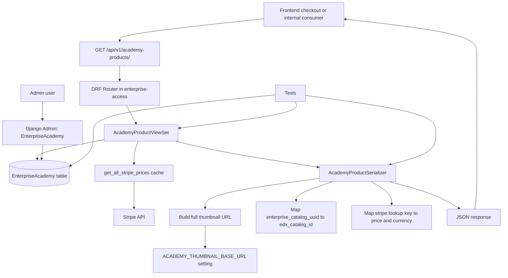

# Academy Public API Implementation Plan

## Executive Summary

Implement a new unauthenticated read-only REST API in `enterprise-access` that exposes academy product metadata for the Essentials checkout flow and other internal consumers.

### Recommended source of truth
Use the existing `EnterpriseAcademy` model in `enterprise-access` as the canonical academy product store.

Current model location:
- `enterprise_access/apps/customer_billing/models.py`
- Class: `EnterpriseAcademy`

This already contains almost every field required by the ticket:
- `uuid`
- `name`
- `long_name`
- `description`
- `marketing_url`
- `thumbnail_url`
- `tags`
- `stripe_product_id`
- `stripe_price_lookup_key`
- `enterprise_catalog_uuid`
- `product_key`
- `slug`
- `is_active`
- `display_order`

## Decision: Storage Location

### Recommended decision
**Do not create a new table.** Reuse `EnterpriseAcademy` in `enterprise-access`.

### Why
1. The model already exists and appears purpose-built for this work.
2. It already supports Stripe integration through `stripe_product_id` and `stripe_price_lookup_key`.
3. It already stores the edX catalog linkage via `enterprise_catalog_uuid`.
4. It already supports frontend routing concerns via `product_key` and `slug`.
5. It avoids introducing a second academy product source of truth.

### Gap to address
The current model stores `thumbnail_url` as a string, but the ticket requires the API to return a **fully qualified public URL**. The simplest implementation is:
- keep the DB field as-is
- treat stored values as either:
  - a relative object path, or
  - a fully qualified URL
- compute the API response field dynamically

## Current State Assessment

### Already implemented
- `EnterpriseAcademy` storage model exists.
- Stripe pricing helpers already exist in `enterprise_access/apps/customer_billing/pricing_api.py`.
- API routing framework already exists in `enterprise_access/apps/api/v1/urls.py`.
- Existing read-only viewset patterns already exist.

### Not yet implemented
- No public academy products API exists.
- No serializer exists for `EnterpriseAcademy`.
- No admin registration exists for `EnterpriseAcademy`.
- No public thumbnail base URL setting exists.
- No tests exist for academy product API behavior.

## Recommended API Design

### Recommended endpoint
Use a new top-level endpoint in `enterprise-access`:

- `GET /api/v1/academy-products/`
- `GET /api/v1/academy-products/<uuid>/`

### Why this path
This is the clearest option because:
1. it avoids collision with `enterprise-catalog`'s existing `/api/v1/academies`
2. it makes it explicit that these are checkout/billing-facing academy products
3. it avoids overloading `customer-billing` endpoints with metadata concerns

### Alternate acceptable endpoint
If the tech lead wants these grouped with checkout/billing APIs:
- `GET /api/v1/customer-billing/academy-products/`
- `GET /api/v1/customer-billing/academy-products/<uuid>/`

### Recommendation
Prefer **`/api/v1/academy-products/`**.

## Authentication / Permissions

### Requirement
Authentication is **not required**.

### Implementation
Use:
- `permission_classes = [AllowAny]`
- `authentication_classes = []` or leave default auth enabled with `AllowAny`

### Recommendation
Set both explicitly in the public academy viewset for clarity:
- `authentication_classes = []`
- `permission_classes = [AllowAny]`

This makes the intent obvious and prevents confusion during maintenance.

## Response Contract

### Required response fields
The API should return the following fields:

| API field | Source | Notes |
|---|---|---|
| `id` | `EnterpriseAcademy.uuid` | UUID string |
| `name` | `EnterpriseAcademy.name` | Short name |
| `long_name` | `EnterpriseAcademy.long_name` | Full public name |
| `description` | `EnterpriseAcademy.description` | Marketing summary |
| `marketing_url` | `EnterpriseAcademy.marketing_url` | Public landing page |
| `thumbnail_url` | computed | Fully qualified public URL |
| `price` | Stripe lookup via `stripe_price_lookup_key` | Decimal yearly price |
| `currency` | Stripe price data | Useful for frontend display |
| `tags` | `EnterpriseAcademy.tags` | JSON array |
| `stripe_product_id` | `EnterpriseAcademy.stripe_product_id` | Stripe product id |
| `edx_catalog_id` | `EnterpriseAcademy.enterprise_catalog_uuid` | Rename in serializer only |

### Optional useful response fields
These are not explicitly required, but are strongly recommended:

| API field | Why include it |
|---|---|
| `product_key` | Useful for checkout entry and plan selection deep links |
| `slug` | Useful for route building and debugging |
| `display_order` | Lets frontend preserve business-defined order |

### Example list response
```json
{
  "count": 8,
  "next": null,
  "previous": null,
  "results": [
    {
      "id": "4f6d2d8d-3f11-4f1f-b82a-4dd519e51111",
      "name": "Artificial intelligence",
      "long_name": "edX AI Academy",
      "description": "Bring your organization into the future by harnessing the power of artificial intelligence at every level.",
      "marketing_url": "https://business.edx.org/academy/ai/",
      "thumbnail_url": "https://<bucket-or-cdn-base>/academies/ai/thumbnail.png",
      "price": "149.00",
      "currency": "usd",
      "tags": ["AI foundations", "Intermediate AI", "Advanced AI", "AI for business"],
      "stripe_product_id": "prod_123",
      "edx_catalog_id": "b9e6b9f1-1234-5678-9012-abcdefabcdef",
      "product_key": "ai-academy",
      "slug": "ai-academy",
      "display_order": 10
    }
  ]
}
```

## Pricing Strategy

### Requirement
Price must remain sourced from Stripe, not duplicated in the academy table.

### Recommended approach
Use `EnterpriseAcademy.stripe_price_lookup_key` and resolve the price dynamically from Stripe through existing pricing utilities.

### Existing reusable code
File:
- `enterprise_access/apps/customer_billing/pricing_api.py`

Useful existing helper:
- `get_all_stripe_prices()`

This already returns cached Stripe recurring prices keyed by `lookup_key`.

### Implementation plan
For each academy record:
1. read `stripe_price_lookup_key`
2. fetch the cached Stripe prices map via `get_all_stripe_prices()`
3. select the matching lookup key
4. return:
   - `unit_amount_decimal` as `price`
   - `currency`

### Failure handling recommendation
If an academy is active but the Stripe lookup key is missing or unresolved:
- log an error
- either:
  - fail the entire request with `500`, or
  - omit price and return `null`

### TL recommendation
For checkout correctness, prefer **failing fast in lower environments** and **returning `null` plus logging in production only if product explicitly allows degraded rendering**.

If the checkout UI cannot function without price, use hard failure.

## Thumbnail URL Strategy

### Requirement
Frontend must receive a fully qualified public image URL.

### Recommended storage convention
Store **relative object path** in the database, for example:
- `academies/ai/thumbnail.png`

### API behavior
In the serializer:
- if stored value starts with `http://` or `https://`, return it unchanged
- otherwise prepend a configured base URL

### New setting to add
Recommended new setting:
- `ACADEMY_THUMBNAIL_BASE_URL`

Example values:
- `https://my-bucket.s3.amazonaws.com/`
- `https://academy-assets.edx.org/`
- `https://d123.cloudfront.net/`

### Serializer output logic
```python
if thumbnail_url.startswith('http://') or thumbnail_url.startswith('https://'):
    return thumbnail_url
return urljoin(settings.ACADEMY_THUMBNAIL_BASE_URL, thumbnail_url)
```

### Recommendation
Use a CDN or CloudFront-style base URL instead of exposing raw S3 URLs directly.

## Recommended Implementation Structure

### 1. Serializer
Create a new serializer file:
- `enterprise_access/apps/api/serializers/academy_products.py`

Recommended serializer classes:
- `AcademyProductSerializer`

Responsibilities:
- map `uuid -> id`
- map `enterprise_catalog_uuid -> edx_catalog_id`
- compute `thumbnail_url`
- compute `price`
- compute `currency`

### 2. View
Create a new view file:
- `enterprise_access/apps/api/v1/views/academy_products.py`

Recommended class:
- `AcademyProductViewSet(ReadOnlyModelViewSet)`

Recommended behavior:
- unauthenticated access allowed
- `queryset = EnterpriseAcademy.objects.filter(is_active=True).order_by('display_order', 'name')`
- `lookup_field = 'uuid'`

### 3. Routing
Update:
- `enterprise_access/apps/api/v1/urls.py`

Add router registration:
```python
router.register('academy-products', views.AcademyProductViewSet, 'academy-products')
```

### 4. Admin
Update:
- `enterprise_access/apps/customer_billing/admin.py`

Add admin registration for `EnterpriseAcademy`.

Recommended admin features:
- list display: `name`, `long_name`, `product_key`, `slug`, `stripe_product_id`, `stripe_price_lookup_key`, `enterprise_catalog_uuid`, `is_active`, `display_order`
- filters: `is_active`
- search: `name`, `long_name`, `slug`, `product_key`, `stripe_product_id`
- ordering: `display_order`, `name`

### 5. Tests
Add tests under:
- `enterprise_access/apps/api/v1/tests/test_academy_products.py`

Test coverage should include:
1. unauthenticated list succeeds
2. unauthenticated detail succeeds
3. inactive academies are excluded from list
4. detail for inactive academy returns `404`
5. `thumbnail_url` prefixes relative path with configured base URL
6. absolute `thumbnail_url` passes through unchanged
7. `price` resolves correctly from Stripe lookup key
8. `edx_catalog_id` maps correctly from `enterprise_catalog_uuid`
9. results are ordered by `display_order`, then `name`
10. missing Stripe lookup key behavior is tested

### 6. OpenAPI / Schema
Document with `drf-spectacular` using `extend_schema`.

Document:
- public list endpoint
- public detail endpoint
- exact response schema
- no authentication required

## File-by-File Implementation Plan

### A. `enterprise_access/apps/customer_billing/models.py`
**Likely no schema change required initially.**

Possible optional changes:
- none for MVP

Potential future cleanup:
- rename DB field `thumbnail_url` to `thumbnail_path` for semantic clarity
- not recommended for initial delivery because it adds migration churn without product value

### B. `enterprise_access/apps/api/serializers/academy_products.py`
Create new serializer.

Suggested implementation outline:
```python
from urllib.parse import urljoin
from django.conf import settings
from rest_framework import serializers

from enterprise_access.apps.customer_billing.models import EnterpriseAcademy
from enterprise_access.apps.customer_billing.pricing_api import get_all_stripe_prices

class AcademyProductSerializer(serializers.ModelSerializer):
    id = serializers.UUIDField(source='uuid', read_only=True)
    edx_catalog_id = serializers.UUIDField(source='enterprise_catalog_uuid', allow_null=True, read_only=True)
    thumbnail_url = serializers.SerializerMethodField()
    price = serializers.SerializerMethodField()
    currency = serializers.SerializerMethodField()

    class Meta:
        model = EnterpriseAcademy
        fields = (
            'id',
            'name',
            'long_name',
            'description',
            'marketing_url',
            'thumbnail_url',
            'price',
            'currency',
            'tags',
            'stripe_product_id',
            'edx_catalog_id',
            'product_key',
            'slug',
            'display_order',
        )
```

Optimization note:
- do not call Stripe once per row
- cache the Stripe price map in serializer context or view-level helper once per request

### C. `enterprise_access/apps/api/v1/views/academy_products.py`
Suggested implementation outline:
```python
from rest_framework.permissions import AllowAny
from rest_framework.viewsets import ReadOnlyModelViewSet

from enterprise_access.apps.api.serializers.academy_products import AcademyProductSerializer
from enterprise_access.apps.customer_billing.models import EnterpriseAcademy

class AcademyProductViewSet(ReadOnlyModelViewSet):
    authentication_classes = []
    permission_classes = [AllowAny]
    serializer_class = AcademyProductSerializer
    lookup_field = 'uuid'

    def get_queryset(self):
        return EnterpriseAcademy.objects.filter(is_active=True).order_by('display_order', 'name')
```

### D. `enterprise_access/apps/api/v1/urls.py`
Register the new route.

### E. `enterprise_access/apps/customer_billing/admin.py`
Register `EnterpriseAcademy` in admin.

### F. `enterprise_access/settings/base.py`
Add:
```python
ACADEMY_THUMBNAIL_BASE_URL = os.environ.get('ACADEMY_THUMBNAIL_BASE_URL', '')
```

Recommendation:
- require env config in deployed environments
- default empty string only for dev/tests

## Data Migration / Backfill Plan

### Required content population
Populate `EnterpriseAcademy` with the 8 Essentials academies.

Fields that must be filled:
- `name`
- `long_name`
- `description`
- `marketing_url`
- `thumbnail_url`
- `tags`
- `stripe_product_id`
- `stripe_price_lookup_key`
- `enterprise_catalog_uuid`
- `product_key`
- `slug`
- `display_order`
- `is_active`

### Recommendation
Use one of these:
1. Django admin for initial manual setup if count remains low
2. data migration if the dataset is fixed and environment-controlled
3. management command if the records may be refreshed from a source sheet or config

### TL recommendation
For this ticket, use:
- **admin + seed fixture/management command**

Reason:
- avoids brittle migration data dependencies on environment-specific Stripe IDs or catalog UUIDs
- keeps operational updates simple

## Suggested Field Mapping for the Current Academy Table

| Business field | Model field |
|---|---|
| Academy Name | `name` |
| Long Name | `long_name` |
| Marketing URL | `marketing_url` |
| Description | `description` |
| Tags | `tags` |
| Thumbnail | `thumbnail_url` |
| Price | Stripe via `stripe_price_lookup_key` |
| Stripe Product ID | `stripe_product_id` |
| edX Catalog ID | `enterprise_catalog_uuid` |

## List vs Retrieve Behavior

### List endpoint
Returns all active academies ordered for frontend display.

Recommended filters for MVP:
- `is_active=True`

### Retrieve endpoint
Returns a single active academy by UUID.

Recommended behavior:
- if academy exists but `is_active=False`, return `404`

## Performance Considerations

### Stripe calls
Avoid per-record Stripe calls.

Use a single cached lookup map from `get_all_stripe_prices()` once per request.

### Database
Query volume is low. This endpoint is read-only and small-cardinality.

### Caching
Optional response caching may be added later, but is not required for MVP because:
- academy count is tiny
- Stripe price map is already cached

## Error Handling

### Missing thumbnail base URL
If `ACADEMY_THUMBNAIL_BASE_URL` is blank and the stored thumbnail path is relative:
- log configuration error
- return relative path only in dev/test
- fail loudly in production if policy demands fully qualified assets

### Missing Stripe price
If lookup key does not resolve:
- log error with academy UUID and lookup key
- choose one of:
  - fail endpoint with `500`
  - return `price = null`

### Recommendation
For checkout-critical usage, fail in non-prod until data is corrected.

## Security Considerations

### Why unauthenticated is acceptable
The data is public marketing / product metadata:
- name
- description
- price
- marketing URL
- thumbnail

No learner, customer, or billing account data is exposed.

### What should not be returned
Do not expose:
- internal admin notes
- hidden Stripe price IDs unless product requires them
- unpublished/inactive academies
- operational metadata not needed by clients

## Acceptance Criteria Mapping

### Determine storage location for data
**Complete via recommendation:** use existing `EnterpriseAcademy` model.

### Keep price consistent with Teams / Stripe source of truth
**Complete via implementation:** derive `price` from Stripe using `stripe_price_lookup_key`.

### Expose RESTful API endpoint with list all and retrieve single
**Complete via implementation:**
- `GET /api/v1/academy-products/`
- `GET /api/v1/academy-products/<uuid>/`

### Authentication not required
**Complete via implementation:** `AllowAny`.

### Thumbnail full URL
**Complete via implementation:** serializer prepends `ACADEMY_THUMBNAIL_BASE_URL` when needed.

## Recommended Implementation Sequence

1. Confirm endpoint path with tech lead
2. Reuse `EnterpriseAcademy` as the storage model
3. Add admin registration for `EnterpriseAcademy`
4. Add academy product serializer
5. Add academy product public read-only viewset
6. Add router registration
7. Add thumbnail base URL setting
8. Add tests
9. Seed the initial 8 academy records
10. Publish API contract to frontend and internal consumers

## Recommended Tech Lead Decisions Needed

1. Final endpoint path:
   - `/api/v1/academy-products/` recommended
   - or `/api/v1/customer-billing/academy-products/`
2. Price resolution failure behavior:
   - strict failure vs nullable field
3. Thumbnail hosting base URL:
   - S3 direct vs CDN/CloudFront
4. Whether to expose `product_key` and `slug`
5. Whether inactive detail endpoint should return `404`

## Final Recommendation

Implement this in **`enterprise-access`**, not `enterprise-catalog`.

### Why
- the academy product model already exists there
- Stripe pricing helpers already exist there
- the consumer is checkout flow / internal billing-adjacent services
- the endpoint must be unauthenticated and product-oriented, not enterprise-customer-scoped

### MVP summary
- reuse `EnterpriseAcademy`
- add public read-only API
- compute `price` from Stripe
- compute fully qualified `thumbnail_url`
- filter to active academies
- add admin + tests + seed data

## Architecture Flow

### Mermaid flowchart



### Request flow summary
1. A public consumer calls `GET /api/v1/academy-products/` or `GET /api/v1/academy-products/<uuid>/`.
2. The DRF router dispatches the request to `AcademyProductViewSet`.
3. The viewset loads active `EnterpriseAcademy` rows ordered by `display_order`, then `name`.
4. The serializer enriches each row by:
   - mapping `uuid` to `id`
   - mapping `enterprise_catalog_uuid` to `edx_catalog_id`
   - converting relative thumbnail paths into fully qualified URLs
   - resolving `price` and `currency` from cached Stripe lookup data
5. The API returns stable product metadata for frontend checkout rendering.

## Change Impact Analysis

### What changes

#### Backend API layer
The implementation is isolated to `enterprise-access` and primarily affects:
- serializer layer
- public read-only API view layer
- router registration
- Django admin registration
- environment-backed thumbnail URL configuration
- API test coverage

#### Operational behavior
After implementation:
- a new unauthenticated academy product endpoint becomes available
- active academy products become frontend-consumable without tenant scoping
- pricing remains sourced from Stripe rather than duplicated in the database
- thumbnail responses become fully qualified and ready for direct frontend rendering

### Impact level by area

#### Low impact
- no database schema change required for MVP
- no migration required
- no auth or permission model redesign required
- no changes required in `enterprise-catalog`

#### Medium impact
- academy records must be accurately maintained in admin
- `ACADEMY_THUMBNAIL_BASE_URL` must be correctly configured in each environment
- Stripe lookup keys must stay aligned with academy product configuration

#### Higher-risk area
The main delivery risk is price resolution failure when:
- `stripe_price_lookup_key` is missing
- the Stripe price cache does not contain the expected key
- operational data is partially configured

This risk should be mitigated with explicit tests, logging, and lower-environment validation.

## Estimated Lines of Code

### Backend MVP estimate

| Area | Estimated LOC |
|---|---:|
| serializer | 60-100 |
| viewset | 20-40 |
| route wiring | 3-8 |
| admin registration | 20-40 |
| settings | 1-5 |
| schema docs | 15-30 |
| tests | 140-220 |
| import/export glue | 10-20 |
| **Total** | **269-463** |

### Planning estimate
Use **~350 LOC** as the practical engineering estimate for the backend MVP.

This should be treated as implementation code only and does not include optional follow-up work such as response caching, analytics instrumentation, or management command refinement.

## Recommended PR Breakdown

### Recommended plan: 2 PRs

#### PR 1 - Backend academy products API
Repository:
- `enterprise-access`

Scope:
- academy product serializer
- public read-only viewset
- route registration
- admin registration
- thumbnail base URL setting
- OpenAPI/schema documentation
- automated tests

#### PR 2 - Frontend consumer integration
Repository:
- whichever frontend first consumes academy checkout metadata

Likely candidates:
- `frontend-app-enterprise-checkout`
- or another enterprise checkout-oriented frontend depending on final ownership

Scope:
- call the new academy products endpoint
- render academy metadata
- display price and currency
- support loading and error handling
- preserve display ordering from the API

### Safest rollout plan: 3 PRs
If deployment configuration is managed separately, use:

1. backend API PR
2. frontend integration PR
3. configuration / rollout PR

The third PR should cover:
- `ACADEMY_THUMBNAIL_BASE_URL` environment configuration
- academy seed data verification
- Stripe lookup key verification in deployed environments

### Minimum possible plan
If speed is the only priority, this can be compressed into **1 PR**, but that is not recommended for reviewability or rollout safety.

## Delivery Recommendation

For planning and stakeholder communication, use the following summary:

> This change is mostly isolated to `enterprise-access`, requires no schema migration for MVP, and is expected to take about **350 lines of backend code** including tests and API wiring. The recommended rollout is **2 PRs**: one backend API PR and one frontend integration PR. If environment configuration is managed separately, use **3 PRs** for the safest rollout.

---

## Proposed Deliverables

### Code deliverables
- new serializer
- new viewset
- new route
- admin registration
- tests
- setting for thumbnail base URL

### Non-code deliverables
- API contract documentation
- seed/backfill plan for the 8 Essentials academies
- rollout notes for frontend integration
