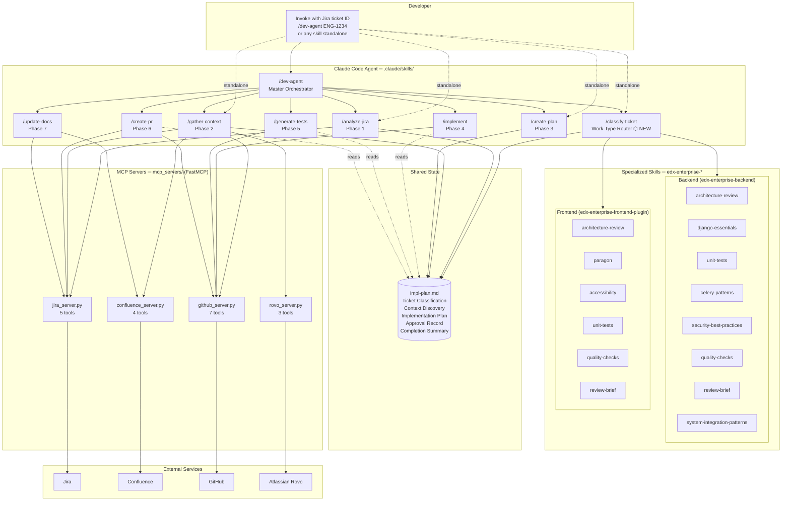
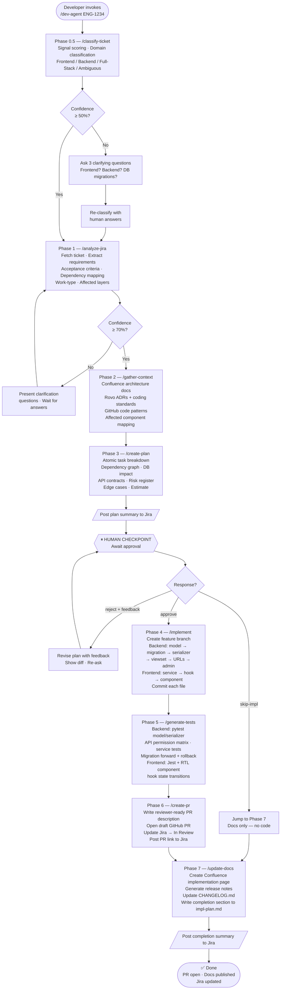
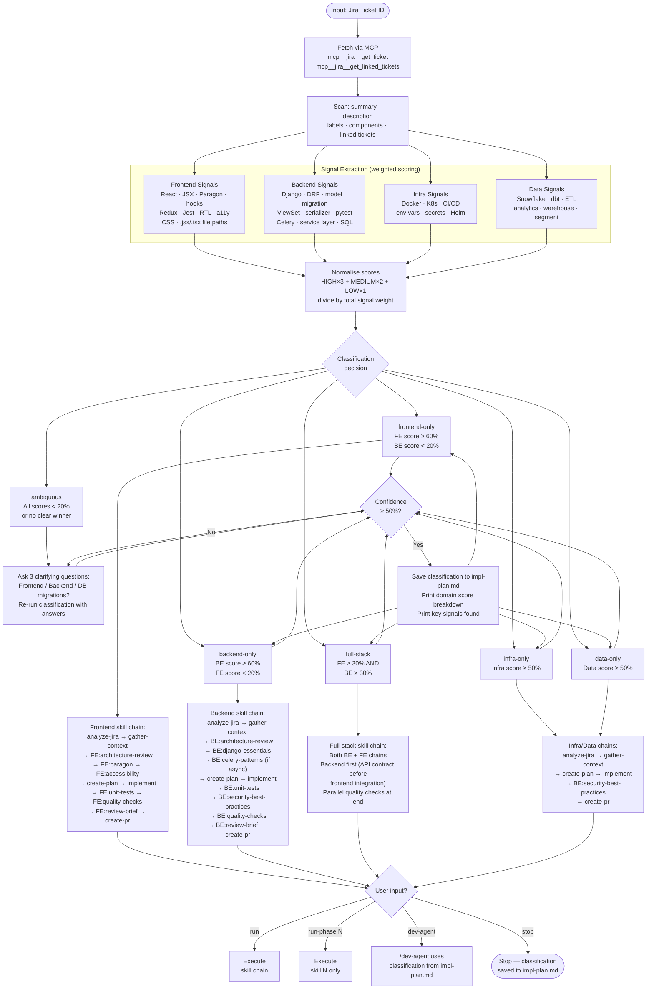
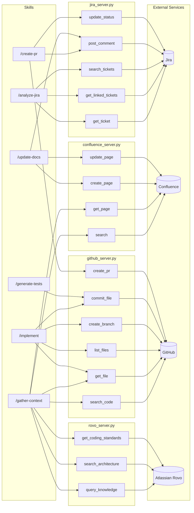
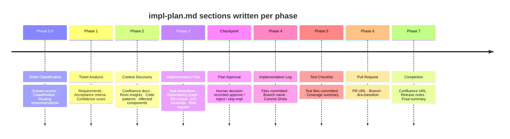
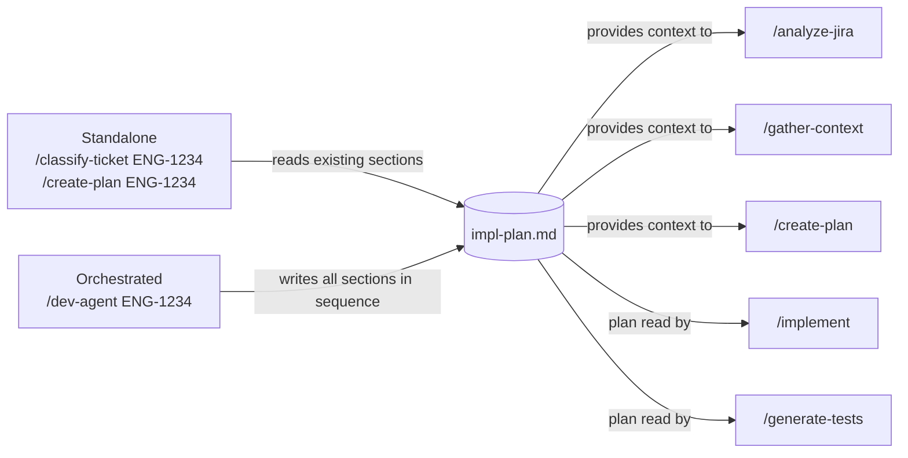

# Developer Agent — Complete Architecture

This document is the single-source reference for how the Developer Agent is structured,
how its phases chain together, how work is routed by ticket type, and which external
systems each skill talks to.

---

## 1. System Architecture Overview

A layered view of every component and how they connect.

---

## 2. Phase Execution Flow

How `/dev-agent` executes all phases in sequence with human checkpoints and routing gates.

---

## 3. classify-ticket — Signal Analysis & Routing

How `/classify-ticket` reads a ticket and decides which skill path to activate.

---

## 4. MCP Server & Tool Integration

Which skill calls which MCP tool, and which external service it hits.

---

## 5. impl-plan.md — Shared State Lifecycle

`impl-plan.md` is the single file written and read across all phases. Each phase
appends its own section; no phase overwrites a prior section.

---

## 6. Skill Inventory

| Skill | Phase | Invocation | Writes to impl-plan.md | Key MCP Tools |
|-------|-------|------------|------------------------|---------------|
| `/classify-ticket` | 0.5 | `/classify-ticket ENG-1234` | ✅ Ticket Classification | `get_ticket`, `get_linked_tickets` |
| `/analyze-jira` | 1 | `/analyze-jira ENG-1234` | ✅ Ticket Analysis | `get_ticket`, `get_linked_tickets`, `search_tickets` |
| `/gather-context` | 2 | `/gather-context ENG-1234` | ✅ Context Discovery | All Confluence, Rovo, GitHub read tools |
| `/create-plan` | 3 | `/create-plan ENG-1234` | ✅ Implementation Plan | `post_comment` |
| `/implement` | 4 | `/implement ENG-1234 repo:org/repo` | ✅ Implementation Log | `create_branch`, `get_file`, `commit_file` |
| `/generate-tests` | 5 | `/generate-tests ENG-1234` | ✅ Test Checklist | `commit_file` |
| `/create-pr` | 6 | `/create-pr ENG-1234` | ✅ Pull Request | `create_pr`, `update_status`, `post_comment` |
| `/update-docs` | 7 | `/update-docs ENG-1234` | ✅ Completion | `create_page`, `update_page`, `post_comment` |
| `/dev-agent` | all | `/dev-agent ENG-1234 repo:org/repo` | orchestrates all above | all |

### Backend specialized skills (`edx-enterprise-backend:*`)

| Skill | When activated |
|-------|---------------|
| `architecture-review` | Before planning — verify service design |
| `django-essentials` | Model / serializer / view implementation |
| `unit-tests` | After implement — pytest generation |
| `celery-patterns` | Only when ticket involves async tasks |
| `security-best-practices` | Before PR — PII, permissions, UUID exposure |
| `quality-checks` | Before PR — isort, pycodestyle, PII annotations |
| `review-brief` | PR description — structured reviewer summary |
| `system-integration-patterns` | When touching external service boundaries |

### Frontend specialized skills (`edx-enterprise-frontend-plugin:*`)

| Skill | When activated |
|-------|---------------|
| `architecture-review` | Before planning — verify plugin architecture |
| `paragon` | Implementation — enforce Paragon UI components |
| `accessibility` | Implementation — WCAG 2.1 AA compliance plan |
| `unit-tests` | After implement — Jest + RTL generation |
| `quality-checks` | Before PR — lint, type-check, a11y audit |
| `review-brief` | PR description — structured reviewer summary |

---

## 7. Standalone vs Orchestrated Execution

Every skill can be run standalone (by the developer directly) or orchestrated
(called automatically by `/dev-agent`). When called standalone, the skill reads
`impl-plan.md` for prior context and skips any section already populated.

