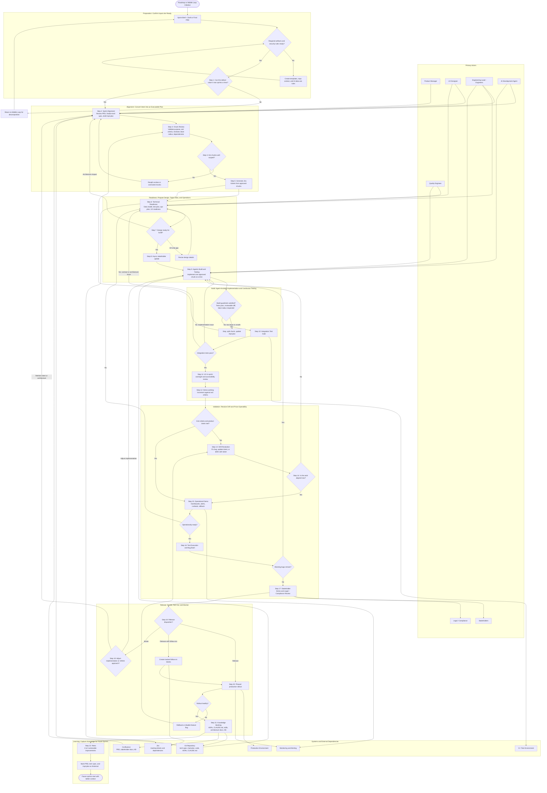
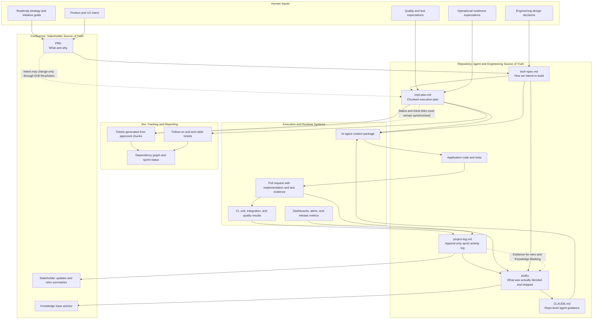
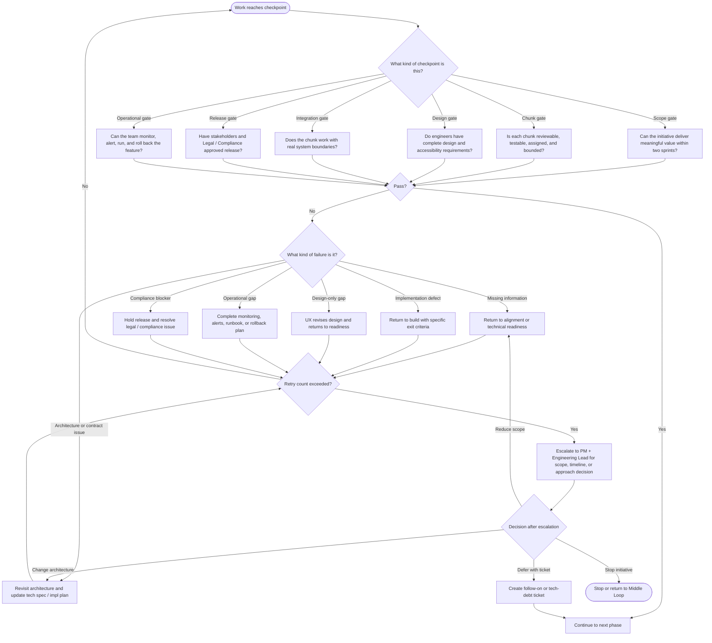

# Architecture Review Board Review — Inner Loop AI PDLC Tech Spec

**Reviewer:** Principal Software Architect / Staff Engineer  
**Review Date:** 2026-06-09  
**Source Document:** `course_discovery/apps/course_metadata/techspec.txt`  
**Review Type:** Architecture Review Board / Technical Design Review  
**Overall Recommendation:** **Conditional approval to continue discovery only; not ready for implementation rollout**

---

## 1. Executive Summary

### Summary of Proposed Solution

The proposed document defines the **Inner Loop**, a sprint-level execution process within an Enterprise AI Product Development Life Cycle. It describes how product, UX, engineering, QE, and AI development agents collaborate from sprint intake through release, knowledge capture, and retro. The main mechanism is a structured sequence of 22 steps, supported by planning artifacts such as `PRD.md`, `tech-spec.md`, `impl-plan.md`, `project-log.md`, ADRs, and `CLAUDE.md`.

The intended business goal is to reduce product development cycle time while maintaining quality by front-loading human intent, using AI agents for implementation, and preserving learnings for future sprints.

### Does the Design Solve the Business Problem?

**Partially.** The design correctly identifies that AI-assisted delivery fails when requirements are vague, artifacts are inconsistent, and humans do not validate agent output. The focus on up-front planning, chunk sizing, named reviewers, blast radius declaration, drift resolution, and knowledge banking is directionally strong.

However, this is currently a **process architecture specification**, not a complete technical architecture. It does not yet define the operational system, tooling integrations, data governance model, security controls, telemetry, compliance boundaries, or rollout mechanics required to safely adopt this process across engineering teams.

### Major Strengths

- Clear philosophy: humans own intent and judgment; agents execute.
- Strong chunking principle: scope is sized for reviewer comprehension, not agent throughput.
- Explicit gates and decision points reduce silent drift.
- Good emphasis on artifact lifecycle and institutional knowledge capture.
- `project-log.md` pattern creates an auditable sprint timeline.
- Step 13 Drift Resolution is a valuable mechanism often missing in delivery processes.
- Step 21 Knowledge Banking is a strong attempt to prevent repeated rediscovery.

### Major Risks

- The document is not yet actionable without templates, ownership definitions, and enforcement mechanisms.
- Security and compliance controls for AI usage are materially underdefined.
- No concrete architecture exists for tooling, Jira automation, Confluence integration, repository artifact management, or agent context loading.
- No observability model exists to measure whether the process improves cycle time or quality.
- Several gates are described as mandatory but have no system-enforced controls.
- The process may introduce additional coordination overhead if not supported by tooling.
- The document references repo artifacts such as `CLAUDE.md`, `docs/plans/`, and architecture docs that do not currently exist in this repository.

---

## Workflow Diagram

### Missing Workflow Steps, Assumptions, and Ambiguities Identified Before Diagramming

The workflow is comprehensive, but several operational details are either implicit or missing. These should be clarified before using the process as an implementation runbook.

| Area | Missing Step / Ambiguity | Why It Matters |
|---|---|---|
| Artifact readiness | No explicit step verifies that `PRD.md`, `tech-spec.md`, `impl-plan.md`, `project-log.md`, and `CLAUDE.md` exist before Step 2 | Agents and engineers may begin Sprint Alignment without the documents required to make the workflow executable |
| Security governance | No early AI data classification or prompt-safety check before using AI in Step 2 | Sensitive product, customer, or operational data could be sent to AI tools before Legal/compliance review occurs |
| Source of truth | The workflow says `impl-plan.md` is the agent source of truth, but Jira, Confluence, and repo docs all carry overlapping state | Artifact drift can cause agents, reviewers, and stakeholders to validate against different versions of intent |
| Gate enforcement | Gates are described as mandatory, but no automation or approval mechanism is defined | Teams may skip gates under schedule pressure without a visible audit trail |
| Failure handling | Several failure paths say “fix and re-run” but do not define retry limits, escalation owners, or rollback to earlier planning stages | Teams can get stuck in unbounded loops without recognizing that the scope or architecture is wrong |
| Operational evidence | Release readiness requires monitoring, alerts, and runbooks, but minimum evidence is not standardized | Stakeholders may approve release without comparable operational proof across teams |
| Knowledge Banking | The workflow requires ADRs, `CLAUDE.md`, skills, architecture docs, and KB updates, but does not define pruning or ownership | Shared context can become stale, noisy, or contradictory over time |
| Process telemetry | No process-level metrics or dashboard are defined | The organization cannot prove whether the Inner Loop reduces cycle time or improves quality |

### Recommended Workflow Improvements

1. Add a **Step 0: Artifact and Security Readiness Check** before Scope Guardrail. This should verify required templates, repo context, and prompt-safety rules.
2. Add a **source-of-truth contract** that defines which fields live in Confluence, Jira, repository markdown, and PR metadata.
3. Add stable **chunk IDs** and use them across `impl-plan.md`, Jira tickets, branches, PRs, tests, demos, logs, and ADRs.
4. Add automated checks for required fields: reviewer, blast radius, exit criteria, dependencies, rollout plan, rollback plan, and test evidence.
5. Add a consistent retry/escalation policy for every failed gate.
6. Add a process dashboard for cycle time, drift count, review latency, PR size, rollback rate, and Knowledge Banking completion.
7. Move model/vendor/token guidance into a separate AI usage runbook so the process specification remains stable.

### Diagram 1 — End-to-End Inner Loop Workflow

### Diagram 2 — Artifact and Data Flow Across Systems

### Diagram 3 — Gate, Failure, and Escalation Model

---

## 2. Architecture Review

### Overall Architecture and Design Approach

The document describes a **workflow architecture** rather than a software system architecture. The high-level approach is sound: define intent up front, decompose into reviewer-sized chunks, use AI for implementation, validate continuously, release through gated checkpoints, and bank knowledge after release.

Architecturally, this resembles a **human-in-the-loop delivery control plane** for AI-assisted engineering. The core components appear to be:

- Product intent source: PRD in Confluence
- Engineering intent source: `tech-spec.md` and `impl-plan.md` in repository
- Execution mechanism: AI coding agents plus engineers
- Tracking layer: Jira
- Operational event log: `project-log.md`
- Knowledge base: ADRs, `CLAUDE.md`, skills library, architecture docs, Confluence KB

This is a reasonable conceptual architecture, but the specification does not define the concrete platform architecture needed to make these components reliable, synchronized, secure, or auditable.

### System Boundaries and Responsibilities

The intended boundaries are not fully clear.

| Boundary | Current State | Concern |
|---|---|---|
| Confluence vs repository | Narrative docs in Confluence, agent-readable docs in repo | `project-log.md` is inconsistently listed as both Confluence and repo-resident |
| Jira vs `impl-plan.md` | Jira is tracking shadow; `impl-plan.md` is source of truth | No synchronization or drift detection mechanism |
| Human vs AI responsibility | Humans define and validate; agents execute | No hard enforcement of human approval points |
| Process vs platform | 22-step loop describes process | No tooling architecture or integration plan |
| Repo-level vs org-level context | `CLAUDE.md`, skills, architecture docs referenced | Missing governance for shared context updates |

**Architectural concern:** The document depends on multiple sources of truth while claiming the `impl-plan.md` is the agent source of truth. Without synchronization rules, stale context and conflicting artifacts are likely.

### Service Interactions and Dependencies

The spec references the following external systems or dependencies:

- Confluence
- Jira
- GitHub or source control
- AI agents / Copilot / Claude
- CI systems
- Test environments
- Monitoring and alerting tools
- Legal/compliance review process
- Skills library / `ai-devtools-internal`

However, it does not define:

- Authentication method between tools
- API ownership
- Failure handling when Jira or Confluence is unavailable
- Audit requirements for AI-generated changes
- Integration contracts between artifact stores
- Whether automation will read/write Jira, Confluence, and repo docs

**Recommendation:** Treat the Inner Loop as a platform workflow with explicit integration contracts. Define which systems are authoritative for which fields and which updates are manual vs automated.

### Data Flow and Integration Points

The conceptual data flow is:

1. PRD enters from Middle Loop / Confluence.
2. Step 2 produces finalized `tech-spec.md` and draft `impl-plan.md`.
3. Step 3 finalizes chunks.
4. Step 5 creates Jira tickets from chunks.
5. Step 9 agents read repo context and produce code.
6. Steps 10–17 validate the build.
7. Step 20 releases.
8. Step 21 deposits knowledge into ADRs, `CLAUDE.md`, architecture docs, skills, and Confluence.
9. Step 22 appends retro to `impl-plan.md`.

Gaps:

- No artifact ID scheme links PRD sections, impl-plan chunks, Jira tickets, PRs, demos, and ADRs.
- No schema for `project-log.md` entries beyond examples.
- No lifecycle state machine for chunks.
- No source-of-truth conflict resolution model.
- No traceability matrix from PRD requirement → chunk → ticket → PR → test → release → ADR.

**Recommendation:** Add a formal traceability model. At minimum, every chunk should have a stable ID used in Jira ticket titles, branch names, PR descriptions, project log entries, and ADR references.

### API Design Considerations

No application APIs are proposed. If this process becomes automated, APIs will likely be required for:

- Creating Jira tickets from chunks
- Updating chunk status
- Reading/writing Confluence pages
- Querying PR status and CI results
- Updating dashboards
- Generating reports

The spec does not define API boundaries, rate limits, permission scopes, idempotency, or failure handling for these integrations.

**Recommendation:** If automation is planned, define an integration API design separately. Use idempotent operations keyed by chunk ID to avoid duplicate Jira tickets, duplicate log entries, or conflicting Confluence updates.

### Event-Driven vs Synchronous Communication Choices

The document implicitly assumes synchronous human gates and asynchronous touchpoints. It does not state whether automation should be event-driven.

Recommended model:

- **Event-driven for state changes:** PR opened, CI completed, chunk approved, demo logged, release phase advanced.
- **Synchronous for hard gates:** Architecture approval, chunk review approval, integration test gate, stakeholder sign-off.
- **Append-only event log:** `project-log.md` or a structured event store should capture immutable process events.

This would improve auditability and allow dashboards without relying on humans to manually summarize status.

### Extensibility and Maintainability

The step model is readable but may be hard to maintain because:

- Process steps, examples, AI prompts, token billing advice, and execution modes are all mixed together.
- The document is long and repetitive.
- The tables copied from Confluence lost markdown structure.
- Model names and billing guidance will become stale quickly.
- Templates are referenced but absent.

**Recommendation:** Split the document into:

1. Process overview
2. Step reference
3. Artifact templates
4. Tooling/integration architecture
5. AI usage guidance
6. Governance and compliance
7. Adoption/runbook guide

---

## 3. Scalability & Performance

### Expected Scaling Characteristics

The process is designed around a single initiative or sprint team. Scaling to multiple teams introduces coordination and consistency risks.

Potential scaling dimensions:

- Number of teams adopting the loop
- Number of concurrent initiatives
- Number of AI-generated PRs
- Number of artifact updates per sprint
- Number of Jira and Confluence integrations
- Number of `CLAUDE.md` or architecture doc updates

### Potential Bottlenecks

| Bottleneck | Why It Matters |
|---|---|
| Human review capacity | The process correctly sizes chunks by reviewer capacity, but reviewer availability becomes the throughput limit |
| Step 2 Sprint Alignment | If upstream artifacts are weak, this becomes a multi-day planning bottleneck |
| Step 3 Chunk Review | All chunks require human validation; large initiatives may block here |
| Legal/compliance SLA | 48h legal review can dominate release timelines |
| Knowledge Banking | Likely to be skipped when teams are behind unless enforced |
| `CLAUDE.md` updates | Shared context files may become merge-conflict hotspots |
| Jira/Confluence synchronization | Manual duplication can introduce drift and overhead |

### Database Impacts

No application database changes are proposed. If platform automation is introduced later, it may require a data store for:

- Chunk states
- Artifact metadata
- PR and ticket mappings
- Gate approvals
- Audit logs
- Metrics and analytics

If no database is used and state is stored only in markdown, performance may be acceptable at small scale but weak for reporting, search, dashboards, and compliance audit.

### Caching Opportunities

Potential caching areas if automated tooling is built:

- Cached Confluence PRD snapshots
- Cached Jira ticket status
- Cached PR metadata and CI status
- Cached architecture context for agents
- Cached template versions

Caching must be carefully versioned because stale context is a primary failure mode for AI-assisted development.

### Throughput and Latency Considerations

The process targets faster cycle time, but several gates have fixed human latency:

- Step 2: 1–2 days
- Step 3: 2–3 hours
- Step 6: 1–2 days
- Step 16: 1–2 days
- Step 17: 1 hour + 48h legal SLA
- Step 21: ≤2 days
- Step 22: 1 hour

The process may reduce implementation time but increase planning and validation time. That can be good if quality improves, but it must be measured.

### Future Growth Concerns

- As `CLAUDE.md` grows, it may become noisy and reduce agent effectiveness.
- As skills accumulate, discoverability and versioning become important.
- As more teams use the process, inconsistent interpretation of gates will reduce comparability.
- Without templates and validation checks, markdown artifacts will drift in structure and quality.

---

## 4. Reliability & Resilience

### Failure Scenarios

| Failure Scenario | Current Handling | Gap |
|---|---|---|
| Agent implements wrong behavior but tests pass | Human review and demo | No product requirement traceability enforcement |
| Integration tests fail | Fix and rerun | No escalation path if contract/design invalid |
| PR exceeds 400 LOC | Stop and split | No enforcement or branch handling guidance |
| Legal review misses SLA | Escalate to VP Eng | No backup approver or release hold policy |
| Jira tickets drift from `impl-plan.md` | Humans validate | No automated drift detection |
| Confluence unavailable | Not addressed | Process dependency risk |
| `CLAUDE.md` contains stale guidance | Knowledge Banking updates | No review cadence or ownership model |
| Multiple teams update shared context | Not addressed | Merge conflict and contradictory guidance risk |

### Error Handling Strategy

The process identifies some failure conditions using flags, but many flags do not define an explicit decision path. A reliable process needs every flag to answer:

1. Who is notified?
2. Who owns resolution?
3. What state does the initiative enter?
4. What artifacts are updated?
5. What is the maximum allowed retry count?
6. What is the escalation path?

### Retry Mechanisms

Retries are implied in several places:

- Re-run integration tests after fixes
- Loop back to build after drift
- Return to Sprint Alignment after rethink
- Rework chunks after review failure

But retry limits are inconsistent. Step 14 has a third-loop escalation, while Steps 10, 18, and 19 do not.

**Recommendation:** Define global retry policy for gates and loops. Example: every gate may be retried twice; third failure triggers Eng Lead + PM escalation and scope review.

### Circuit Breaker Patterns

For a process architecture, circuit breakers should stop continued investment when signals indicate the plan is invalid.

Suggested circuit breakers:

- More than 50% chunks fail pre-screen → stop Step 3 and rewrite plan.
- Any PR exceeds 400 LOC before passing chunk exit criteria → stop build and split.
- Same drift category appears in two demos → pause build and revisit requirements.
- Integration failure requires API contract change → route back to Step 2 or Step 6.
- Legal/compliance rejects feature → freeze release disposition until PRD and risk model are updated.

### Disaster Recovery Considerations

No DR concerns are discussed. For the process itself, DR means recovering from artifact loss, stale state, or failed tooling.

Minimum expectations:

- Repo artifacts are versioned in Git.
- Confluence PRD snapshots are linked or exported at Sprint Alignment.
- Jira ticket IDs are recorded in `impl-plan.md`.
- Release decisions and approvals are preserved in immutable logs.
- If Confluence/Jira is unavailable, teams know which local artifacts remain authoritative.

### High Availability Concerns

If this becomes a required release process, dependencies such as Jira, Confluence, GitHub, CI, and AI tooling become part of the delivery control plane. Their outages can block delivery. The document should define degraded-mode operation.

---

## 5. Security Review

### Authentication and Authorization

The spec does not define how humans or agents authenticate to:

- GitHub/source control
- Jira
- Confluence
- CI/CD systems
- Monitoring systems
- AI tooling

Questions:

1. Can AI agents create branches, commits, PRs, Jira tickets, or Confluence edits directly?
2. Are agents acting under a human identity, bot identity, or service account?
3. What permission scopes are granted?
4. Who audits agent actions?

### Secrets Management

No secret handling policy is provided. This is a critical gap because AI prompts may accidentally include:

- API tokens
- OAuth credentials
- environment variables
- customer data
- private configuration
- internal endpoints

**Must fix:** Add explicit prohibition on pasting secrets into AI tools and define automated secret scanning on generated diffs and prompt artifacts where possible.

### Data Protection

The process encourages agents to read PRDs, tech specs, code, logs, and project notes. These artifacts may contain sensitive or regulated data.

Missing controls:

- Data classification rules for prompts
- PII handling policy
- Customer data redaction rules
- Vendor/model data retention policy
- Allowed/disallowed document types for AI ingestion
- Audit trail for what context was provided to AI

### Encryption Requirements

No encryption requirements are documented. If artifacts remain in Git/Jira/Confluence, encryption may be inherited from those platforms, but the spec should explicitly state this. If logs or automation stores metadata elsewhere, encryption at rest and in transit are required.

### Compliance Considerations

Potential compliance areas:

- SOC 2 change management evidence
- GDPR / privacy obligations if PRDs contain user data
- IP/licensing review for AI-generated code
- Open-source license compliance
- Auditability of human approvals
- Data residency depending on AI vendor

The Legal/compliance step is too late if sensitive data was already sent to AI during planning. Compliance must be considered before Step 9 and ideally before Step 2 AI analysis.

### Security Vulnerabilities or Gaps

Critical gaps:

- No AI acceptable use policy.
- No prompt data classification policy.
- No agent permission model.
- No generated-code security scanning requirement.
- No dependency/license scanning requirement when agents introduce packages.
- No mandatory threat modeling step for high-risk changes.
- No policy for handling insecure AI suggestions.

---

## 6. Operational Readiness

### Monitoring Strategy

The document asks each feature to define monitors during Step 6 and demonstrate them in Step 15. That is good, but process-level monitoring is missing.

Recommended process metrics:

- Cycle time from Step 1 → Step 20
- Time spent per gate
- Number of chunk resplits
- Number of drift items per sprint
- PR size distribution
- Test failure rate by stage
- Rollback rate
- Number of Knowledge Banking deposits
- Repeated question rate in Step 2
- AI-generated code defect rate

### Logging Requirements

`project-log.md` is a strong idea, but it needs a schema.

Recommended fields:

| Field | Example |
|---|---|
| timestamp | `2026-06-09T15:00Z` |
| event_type | `chunk-approved`, `integration-test`, `drift`, `release` |
| actor | `@engineer` |
| chunk_id | `CH-003` |
| artifact_links | PR, Jira, demo, ADR |
| status | pass/fail/warn |
| summary | human-readable summary |
| follow_up | optional action item |

### Alerting Considerations

The process defines flags but not alerts. If adopted broadly, flags should trigger notifications.

Examples:

- PR open >48h without approval → notify reviewer and Eng Lead.
- Diff >400 LOC → notify author and require split decision.
- Integration gate failure → notify QE and Eng Lead.
- Legal no response within 48h → escalate.
- Knowledge Banking overdue → notify Eng Lead.

### Observability Gaps

- No dashboard design.
- No source for metrics.
- No event taxonomy.
- No SLOs for process health.
- No reporting model for pilot success.

### Deployment Strategy

The process says Step 20 should perform phased rollout, but deployment strategy is feature-specific. The spec should require every `impl-plan.md` to declare:

- Release mechanism
- Feature flag strategy
- Canary or percentage rollout plan
- Bake time between phases
- Monitoring checks at each phase
- Rollback trigger thresholds

### Rollback Strategy

Rollback is mentioned but not standardized. Stronger guidance is needed for:

- Code rollback vs feature flag disablement
- Database migration rollback
- Data backfill reversal
- External integration rollback
- Consumer compatibility during rollback

### Runbook Requirements

Step 15 correctly requires runbooks, but the minimum runbook content is not defined.

Recommended minimum:

- Feature overview
- Expected dashboards
- Alert meanings
- Common failure modes
- Triage commands/links
- Rollback procedure
- Escalation contacts
- Customer-impact guidance

---

## 7. Data & Migration Review

### Data Model Design

No product data model is proposed. For the process itself, the data model consists of artifacts and workflow state.

Suggested conceptual entities:

- Initiative
- Sprint brief
- PRD
- Tech spec
- Impl plan
- Chunk
- Gate decision
- Jira ticket
- PR
- Test result
- Demo
- Release phase
- ADR
- Knowledge deposit
- Retro action

### Migration Strategy

There is no adoption migration plan. Moving teams from current delivery workflows to this Inner Loop is itself a migration.

Missing:

- Pilot team selection
- Migration path from current grooming/ticketing process
- Backward compatibility with existing Jira workflows
- How existing PRD/tech-spec formats map into new templates
- Cutover strategy
- Training plan
- Exit criteria for pilot success

### Backward Compatibility

The spec should be compatible with teams that do not yet have:

- `CLAUDE.md`
- architecture markdown files
- skills library
- mature CI
- integration test suites
- established runbooks

Without a compatibility path, adoption will be uneven.

### Rollout Risks

- Teams may treat the 22-step flow as heavyweight bureaucracy.
- Teams may skip Knowledge Banking when deadlines are tight.
- Teams may generate low-quality templates and automate bad assumptions.
- Jira and `impl-plan.md` may diverge.
- Engineers may accept agent code they do not fully understand.

### Data Consistency Concerns

The highest consistency risk is artifact drift:

- PRD says one thing.
- `tech-spec.md` says another.
- `impl-plan.md` evolves during the sprint.
- Jira tickets reflect an older version.
- PRs implement a newer interpretation.
- ADRs later document what actually shipped.

**Recommendation:** Add an explicit artifact consistency check before Step 9 and before Step 17.

---

## 8. Testing Strategy Review

### Unit Test Coverage Expectations

The spec says unit tests must pass after each change, but does not define coverage expectations.

Recommendations:

- Each chunk must add or update unit tests for its exit criteria.
- Coverage should not decrease.
- Critical logic should include negative and edge-case tests.
- Test assertions should map to chunk IDs or exit criteria where practical.

### Integration Testing Requirements

Step 10 is good but underspecified. Integration test requirements should include:

- API contract validation
- Database migration validation
- external service mocks or sandbox checks
- feature flag on/off tests
- backward compatibility checks
- idempotency checks for retryable operations

### End-to-End Testing Needs

For user-facing changes, Step 16 bug bash is not enough. E2E expectations should be defined in Step 6:

- Happy path
- permission variants
- error states
- empty states
- loading states
- accessibility path
- rollback/off-flag behavior

### Performance Testing Recommendations

Performance testing is missing. Add requirements for chunks that affect:

- Query paths
- list endpoints
- background jobs
- indexing/search
- external API calls
- high-volume user flows

Minimum performance questions:

1. What is the expected request volume?
2. What is the latency budget?
3. Does the change add queries or external calls?
4. Is load testing required before release?
5. What metric proves no regression?

### Failure Testing Scenarios

Recommended failure tests:

- Downstream API timeout
- partial database failure
- stale cache
- invalid/malformed input
- feature flag disabled mid-request
- retry exhaustion
- duplicate event delivery if event-driven
- rollback after partial rollout

---

## 9. Missing Information

### Unclear Assumptions

- Assumes teams already have strong PRDs and technical specs.
- Assumes engineers can reliably review every AI-generated diff line by line.
- Assumes legal/compliance review only matters near release.
- Assumes `CLAUDE.md` and architecture docs exist.
- Assumes Jira can be a tracking shadow without drift issues.
- Assumes all teams can follow 22 steps within a two-week sprint.
- Assumes AI-generated code can be evaluated with existing tests.

### Missing Requirements

- AI governance policy
- prompt data classification
- secrets handling
- artifact templates
- traceability model
- approval model
- automation architecture
- metrics and success criteria
- adoption rollout plan
- degraded-mode operation
- training/onboarding plan
- legal/IP policy for generated code
- model/vendor risk policy

### Areas Requiring Clarification

1. Is this process mandatory or optional during the pilot?
2. Who owns the overall Inner Loop process?
3. Where should this document live long-term?
4. What tooling will enforce gates?
5. What happens when a team skips a gate?
6. What is the minimum viable artifact set for a small change?
7. How are urgent production fixes handled if they are outside this loop?
8. How are cross-team dependencies tracked?
9. Who approves updates to `CLAUDE.md`?
10. What evidence is required for Legal/compliance sign-off?

---

## 10. Improvement Recommendations

### Critical Issues — Must Fix Before Implementation

1. **Create artifact templates.** Provide concrete templates for `tech-spec.md`, `impl-plan.md`, `project-log.md`, ADRs, Jira tickets, and `CLAUDE.md`.
2. **Define AI security and compliance controls.** Include prompt data classification, secrets policy, vendor/model policy, and generated-code scanning.
3. **Resolve artifact source-of-truth rules.** Clarify Confluence vs repo vs Jira responsibilities and synchronization rules.
4. **Add traceability model.** Link PRD requirements, chunks, tickets, PRs, tests, demos, release notes, and ADRs.
5. **Define gate enforcement.** Decide which gates are manual, automated, blocking, advisory, or escalation-only.
6. **Add rollout/adoption plan.** Define pilot scope, success metrics, training, and graduation criteria.

### Recommended Improvements

- Split process, templates, governance, and AI usage guidance into separate documents.
- Add a state machine for chunks and gates.
- Add a risk register.
- Add process-level telemetry and dashboards.
- Add escalation paths for every flag condition.
- Add artifact consistency checks before build and before release.
- Add performance and failure testing guidance.

### Nice-to-Have Enhancements

- Generate a Mermaid diagram for the 22-step workflow.
- Build a CLI or GitHub Action to validate `impl-plan.md` structure.
- Add PR template fields for chunk ID, exit criteria, blast radius, and test evidence.
- Add Jira automation to link tickets to chunks and PRs.
- Add a Knowledge Banking checklist bot.

### Alternative Architectural Approaches

1. **Lightweight governance mode:** Start with only Steps 1–6, 9–10, 13, 20–22 for the pilot. Add remaining gates once teams have templates and tooling.
2. **Platform-backed workflow:** Store chunk state, gate decisions, and traceability in a small internal service instead of markdown-only artifacts.
3. **Git-native workflow:** Keep everything in repo using pull requests, markdown templates, CODEOWNERS, GitHub Actions, and PR checks. Use Jira only for reporting.
4. **Policy-as-code workflow:** Define gates as machine-readable policy checks and fail builds when required fields, tests, or approvals are missing.

---

## 11. Architecture Review Scorecard

| Category | Score | Rationale |
|---|---:|---|
| Architecture | 5/10 | Strong conceptual workflow, but no concrete platform architecture or integration design |
| Scalability | 4/10 | Reviewer-sized chunks help, but process may bottleneck across teams without automation |
| Security | 2/10 | AI security, data protection, secrets, and compliance controls are largely missing |
| Reliability | 5/10 | Good gates and drift loops, but failure handling and retry/escalation policies are incomplete |
| Maintainability | 5/10 | Good artifact lifecycle concept, but document is too broad and templates are absent |
| Operational Readiness | 4/10 | Feature-level ops readiness is addressed, but process-level observability is missing |
| Testability | 6/10 | Testing is emphasized, but coverage standards, performance tests, and failure tests need detail |

**Overall Score:** **4.4 / 10**

**ARB Disposition:** **Not ready for implementation rollout. Suitable for continued refinement and limited pilot only after critical controls are added.**

---

## 12. Actionable Feedback

| Priority | Area | Issue | Recommendation | Impact |
|---|---|---|---|---|
| P0 | Security | No AI data governance or prompt classification policy | Define allowed/disallowed data for AI prompts; include PII, secrets, customer data, and retention rules | Prevents data leakage and compliance violations |
| P0 | Security | No agent identity or permission model | Define whether agents use bot accounts, human accounts, or service accounts; apply least privilege | Reduces unauthorized changes and audit gaps |
| P0 | Artifacts | Templates are referenced but absent | Create templates for `tech-spec.md`, `impl-plan.md`, `project-log.md`, ADRs, Jira tickets, and `CLAUDE.md` | Makes process executable and repeatable |
| P0 | Source of Truth | Confluence, Jira, and repo artifacts can drift | Define authoritative fields and synchronization rules | Prevents agents from building from stale or conflicting context |
| P0 | Traceability | No requirement-to-release traceability | Add stable chunk IDs and link PRD → chunk → ticket → PR → test → release → ADR | Improves auditability and delivery confidence |
| P1 | Reliability | Gate failures lack consistent escalation paths | Add owner, retry count, escalation path, and artifact update rule for every flag | Prevents infinite loops and silent failure |
| P1 | Operations | No process-level observability | Track cycle time, drift count, chunk resplits, PR size, rollback rate, and Knowledge Banking completion | Measures whether the pilot works |
| P1 | Adoption | No rollout or pilot plan | Define pilot teams, success metrics, timeline, training, and graduation criteria | Prevents inconsistent adoption |
| P1 | Testing | Performance and failure testing are missing | Add required performance/failure test checklist for high-risk chunks | Reduces production regression risk |
| P1 | Compliance | Legal/compliance appears too late in the process | Add early compliance screening before AI planning/build for sensitive initiatives | Prevents late-stage release blockers |
| P2 | Maintainability | AI model billing guidance is embedded in process spec | Move model/vendor/billing guidance to separate operational runbook | Reduces document churn |
| P2 | Operations | `project-log.md` format is example-based only | Define strict schema and event taxonomy | Improves automation and retro quality |
| P2 | Architecture | No workflow diagram in repo | Add Mermaid diagram showing step transitions and loopbacks | Improves comprehension |
| P2 | DevEx | No automated validation of plan quality | Add linter/checklist for missing reviewer, blast radius, exit criteria, dependencies | Reduces manual review burden |
| P3 | Knowledge | `CLAUDE.md` may grow noisy over time | Add ownership, review cadence, and pruning rules | Keeps agent context useful |
| P3 | Cost | Token guidance is qualitative only | Define metrics for token spend per phase if cost becomes material | Improves cost governance |

---

## Final ARB Recommendation

Do **not** roll this out broadly as an implementation process yet. The concept is promising and directionally aligned with AI-assisted delivery, but it requires stronger governance, security, traceability, artifact templates, and operational controls before production teams depend on it.

Recommended next step: run a **controlled pilot** with one team and one low-risk product initiative after adding the P0 items above. Use the pilot to validate whether the process reduces cycle time without increasing defect rate, coordination overhead, or compliance risk.
