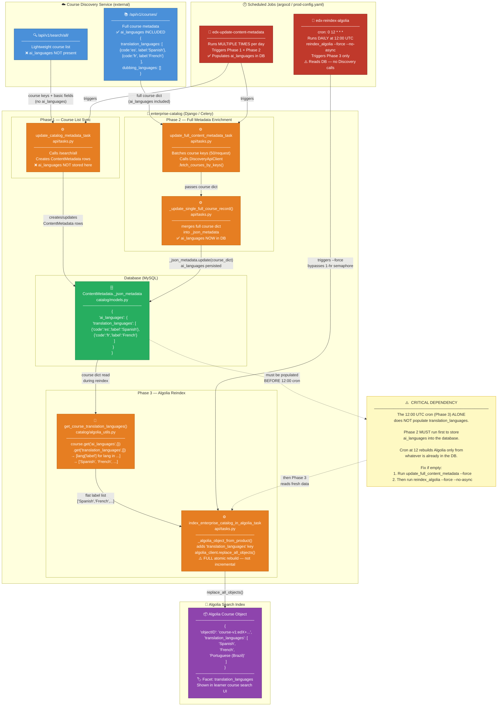
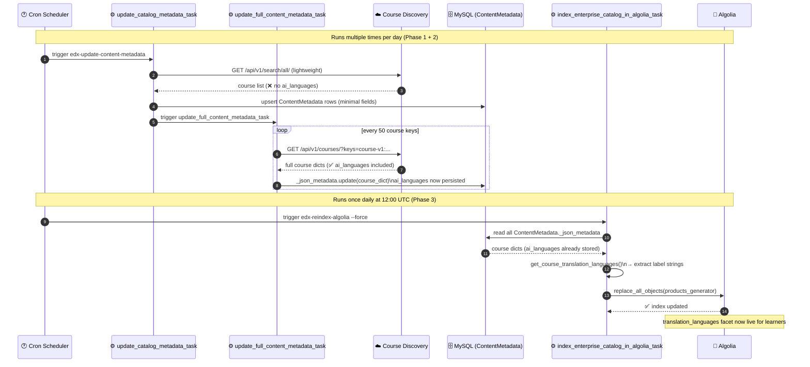
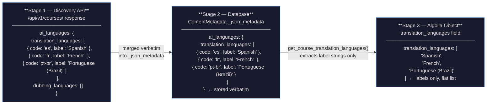
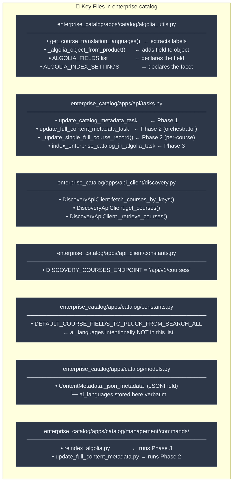
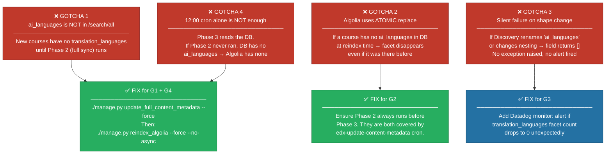

# AI Languages → `translation_languages` — Full Architecture

> **Purpose:** Visual reference for how `ai_languages` from Course Discovery becomes
> the `translation_languages` search facet in Algolia.
> **Last updated:** 2026-06-08

---

## Architecture Diagram

---

## Sequence Diagram — One Full Nightly Cycle

---

## Data Shape at Each Stage

---

## Component Ownership Map

---

## Gotchas at a Glance

---

## Related Files

| Purpose | File | Symbol |
|---|---|---|
| Extract labels for Algolia | [algolia_utils.py](../../enterprise_catalog/apps/catalog/algolia_utils.py) | `get_course_translation_languages()` |
| Write to Algolia object | [algolia_utils.py](../../enterprise_catalog/apps/catalog/algolia_utils.py) | `_algolia_object_from_product()` |
| Persist `ai_languages` from Discovery | [api/tasks.py](../../enterprise_catalog/apps/api/tasks.py) | `_update_single_full_course_record()` |
| Discovery HTTP client | [api_client/discovery.py](../../enterprise_catalog/apps/api_client/discovery.py) | `DiscoveryApiClient.fetch_courses_by_keys()` |
| Discovery endpoint constant | [api_client/constants.py](../../enterprise_catalog/apps/api_client/constants.py) | `DISCOVERY_COURSES_ENDPOINT` |
| Algolia field + facet declared | [algolia_utils.py](../../enterprise_catalog/apps/catalog/algolia_utils.py) | `ALGOLIA_FIELDS`, `ALGOLIA_INDEX_SETTINGS` |
| Fields plucked from `/search/all` | [catalog/constants.py](../../enterprise_catalog/apps/catalog/constants.py) | `DEFAULT_COURSE_FIELDS_TO_PLUCK_FROM_SEARCH_ALL` |
| Reindex management command | [reindex_algolia.py](../../enterprise_catalog/apps/catalog/management/commands/reindex_algolia.py) | `Command.handle()` |
| Full-metadata management command | [update_full_content_metadata.py](../../enterprise_catalog/apps/catalog/management/commands/update_full_content_metadata.py) | — |

---

*See also: [ai_languages_post_merge_next_steps.md](ai_languages_post_merge_next_steps.md)*
