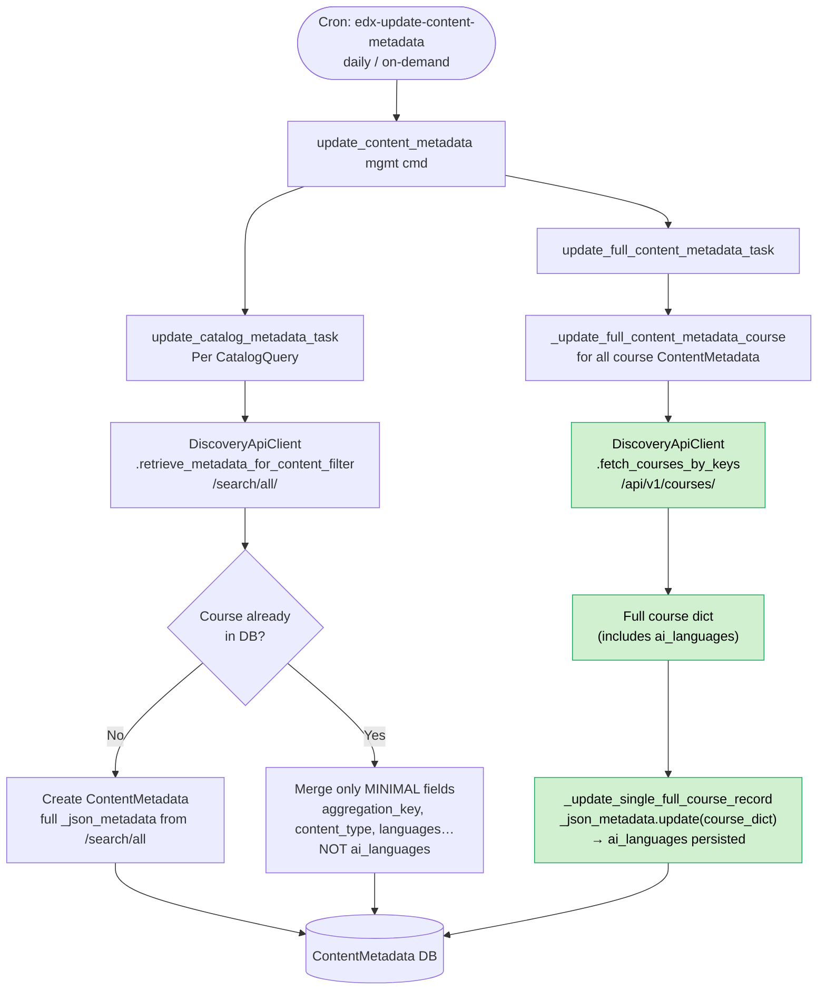
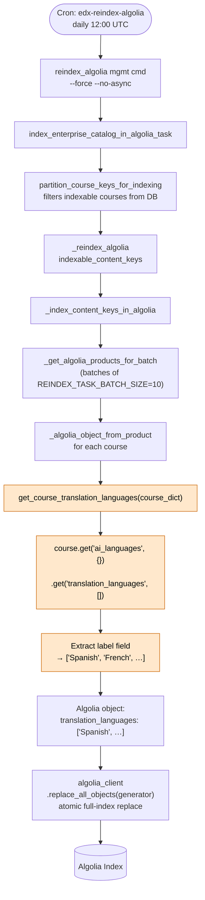
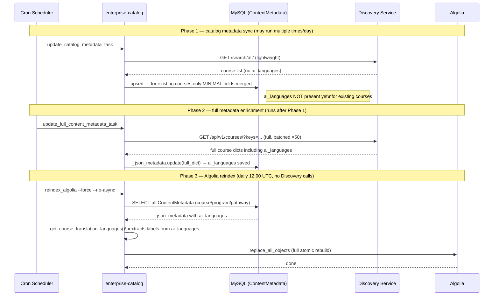

# AI Languages & Translation Languages — Architecture Reference

## Overview

Enterprise Catalog surfaces an Algolia facet called `translation_languages` that lets learners
filter courses by the AI-generated subtitle / translation languages that are available.  The data
originates in the **Course Discovery** service as a field called `ai_languages` and flows through
several layers before it appears in Algolia.

This document covers:

1. [Data shape](#1-data-shape)
2. [End-to-end data flow](#2-end-to-end-data-flow)
3. [Component architecture](#3-component-architecture)
4. [Flowcharts](#4-flowcharts)
5. [Key code locations](#5-key-code-locations)
6. [Scheduled jobs](#6-scheduled-jobs)
7. [Important constraints & gotchas](#7-important-constraints--gotchas)

---

## 1. Data Shape

### Discovery API response (`/api/v1/courses/`)

```json
{
  "key": "course-v1:edX+DemoX+Demo_Course",
  "ai_languages": {
    "translation_languages": [
      { "code": "es",   "label": "Spanish" },
      { "code": "fr",   "label": "French"  },
      { "code": "pt-br","label": "Portuguese (Brazil)" }
    ],
    "dubbing_languages": []
  }
}
```

> `ai_languages` is **only** present in the full course endpoint (`/api/v1/courses/`).
> It is **not** returned by the lightweight `/search/all/` endpoint.

### Stored in `ContentMetadata._json_metadata`

The entire `ai_languages` dict is merged verbatim into the `_json_metadata` JSON column during
the `update_full_content_metadata_task` run.

### Published to Algolia

`translation_languages` is a flat list of human-readable labels extracted from
`ai_languages.translation_languages`:

```json
{
  "translation_languages": ["Spanish", "French", "Portuguese (Brazil)"]
}
```

---

## 2. End-to-End Data Flow

```
Discovery Service
  /api/v1/courses/
       │  (HTTP GET, batched by 50 course keys)
       ▼
enterprise_catalog.apps.api_client.discovery.DiscoveryApiClient
  .fetch_courses_by_keys()  →  .get_courses()  →  ._retrieve_courses()
       │
       │  raw course dict  (includes ai_languages)
       ▼
enterprise_catalog.apps.api.tasks._update_full_content_metadata_course()
  └─► _update_single_full_course_record()
        └─► metadata_record._json_metadata.update(course_metadata_dict)
              ↳  ai_languages key is now persisted in DB
       │
       ▼
   MySQL  ─  ContentMetadata._json_metadata  (JSON column)
       │
       │  (read during nightly reindex, no new API calls)
       ▼
enterprise_catalog.apps.catalog.algolia_utils.get_course_translation_languages()
  translation_languages = course.get('ai_languages', {})
                                 .get('translation_languages', [])
  return [lang['label'] for lang in translation_languages if lang.get('label')]
       │
       ▼
  _algolia_object_from_product()  ─  adds 'translation_languages' key
       │
       ▼
  Algolia index  (facet: translation_languages)
```

---

## 3. Component Architecture

```
┌──────────────────────────────────────────────────────────────────────┐
│                        Course Discovery Service                       │
│                                                                        │
│  /api/v1/search/all/        /api/v1/courses/         /course_review/  │
│  (lightweight metadata)     (FULL metadata)          (ratings)        │
└──────────┬───────────────────────────┬───────────────────────────────┘
           │ /search/all               │ /courses/  (includes ai_languages)
           │ (no ai_languages)         │
           ▼                           ▼
┌──────────────────────────────────────────────────────────────────────┐
│                     enterprise-catalog  (Django)                       │
│                                                                        │
│  api_client/discovery.py                                               │
│  ┌─────────────────────────────────────────────────────────────────┐  │
│  │ DiscoveryApiClient                                               │  │
│  │  .retrieve_metadata_for_content_filter()  ← /search/all        │  │
│  │  .fetch_courses_by_keys()                 ← /courses/           │  │
│  └──────────────┬──────────────────────────────────────────────────┘  │
│                 │                                                       │
│  api/tasks.py   ▼                                                      │
│  ┌─────────────────────────────────────────────────────────────────┐  │
│  │ update_catalog_metadata_task                                     │  │
│  │   calls /search/all → stores MINIMAL fields to ContentMetadata  │  │
│  │                        (ai_languages NOT included here)         │  │
│  │                                                                  │  │
│  │ update_full_content_metadata_task                                │  │
│  │   calls /courses/ → merges FULL dict into _json_metadata        │  │
│  │   ai_languages ─────────────────────────────────────────────►   │  │
│  └──────────────┬──────────────────────────────────────────────────┘  │
│                 │                                                       │
│  catalog/models.py ▼                                                   │
│  ┌─────────────────────────────────────────────────────────────────┐  │
│  │ ContentMetadata                                                   │  │
│  │   _json_metadata (JSONField)                                     │  │
│  │     └─ ai_languages: { translation_languages: [...] }           │  │
│  └──────────────┬──────────────────────────────────────────────────┘  │
│                 │                                                       │
│  catalog/algolia_utils.py ▼                                            │
│  ┌─────────────────────────────────────────────────────────────────┐  │
│  │ get_course_translation_languages(course_dict)                    │  │
│  │   course.get('ai_languages', {})                                 │  │
│  │       .get('translation_languages', [])                          │  │
│  │   → ['Spanish', 'French', ...]                                   │  │
│  │                                                                  │  │
│  │ _algolia_object_from_product()                                   │  │
│  │   adds  translation_languages  key to Algolia object            │  │
│  └──────────────┬──────────────────────────────────────────────────┘  │
│                 │                                                       │
│  api/tasks.py   ▼                                                      │
│  ┌─────────────────────────────────────────────────────────────────┐  │
│  │ index_enterprise_catalog_in_algolia_task                         │  │
│  │   algolia_client.replace_all_objects(products_generator)        │  │
│  └──────────────┬──────────────────────────────────────────────────┘  │
└─────────────────┼────────────────────────────────────────────────────┘
                  │
                  ▼
        ┌─────────────────┐
        │  Algolia Index  │
        │  facet:         │
        │  translation_   │
        │  languages      │
        └─────────────────┘
```

---

## 4. Flowcharts

### 4a. How `ai_languages` gets into the database



### 4b. How `translation_languages` flows to Algolia



### 4c. Two-phase sync: why `ai_languages` needs the full sync



---

## 5. Key Code Locations

| Concern | File | Symbol |
|---|---|---|
| Extract labels for Algolia | `enterprise_catalog/apps/catalog/algolia_utils.py` | `get_course_translation_languages()` |
| Write to Algolia object | `enterprise_catalog/apps/catalog/algolia_utils.py` | `_algolia_object_from_product()` |
| Persist `ai_languages` from Discovery | `enterprise_catalog/apps/api/tasks.py` | `_update_single_full_course_record()` |
| Discovery HTTP call | `enterprise_catalog/apps/api_client/discovery.py` | `DiscoveryApiClient.fetch_courses_by_keys()` |
| Discovery endpoint constant | `enterprise_catalog/apps/api_client/constants.py` | `DISCOVERY_COURSES_ENDPOINT` (`/api/v1/courses/`) |
| Algolia field declared | `enterprise_catalog/apps/catalog/algolia_utils.py` | `ALGOLIA_FIELDS` list — `'translation_languages'` |
| Algolia facet declared | `enterprise_catalog/apps/catalog/algolia_utils.py` | `ALGOLIA_INDEX_SETTINGS['attributesForFaceting']` |
| Fields plucked from `/search/all` | `enterprise_catalog/apps/catalog/constants.py` | `DEFAULT_COURSE_FIELDS_TO_PLUCK_FROM_SEARCH_ALL` |
| Reindex management command | `enterprise_catalog/apps/catalog/management/commands/reindex_algolia.py` | `Command.handle()` |
| Full-metadata management command | `enterprise_catalog/apps/catalog/management/commands/update_full_content_metadata.py` | — |

---

## 6. Scheduled Jobs

Two separate cron jobs, both defined in `argocd/applications/enterprise-catalog/prod-config.yaml`
in edx-internal.

| Job name | Schedule | Command | What it does |
|---|---|---|---|
| `edx-update-content-metadata` | Multiple times / day | `update_content_metadata` | Phase 1+2: syncs course list from `/search/all/`, then enriches all courses from `/api/v1/courses/` (which brings in `ai_languages`). |
| `edx-reindex-algolia` | `0 12 * * *` (daily 12:00 UTC) | `reindex_algolia --force --no-async` | Phase 3: **full Algolia rebuild** from whatever is currently in the DB — no Discovery calls. Reads `ai_languages` from stored `_json_metadata`, extracts `translation_languages` labels, and atomically replaces all Algolia objects. |

> **Key insight:** `edx-reindex-algolia` alone is not sufficient to populate `translation_languages`.
> The data must first exist in `ContentMetadata._json_metadata` via `update_full_content_metadata_task`.
> If a course's `ai_languages` changes in Discovery but the full-metadata sync hasn't run since,
> Algolia will serve stale data until the next `update_content_metadata` cycle completes.

---

## 7. Important Constraints & Gotchas

### `ai_languages` is not in the `/search/all` pluck list

`DEFAULT_COURSE_FIELDS_TO_PLUCK_FROM_SEARCH_ALL` (in `constants.py`) deliberately excludes
`ai_languages`.  For **existing** course records, only those whitelisted fields are merged from
`/search/all` responses.  `ai_languages` arrives exclusively through the `/api/v1/courses/` full
sync (`update_full_content_metadata_task`).

### New courses get `ai_languages` on first insert

Brand-new `ContentMetadata` rows (course not yet in DB) receive the full `/search/all` payload
including any fields Discovery happens to return.  However, `/search/all` does **not** return
`ai_languages`, so new courses will have no `translation_languages` in Algolia until the next
full-metadata sync runs.

### Data shape dependency

`get_course_translation_languages` expects:

```python
ai_languages = {
    "translation_languages": [
        {"code": "es", "label": "Spanish"},
        ...
    ]
}
```

If Discovery changes the key name or nests the data differently, `translation_languages` will
silently become empty.  No error is raised — the field simply won't appear in Algolia for
affected courses.

### Algolia uses atomic replace, not incremental upsert

`algolia_client.replace_all_objects()` rebuilds the entire index.  This means:

- A course missing `ai_languages` in the DB at reindex time will have no `translation_languages`
  in Algolia, even if it had one previously.
- Conversely, once the DB is correct, a single reindex restores the facet for all courses.

### `--force` flag on the cron

`reindex_algolia --force` bypasses the `expiring_task_semaphore` (which otherwise prevents
re-running within 1 hour).  It does **not** change the scope — it still rebuilds from all DB
records regardless of what changed.
