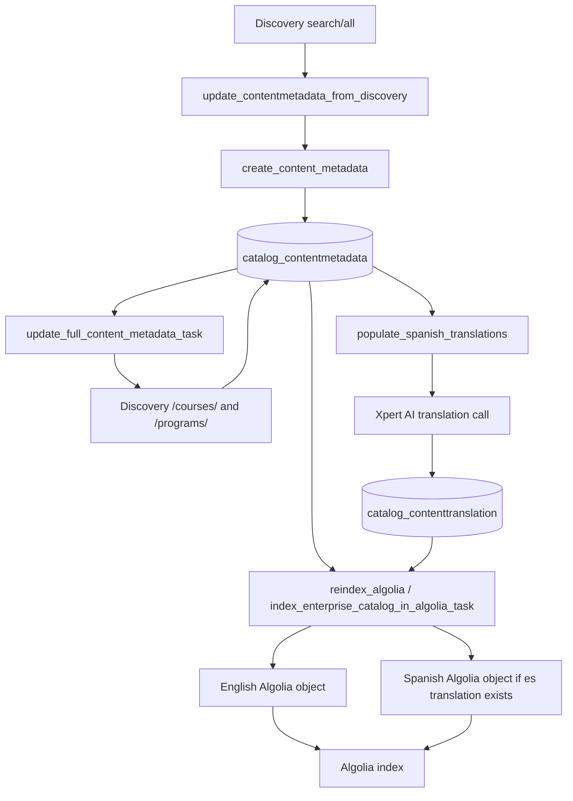
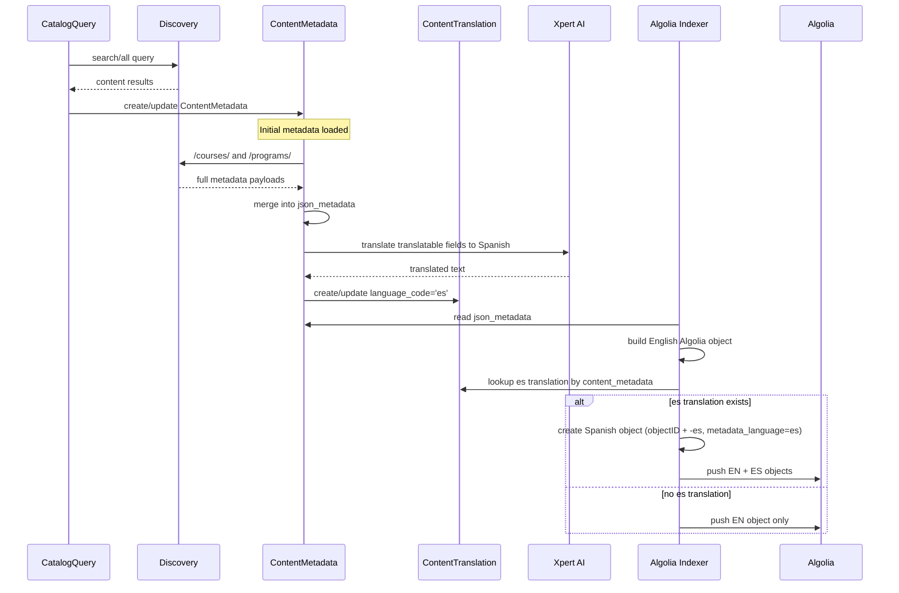

# ContentMetadata, Spanish Translation, and Algolia Indexing Flow

## Purpose

This document explains, end-to-end, how enterprise-catalog:

1. loads `ContentMetadata` from Discovery,
2. enriches it with full course/program payloads,
3. stores Spanish translations in `ContentTranslation`,
4. creates Algolia objects,
5. creates Spanish Algolia variants,
6. fails when Spanish conversion is missing or incomplete,
7. can be backfilled for all missing Spanish translations.

This is intended as an operator/developer runbook.

---

## Executive summary

- `ContentMetadata` is loaded from Discovery `search/all` results.
- For courses and programs, later jobs enrich the minimal `search/all` payload with full `/courses/` and `/programs/` payloads.
- `ContentTranslation` is **not** populated during content sync.
- Spanish translations are populated separately by the management command `populate_spanish_translations`.
- Algolia indexing always creates the English object from `ContentMetadata.json_metadata`.
- A Spanish Algolia object is created **only** when a matching `ContentTranslation(language_code='es')` row exists.
- If Spanish translation fails, the most common root cause is: **missing `ContentTranslation` row for `language_code='es'`**.

---

## Main data models

### `ContentMetadata`

Stores content payload from Discovery.

Key fields:

- `content_key`
- `content_uuid`
- `content_type`
- `parent_content_key`
- `_json_metadata` / `json_metadata`

Primary reference:

- `enterprise_catalog/apps/catalog/models.py`

### `ContentTranslation`

Stores precomputed translated text for a `ContentMetadata` row.

Key fields:

- `content_metadata`
- `language_code`
- `title`
- `short_description`
- `full_description`
- `subtitle`
- `source_hash`

Important: this table stores **translated text fields only**. It does **not** store structural fields such as:

- `course_keys`
- `program_type`
- `partners`
- `subjects`
- `prices`
- `availability`

Primary reference:

- `enterprise_catalog/apps/catalog/models.py`

---

## High-level architecture



---

## Step 1: How `ContentMetadata` gets loaded

### Entry point

`update_contentmetadata_from_discovery(catalog_query, dry_run=False)`

What it does:

1. Fetches content from Discovery via `CatalogQueryMetadata(catalog_query).metadata`
2. Uses Discovery `search/all` results
3. Creates or updates `ContentMetadata`
4. Associates returned content rows to the `CatalogQuery`

Relevant code path:

- `enterprise_catalog/apps/catalog/models.py`
  - `update_contentmetadata_from_discovery()`
  - `associate_content_metadata_with_query()`
  - `create_content_metadata()`

### Discovery API path used

Discovery client method:

- `DiscoveryApiClient.get_metadata_by_query()`

Behavior:

- calls Discovery `search/all`
- includes `exclude_expired_course_run=True`
- includes `include_learner_pathways=True`

This is the source of the initial content payload.

### What gets stored initially

`ContentMetadata` is seeded from the Discovery response using `_get_defaults_from_metadata()`.

Important behavior:

- **new records**: full entry goes into `_json_metadata`
- **existing non-course records** (programs, pathways, course runs): `_json_metadata` is overwritten from the latest `search/all` entry
- **existing course records**: only selected `search/all` fields are merged into existing full course metadata, to preserve richer `/courses/` data already stored later

### Create/update behavior

`create_content_metadata()`:

- filters unsupported content
- batches the update/create operation
- updates existing records through `_execute_updates_existing_records_avoid_deadlock()`
- creates new rows through `_create_new_content_metadata()`

### Association to catalogs

After content rows exist, `associate_content_metadata_with_query()` does:

- `catalog_query.contentmetadata_set.set(metadata_list, clear=True)`

So the `CatalogQuery` owns the association to the content set.

---

## Step 2: How full course/program metadata is loaded

The initial `search/all` payload is not the final shape used for indexing.

### Enrichment job

`update_full_content_metadata_task()`

This job:

- loads all course keys from `ContentMetadata`
- calls Discovery `/courses/`
- loads all program keys from `ContentMetadata`
- calls Discovery `/programs/`
- merges full payloads into `ContentMetadata.json_metadata`

Why this matters:

- `search/all` gives the initial content universe
- `/courses/` and `/programs/` provide richer data needed by APIs and Algolia

### Program relationships

When full course metadata is loaded, associated programs embedded in course payloads are also created/updated through:

- `create_course_associated_programs(programs, course_content_metadata)`

This means a program can exist in `ContentMetadata` because:

1. it came directly from `search/all`, or
2. it was created via associated course program data.

---

## Step 3: Who adds rows into `ContentTranslation`

### Short answer

`ContentTranslation` is populated by the management command:

- `populate_spanish_translations`

It is **not** populated by:

- `update_contentmetadata_from_discovery`
- `update_full_content_metadata_task`
- `reindex_algolia`
- `index_enterprise_catalog_in_algolia_task`

### Actual owner of translation writes

Management command:

- `enterprise_catalog/apps/catalog/management/commands/populate_spanish_translations.py`

This command:

1. iterates through `ContentMetadata`
2. checks whether the item should be translated
3. computes a `source_hash`
4. creates or updates `ContentTranslation(language_code='es')`
5. saves translated `title`, `short_description`, `full_description`, `subtitle`

### Translation engine used

`translate_to_spanish()` in:

- `enterprise_catalog/apps/catalog/translation_utils.py`

This calls:

- `chat_completion()` from the Xpert AI client

So Spanish translation depends on an external AI translation call.

### Change detection

The command computes a `source_hash` from these fields:

- `title`
- `short_description`
- `full_description`
- `subtitle`

If the hash has not changed and `--force` is not used, translation is skipped.

This prevents repeated re-translation of unchanged content.

---

## Step 4: How Algolia objects are created

### Main indexing task

Algolia indexing is driven by:

- `index_enterprise_catalog_in_algolia_task()`

which eventually calls:

- `_reindex_algolia()`
- `_index_content_keys_in_algolia()`
- `_get_algolia_products_for_batch()`
- `add_metadata_to_algolia_objects()`

### English object creation

For each `ContentMetadata`, `add_metadata_to_algolia_objects()` starts from:

- `metadata.json_metadata`

Then it adds:

- `objectID`
- `metadata_language='en'`
- enterprise catalog UUID shards
- enterprise customer UUID shards
- academy UUIDs/tags
- video IDs

Then `_algolia_object_from_product()` derives the final Algolia fields.

### Program object derivation

For programs, `_algolia_object_from_product()` builds fields such as:

- `course_keys`
- `programs`
- `program_titles`
- `program_type`
- `availability`
- `partners`
- `subjects`
- `skill_names`
- `level_type`
- `learning_items`
- `prices`
- `banner_image_url`
- `course_details`
- `learning_type`
- `learning_type_v2`
- `metadata_language`

Important:

- `course_keys` come from `ContentMetadata.json_metadata`, not from `ContentTranslation`
- this is why a program Algolia object can exist even when there is no translation row

### Why English objects always exist

English indexing uses the `ContentMetadata` row directly.

So if `ContentMetadata` exists and the item is indexable, the English Algolia object is created regardless of whether `ContentTranslation` exists.

---

## Step 5: How Spanish Algolia conversion happens

### Spanish object creation logic

Spanish variants are created by:

- `create_spanish_algolia_object(algolia_object, content_metadata)`

Behavior:

1. deep-copies the English Algolia object
2. looks up `content_metadata.translations.get(language_code='es')`
3. if found, overrides translated text fields
4. changes `objectID` to append `-es`
5. sets `metadata_language='es'`
6. returns the Spanish object

If no translation row exists, it returns `None`.

### Fields actually translated in Spanish object

Currently the Spanish Algolia conversion overrides only these fields if present:

- `title`
- `short_description`
- `full_description`
- `subtitle`

Not everything is translated during this step.

Examples of fields that remain sourced from the original English metadata pipeline:

- `course_keys`
- `program_type`
- `availability`
- `prices`
- `partners`
- `language`
- `learning_items`
- `subjects`
- `skill_names`

That is expected given the current implementation.

---

## Detailed sequence diagram



---

## Why Spanish conversion fails

## Primary root cause

### Missing `ContentTranslation(language_code='es')`

This is the most likely and most common root cause.

If no row exists, this code path occurs:

1. English object is created from `ContentMetadata`
2. `create_spanish_algolia_object()` looks up `translations.get(language_code='es')`
3. lookup fails
4. function returns `None`
5. no Spanish Algolia object is indexed

Result:

- object exists in Algolia only with `metadata_language='en'`
- no corresponding `-es` object exists

## Other failure modes

### 1. Translation command skipped the content

`populate_spanish_translations` skips content when:

- item is not eligible for Algolia indexing, unless `--all` is used
- course advertised run is archived
- source hash has not changed and `--force` is not used

### 2. Translation API failure

If Xpert AI translation fails:

- HTTP error
- unexpected exception
- empty response

then translated fields may be blank or row creation may not happen as expected.

### 3. Translation exists but Algolia was not reindexed yet

If `ContentTranslation` was created after the last Algolia rebuild:

- DB has Spanish translation
- Algolia still has only English object

This requires a reindex.

### 4. Content exists but is not indexable

The program/course may exist in `ContentMetadata` but fail the indexability checks.

For programs, indexability is based on conditions such as:

- marketing URL exists
- type exists
- not hidden
- status is active

### 5. Partial Spanish conversion

Even when Spanish object exists, only the supported translated fields are overridden.

So some fields may still appear effectively English because they are not part of `ContentTranslation`-based override logic.

---

## How to check whether Spanish is missing

## ORM check for one content key

```python
from enterprise_catalog.apps.catalog.models import ContentMetadata, ContentTranslation

content_key = 'a17b8a86-6bfe-4b83-b42b-7c46843b3250'

cm = ContentMetadata.objects.filter(content_key=content_key).first()
print('content exists:', bool(cm))

if cm:
	es = ContentTranslation.objects.filter(content_metadata=cm, language_code='es').first()
	print('has es translation:', bool(es))
	if es:
		print(es.title)
		print(es.short_description)
```

## SQL check for missing Spanish translations

```sql
SELECT cm.id, cm.content_key, cm.content_type
FROM catalog_contentmetadata cm
LEFT JOIN catalog_contenttranslation ct
  ON ct.content_metadata_id = cm.id
 AND ct.language_code = 'es'
WHERE ct.id IS NULL;
```

## SQL check for only indexable programs/courses missing Spanish

This cannot be expressed perfectly in one generic query because part of the indexability logic is implemented in Python, but the SQL above gives the base missing set.

---

## How to update `ContentTranslation` for all missing Spanish translations

## Recommended approach

Use the existing management command.

### Translate all eligible missing/changed content

```bash
./manage.py populate_spanish_translations --batch-size 50
```

This is the standard production path.

### Translate everything, even content that would normally be skipped

```bash
./manage.py populate_spanish_translations --all --batch-size 50
```

Use this when you want to backfill everything, not only currently indexable content.

### Force re-translation for all content

```bash
./manage.py populate_spanish_translations --all --force --batch-size 50
```

Use this when:

- source content changed,
- translation prompt changed,
- or you suspect stale/bad Spanish content.

### Translate only specific missing keys

```bash
./manage.py populate_spanish_translations --content-keys <key1> <key2> <key3> --force
```

Example:

```bash
./manage.py populate_spanish_translations --content-keys a17b8a86-6bfe-4b83-b42b-7c46843b3250 --force
```

## After translations are created

You must rebuild Algolia to materialize Spanish objects:

```bash
./manage.py reindex_algolia --force --no-async
```

Without this step, the translation rows will exist in the database but not in Algolia.

---

## Full operational backfill plan

### Safe sequence

1. Refresh content metadata from Discovery
2. Refresh full course/program metadata
3. Populate missing Spanish translations
4. Reindex Algolia
5. Verify `-es` objects exist

### Commands

```bash
./manage.py update_content_metadata --force
./manage.py update_full_content_metadata --force
./manage.py populate_spanish_translations --batch-size 50
./manage.py reindex_algolia --force --no-async
```

### Full backfill including skipped content

```bash
./manage.py update_content_metadata --force
./manage.py update_full_content_metadata --force
./manage.py populate_spanish_translations --all --force --batch-size 50
./manage.py reindex_algolia --force --no-async
```

---

## Production scheduling

There is a scheduled cron job for Spanish translation population.

Production/stage config includes:

- daily `populate_spanish_translations --batch-size 50`
- daily `reindex_algolia --force --no-async`

Important operational nuance:

- translation population and Algolia reindex are separate jobs
- if content is created after translation job but before reindex, or after reindex but before translation, English-only windows can happen until the next cycle completes

---

## Why a program can appear in Algolia even if course keys are not in `ContentTranslation`

This is expected.

Example:

- program contains `course_keys = ["DavidsonX+DavidsonX_D008", "DavidsonX+DavidsonX.D006"]`

These values are derived from program metadata in `ContentMetadata.json_metadata`.

They are not supposed to be stored in `ContentTranslation`.

`ContentTranslation` only stores text translations for supported fields like `title` and descriptions.

So:

- English program object can still be built
- `course_keys` can still appear in Algolia
- Spanish object still fails if the `es` translation row is missing

---

## Troubleshooting checklist

### If a Spanish Algolia object is missing

Check in this order:

1. `ContentMetadata` row exists
2. `ContentTranslation(language_code='es')` row exists
3. translation fields are populated
4. content is indexable
5. Algolia reindex has run after translation creation
6. Algolia object with `-es` suffix exists

### If translation row is missing

Run:

```bash
./manage.py populate_spanish_translations --content-keys <content_key> --force
./manage.py reindex_algolia --force --no-async
```

### If translation row exists but Algolia is still English-only

Likely causes:

- reindex has not run since translation creation
- content was not included in indexable set
- stale object still being inspected

### If translation row exists but some fields remain English

Likely cause:

- those fields are not part of the current Spanish override implementation

---

## Root cause statement template

Use this wording for incident notes:

> The Spanish Algolia object was not created because enterprise-catalog had no `ContentTranslation` row for the affected `ContentMetadata` with `language_code='es'`. English indexing succeeded because it relies directly on `ContentMetadata.json_metadata`, but Spanish indexing is conditional on a precomputed translation row and therefore was skipped.

---

## Recommended remediation

For one-off fixes:

```bash
./manage.py populate_spanish_translations --content-keys <content_key> --force
./manage.py reindex_algolia --force --no-async
```

For broad platform cleanup:

```bash
./manage.py update_content_metadata --force
./manage.py update_full_content_metadata --force
./manage.py populate_spanish_translations --all --force --batch-size 50
./manage.py reindex_algolia --force --no-async
```

For ongoing prevention:

- monitor missing `ContentTranslation(es)` coverage
- alert on translation API failures
- ensure translation cron completes before or before next reindex window
- periodically audit Algolia for English-only high-traffic content

---

## Key takeaways

- `ContentMetadata` is the source of truth for English indexing.
- `ContentTranslation` is the source of truth for Spanish text overrides.
- Spanish Algolia objects are optional and conditional.
- Missing `ContentTranslation(es)` is the main reason Spanish indexing fails.
- `course_keys` and similar structural fields do not belong in `ContentTranslation`.
- Backfilling missing Spanish translations requires both translation population and Algolia reindex.

