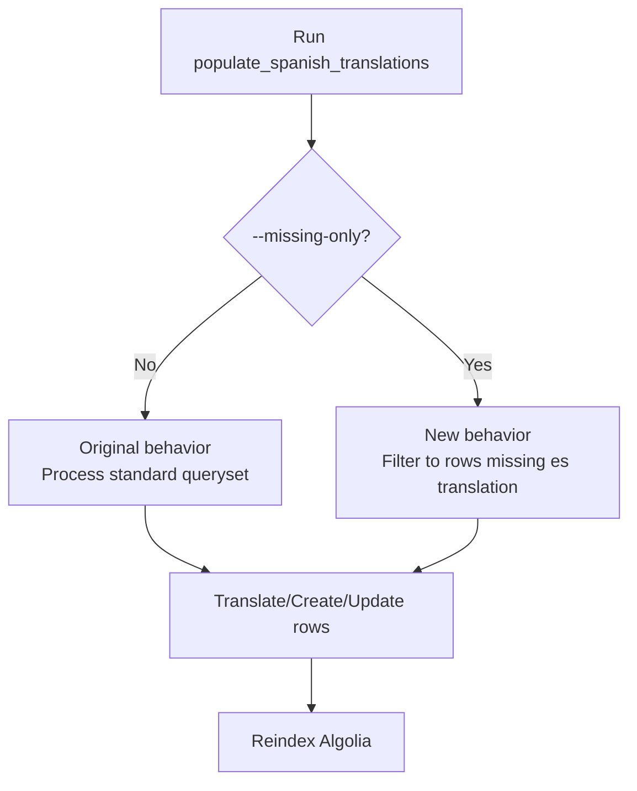
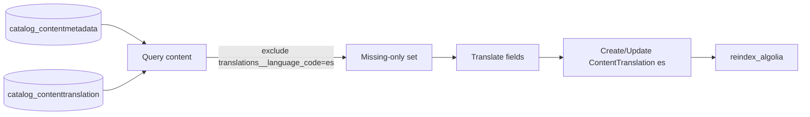

# Algolia Translation Investigation Guide

## Observation from current Algolia response (Marketing Digital)

- The sample record below is the **English variant**, not Spanish:
  - `objectID = program-53005fd8-f03a-4484-bc49-7e8054a9fee8-customer-uuids-9`
  - `metadata_language = en`
  - `title = Digital Marketing`
- This confirms translation is not being validated yet; you must explicitly find the `-es` record.
- Expected Spanish object pattern for the same shard:
  - `program-53005fd8-f03a-4484-bc49-7e8054a9fee8-es-customer-uuids-9`

## Important: Snowflake vs service DB

- `ContentMetadata` and `ContentTranslation` are application tables in the enterprise-catalog service DB (PostgreSQL), not Snowflake source-of-truth tables.
- If you do not see `catalog_contentmetadata` or `catalog_contenttranslation` in Snowflake, that is expected in many environments.
- Verification should be done via:
  1. Django ORM (`manage.py shell`) in enterprise-catalog, or
  2. Postgres SQL against enterprise-catalog database.

---

## Exact DB queries to verify `ContentTranslation`

## 1) SQL query: verify translation rows for one program UUID/content key and child courses

Use this in psql (replace values as needed):

```sql
-- 1) Find the program ContentMetadata row
SELECT id, content_key, content_type, content_uuid, json_metadata
FROM catalog_contentmetadata
WHERE content_type = 'program'
  AND (content_key = '53005fd8-f03a-4484-bc49-7e8054a9fee8' OR content_uuid::text = '53005fd8-f03a-4484-bc49-7e8054a9fee8');

-- 2) Verify Spanish translation row for that program
SELECT ct.id, ct.content_metadata_id, cm.content_key, ct.language_code,
       ct.title, ct.short_description, ct.full_description, ct.subtitle,
       ct.source_hash, ct.created, ct.modified
FROM catalog_contenttranslation ct
JOIN catalog_contentmetadata cm ON cm.id = ct.content_metadata_id
WHERE ct.language_code = 'es'
  AND (cm.content_key = '53005fd8-f03a-4484-bc49-7e8054a9fee8' OR cm.content_uuid::text = '53005fd8-f03a-4484-bc49-7e8054a9fee8');

-- 3) Verify child course translations used by nested program.course_details
-- (if you know course keys from program json)
SELECT cm.content_key, ct.language_code, ct.title, ct.short_description, ct.source_hash
FROM catalog_contenttranslation ct
JOIN catalog_contentmetadata cm ON cm.id = ct.content_metadata_id
WHERE ct.language_code = 'es'
  AND cm.content_key IN (
    'USMx+DM01',
    'USMx+DM02',
    'USMx+DM03',
    'USMx+DM04'
  )
ORDER BY cm.content_key;
```

## 2) Django shell queries (exact)

```python
from enterprise_catalog.apps.catalog.models import ContentMetadata, ContentTranslation

program_key = '53005fd8-f03a-4484-bc49-7e8054a9fee8'

program = ContentMetadata.objects.filter(content_key=program_key).first()
print('program exists:', bool(program))
if program:
    es = ContentTranslation.objects.filter(content_metadata=program, language_code='es').first()
    print('program es translation exists:', bool(es))
    if es:
        print('title:', es.title)
        print('short_description:', (es.short_description or '')[:160])
        print('full_description:', (es.full_description or '')[:160])
        print('subtitle:', es.subtitle)
        print('source_hash:', es.source_hash)

    course_keys = [c.get('key') for c in (program.json_metadata.get('courses') or []) if c.get('key')]
    print('course_keys in program:', course_keys)

    rows = ContentTranslation.objects.filter(
        content_metadata__content_key__in=course_keys,
        language_code='es',
    ).values('content_metadata__content_key', 'title', 'short_description')
    print('child course es translations count:', len(rows))
    for row in rows:
        print(row)
```

---

## Code change implemented (nested program field translation)

Implemented in:
- [enterprise_catalog/apps/catalog/algolia_utils.py](enterprise_catalog/apps/catalog/algolia_utils.py)

Behavior now:
1. For Spanish program objects, set `program_titles` to translated program `title`.
2. For program `course_details`, look up pre-computed `ContentTranslation(language_code='es')` by child course `content_key`.
3. Replace nested `course_details[].title` and `course_details[].short_description` where translation rows exist.
4. Keep English fallback for child courses with no translation row.

Test added in:
- [enterprise_catalog/apps/catalog/tests/test_algolia_translation.py](enterprise_catalog/apps/catalog/tests/test_algolia_translation.py)

---

## How to check in Algolia if translation happened

## A) In Algolia Dashboard

1. Open the active enterprise-catalog index.
2. Search by object id prefix or UUID:
   - `program-53005fd8-f03a-4484-bc49-7e8054a9fee8`
3. Confirm there are 2 object variants:
   - English object (no `-es` suffix)
   - Spanish object (`objectID` contains `-es`)
4. For your exact shard, search this specific object id:
  - `program-53005fd8-f03a-4484-bc49-7e8054a9fee8-es-customer-uuids-9`
5. If it does not exist, Spanish indexing for this customer-uuid shard has not been produced.
6. Open Spanish object and verify:
   - `metadata_language` is `es`
   - `title` is Spanish
   - `program_titles[0]` is Spanish
   - `course_details[*].title` and `course_details[*].short_description` are Spanish where DB translation rows exist

## B) Query-level check using current API pattern

Your API request should include/return filters with:
- `filters=... AND metadata_language:es`

Then in hits verify:
- `objectID` contains `-es`
- `metadata_language = es`
- translated fields are present

---

## If mismatch still happens

1. If DB rows are missing in `catalog_contenttranslation`:
   - Run translation command for target content:
   - `./manage.py populate_spanish_translations --content-keys <content_key> --force`
2. Reindex Algolia:
   - `./manage.py reindex_algolia --force --no-async`
3. Recheck object in Algolia dashboard/API.
4. If DB and Algolia are correct but UI still shows English, inspect frontend query/filter and hit-selection logic.

---

## Your scenario runbook (Program/Course exists in ContentMetadata, missing in ContentTranslation)

Use this section when:

- English Algolia object exists
- `catalog_contentmetadata` has the record
- `catalog_contenttranslation` has no `language_code='es'` row

### What it means

This is usually **not a raw data integrity bug** in `catalog_contentmetadata`. It means translation materialization did not occur (or was skipped) for that content.

English indexing reads from `ContentMetadata`; Spanish indexing is conditional on `ContentTranslation(es)`.

### Is this a data issue?

Short answer: **sometimes, but often operational/processing rather than source-data corruption**.

Interpretation by state:

1. `ContentMetadata` present, `ContentTranslation(es)` missing
  - Most common cause: translation pipeline skipped/failed/not yet run for this key.
  - Usually an operational gap, not a broken metadata row.

2. `ContentMetadata` present, `ContentTranslation(es)` present but empty fields
  - Translation API returned empty/failed, or source text fields were empty.
  - Data quality issue can exist if source fields are blank.

3. Both present and populated, but no `-es` Algolia object
  - Reindex not run after translation, wrong environment/index, or stale Algolia object view.

### Why translation may be missing even when metadata exists

Possible causes (in order of frequency):

1. `populate_spanish_translations` did not run after content was added.
2. Command ran but skipped item due to indexability checks (unless `--all` used).
3. Command ran before full metadata refresh; translatable fields missing at translation time.
4. Translation provider call failed for that item.
5. Existing row considered up-to-date via `source_hash` and not forced.
6. You are checking DB from one environment and Algolia index from another.

### Expert verification steps (exact order)

1. Confirm environment alignment
  - Same deployment for DB + `ALGOLIA_APPLICATION_ID` + `ALGOLIA_INDEX_NAME`.

2. Confirm content exists in metadata

```sql
SELECT id, content_key, content_type, content_uuid
FROM catalog_contentmetadata
WHERE content_key = '<content_key>';
```

3. Confirm Spanish translation row is missing/present

```sql
SELECT ct.id, cm.content_key, ct.language_code, ct.title, ct.short_description, ct.full_description, ct.subtitle
FROM catalog_contenttranslation ct
JOIN catalog_contentmetadata cm ON cm.id = ct.content_metadata_id
WHERE cm.content_key = '<content_key>'
  AND ct.language_code = 'es';
```

4. Populate translation for affected content key(s)

```bash
./manage.py populate_spanish_translations --content-keys <content_key_1> <content_key_2> --force
```

5. Reindex Algolia after translation

```bash
./manage.py reindex_algolia --force --no-async
```

6. Validate in Algolia
  - English object: no `-es` suffix, `metadata_language=en`
  - Spanish object: `-es` suffix present, `metadata_language=es`

### For your concrete example

If the program row exists in `catalog_contentmetadata` and the child courses also exist there, but any of these are missing from `catalog_contenttranslation` for `es`, then:

- English object is expected to exist.
- Spanish object (or translated nested course details) will be partial/missing until translations are materialized.

### Bulk fix for all missing Spanish translations

Run a full backfill:

```bash
./manage.py update_content_metadata --force
./manage.py update_full_content_metadata --force
./manage.py populate_spanish_translations --all --force --batch-size 50
./manage.py reindex_algolia --force --no-async
```

### Operational recommendation

To avoid repeats:

1. Ensure translation cron completes successfully before/near reindex window.
2. Monitor count of missing `es` translations:

```sql
SELECT COUNT(*) AS missing_es
FROM catalog_contentmetadata cm
LEFT JOIN catalog_contenttranslation ct
  ON ct.content_metadata_id = cm.id
 AND ct.language_code = 'es'
WHERE ct.id IS NULL;
```

3. Alert on translation API failures in service logs.

---

## Incident template (copy/paste)

Use this template for Jira, incident notes, or handoff.

```markdown
Title: Spanish Algolia object missing for <content_key>

Summary
- English Algolia object exists for `<content_key>`.
- Spanish object (`-es` suffix / `metadata_language=es`) is missing.

Impact
- Learners searching in Spanish receive English content for this item.
- Program/course field localization is incomplete in Algolia results.

Scope
- Content key(s): <content_key_1>, <content_key_2>
- Content type(s): <course|program>
- Environment: <prod|stage>
- Algolia index: <index_name>

Root cause
- `catalog_contentmetadata` row exists, but `catalog_contenttranslation` row with `language_code='es'` is missing (or stale/empty).
- Spanish Algolia object creation is conditional on that translation row.

Evidence
- DB check: `catalog_contentmetadata` contains key `<content_key>`.
- DB check: no row in `catalog_contenttranslation` for `<content_key>` + `language_code='es'`.
- Algolia check: English object exists; no matching `-es` object.

Fix applied
1. Ran translation materialization:
  - `./manage.py populate_spanish_translations --content-keys <content_key(s)> --force`
2. Reindexed Algolia:
  - `./manage.py reindex_algolia --force --no-async`

Validation
- `catalog_contenttranslation` now contains `language_code='es'` row(s).
- Algolia now contains `-es` object(s) with `metadata_language='es'`.
- Translated fields (`title`, `short_description`, `full_description`, `subtitle`) populated as expected.

Prevention
- Ensure `populate_spanish_translations` succeeds before/near reindex window.
- Monitor count of missing `es` rows in `catalog_contenttranslation`.
- Alert on translation API failures and cronjob failures.

Owner
- <team/person>

ETA/Status
- <in-progress|resolved>
```

---

## Fix implemented in code (backfill missing Spanish only)

This repo now includes a targeted fix in:

- [enterprise_catalog/apps/catalog/management/commands/populate_spanish_translations.py](enterprise_catalog/apps/catalog/management/commands/populate_spanish_translations.py)

### What was the issue

- We needed a safe production mode to backfill only content missing `language_code='es'`.
- Existing command behavior was broad (translate/update many items), which is fine for full refresh but less ideal for focused backfill.

### What was changed

- Added a new flag: `--missing-only`
- In this mode, command scopes queryset to content with **no** Spanish translation row:
  - excludes rows where `translations__language_code='es'`
- Added explicit logs for this mode:
  - announces missing-only filter is active
  - logs how many items are missing before processing

### What was intentionally not changed

- Default behavior remains unchanged when `--missing-only` is not passed.
- Existing flags (`--all`, `--force`, `--content-keys`, `--batch-size`, `--dry-run`) continue to work the same.

---

## Visualization (before vs after)



### Missing-only internal flow



---

## How to use the fix in production

Backfill only missing Spanish translations:

```bash
./manage.py populate_spanish_translations --missing-only --all --batch-size 50
```

Then regenerate Algolia objects:

```bash
./manage.py reindex_algolia --force --no-async
```

Optional (targeted keys only):

```bash
./manage.py populate_spanish_translations --missing-only --content-keys <key1> <key2> --force
./manage.py reindex_algolia --force --no-async
```

---

## Impact assessment

### Functional impact

- Positive: enables safe, focused backfill for missing Spanish rows.
- Positive: reduces unnecessary translation churn on already translated content.

### Risk impact

- Low risk: change is opt-in via `--missing-only`.
- Low risk: default command path is unchanged.

### Performance impact

- In missing-only mode, fewer rows are processed in most cases.
- Reindex workload remains unchanged and still depends on total indexable content.

### Operational impact

- Better observability for missing-translation backfill runs through mode-specific logs.
- Fits existing runbook steps without changing downstream indexing logic.
