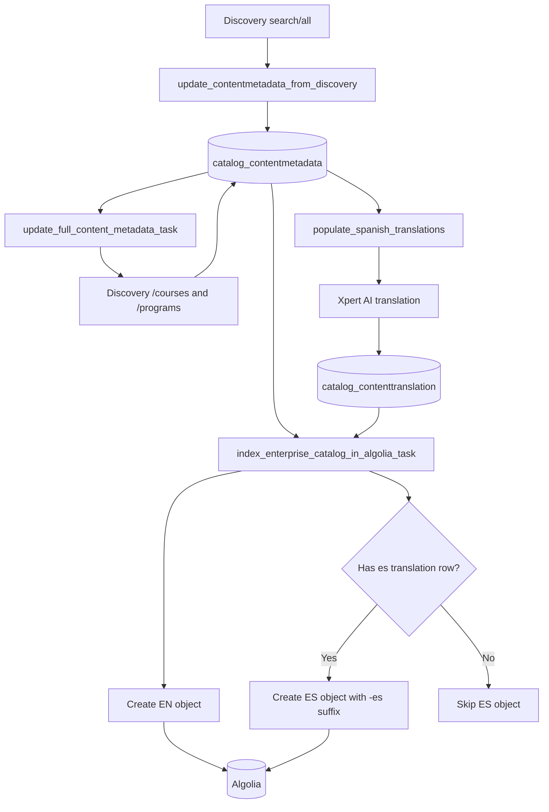
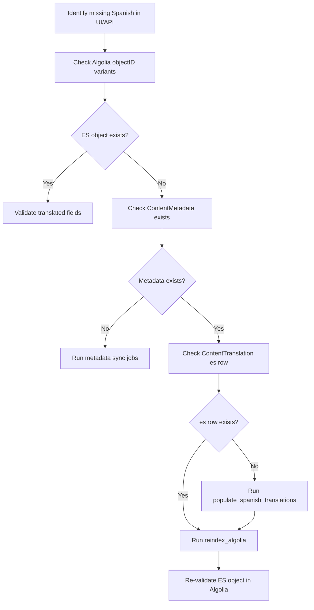

# Algolia Spanish Translation Investigation & Remediation Runbook

## Purpose

This runbook consolidates current investigation findings, root cause analysis, and production-safe fixes for missing Spanish (`es`) Algolia records in enterprise-catalog.

It answers:
- why an item appears in Algolia only with `metadata_language='en'`,
- how to verify database and Algolia state correctly,
- how to backfill missing Spanish translations safely,
- what was fixed in ENT-11802.

---

## Current validated observations

- English Algolia objects are built from `ContentMetadata.json_metadata`.
- Spanish Algolia objects are created only when `ContentTranslation(language_code='es')` exists.
- Missing `ContentTranslation(es)` is the most frequent reason the `-es` Algolia object is absent.
- Structural fields (`course_keys`, `program_type`, `availability`, etc.) come from metadata, not translation rows.
- The command `populate_spanish_translations` now supports `--missing-only` for safe targeted backfill (ENT-11802).

---

## Architecture at a glance



---

## Source of truth by field

### `ContentMetadata` (English + structure)

Primary source for:
- `title` (default English)
- `course_keys`
- `program_type`
- `availability`
- `partners`
- `subjects`
- many other structural/indexing fields

### `ContentTranslation` (Spanish text overrides)

Primary source for Spanish overrides:
- `title`
- `short_description`
- `full_description`
- `subtitle`

Not used for:
- `course_keys`
- `program_type`
- `prices`
- `availability`
- other non-text structural fields

---

## Why EN exists while ES is missing

## Primary root cause

No `ContentTranslation` row for the target `ContentMetadata` with `language_code='es'`.

At indexing time:
1. EN object is always built from metadata.
2. Spanish builder attempts `translations.get(language_code='es')`.
3. If no row exists, Spanish object returns `None`.
4. Only EN object is indexed.

## Other causes

1. Translation command skipped content (`indexability`, archived run, unchanged hash without `--force`).
2. Translation API failure (provider error, timeout, empty output).
3. Translation exists but reindex has not run yet.
4. Environment mismatch (DB checked in one env, Algolia index from another env).

---

## Best-practice diagnostic flow



---

## Verification queries

### SQL: metadata + Spanish translation state

```sql
-- Metadata row for a specific content key/uuid
SELECT id, content_key, content_type, content_uuid
FROM catalog_contentmetadata
WHERE content_key = '<content_key>'
   OR content_uuid::text = '<content_uuid>';

-- Spanish translation row
SELECT ct.id, ct.content_metadata_id, cm.content_key, ct.language_code,
       ct.title, ct.short_description, ct.full_description, ct.subtitle,
       ct.source_hash, ct.created, ct.modified
FROM catalog_contenttranslation ct
JOIN catalog_contentmetadata cm ON cm.id = ct.content_metadata_id
WHERE ct.language_code = 'es'
  AND (cm.content_key = '<content_key>' OR cm.content_uuid::text = '<content_uuid>');

-- Missing Spanish translations (base set)
SELECT cm.id, cm.content_key, cm.content_type
FROM catalog_contentmetadata cm
LEFT JOIN catalog_contenttranslation ct
  ON ct.content_metadata_id = cm.id
 AND ct.language_code = 'es'
WHERE ct.id IS NULL;
```

### ORM: quick single-key verification

```python
from enterprise_catalog.apps.catalog.models import ContentMetadata, ContentTranslation

content_key = '<content_key>'
cm = ContentMetadata.objects.filter(content_key=content_key).first()
print('metadata exists:', bool(cm))

if cm:
    es = ContentTranslation.objects.filter(content_metadata=cm, language_code='es').first()
    print('has es translation:', bool(es))
    if es:
        print('title:', es.title)
        print('short_description:', (es.short_description or '')[:160])
```

---

## ENT-11802 fix implemented

### File changed

- `enterprise_catalog/apps/catalog/management/commands/populate_spanish_translations.py`

### What changed

- Added `--missing-only` flag.
- When enabled, command processes only content without an existing `language_code='es'` translation row.
- Added mode-specific logs to show missing-only behavior and counts.

### What did not change

- Default behavior remains unchanged when `--missing-only` is not used.
- Existing flags (`--all`, `--force`, `--content-keys`, `--batch-size`, `--dry-run`) continue to work.

### Test coverage

- `enterprise_catalog/apps/catalog/tests/test_populate_spanish_translations.py`

---

## Missing-only behavior visualization

```mermaid
flowchart LR
    A[Start populate_spanish_translations] --> B{--missing-only?}
    B -- No --> C[Standard queryset]
    B -- Yes --> D[Exclude translations with language_code='es']
    C --> E[Translate and upsert rows]
    D --> E
    E --> F[Update ContentTranslation(es)]
```

---

## Production runbooks

## One-off fix for specific key(s)

```bash
./manage.py populate_spanish_translations --content-keys <key1> <key2> --force
./manage.py reindex_algolia --force --no-async
```

## Safe targeted backfill (recommended)

```bash
./manage.py populate_spanish_translations --missing-only --all --batch-size 50
./manage.py reindex_algolia --force --no-async
```

## Full refresh backfill (broadest)

```bash
./manage.py update_content_metadata --force
./manage.py update_full_content_metadata --force
./manage.py populate_spanish_translations --all --force --batch-size 50
./manage.py reindex_algolia --force --no-async
```

---

## Algolia validation checklist

For content key/uuid `<X>`:

1. Find EN object (without `-es` suffix).
2. Find ES object (`objectID` with `-es` suffix).
3. Confirm `metadata_language='es'` on ES object.
4. Confirm translated fields (`title`, `short_description`, `full_description`, `subtitle`).
5. If ES object missing, verify DB translation row and rerun reindex.

Example ES object pattern:
- `program-<uuid>-es-customer-uuids-<shard>`

---

## Environment alignment checklist

Before diagnosing, verify all three point to the same environment:

- enterprise-catalog database
- `ALGOLIA_APPLICATION_ID`
- `ALGOLIA_INDEX_NAME`

Many false negatives come from cross-environment checks.

---

## Incident-ready root cause statement

> Spanish Algolia object generation is conditional on a precomputed `ContentTranslation(language_code='es')` row for the target `ContentMetadata`. In this incident, metadata existed and English indexing succeeded, but no qualifying Spanish translation row was present at indexing time, so the `-es` object was skipped.

---

## Preventive controls

- Monitor count of rows missing `ContentTranslation(es)`.
- Alert on translation command failures and translation provider failures.
- Schedule translation job to complete before the next Algolia reindex window.
- Periodically audit high-traffic content for EN-only Algolia state.

Recommended monitor query:

```sql
SELECT COUNT(*) AS missing_es
FROM catalog_contentmetadata cm
LEFT JOIN catalog_contenttranslation ct
  ON ct.content_metadata_id = cm.id
 AND ct.language_code = 'es'
WHERE ct.id IS NULL;
```

---

## Key takeaways

- English indexing depends on `ContentMetadata`.
- Spanish indexing depends on `ContentTranslation(es)`.
- EN object presence does not imply ES object presence.
- `--missing-only` provides a safer production backfill path for missing Spanish rows.
- Translation backfill is incomplete until `reindex_algolia` runs.
