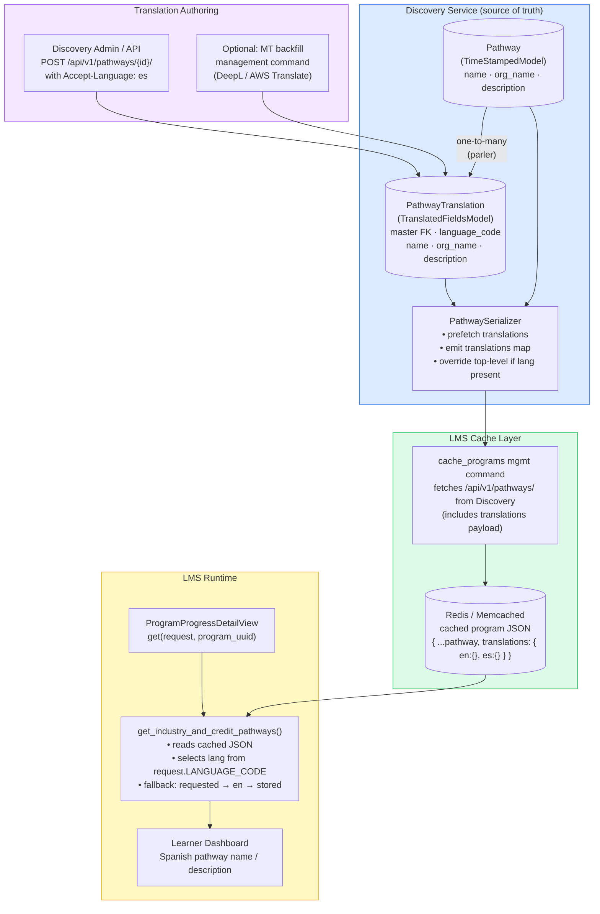

# Credit Pathway Translation Status — Spanish

## Summary
Spanish translations are **not available** for credit pathways in the Dashboard API response. The `credit_pathways` array contains pathway data from the `course_metadata_pathway` table, which does not support multi-language content.

## Problem Statement
When viewing the Dashboard API endpoint (`/api/dashboard/v0/programs/{uuid}/progress_details/`) with `Accept-Language: es`, the following pathway fields remain in English:

- `name`: "Master of Science in Professional Studies, Rochester Institute of Technology"
- `org_name`: "Rochester Institute of Technology"  
- `description`: "27%"

**Expected behavior**: These fields should be translated to Spanish when the user's language preference is Spanish.

**Actual behavior**: All pathway fields are returned in English only, regardless of the `Accept-Language` header.

---

## Root Cause Analysis

### 1. Database Schema — No Translation Support
The `Pathway` model in the Discovery service (`course_discovery/apps/course_metadata/models.py`) stores text fields as plain strings:

```python
class Pathway(TimeStampedModel):
    uuid = models.UUIDField(...)
    name = models.CharField(max_length=255)
    org_name = models.CharField(max_length=255)
    description = models.TextField(blank=True)
    # ... other fields
```

**Key Issue**: Unlike `Course`, `Program`, or `Academy` models, the `Pathway` model:
- ❌ Does **not** inherit from `TranslatableModel` (django-parler)
- ❌ Does **not** have a companion `PathwayTranslation` table
- ❌ Is **excluded** from the existing translation infrastructure

### 2. API Serialization — No Translation Logic
The `PathwaySerializer` in Discovery (`course_discovery/apps/api/serializers.py`) returns fields as-is:

```python
class PathwaySerializer(serializers.ModelSerializer):
    class Meta:
        model = Pathway
        fields = ('id', 'uuid', 'name', 'org_name', 'email', 
                  'description', 'destination_url', ...)
```

**Key Issue**: The serializer:
- ❌ Does **not** check the `Accept-Language` header
- ❌ Does **not** include a `translations` field or map
- ❌ Returns the same English text for all requests

### 3. LMS Cache — English-Only Payload
The LMS caches pathway data from Discovery using the `cache_programs` management command. The cached JSON stored in Redis/Memcached contains only English strings:

```json
"credit_pathways": [
  {
    "id": 196,
    "name": "Master of Science in Professional Studies, Rochester Institute of Technology",
    "org_name": "Rochester Institute of Technology",
    "description": "27%",
    ...
  }
]
```

**Key Issue**: The cache:
- ❌ Does **not** store multi-language versions
- ❌ Is used directly by the Dashboard API without translation selection

### 4. Dashboard API — No Runtime Translation
The `ProgramProgressDetailView` in the LMS (`edx-platform/openedx/core/djangoapps/programs/rest_api/v1/views.py`) serves the pathway data from cache:

```python
def get(self, request, program_uuid):
    # ... fetch program_data from cache
    return Response({
        'program_data': program_data,
        'credit_pathways': get_industry_and_credit_pathways(program_data, site),
        ...
    })
```

**Key Issue**: The view:
- ❌ Does **not** inspect `request.LANGUAGE_CODE` or `Accept-Language`
- ❌ Does **not** perform runtime selection of translated pathway fields
- ❌ Returns cached English strings directly

---

## Comparison with Organizations

**Organizations** in the same API response **do have** Spanish translations:

```json
"authoring_organizations": [
  {
    "name": "Rochester Institute of Technology",
    "description": "<p>Rochester Institute of Technology is home to...</p>",
    "description_es": "<p>Rochester Institute of Technology (Instituto Tecnológico de Rochester)...</p>"
  }
]
```

**Why organizations work but pathways don't:**

| Feature | Organizations | Pathways |
|---------|--------------|----------|
| Translation table | ✅ `OrganizationTranslation` | ❌ None |
| Parler integration | ✅ Yes | ❌ No |
| API includes `*_es` fields | ✅ Yes | ❌ No |
| Discovery serializer handles translations | ✅ Yes | ❌ No |

---

## Impact

### User Experience
- Spanish-speaking learners see English pathway names/descriptions in their learner dashboard
- Inconsistent experience: Programs, courses, and organizations are translated, but pathways are not
- Reduced trust and engagement for non-English learners

### Business Impact
- Lower conversion rates for credit pathway programs in Spanish-speaking markets
- Difficulty scaling edX offerings to international learners

---

## Recommended Solution

## Architecture Diagram

The diagram below shows the recommended end-to-end translation flow, identical in structure to how `Subject` and `Topic` translations work for courses today.



**Key takeaway**: Discovery owns and stores translations (same as `Subject`/`Topic`). The cache stores the full `translations` map. LMS selects the right language at runtime from the cache — no additional Discovery calls needed per request.

---

---

## Can We Use the Same Pattern as Course Translation? Yes.

The short answer is: **yes, pathway translation can and should be implemented the same way course-related taxonomy (Subject, Topic, LevelType, ProgramType) is translated today**.

### How course translation works today (the reference pattern)

Every taxonomy-like metadata entity in Discovery follows the same two-class pattern using **django-parler**:

```python
# Step 1: The base model inherits TranslatableModel
class Subject(TranslatableModel, TimeStampedModel):
    uuid = models.UUIDField(...)
    banner_image_url = models.URLField(...)
    partner = models.ForeignKey(Partner, models.CASCADE)
    # No translatable text fields here — they live in the translation table

# Step 2: A companion translation table holds language-specific text
class SubjectTranslation(TranslatedFieldsModel):
    master = models.ForeignKey(Subject, models.CASCADE, related_name='translations', null=True)
    language_code = models.CharField(...)     # managed by parler
    name = models.CharField(max_length=255)
    subtitle = models.CharField(max_length=255, blank=True, null=True)
    description = models.TextField(blank=True, null=True)

    class Meta:
        unique_together = ('language_code', 'master')
```

The serializer then prefetches translations and parler resolves the active language automatically via Django's `LocaleMiddleware` (set from the `Accept-Language` header):

```python
class SubjectSerializer(BaseModelSerializer):
    @classmethod
    def prefetch_queryset(cls):
        return Subject.objects.prefetch_related('translations')  # one DB call, all langs

    class Meta:
        model = Subject
        fields = ('name', 'subtitle', 'description', ...)
        # parler transparently serves the active language's name/description
```

Settings wire it all together:

```python
# course_discovery/settings/base.py
PARLER_DEFAULT_LANGUAGE_CODE = LANGUAGE_CODE   # 'en'
PARLER_LANGUAGES = {
    None: (
        {'code': 'en'},
        {'code': 'es'},
    ),
    'default': {'fallbacks': [PARLER_DEFAULT_LANGUAGE_CODE]}
}
```

This is exactly the pattern used for `Subject`, `Topic`, `LevelType`, and `ProgramType` — all entities that feed into course and program metadata.

### How pathway translation should mirror this pattern

| Step | Course taxonomy (today) | Pathway (proposed) |
|------|------------------------|-------------------|
| Base model | `Subject(TranslatableModel, TimeStampedModel)` | `Pathway(TranslatableModel, TimeStampedModel)` |
| Translation table | `SubjectTranslation(TranslatedFieldsModel)` | `PathwayTranslation(TranslatedFieldsModel)` |
| FK from translation | `master = FK(Subject, related_name='translations')` | `master = FK(Pathway, related_name='translations')` |
| Translated fields | `name`, `subtitle`, `description` | `name`, `org_name`, `description` |
| Serializer prefetch | `Subject.objects.prefetch_related('translations')` | `Pathway.objects.prefetch_related('translations')` |
| Language selection | Django `LocaleMiddleware` + parler auto-resolution | Same: Django `LocaleMiddleware` + parler |
| Fallback | `PARLER_DEFAULT_LANGUAGE_CODE` → English | Same |
| Migration backfill | `0061_migrate_subjects_data.py` copies existing EN strings | New migration copies existing `name`, `org_name`, `description` to language_code=`en` |
| PARLER_LANGUAGES setting | Already configured in Discovery | Same config, already present |

The only new step for pathway (not needed for taxonomy) is:

- the LMS cache (`cache_programs`) must include the `translations` map in the cached pathway JSON
- the LMS dashboard view must select the right language from that cache at request time

This is necessary because LMS does not query Discovery at request time — it reads from Redis/Memcached. The same cache-aware design is needed regardless of which translation backend is used.

### Why not use academy-style `django-modeltranslation`?

Academy in `enterprise-catalog` uses `modeltranslation`, which adds `_es`, `_fr` etc. suffix columns to the base table:

```python
# enterprise-catalog academy pattern
class AcademyTranslationOptions(TranslationOptions):
    fields = ('title', 'short_description', 'long_description')
# → adds title_es, short_description_es, long_description_es to the Academy table
```

This is simpler to set up but:
- adds one column per field per language (harder to extend to 3+ languages)
- is tied to the `enterprise-catalog` service which is not where `Pathway` lives
- is not aligned with Discovery's existing `Subject`/`Topic` patterns

Since `Pathway` is authored, stored, and served from Discovery, the parler pattern already in use there is the correct choice.

---

## Translation Architecture Recommendation

### Executive recommendation
For `Pathway`, adopt the **Discovery-owned translation table** approach and avoid introducing long-term hardcoded translations in LMS.

This is the closest fit to how multilingual metadata is already handled for taxonomy-like entities in Discovery, and it keeps authoring, translation, and publication inside the service that owns the content.

### Why this is the preferred architecture
`Pathway` is authored and stored in Discovery, so the translation source of truth should also live in Discovery. LMS should not become the permanent owner of pathway translation content; it should consume translated payloads and choose the correct language at response time.

This gives us:
- one authoring source of truth
- one translation persistence layer
- backward-compatible API payloads
- reusable translations for every downstream consumer, not just the Dashboard API

---

## How edX handles translation today across related content types

The current ecosystem is mixed. There is no single translation pattern everywhere.

### 1. Taxonomy-style metadata in Discovery
Examples:
- `Subject`
- `Topic`
- `ProgramType`
- `LevelType`

Pattern used:
- `TranslatableModel`
- `TranslatedFieldsModel`
- companion translation tables such as `SubjectTranslation`, `TopicTranslation`, `ProgramTypeTranslation`

This is the cleanest long-term pattern for authored metadata in Discovery because:
- translations are normalized in separate tables
- language variants are first-class records
- the source service owns authoring and retrieval

### 2. Academies in enterprise-catalog
Pattern used:
- `django-modeltranslation`
- duplicated language-specific columns such as `title_es`, `short_description_es`, `long_description_es`
- request-time language activation using `lang`

This works, but it is a different translation style from Discovery and is tied to the `enterprise-catalog` service's data model.

### 3. Organizations and some marketing fields in Discovery
Pattern used:
- manually added language-specific fields such as `description_es`

This is a tactical pattern, useful for one or two fields, but it is not ideal for a scalable content translation system across many fields and languages.

### 4. Courses and programs
Programs and courses already depend on a mixture of:
- translated related metadata (`ProgramType`, `Subject`, `LevelType`)
- request context in serializers
- localized or override fields in surrounding objects

This means the platform already supports multilingual behavior, but not through one universal implementation pattern.

### 5. Pathway today
Pattern used:
- no translation model
- no translated fields table
- no `translations` payload in the serializer
- no runtime language selection in LMS

### Recommended direction for `Pathway`
For `Pathway`, align with the **Discovery taxonomy-style translation model**, not the academy `modeltranslation` pattern and not the hardcoded LMS quick fix.

---

## Target Architecture

### Principle 1: Source-of-truth stays with the authoring service
If content is authored in Discovery, translations should also be stored in Discovery.

### Principle 2: Cache multilingual payloads, not language-specific snapshots
The LMS cache should store both:
- top-level localized values for the default language
- a `translations` object containing all published language variants

### Principle 3: Do final language selection at response time
LMS should use the request language to select the right localized values from cached payloads.

### Principle 4: Keep payload backward-compatible
Existing API consumers should still receive top-level `name`, `org_name`, and `description` fields.

### Principle 5: Standardize fallback logic
All multilingual metadata should use the same fallback order:
1. requested language
2. English
3. original base fields

---

## Recommended design for Pathway

### Data model design
Add a `PathwayTranslation` table in Discovery and make `Pathway` translation-aware using a normalized translation model.

Recommended translated fields:
- `name`
- `org_name`
- `description`

Do **not** start with `destination_url`, `email`, or enum/status fields, because those are not language-specific content.

### Serializer design
The Discovery serializer should:
- keep top-level fields for compatibility
- add a `translations` map keyed by language code
- optionally override top-level values based on request language

Recommended shape:

```json
{
    "id": 196,
    "uuid": "...",
    "name": "Maestría en Ciencias en Estudios Profesionales, Instituto Tecnológico de Rochester",
    "org_name": "Instituto Tecnológico de Rochester",
    "description": "27%",
    "translations": {
        "en": {
            "name": "Master of Science in Professional Studies, Rochester Institute of Technology",
            "org_name": "Rochester Institute of Technology",
            "description": "27%"
        },
        "es": {
            "name": "Maestría en Ciencias en Estudios Profesionales, Instituto Tecnológico de Rochester",
            "org_name": "Instituto Tecnológico de Rochester",
            "description": "27%"
        }
    }
}
```

### Cache design
The cached program JSON in LMS should store the `translations` object as part of the pathway record.

This lets LMS:
- serve any supported language from one cached object
- avoid per-request Discovery calls
- stay consistent with existing cache-driven program flows

### LMS runtime design
The LMS helper that assembles industry and credit pathways should:
- receive the request object or the resolved language code
- inspect `pathway['translations']`
- replace top-level `name`, `org_name`, and `description`
- apply standardized fallback rules

---

## Why not use the academy pattern for Pathway?

The academy implementation in `enterprise-catalog` uses `django-modeltranslation` with explicit `*_es` fields on the base table.

That pattern works for that service, but it is not the best fit here because:
- `Pathway` lives in Discovery, where translation-table patterns already exist
- adding `name_es`, `org_name_es`, `description_es` to `Pathway` would be less scalable for more languages
- normalized translation tables are easier to extend and align better with other Discovery metadata entities

So for `Pathway`, the recommended direction is:
- **Discovery translation table pattern**
- **not** academy-style duplicated columns

---

## Why not use the hardcoded LMS quick fix as the final solution?

The hardcoded LMS approach is acceptable only as an emergency mitigation.

It should not be the long-term architecture because:
- translations become code instead of content
- each new pathway translation requires code deployment
- LMS becomes the owner of text authored elsewhere
- it does not scale to additional languages

Use it only if:
- one or two critical Spanish pathways must be fixed immediately
- product accepts a temporary bridge solution
- the full Discovery-backed implementation is planned next

---

## Detailed Implementation Design

To enable Spanish translations for credit pathways, the following changes are required across **two services** (Discovery and LMS):

### Phase 1: Discovery Service (Backend Data Model)

#### Step 1.1: Add Translation Model
Modify `course_discovery/apps/course_metadata/models.py` — **exact same pattern as `Subject` / `SubjectTranslation`**:

```python
from parler.models import TranslatableModel, TranslatedFieldsModel

# Change base class — add TranslatableModel (parler), keep TimeStampedModel
class Pathway(TranslatableModel, TimeStampedModel):
    uuid = models.UUIDField(...)
    # Retain existing plain fields for backward compatibility during migration
    name = models.CharField(max_length=255)
    org_name = models.CharField(max_length=255)
    description = models.TextField(blank=True)
    # ... all other existing fields remain exactly as they are

# Add this new companion model immediately below Pathway
class PathwayTranslation(TranslatedFieldsModel):
    master = models.ForeignKey(Pathway, models.CASCADE, related_name='translations', null=True)

    name = models.CharField(max_length=255, blank=True, null=True)
    org_name = models.CharField(max_length=255, blank=True, null=True)
    description = models.TextField(blank=True, null=True)

    class Meta:
        unique_together = ('language_code', 'master')
        verbose_name = 'Pathway model translations'
```

This is structurally identical to `SubjectTranslation` at line 723 and `TopicTranslation` at line 769 in `models.py`.

#### Step 1.2: Create Database Migration
Create `course_discovery/apps/course_metadata/migrations/0XXX_add_pathway_translation.py` — **mirrors `0061_migrate_subjects_data.py`**:

```python
from django.conf import settings
from django.db import migrations

def backfill_english_translations(apps, schema_editor):
    """Copy existing English strings into the new PathwayTranslation table."""
    Pathway = apps.get_model('course_metadata', 'Pathway')
    PathwayTranslation = apps.get_model('course_metadata', 'PathwayTranslation')

    for pathway in Pathway.objects.all():
        PathwayTranslation.objects.get_or_create(
            master_id=pathway.id,
            language_code=settings.PARLER_DEFAULT_LANGUAGE_CODE,  # 'en'
            defaults={
                'name': pathway.name,
                'org_name': pathway.org_name,
                'description': pathway.description,
            }
        )

class Migration(migrations.Migration):
    dependencies = [
        ('course_metadata', '0XXX_previous'),
    ]
    operations = [
        migrations.CreateModel(
            name='PathwayTranslation',
            fields=[
                ('id', models.AutoField(...)),
                ('language_code', models.CharField(max_length=15, db_index=True)),
                ('name', models.CharField(max_length=255, blank=True, null=True)),
                ('org_name', models.CharField(max_length=255, blank=True, null=True)),
                ('description', models.TextField(blank=True, null=True)),
                ('master', models.ForeignKey('course_metadata.Pathway', ...)),
            ],
        ),
        migrations.RunPython(backfill_english_translations, migrations.RunPython.noop),
    ]
```

#### Step 1.3: Update API Serializer
Modify `course_discovery/apps/api/serializers.py` — **mirrors `SubjectSerializer`**:

```python
class PathwaySerializer(serializers.ModelSerializer):

    @classmethod
    def prefetch_queryset(cls):
        # One DB query fetches all language rows — same as Subject.objects.prefetch_related('translations')
        return Pathway.objects.prefetch_related('translations')

    class Meta:
        model = Pathway
        fields = ('id', 'uuid', 'name', 'org_name', 'email',
                  'description', 'destination_url', 'pathway_type',
                  'course_run_statuses', 'translations')

    def to_representation(self, instance):
        data = super().to_representation(instance)

        # Build translations map — keyed by language_code
        # parler auto-resolves .name/.org_name/.description to the active language
        # but we also expose the full map for the LMS cache consumer
        translations = {}
        for t in instance.translations.all():
            translations[t.language_code] = {
                'name': t.name,
                'org_name': t.org_name,
                'description': t.description,
            }
        data['translations'] = translations

        return data
```

**Note**: parler's Django `LocaleMiddleware` already sets the active language from `Accept-Language`, so `instance.name` / `instance.org_name` / `instance.description` are automatically returned in the correct language when accessed on the model — the same behavior as `Subject.name`. The `translations` map is added on top so the LMS cache can store all variants.

### Phase 2: LMS Service (Cache & API)

#### Step 2.1: Cache Translations
Ensure `cache_programs` command stores the full `translations` payload in the cached program JSON.

#### Step 2.2: Update Dashboard API
Modify `edx-platform/openedx/core/djangoapps/programs/utils.py`:

```python
def get_industry_and_credit_pathways(program_data, site, request=None):
    pathways = program_data.get('pathways', [])
    # ... existing logic
    
    # NEW: Runtime translation selection
    if request and hasattr(request, 'LANGUAGE_CODE'):
        lang = request.LANGUAGE_CODE  # e.g., 'es'
        for pathway in pathways:
            translations = pathway.get('translations', {})
            if lang in translations:
                pathway['name'] = translations[lang]['name']
                pathway['org_name'] = translations[lang]['org_name']
                pathway['description'] = translations[lang]['description']
    
    return pathways
```

Update `ProgramProgressDetailView` to pass `request`:

```python
def get(self, request, program_uuid):
    # ...
    return Response({
        'credit_pathways': get_industry_and_credit_pathways(program_data, site, request),
        ...
    })
```

### Phase 3: Backfill Spanish Translations

#### Create Management Command
Create `course_discovery/apps/course_metadata/management/commands/backfill_pathway_translations.py`:

```python
from django.core.management.base import BaseCommand
from course_metadata.models import Pathway
import requests

class Command(BaseCommand):
    def add_arguments(self, parser):
        parser.add_argument('--languages', nargs='+', default=['es'])
        parser.add_argument('--mt-endpoint', required=True)
        parser.add_argument('--mt-key', required=True)
    
    def handle(self, *args, **options):
        for pathway in Pathway.objects.all():
            for lang in options['languages']:
                # Translate via MT API
                translations = self.translate_fields(pathway, lang, options)
                
                # Save to PathwayTranslation table
                pathway.set_current_language(lang)
                pathway.name = translations['name']
                pathway.org_name = translations['org_name']
                pathway.description = translations['description']
                pathway.save()
```

Run: `./manage.py backfill_pathway_translations --languages=es --mt-endpoint=https://api.deepl.com/v2/translate --mt-key=$KEY`

---

## Proposed implementation by service

### Service A: Discovery

#### Objectives
- persist translated pathway content
- serialize multilingual pathway payloads
- expose localized values to cache producers and API consumers

#### Files to change
- `course_discovery/apps/course_metadata/models.py`
- `course_discovery/apps/course_metadata/migrations/...`
- `course_discovery/apps/api/serializers.py`
- optionally Discovery admin/forms if translators need admin authoring workflows
- optional management command for translation backfill

#### Discovery implementation notes
1. Introduce `PathwayTranslation` alongside `Pathway`
2. Backfill English values from existing columns
3. Update `PathwaySerializer` to emit a `translations` map
4. If request language is present, override top-level fields before response serialization
5. Add serializer, model, and migration tests

### Service B: LMS

#### Objectives
- preserve multilingual data in cached program payloads
- localize pathway fields at request time
- keep dashboard API contract unchanged

#### Files to change
- `openedx/core/djangoapps/catalog/management/commands/cache_programs.py`
- `openedx/core/djangoapps/programs/utils.py`
- `openedx/core/djangoapps/programs/rest_api/v1/views.py`
- relevant LMS tests for dashboard and learner dashboard program flows

#### LMS implementation notes
1. Ensure cache refresh stores `translations`
2. Pass request or language code into pathway selection helper
3. Apply runtime language selection using fallback chain
4. Add tests for `Accept-Language: es`
5. Rebuild cached program payloads after deploy

---

## Recommended standardized translation contract

To make future multilingual content easier across taxonomy, course, academy, program, and pathway metadata, use this platform-level rule:

### Standard API contract
Every translated content object should support:
- stable top-level default fields
- optional `translations` object for all available languages
- runtime language selection using request language
- deterministic fallback behavior

### Standard fallback rule
For every translatable field:
1. requested language
2. English
3. original stored field

### Standard cache rule
If a service caches translated metadata, cache the `translations` payload as well.

---

## Recommended long-term platform guidance

### Taxonomy-like metadata
Use the Discovery `TranslatableModel` + translation table pattern.

Good candidates:
- pathway metadata
- taxonomy/subject/topic-like entities
- controlled vocabulary metadata in Discovery

### Academy metadata
Keep the current academy `modeltranslation` implementation unless there is a broader platform migration effort.

Do not try to refactor academy translation style inside this pathway ticket.

### Course and program payloads
Continue supporting request-aware serializers and localized related metadata, but favor normalized translation ownership in the source service when introducing new multilingual entities.

---

## Testing Strategy

### Discovery tests
- model creation for `PathwayTranslation`
- English backfill migration test
- serializer includes `translations`
- request language overrides top-level values correctly
- fallback to English when Spanish translation is missing

### LMS tests
- cached payload contains `translations`
- Dashboard API returns Spanish values when `Accept-Language: es`
- fallback to English works
- non-pathway program payload remains unchanged

### Regression tests
- existing English-only clients still receive top-level `name`, `org_name`, `description`
- cache refresh still works when a pathway has no Spanish translation

---

## Deployment and Rollout Plan

### Recommended PR split

#### PR 1 - Discovery model and serializer
- add translation table
- add migration
- add serializer updates
- add backfill command or migration data backfill
- add Discovery tests

#### PR 2 - LMS cache and dashboard localization
- cache refresh updates
- runtime translation selection in LMS
- dashboard API tests

#### PR 3 - Optional operational backfill / config / data QA
- MT-assisted translation population
- cache refresh runbook
- production verification checklist

### Minimum possible rollout
If necessary, use 2 PRs:
1. Discovery
2. LMS

### Safest rollout
Use 3 PRs if translation data population is operationally separate.

---

## Estimated change size

### Discovery
- models + migration: 70-130 LOC
- serializer changes: 40-80 LOC
- backfill command / helper: 60-120 LOC
- tests: 120-220 LOC

### LMS
- cache logic: 20-50 LOC
- runtime selection helper: 30-70 LOC
- view wiring: 5-15 LOC
- tests: 80-160 LOC

### Practical estimate
Total implementation size: **~425-845 LOC** depending on test depth and whether the backfill command is included in scope.

---

## Final architecture recommendation

### Recommended approach
Build pathway translation using the **Discovery translation-table pattern**, cache the multilingual payload in LMS, and do final language selection in LMS response assembly.

### Do not use as the final architecture
- hardcoded LMS translation dictionaries
- a one-off Spanish-only field strategy unless product explicitly accepts a tactical shortcut

### Why this is the best fit
It is the most scalable, service-aligned, and reusable approach for multilingual authored metadata, and it is the closest fit to existing Discovery translation patterns for taxonomy-like content.

---

## Alternative: Hardcoded Translations (Quick Fix)

If a full translation infrastructure is not feasible for MVP, hardcode Spanish translations for the specific pathway:

```python
# In LMS utils.py
PATHWAY_TRANSLATIONS = {
    196: {  # Pathway ID
        'es': {
            'name': 'Maestría en Ciencias en Estudios Profesionales, Instituto Tecnológico de Rochester',
            'org_name': 'Instituto Tecnológico de Rochester',
            'description': '27%',
        }
    }
}

def get_industry_and_credit_pathways(program_data, site, request=None):
    pathways = program_data.get('pathways', [])
    
    if request and hasattr(request, 'LANGUAGE_CODE'):
        lang = request.LANGUAGE_CODE
        for pathway in pathways:
            pathway_id = pathway.get('id')
            if pathway_id in PATHWAY_TRANSLATIONS and lang in PATHWAY_TRANSLATIONS[pathway_id]:
                trans = PATHWAY_TRANSLATIONS[pathway_id][lang]
                pathway['name'] = trans['name']
                pathway['org_name'] = trans['org_name']
                pathway['description'] = trans['description']
    
    return pathways
```

**Pros**: Fast, no DB changes, no migration  
**Cons**: Not scalable, requires code deployment for each new translation

---

## Risks & Considerations

1. **Migration Downtime**: Adding `PathwayTranslation` table and backfilling data may lock the `course_metadata_pathway` table. Run during maintenance window.

2. **Cache Invalidation**: After deploying Discovery changes, you **must** re-run `cache_programs` to refresh the LMS cache with the new `translations` payload.

3. **MT Quality**: Machine-translated pathway names may require human review before publishing. Consider a staging/QA workflow.

4. **API Compatibility**: Ensure existing API clients can handle the new `translations` field (should be backward-compatible if you keep top-level `name`, `org_name`, `description` fields).

---

## Next Steps

1. **Decision**: Choose between full translation infrastructure (Phase 1-3) or hardcoded translations (quick fix).
2. **Estimation**: Full implementation ~3-5 days (backend changes + migration + backfill + testing).
3. **Approval**: Get Product/UX approval for translated pathway names.
4. **Implementation**: Follow phases above, test in staging, deploy to production.
5. **Cache Refresh**: Run `./manage.py cache_programs` after deploying Discovery changes.

---

## Related Documentation

- [Pathway Translation Status (Course/Program)](PATHWAY_TRANSLATION_STATUS.md) - Same issue, different content type
- Discovery Translation Pipeline: `course_discovery/apps/course_metadata/algolia_models.py`
- LMS Cache Management: `edx-platform/openedx/core/djangoapps/catalog/management/commands/cache_programs.py`

---

## Conclusion

Credit pathway translations are **not available** because:
1. The `Pathway` model lacks translation infrastructure (no parler, no translation table)
2. The Discovery API does not support `Accept-Language` for pathways
3. The LMS cache stores and serves English-only pathway data

**To fix**: Add `PathwayTranslation` model, update serializer, backfill Spanish translations, and refresh LMS cache. Estimated effort: 3-5 days for full implementation.
