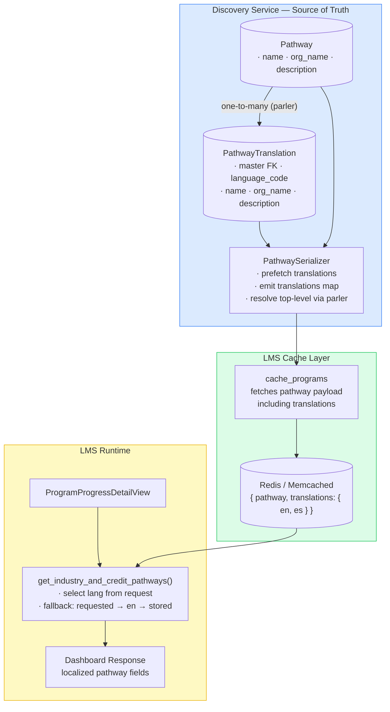

# Credit Pathway Translation — Architectural Design

> **Status**: Proposed  
> **Author**: Enterprise Architecture  
> **Scope**: Discovery + LMS (required), enterprise-catalog / Algolia (only if enterprise search is in scope)  
> **Primary language target**: Spanish (`es`)

---

## 1. Executive Summary

Credit pathway fields (`name`, `org_name`, `description`) are returned in English regardless of the request language. Translation support is missing across the serving chain used by the learner dashboard — from source persistence in Discovery, through the LMS cache, to the dashboard API response.

**Recommended approach**: Add a normalized `PathwayTranslation` table in Discovery (identical to the existing `SubjectTranslation` / `TopicTranslation` pattern), include a `translations` map in the serialized payload, cache the multilingual payload in LMS, and apply language selection at response time using `request.LANGUAGE_CODE`.

This design keeps translation ownership with the authoring service, remains backward-compatible, avoids runtime machine translation, and scales cleanly to additional languages.

**Important scope note**: Algolia is **not required** to solve credit pathway translation for the learner dashboard/API. Algolia changes are only required if translated pathway content must also appear in enterprise search results.

---

## 2. Problem Statement

**Endpoint**: `/api/dashboard/v0/programs/{uuid}/progress_details/`

When requested with `Accept-Language: es`, `credit_pathways` fields remain English:

| Field | Current value (always English) |
|-------|-------------------------------|
| `name` | Master of Science in Professional Studies, Rochester Institute of Technology |
| `org_name` | Rochester Institute of Technology |
| `description` | 27% |

**Expected**: Spanish values when translations exist.  
**Actual**: English values regardless of request language.

---

## 3. Root Cause Analysis

Translation capability is absent at every layer of the serving chain:

| Layer | Service | Gap |
|-------|---------|-----|
| **Data model** | Discovery | `Pathway` has no translation table; text is stored as plain base fields |
| **API serializer** | Discovery | `PathwaySerializer` returns base fields only; no `translations` map, no language awareness |
| **Cache** | LMS | `cache_programs` stores a single-language snapshot; no multilingual data available |
| **Response assembly** | LMS | `get_industry_and_credit_pathways()` returns cached values directly; does not inspect `request.LANGUAGE_CODE` |

### Why other content types work

| Capability | Subject/Topic | Organization | Pathway |
|-----------|---------------|--------------|---------|
| Translation table | `SubjectTranslation` (parler) | `OrganizationTranslation` | **None** |
| Serializer handles `Accept-Language` | Yes | Yes | **No** |
| API exposes `translations` or `*_es` fields | Yes | Yes | **No** |

---

## 4. Decision: Recommended Architecture

### 4.1 Approach

Adopt the **Discovery-owned normalized translation table** pattern — the same pattern used by `Subject`, `Topic`, `LevelType`, and `ProgramType`.

### 4.2 Why this pattern

| Criterion | Discovery translation table | Academy-style `modeltranslation` | Hardcoded LMS dict |
|-----------|---------------------------|----------------------------------|---------------------|
| Ownership boundary | Source service owns translations | Wrong service for Pathway | LMS owns authored content it doesn't control |
| Language scalability | +1 row per language | +N columns per language | +1 code deploy per pathway per language |
| Consistency with Discovery | Identical to Subject/Topic | Different pattern | Not in Discovery at all |
| Backward compatibility | Top-level fields preserved | Top-level fields preserved | Top-level fields preserved |
| Maintenance cost | Content change = DB update | Content change = DB update | Content change = code deploy |

### 4.3 Alternatives considered

**Option A — Academy-style `django-modeltranslation`** (duplicated `_es` columns)
- Works for `enterprise-catalog` but Pathway lives in Discovery.
- Column-per-field-per-language scales poorly beyond 2-3 languages.
- Misaligned with Discovery's established pattern.
- **Verdict**: Not recommended.

**Option B — Hardcoded LMS translation dictionary**
- Acceptable as a temporary emergency bridge only.
- Translations become code; each change requires deployment.
- LMS becomes the translation owner for content authored elsewhere.
- **Verdict**: Use only as a tactical bridge if product requires an immediate fix while the full solution is built.

**Option C — Discovery translation table** (recommended)
- Aligned with `SubjectTranslation`, `TopicTranslation` precedent.
- Source-owned, normalized, scalable.
- **Verdict**: Recommended.

---

## 5. Design Principles

1. **Translation ownership stays with the authoring service.** Pathway is authored in Discovery; translations persist there.
2. **Cache multilingual payloads, not language-specific snapshots.** One cached object serves all languages.
3. **Final language resolution happens at response time.** LMS selects from cached `translations` using the request language.
4. **Top-level fields remain stable.** Existing consumers continue to work unchanged.
5. **Deterministic fallback chain.** requested language → English → original stored value.

---

## 6. Target Data Contract

```json
{
  "id": 196,
  "uuid": "...",
  "name": "Maestría en Ciencias en Estudios Profesionales, Instituto Tecnológico de Rochester",
  "org_name": "Instituto Tecnológico de Rochester",
  "description": "27%",
  "translations": {
    "en": {
      "name": "Master of Science in Professional Studies, Rochester Institute of Technology",
      "org_name": "Rochester Institute of Technology",
      "description": "27%"
    },
    "es": {
      "name": "Maestría en Ciencias en Estudios Profesionales, Instituto Tecnológico de Rochester",
      "org_name": "Instituto Tecnológico de Rochester",
      "description": "27%"
    }
  }
}
```

**Rules**:
- Top-level `name` / `org_name` / `description` resolve to the active language (via parler middleware).
- `translations` contains all published language variants.
- Missing language falls back: requested → `en` → stored base value.

---

## 6a. Algolia Search Indexing — Optional, Only if Search Is In Scope

> **This section is optional.** Pathway content is indexed in Algolia through `enterprise-catalog`, but this only matters if the rollout includes enterprise search results. If the goal is limited to the learner dashboard/API (`credit_pathways`), Discovery + LMS changes are sufficient and Algolia is not needed.

### Two distinct pathway surfaces

| Surface | Source | Translation mechanism needed |
|---------|--------|------------------------------|
| **LMS Dashboard** (`credit_pathways`) | Discovery `Pathway` model, cached in LMS | Discovery translation table + LMS runtime selection (Phases 1–2 above) |
| **Algolia search results** (`LEARNER_PATHWAY` content type in `enterprise-catalog`) | `ContentMetadata.json_metadata` synced from Discovery | `ContentTranslation` record + `create_spanish_algolia_object` + reindex |

These two surfaces are separate pipelines and should be addressed independently.

- If the goal is **dashboard/API translation only**, implement the LMS Dashboard row only.
- If the goal is **dashboard + search translation**, implement both rows.

### How the Algolia translation pipeline works today (for courses/programs)

1. `populate_spanish_translations` management command creates `ContentTranslation` records (`title`, `short_description`, `full_description`, `subtitle`) for eligible `ContentMetadata` objects.
2. `index_enterprise_catalog_in_algolia_task` / `reindex_algolia` calls `_algolia_object_from_product()` to build an English Algolia object.
3. `create_spanish_algolia_object()` reads the `ContentTranslation` for the item, overlays translated fields, sets `objectID` suffix `-es`, sets `metadata_language = 'es'`, and returns a Spanish duplicate Algolia object.
4. Both English (`objectID`) and Spanish (`objectID-es`) objects are saved to the Algolia index.

### Current gap for `LEARNER_PATHWAY`

`_algolia_object_from_product()` already handles `LEARNER_PATHWAY`:

```python
elif searchable_product.get('content_type') == LEARNER_PATHWAY:
    searchable_product.update({
        'course_keys': get_pathway_course_keys(searchable_product),
        'availability': get_pathway_availability(searchable_product),
        'partners': get_pathway_partners(searchable_product),
        'subjects': get_pathway_subjects(searchable_product),
        ...
        'metadata_language': searchable_product.get('metadata_language', 'en'),
    })
```

However, `create_spanish_algolia_object()` currently only translates `title`, `short_description`, `full_description`, `subtitle` — the fields that exist in `ContentTranslation` for courses. Pathway-specific translated fields (`name`, `org_name`, `description`) are **not yet covered**.

Additionally, `populate_spanish_translations` currently filters to courses and programs eligible for Algolia indexing — it does not yet cover `LEARNER_PATHWAY` content.

### What needs to change in the Algolia pipeline

| Step | Change required |
|------|----------------|
| `ContentTranslation` model / `populate_spanish_translations` | Extend to cover `LEARNER_PATHWAY` content; map `title` ↔ pathway `title`, `short_description` ↔ pathway `description` (or add dedicated pathway translation fields) |
| `create_spanish_algolia_object()` | Confirm pathway translated field names match what is stored in `ContentTranslation` |
| `reindex_algolia` / `index_enterprise_catalog_in_algolia_task` | Must be run after translation data is populated to produce Spanish Algolia objects for pathways |

### Algolia reindex requirement

After all translation data is populated:

```bash
# Trigger full reindex to produce Spanish Algolia objects for pathways
./manage.py reindex_algolia
```

Or, if using the task directly:
```python
index_enterprise_catalog_in_algolia_task.apply_async()
```

This must be included in the deployment runbook. Spanish pathway Algolia objects will not exist until a reindex runs after translation data is in place.

---

## 7. Architecture Diagram



---

## 8. Implementation Plan

### Phase 1 — Discovery: Translation Model + Serializer

#### 8.1.1 Add `PathwayTranslation` model

```python
from parler.models import TranslatableModel, TranslatedFieldsModel

# Modify Pathway to inherit TranslatableModel
class Pathway(TranslatableModel, TimeStampedModel):
    uuid = models.UUIDField(...)
    name = models.CharField(max_length=255)        # kept for compat
    org_name = models.CharField(max_length=255)     # kept for compat
    description = models.TextField(blank=True)      # kept for compat
    # ... all other existing fields unchanged

class PathwayTranslation(TranslatedFieldsModel):
    master = models.ForeignKey(
        Pathway, models.CASCADE,
        related_name='translations', null=True,
    )
    name = models.CharField(max_length=255, blank=True, null=True)
    org_name = models.CharField(max_length=255, blank=True, null=True)
    description = models.TextField(blank=True, null=True)

    class Meta:
        unique_together = ('language_code', 'master')
        verbose_name = 'Pathway model translations'
```

This is structurally identical to `SubjectTranslation` and `TopicTranslation`.

#### 8.1.2 Create migration with English backfill

```python
def backfill_english_translations(apps, schema_editor):
    Pathway = apps.get_model('course_metadata', 'Pathway')
    PathwayTranslation = apps.get_model('course_metadata', 'PathwayTranslation')

    for pathway in Pathway.objects.all():
        PathwayTranslation.objects.get_or_create(
            master_id=pathway.id,
            language_code=settings.PARLER_DEFAULT_LANGUAGE_CODE,  # 'en'
            defaults={
                'name': pathway.name,
                'org_name': pathway.org_name,
                'description': pathway.description,
            },
        )
```

#### 8.1.3 Update `PathwaySerializer`

```python
class PathwaySerializer(serializers.ModelSerializer):
    @classmethod
    def prefetch_queryset(cls):
        return Pathway.objects.prefetch_related('translations')

    class Meta:
        model = Pathway
        fields = (
            'id', 'uuid', 'name', 'org_name', 'email',
            'description', 'destination_url', 'pathway_type',
            'course_run_statuses',
        )

    def to_representation(self, instance):
        data = super().to_representation(instance)
        translations = {}
        for t in instance.translations.all():
            translations[t.language_code] = {
                'name': t.name,
                'org_name': t.org_name,
                'description': t.description,
            }
        data['translations'] = translations
        return data
```

Parler's `LocaleMiddleware` already resolves the active language from `Accept-Language`, so top-level fields resolve correctly without extra logic.

#### 8.1.4 Files changed

| File | Change |
|------|--------|
| `course_discovery/apps/course_metadata/models.py` | Add `PathwayTranslation`, modify `Pathway` base class |
| `course_discovery/apps/course_metadata/migrations/0XXX_*.py` | Schema + backfill |
| `course_discovery/apps/api/serializers.py` | `PathwaySerializer` update |
| Discovery admin (optional) | Admin form for translation authoring |

---

### Phase 2 — LMS: Cache + Runtime Localization

#### 8.2.1 Cache translations

Ensure `cache_programs` stores the full `translations` payload from the Discovery response. No transformation needed — the serializer already emits the correct shape.

#### 8.2.2 Runtime language selection

```python
def get_industry_and_credit_pathways(program_data, site, request=None):
    pathways = program_data.get('pathways', [])
    # ... existing logic ...

    if request and hasattr(request, 'LANGUAGE_CODE'):
        lang = request.LANGUAGE_CODE
        for pathway in pathways:
            translations = pathway.get('translations', {})
            lang_data = translations.get(lang) or translations.get('en', {})
            if lang_data:
                pathway['name'] = lang_data.get('name', pathway['name'])
                pathway['org_name'] = lang_data.get('org_name', pathway['org_name'])
                pathway['description'] = lang_data.get('description', pathway['description'])

    return pathways
```

#### 8.2.3 Wire request into view

```python
def get(self, request, program_uuid):
    # ...
    return Response({
        'credit_pathways': get_industry_and_credit_pathways(program_data, site, request),
        ...
    })
```

#### 8.2.4 Files changed

| File | Change |
|------|--------|
| `openedx/core/djangoapps/catalog/management/commands/cache_programs.py` | Ensure `translations` is preserved |
| `openedx/core/djangoapps/programs/utils.py` | Add language selection logic |
| `openedx/core/djangoapps/programs/rest_api/v1/views.py` | Pass `request` to helper |

---

### Phase 3 — Translation Population

Create a management command to backfill Spanish translations using an MT service (e.g., DeepL, AWS Translate):

```bash
./manage.py backfill_pathway_translations --languages=es \
    --mt-endpoint=https://api.deepl.com/v2/translate \
    --mt-key=$DEEPL_KEY
```

MT output should be reviewed by a human before marking as production-ready.

---

## 9. Testing Strategy

### Discovery tests

| Test | Validates |
|------|-----------|
| `PathwayTranslation` model creation | Schema correctness |
| English backfill migration | Data integrity after migration |
| Serializer includes `translations` map | API contract |
| `Accept-Language: es` resolves top-level fields | Parler integration |
| Missing Spanish falls back to English | Fallback chain |

### LMS tests

| Test | Validates |
|------|-----------|
| Cached payload contains `translations` | Cache pipeline |
| Dashboard returns Spanish with `Accept-Language: es` | End-to-end localization |
| Missing translation falls back to English | Fallback behavior |
| Non-pathway payloads unchanged | Regression safety |

### Regression tests

| Test | Validates |
|------|-----------|
| English-only clients receive top-level fields | Backward compatibility |
| Cache refresh works when pathway has no translations | Graceful degradation |

---

## 10. PR Strategy

| PR | Scope | Service |
|----|-------|---------|
| **PR 1** | Translation model + migration + serializer + Discovery tests | Discovery |
| **PR 2** | Cache preservation + runtime selection + LMS tests | LMS |
| **PR 3** (optional) | `ContentTranslation`/`populate_spanish_translations` extended for `LEARNER_PATHWAY`; `create_spanish_algolia_object` covers pathway fields | enterprise-catalog |
| **PR 4** (optional) | MT backfill command + QA checklist | Discovery |

Minimum viable rollout (Dashboard only): 2 PRs (Discovery + LMS).  
Full rollout (Dashboard + enterprise search): 3 PRs minimum.  
Safest rollout: 4 PRs with operational backfill and optional Algolia work separated.

---

## 11. Effort Estimate

| Component | LOC range |
|-----------|-----------|
| Discovery model + migration | 70–130 |
| Discovery serializer | 40–80 |
| Discovery backfill command | 60–120 |
| Discovery tests | 120–220 |
| LMS cache logic | 20–50 |
| LMS runtime selection | 30–70 |
| LMS view wiring | 5–15 |
| LMS tests | 80–160 |
| enterprise-catalog `ContentTranslation` + Algolia pipeline (optional) | 30–60 |
| enterprise-catalog Algolia tests (optional) | 40–80 |
| **Total** | **~425–845** dashboard only, **~465–985** with search |

**Calendar estimate**: 3–5 engineering days including testing and review.

---

## 12. Risks and Mitigations

| Risk | Impact | Mitigation |
|------|--------|------------|
| Migration locks `course_metadata_pathway` table | Brief write unavailability | Run during low-traffic window; `PathwayTranslation` is a new table so `CREATE TABLE` is fast |
| Stale cache after Discovery deploy | Dashboard still serves English | Include `cache_programs` refresh in deployment runbook |
| MT translation quality | Incorrect or awkward pathway titles | Human review step before production publication |
| New `translations` field surprises API clients | Unexpected payload shape | Field is additive; top-level fields unchanged; backward-compatible by design |

---

## 13. Deployment Checklist

- [ ] Discovery: merge PR 1 (model + serializer)
- [ ] Discovery: run migration in staging, validate
- [ ] Discovery: populate Spanish translations (MT + review)
- [ ] Discovery: promote to production
- [ ] LMS: merge PR 2 (cache + runtime)
- [ ] LMS: deploy to staging, validate with `Accept-Language: es`
- [ ] LMS: promote to production
- [ ] LMS: run `./manage.py cache_programs` to refresh cached payloads
- [ ] Verify: dashboard shows Spanish pathway fields when language is Spanish
- [ ] Verify: dashboard shows English pathway fields when language is English
- [ ] Verify: existing English-only clients are unaffected

**Only if enterprise search is in scope:**

- [ ] enterprise-catalog: merge PR 3 (Algolia pipeline for `LEARNER_PATHWAY`)
- [ ] enterprise-catalog: run `populate_spanish_translations` for `LEARNER_PATHWAY` content
- [ ] enterprise-catalog: run `./manage.py reindex_algolia` to produce Spanish Algolia objects
- [ ] Verify: Spanish Algolia objects exist for pathways (objectID suffix `-es`, `metadata_language=es`)
- [ ] Verify: Spanish pathway titles/descriptions appear in enterprise search results

---

## 14. Frontend Impact

### Short answer

- **For learner dashboard / program progress pathway translation:** no frontend change is required, and no Algolia dependency exists.
- **For enterprise search results:** frontend already uses Algolia and already filters by locale, so no frontend change is required there either — but backend indexing and reindexing are required.

The frontend has **two separate retrieval patterns**:

1. **Direct API path** for program progress / credit pathways
2. **Algolia search path** for searchable catalog content

These should not be conflated.

### Dashboard surface (`ProgramPathwayOpportunity.jsx`)

`ProgramPathwayOpportunity.jsx` renders pathway fields directly from the API response:

```jsx
<h2 className="pathway-heading"> { pathway.name } </h2>
{ pathway.description && <p> {pathway.description}</p> }
```

It does not do any client-side language selection or translation lookup. It renders whatever `name` and `description` values arrive in the payload.

That data comes from `useLearnerProgramProgressData()`, which loads `queryLearnerProgramProgressData(programUUID)`. This is a **content/program progress API query**, not an Algolia query.

So for the learner dashboard flow:

- frontend does **not** retrieve pathways from Algolia,
- frontend does **not** retrieve translations from Algolia,
- frontend simply renders the localized values returned by LMS.

The LMS Phase 2 change (runtime language selection in `get_industry_and_credit_pathways()`) resolves the correct language **server-side** before the response is sent, overwriting the top-level `name`, `org_name`, and `description` fields. The frontend receives and renders the already-translated values with no awareness that a translation took place.

**Frontend change required: none.**

### Algolia search surface

The search frontend uses `useAlgoliaSearch()` to initialize an Algolia client and `useDefaultSearchFilters()` to construct the default filter set.

`useDefaultSearchFilters()` explicitly adds:

```text
metadata_language:<currentLocale>
```

where `<currentLocale>` is derived from `getSupportedLocale()` and currently resolves to `en` or `es`.

There is also already precedent for language-specific content retrieval from Algolia in the frontend. For example, `useCourseFromAlgolia()` explicitly looks up translated course content using:

```text
content_type:course
metadata_language:es
```

This confirms that the frontend search stack is already designed to consume localized Algolia objects.

Therefore, for search results:

- frontend **does** use Algolia,
- frontend **already** filters by `metadata_language`,
- frontend does **not** need new translation logic for pathways,
- backend only needs to ensure Spanish `LEARNER_PATHWAY` objects are indexed and reindexed.

Once the backend (enterprise-catalog) creates Spanish Algolia objects for pathways and the reindex runs, Spanish pathway records will automatically appear in Spanish search results through the existing filter — no frontend changes needed.

**Frontend change required: none.**

### Can pathway translation be handled without Algolia?

Yes — **if the requirement is only the learner dashboard / program progress API experience**.

For that use case, pathway translation is fully handled by:

1. Discovery storing translations,
2. LMS caching the multilingual payload,
3. LMS selecting the correct language before returning the response.

In that flow, Algolia is not involved at all.

However, **if the requirement includes enterprise search results**, then Algolia must be updated because the search frontend depends on Algolia for search retrieval.

So the correct architectural conclusion is:

- **Dashboard translation:** can be solved without Algolia.
- **Search translation:** cannot be solved without Algolia unless search is redesigned to stop using Algolia entirely.

### When a frontend change would be required

A frontend change would only be needed if:

- A new pathway field (e.g., `org_name`) needs to be displayed in `ProgramPathwayOpportunity.jsx` — currently it renders only `name` and `description`.
- A product decision is made to show a language selector that overrides the default browser/LMS language.
- A new pathway detail page is built that requires direct multilingual field access from cached data.

---

## 15. Conclusion

Credit pathway translations are missing because the `Pathway` model has no translation infrastructure, the API exposes only English values, and the LMS cache and response layer have no language-aware behavior.

The required fix for learner dashboard/API translation spans two areas:

1. **Discovery** — add `PathwayTranslation` table (same pattern as `SubjectTranslation`), expose a `translations` map in the serializer.
2. **LMS** — cache the multilingual payload, apply language selection at response time in the Dashboard API.

**Optional third area, only if enterprise search is in scope:**

3. **enterprise-catalog / Algolia** — extend `ContentTranslation` and `populate_spanish_translations` to cover `LEARNER_PATHWAY` content, then reindex so Spanish Algolia objects are produced.

Without step 3, Spanish translations can still appear correctly in the learner dashboard. Step 3 is only needed if translated pathway content must also appear in enterprise search results.
