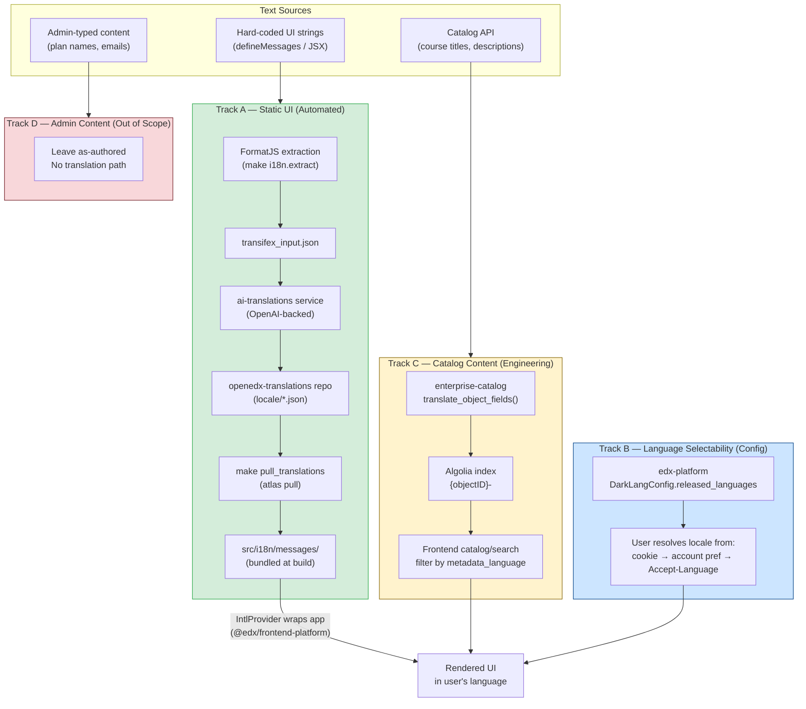
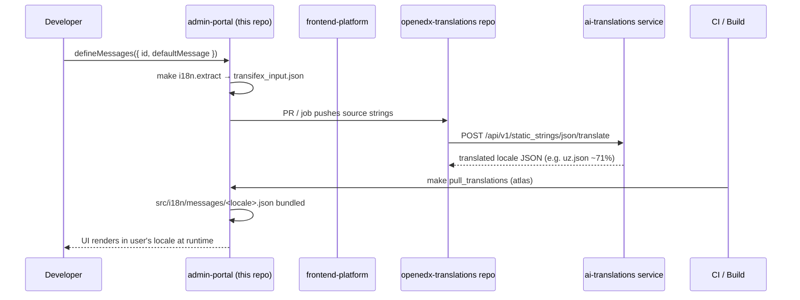

# Adding a Translation Language to the Enterprise Admin Portal

A quick reference for taking the admin portal — and the content it renders — into a new
language. **Worked example:** Uzbek (`uz`). *Statuses drift; re-verify before relying on them.*

## The four tracks

"Translating the admin portal" is really four independent problems. Identify which one your
text belongs to first — that tells you the pipeline, owner, and effort.

```
Where does the text come from?
├─ Hard-coded in the MFE (defineMessages, labels, buttons) ─► Track A  (free, automated)
├─ Catalog / discovery API (course titles, descriptions) ───► Track C  (real work)
├─ Typed by an enterprise admin (plan/budget names, email) ─► Track D  (leave it)
└─ Translation exists but user can't pick the language ─────► Track B  (platform config)
```

| Track | Domain | Effort | Owner | State |
|---|---|---|---|---|
| **A** | Static UI strings | Near-zero once locale is registered upstream | Aurora | Automated |
| **B** | Language selectability | One config change + release decision | Platform / BOM | Config needed |
| **C** | Dynamic catalog content | Real engineering (generalize Spanish-only pipeline) | Catalog / Enterprise | Partial |
| **D** | Admin-authored content | None (deliberate non-goal) | Product | Out of scope |



---

## Track A — Static UI strings

Strings from `defineMessages` are extracted, machine-translated by the central
`ai-translations` service, and pulled into the bundle at build. For a language already on
the platform, **this is automatic — no change in this repo.**



1. **Register the locale in `frontend-platform`** *(only if new to the platform)* —
   `supportedLocales`, FormatJS locale-data imports, `countries.js`, and test counts in
   `src/i18n/lib.js` / `lib.test.js`. Mirror the Vietnamese PR
   ([frontend-platform#825][pr825]). Then bump `@edx/frontend-platform` in `package.json`.
2. **Translate in `openedx-translations`** — the app is already registered in
   `translations-config.json`; just ensure the language is in the job matrix. The
   `ai-translations` (OpenAI-backed) fetch job produces `<locale>.json`. Untranslated keys
   fall back to English.
3. **MFE pull (this repo)** — no change needed. `make pull_translations` already pulls
   frontend-platform, paragon, and admin-portal resources, and `intl-imports.js` regenerates
   `src/i18n/index.js` (which is `export default [];` in source).
4. **Deploy (`edx-internal`)** — one-time, already done: `use_atlas: true` and
   `ATLAS_OPTIONS: --repository=edx/openedx-translations`, no revision pin.

---

## Track B — Make the language selectable

The real end-user gate. The MFE resolves locale from the `openedx-language-preference`
cookie → account preference → `Accept-Language`. The language must be **released** in
`edx-platform` (`DarkLangConfig.released_languages`, backed by `LANGUAGES`). Owned by the
platform team — treat it as the critical path.

**Test before release:** set the `openedx-language-preference` cookie, or use
`?preview-lang=<locale>` on a deployed environment.

---

## Track C — Dynamic catalog content (real work)

Course/program/academy titles and descriptions come from `enterprise-catalog` via Algolia.
An LLM pipeline (Xpert AI) exists but is **hard-coded to Spanish** in several places. To
generalize (in `openedx/enterprise-catalog`):

1. Parameterize the translation engine / prompt (`translate_object_fields()`) to take a
   target language instead of "Spanish".
2. Replace hard-coded `'es'` in `populate_spanish_translations` with a `--language` arg;
   keep `source_hash` skip logic and `is_reviewed=False` for human review.
3. Make the Algolia replica emit `{objectID}-<locale>` with `metadata_language=<locale>`,
   loop over enabled languages, reindex. **Mind the Algolia 10 KB record limit** — truncate
   long descriptions.
4. **Frontend (this repo + learner portal):** filter catalog/search by `metadata_language`
   with English fallback. The admin portal currently sends **no** locale to any backend, so
   this is net-new plumbing.

---

## Track D — Admin-authored content (out of scope)

Free text typed by admins — subscription/plan names (`subscription.title`), budget names
(`subsidyAccessPolicy.displayName`), coupon titles, email templates, highlight titles. No
machine-translation path; leave as-authored unless product wants per-locale variants.

> Note: enrollment *status* values look dynamic but are a fixed vocabulary mapped to static
> strings in `src/utils.js` — those are **Track A**, not D.

---

## Worked example — Uzbek (`uz`)

| Item | Status |
|---|---|
| frontend-platform registration (A1) | PR open — [frontend-platform#887][pr887] |
| Translations exist (A2) | Done — `uz.json` (~71%) for all three resources |
| MFE bundles it (A3) | Done — Makefile already pulls it |
| Deploy pulls it (A4) | Done — atlas pointed at edx fork |
| Released in edx-platform (B) | **Verify** — the remaining end-user gate |
| Catalog content (C) | Not started — pipeline is Spanish-only |
| Admin-authored (D) | N/A |

**Bottom line:** Static UI in Uzbek is shippable today (previewable via the language
cookie). Open items: platform release (B) and, if catalog content must localize, the
Track C generalization.

---

## Appendix

**`ai-translations` API:** `POST {ai-translations}/api/v1/static_strings/json/translate`
(multipart: `translation_file`, `application_name`, `translation_language`); `/initialize`
seeds existing human translations.

**Owners:** pipeline → Aurora · admin-portal → Titans · released languages → Platform/BOM ·
catalog content → Catalog/Enterprise.

[pr825]: https://github.com/openedx/frontend-platform/pull/825
[pr887]: https://github.com/openedx/frontend-platform/pull/887
