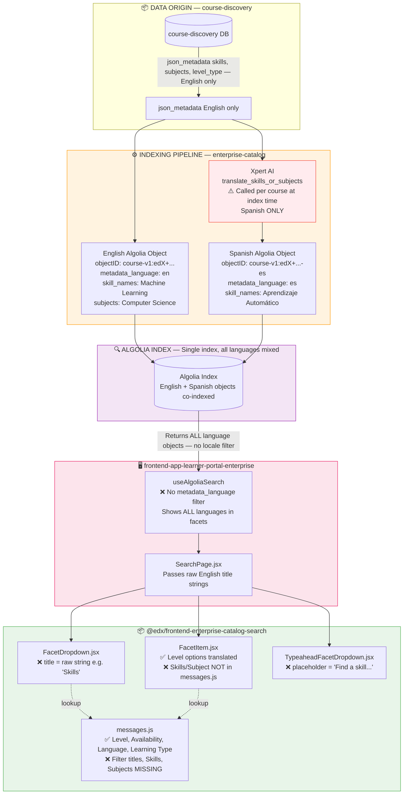
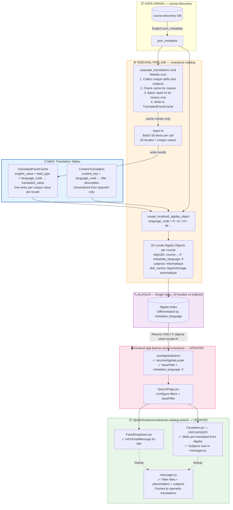
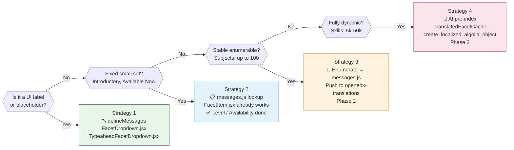
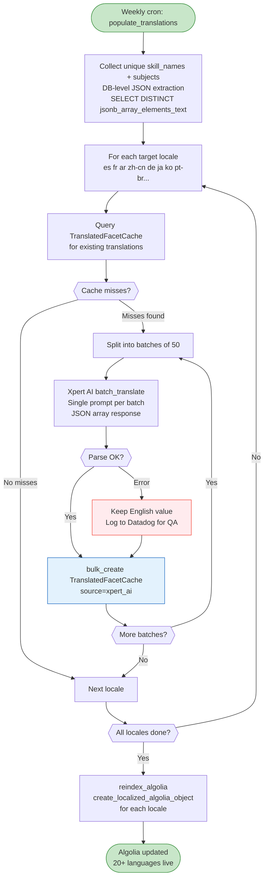
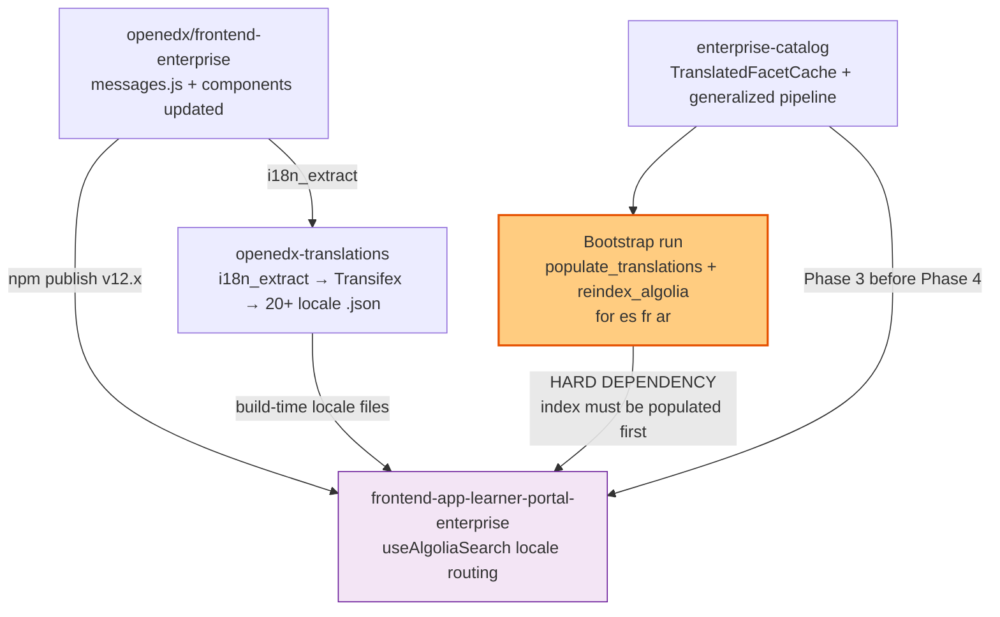

# Dynamic Data Translation Architecture
## Skills, Subject, Level, Ability & Learning Type Filters — 20+ Language Support

> **Author perspective:** Expert Architect  
> **Scope:** End-to-end translation of search filter labels *and* dynamic Algolia facet values  
> **Target:** 20+ supported locales  

---

## Table of Contents

1. [System Overview](#1-system-overview)
2. [AS-IS Process — Current State](#2-as-is-process--current-state)
   - [Data Flow Diagram (AS-IS)](#data-flow-diagram-as-is)
   - [Layer-by-Layer Analysis](#layer-by-layer-analysis)
   - [Gaps and Broken Surfaces](#gaps-and-broken-surfaces)
3. [TO-BE Process — Target Architecture](#3-to-be-process--target-architecture)
   - [Data Flow Diagram (TO-BE)](#data-flow-diagram-to-be)
   - [Design Principles](#design-principles)
   - [Translation Classification Matrix](#translation-classification-matrix)
4. [Implementation Blueprint](#4-implementation-blueprint)
   - [Layer 1: Filter Labels & Placeholders](#layer-1-filter-labels--placeholders-static-ui)
   - [Layer 2: Closed-Set Facet Values](#layer-2-closed-set-facet-values-level-availability-learning-type)
   - [Layer 3: Semi-Dynamic Facet Values](#layer-3-semi-dynamic-facet-values-subjects)
   - [Layer 4: Fully Dynamic Facet Values](#layer-4-fully-dynamic-facet-values-skills--ability)
   - [Layer 5: Frontend Locale Routing](#layer-5-frontend-locale-routing)
   - [Layer 6: Backend Multi-Language Pipeline](#layer-6-backend-multi-language-pipeline)
5. [Phased Delivery Plan](#5-phased-delivery-plan)
6. [Repository Touchpoints](#6-repository-touchpoints)
7. [ADRs — Architecture Decision Records](#7-adrs--architecture-decision-records)
8. [Generic Reusable Solution for All Dynamic Filter Tickets](#8-generic-reusable-solution-for-all-dynamic-filter-tickets)
9. [Efficient Backend-Centric Translation Model](#9-efficient-backend-centric-translation-model)
10. [Industry Filter Example — Skills Quiz](#10-industry-filter-example--skills-quiz)

---

## 1. System Overview

The search page filters are powered by **Algolia** as the data backbone, delivered through the `@edx/frontend-enterprise-catalog-search` shared package, consumed by `frontend-app-learner-portal-enterprise`. The backend indexing pipeline lives in **enterprise-catalog**, which also partially exists in **course-discovery** for original field sourcing.

```
┌──────────────────────────────────────────────────────────────┐
│                    DATA ORIGIN LAYER                         │
│  course-discovery DB ──► json_metadata (skills, subjects,    │
│                           level_type, etc.)                  │
└───────────────────────────────┬──────────────────────────────┘
                                │
┌───────────────────────────────▼──────────────────────────────┐
│                 INDEXING PIPELINE LAYER                       │
│  enterprise-catalog                                          │
│  ├── algolia_utils.py     (field extraction + indexing)      │
│  ├── ContentTranslation   (DB cache for translated fields)   │
│  ├── translation_utils.py (Xpert AI translation calls)       │
│  └── reindex_algolia cmd  (writes to Algolia)                │
└───────────────────────────────┬──────────────────────────────┘
                                │
┌───────────────────────────────▼──────────────────────────────┐
│                    ALGOLIA INDEX LAYER                        │
│  Single index: both English + Spanish objects co-indexed     │
│  Differentiated by: metadata_language field                  │
│  Fields: skill_names, subjects, level_type, availability,    │
│          content_type, partners.name, language               │
└───────────────────────────────┬──────────────────────────────┘
                                │
┌───────────────────────────────▼──────────────────────────────┐
│               SHARED PACKAGE LAYER                           │
│  @edx/frontend-enterprise-catalog-search                     │
│  ├── SEARCH_FACET_FILTERS constants  (filter definitions)    │
│  ├── messages.js             (known-value i18n mappings)     │
│  ├── FacetItem.jsx           (dropdown option rendering)     │
│  ├── FacetDropdown.jsx       (filter title rendering)        │
│  ├── TypeaheadFacetDropdown  (typeahead placeholder)         │
│  ├── LearningTypeRadioFacet  (Learning Type only)            │
│  └── CurrentRefinements      (active filter chips)           │
└───────────────────────────────┬──────────────────────────────┘
                                │
┌───────────────────────────────▼──────────────────────────────┐
│                   CONSUMER APP LAYER                         │
│  frontend-app-learner-portal-enterprise                      │
│  ├── SearchPage.jsx          (filter surface)                │
│  ├── constants.js            (overrides SEARCH_FACET_FILTERS)│
│  └── useAlgoliaSearch hook   (index selection, locale)       │
└──────────────────────────────────────────────────────────────┘
```

---

## 2. AS-IS Process — Current State

### Data Flow Diagram (AS-IS)



### Layer-by-Layer Analysis

#### Backend — enterprise-catalog

| Component | File | What it does | Translation state |
|---|---|---|---|
| `ContentTranslation` model | `models.py` L1886 | DB cache for pre-translated title, description, subtitle, outcome | ✅ Exists, **Spanish only** |
| `populate_spanish_translations` | `management/commands/` | Runs Xpert AI to fill `ContentTranslation` table | ✅ Exists, **Spanish only** |
| `create_spanish_algolia_object` | `algolia_utils.py` L1701 | Creates ES Algolia object from EN object | ✅ Exists, **Spanish only** |
| `translate_skills_or_subjects` | `translation_utils.py` L133 | Calls Xpert AI at **index time** per item | ⚠️ Runtime AI call, slow, Spanish only |
| `translate_facet_value` | `translation_utils.py` L97 | Dict lookup for closed-set values | ✅ Works, Spanish only |
| Level translations | `algolia_utils.py` | `LEVEL_TYPE_TRANSLATIONS` dict | ✅ Spanish only |
| `metadata_language` field | Algolia object | Differentiates EN vs ES objects | ⚠️ Not used by frontend |

#### Frontend — `@edx/frontend-enterprise-catalog-search` package

| Component | File | What it translates | What is missing |
|---|---|---|---|
| `LearningTypeRadioFacet.jsx` | Package src | All labels via `<FormattedMessage>` | ✅ Fully translated |
| `FacetItem.jsx` | Package src | Dropdown options via `messages[item.label]` lookup | ❌ Skills/Subject values not in messages.js |
| `CurrentRefinements.jsx` | Package src | Active filter chips via `messages[item.label]` lookup | ❌ Same gap |
| `FacetDropdown.jsx` | Package src | Filter **title** via raw `{title}` prop | ❌ Not wrapped in intl |
| `TypeaheadFacetDropdown.jsx` | Package src | Renders `options.placeholder` and `options.ariaLabel` | ❌ Not wrapped in intl |
| `SearchFilters.jsx` | Package src | Passes raw `title` from constants to `FacetDropdown` | ❌ Source is a raw string |
| `messages.js` | Package src | `defineMessages` for Level, Availability, Language, Learning Type | ❌ Missing: Skills, Subject, filter titles, placeholders |
| `SEARCH_FACET_FILTERS` constants | `data/constants.js` | Static English strings for all filter definitions | ❌ Not intl-wrapped |

#### Frontend — `frontend-app-learner-portal-enterprise`

| Component | Issue |
|---|---|
| `useAlgoliaSearch` hook | Does not filter Algolia queries by `metadata_language` |
| `constants.js` (SearchPage) | Overrides some SEARCH_FACET_FILTERS but still raw strings |
| No locale → index routing | Frontend sends same query regardless of user locale |

---

### Gaps and Broken Surfaces

```
Priority | Filter      | What's broken
─────────┼─────────────┼──────────────────────────────────────────────────────
 HIGH    │ Skills      │ Title "Skills", placeholder "Find a skill..." — English
         │             │ All option values — English (Algolia raw strings)
         │             │ Frontend doesn't request locale-specific Algolia data
─────────┼─────────────┼──────────────────────────────────────────────────────
 HIGH    │ Subject     │ Title "Subject", placeholder "Find a subject..." — English
         │             │ All option values — English (Algolia raw strings)
─────────┼─────────────┼──────────────────────────────────────────────────────
 MEDIUM  │ Level       │ Title "Level" — English
         │             │ Option values ARE translated via messages.js ✅
─────────┼─────────────┼──────────────────────────────────────────────────────
 MEDIUM  │ Learning    │ Fully translated in LearningTypeRadioFacet ✅
         │ Type        │ But content_type values in Algolia still English
─────────┼─────────────┼──────────────────────────────────────────────────────
 LOW     │ Availability│ Option values translated ✅; title "Availability" not ✅
─────────┼─────────────┼──────────────────────────────────────────────────────
 UNCLEAR │ Ability     │ Not present in SEARCH_FACET_FILTERS in the package
         │             │ May be a consuming-app local filter — needs confirmation
─────────┼─────────────┼──────────────────────────────────────────────────────
 ALL     │ 19 missing  │ Translation pipeline is Spanish-ONLY
         │ locales     │ No architecture for 20+ languages
```

---

## 3. TO-BE Process — Target Architecture

### Data Flow Diagram (TO-BE)



### Design Principles

1. **Translate at index time, not render time** — All dynamic values (skills, subjects) must be pre-translated before being written to Algolia. Never call a translation API at request time.
2. **Single Algolia index, language-differentiated objects** — Avoids Algolia plan overages and simplifies management. Objects differentiated by `metadata_language` field + `-{locale}` objectID suffix.
3. **Translation cache is the single source of truth** — A `TranslatedFacetCache` table prevents re-translating the same skill or subject across thousands of courses.
4. **Finite sets use static message files** — Level, Availability, Learning Type option values are hardcoded sets and should use `defineMessages` in the shared package. No backend work needed.
5. **Dynamic sets use pre-indexed translated values** — Skills and subjects come from Algolia already translated. The frontend simply renders what Algolia returns.
6. **UI strings (titles, placeholders) belong to the frontend package** — These are not data; they are UI chrome and must be wrapped in `defineMessages` / `FormattedMessage`.
7. **Degrade gracefully** — If a translation is missing for a locale, fall back to English. Never show a blank.

---

### Translation Classification Matrix

| Filter | Value source | Cardinality | Change frequency | Translation strategy |
|---|---|---|---|---|
| **Filter title** (e.g. "Skills") | `constants.js` static string | ~10 titles | Rarely | `defineMessages` in shared package |
| **Placeholder** (e.g. "Find a skill...") | `constants.js` static string | ~10 strings | Rarely | `defineMessages` in shared package |
| **Level** options | Algolia, fixed set: 3 values | 3 | Never | `messages.js` static lookup |
| **Availability** options | Algolia, fixed set: 4 values | 4 | Never | `messages.js` static lookup |
| **Learning Type** options | Component-hardcoded | 4–5 | Rarely | `<FormattedMessage>` (already done ✅) |
| **Subject** options | Algolia, semi-static | ~50–100 | Quarterly | `messages.js` static lookup (Phase 2) + pre-indexed (Phase 4) |
| **Skills** options | Algolia, fully dynamic | 5,000–50,000 | Weekly | Pre-indexed translated values from `TranslatedFacetCache` (Phase 4) |
| **Ability** options | TBD — confirm source | TBD | TBD | Identify first; apply matching strategy |

**Classification decision tree:**



---

## 4. Implementation Blueprint

### Layer 1: Filter Labels & Placeholders (Static UI)

**Repo:** `openedx/frontend-enterprise` → `packages/catalog-search/src`

**Problem:** `SEARCH_FACET_FILTERS` in `data/constants.js` stores `title` and `typeaheadOptions.placeholder` as raw English strings. `FacetDropdown.jsx` renders `{title}` directly. `TypeaheadFacetDropdown.jsx` renders `options.placeholder` directly.

**Solution:**

**Step 1 — Add new entries to `messages.js`:**

```js
// packages/catalog-search/src/messages.js  (additions)
import { defineMessages } from '@edx/frontend-platform/i18n';

const messages = defineMessages({
  // === EXISTING (already present) ===
  // Level, Availability, Language, Learning Type options...

  // === NEW: Filter titles ===
  'filter.title.skills': {
    id: 'search.facetFilters.title.skills',
    defaultMessage: 'Skills',
    description: 'Label for the Skills filter dropdown',
  },
  'filter.title.subject': {
    id: 'search.facetFilters.title.subject',
    defaultMessage: 'Subject',
    description: 'Label for the Subject filter dropdown',
  },
  'filter.title.level': {
    id: 'search.facetFilters.title.level',
    defaultMessage: 'Level',
    description: 'Label for the Level filter dropdown',
  },
  'filter.title.partner': {
    id: 'search.facetFilters.title.partner',
    defaultMessage: 'Partner',
    description: 'Label for the Partner filter dropdown',
  },
  'filter.title.availability': {
    id: 'search.facetFilters.title.availability',
    defaultMessage: 'Availability',
    description: 'Label for the Availability filter dropdown',
  },

  // === NEW: Typeahead placeholders ===
  'filter.placeholder.skills': {
    id: 'search.facetFilters.placeholder.skills',
    defaultMessage: 'Find a skill...',
    description: 'Placeholder text for the Skills typeahead filter',
  },
  'filter.placeholder.subject': {
    id: 'search.facetFilters.placeholder.subject',
    defaultMessage: 'Find a subject...',
    description: 'Placeholder text for the Subject typeahead filter',
  },
  'filter.ariaLabel.skills': {
    id: 'search.facetFilters.ariaLabel.skills',
    defaultMessage: 'Type to find a skill',
    description: 'Aria label for the Skills typeahead input',
  },
  'filter.ariaLabel.subject': {
    id: 'search.facetFilters.ariaLabel.subject',
    defaultMessage: 'Type to find a subject',
    description: 'Aria label for the Subject typeahead input',
  },
});
```

**Step 2 — Update `data/constants.js` to use message keys instead of raw strings:**

```js
// data/constants.js — each filter definition now carries a messageKey
export const SEARCH_FACET_FILTERS = [
  {
    attribute: 'skill_names',
    title: 'Skills',                    // kept for backward compat
    titleMessageKey: 'filter.title.skills',
    typeaheadOptions: {
      placeholder: 'Find a skill...',   // kept for backward compat
      placeholderMessageKey: 'filter.placeholder.skills',
      ariaLabel: 'Type to find a skill',
      ariaLabelMessageKey: 'filter.ariaLabel.skills',
      minLength: 3,
    },
  },
  // ... other filters follow same pattern
];
```

**Step 3 — Update `FacetDropdown.jsx` to resolve the message key:**

```jsx
// FacetDropdown.jsx
import { useIntl } from '@edx/frontend-platform/i18n';
import messages from './messages';

const FacetDropdown = ({ title, titleMessageKey, items, ... }) => {
  const intl = useIntl();
  const resolvedTitle = titleMessageKey && messages[titleMessageKey]
    ? intl.formatMessage(messages[titleMessageKey])
    : title; // fallback to raw string for backward compat

  return (
    <div className="facet-list">
      <Dropdown ...>
        <Dropdown.Toggle ...>
          {resolvedTitle}
        </Dropdown.Toggle>
        ...
      </Dropdown>
    </div>
  );
};
```

**Step 4 — Update `TypeaheadFacetDropdown.jsx` similarly:**

```jsx
const TypeaheadFacetDropdown = ({ title, titleMessageKey, options, ... }) => {
  const intl = useIntl();
  const resolvedPlaceholder = options.placeholderMessageKey && messages[options.placeholderMessageKey]
    ? intl.formatMessage(messages[options.placeholderMessageKey])
    : options.placeholder;

  const resolvedAriaLabel = options.ariaLabelMessageKey && messages[options.ariaLabelMessageKey]
    ? intl.formatMessage(messages[options.ariaLabelMessageKey])
    : options.ariaLabel;

  // pass resolvedPlaceholder and resolvedAriaLabel to Input
};
```

**Step 5 — Extract strings and push to openedx-translations:**

```bash
# In frontend-enterprise repo
npm run i18n_extract    # generates src/i18n/messages/en.json
# Push to Transifex / openedx-translations for 20+ locale translation
```

---

### Layer 2: Closed-Set Facet Values (Level, Availability, Learning Type)

**Status:** ✅ Largely done. `messages.js` already has Level, Availability, Language, Learning Type values.  
**Remaining action:** Verify all currently used string values are covered and the `messages[item.label]` pattern in `FacetItem.jsx` and `CurrentRefinements.jsx` serves them correctly.

**Validation checklist:**
- `Introductory`, `Intermediate`, `Advanced` → present ✅
- `Available Now`, `Upcoming`, `Starting Soon`, `Archived` → present ✅
- `course`, `program`, `learnerpathway`, `video` → present ✅
- Make sure all translations are published in `openedx-translations` `.json` files for each locale

No new code changes needed in Layer 2 beyond ensuring completeness.

---

### Layer 3: Semi-Dynamic Facet Values (Subjects)

**Cardinality:** ~50–100 values. Changes quarterly when edX adds new subject areas.

**Subjects are a finite known set.** This is the same approach already used for Level and Language.

**Step 1 — Enumerate all active subject values from Algolia/course-discovery:**

```bash
# Run this against course-discovery DB or Algolia export
python manage.py shell -c "
from course_discovery.apps.course_metadata.models import Subject
for s in Subject.objects.all().order_by('name'):
    print(s.name)
"
```

**Step 2 — Add all ~50 subject names to `messages.js`:**

```js
// messages.js additions
'Computer Science': {
  id: 'catalog.subject.computerScience',
  defaultMessage: 'Computer Science',
  description: 'Subject filter option: Computer Science',
},
'Business & Management': {
  id: 'catalog.subject.businessManagement',
  defaultMessage: 'Business & Management',
  description: 'Subject filter option: Business & Management',
},
'Data Analysis & Statistics': {
  id: 'catalog.subject.dataAnalysis',
  defaultMessage: 'Data Analysis & Statistics',
  description: 'Subject filter option: Data Analysis & Statistics',
},
// ... all remaining subjects
```

**Why this works:** `FacetItem.jsx` already does `messages[item.label] ? intl.formatMessage(...) : item.label`. Adding subject values to `messages.js` activates translation with zero component changes.

**Step 3 — Push to openedx-translations for all 20 locales.**

**Maintenance process:**  
When a new subject is added to course-discovery, a PR must be raised to `frontend-enterprise` to add the new message ID. A CI lint rule can detect Algolia subjects not present in `messages.js` and flag as a warning.

---

### Layer 4: Fully Dynamic Facet Values (Skills & Ability)

This is the **hardest layer** and requires changes across backend and frontend.

#### Problem Statement

Algolia contains `skill_names` values like `"Machine Learning"`, `"Transformer Models"`, `"PyTorch"` — tens of thousands of dynamically growing English strings. The `messages.js` lookup approach cannot scale.

The AS-IS backend already creates Spanish Algolia objects (`objectID = "...-es"`) but:
- Only Spanish, not 20+ locales
- `translate_skills_or_subjects()` calls Xpert AI at **indexing time** for each course — meaning the same skill `"Python"` is translated hundreds of times (once per course that has it)
- No deduplication cache for facet values specifically
- Frontend doesn't know to filter by `metadata_language`

#### Solution Architecture

**Sub-approach A: Add `TranslatedFacetCache` table (Backend)**

```python
# enterprise-catalog new model
class TranslatedFacetCache(TimeStampedModel):
    """
    Cache for individual translated facet values across all content.
    Prevents re-translating the same skill/subject dozens of times.
    """
    english_value = models.CharField(max_length=500, db_index=True)
    field_type = models.CharField(
        max_length=50,
        choices=[('skill', 'Skill'), ('subject', 'Subject'), ('ability', 'Ability')]
    )
    language_code = models.CharField(max_length=10)
    translated_value = models.CharField(max_length=500)
    source = models.CharField(
        max_length=20,
        default='xpert_ai',
        help_text="Translation source: xpert_ai, human, google_translate"
    )

    class Meta:
        unique_together = ('english_value', 'field_type', 'language_code')
        indexes = [
            models.Index(fields=['english_value', 'field_type', 'language_code']),
        ]
```

**Sub-approach B: Generalize `create_spanish_algolia_object` → `create_localized_algolia_object`**

```python
# algolia_utils.py
import copy  # required — add to module-level imports

def create_localized_algolia_object(algolia_object, content_metadata, language_code):
    """
    Replaces create_spanish_algolia_object.
    Supports any language_code from SUPPORTED_LOCALES.
    """
    # 1. Fetch ContentTranslation for title/description
    translation = content_metadata.translations.filter(
        language_code=language_code
    ).first()

    if not translation:
        return None  # No pre-computed translation → skip this locale

    # 2. Deep copy and apply translated text fields
    localized_object = copy.deepcopy(algolia_object)
    _apply_text_translation(localized_object, translation)

    # 3. Translate facet values using TranslatedFacetCache
    _translate_facet_values_from_cache(localized_object, language_code)

    # 4. Mark the object
    localized_object['objectID']          = f"{algolia_object['objectID']}-{language_code}"
    localized_object['metadata_language'] = language_code

    return localized_object


def _translate_facet_values_from_cache(obj, language_code):
    """
    Translates skill_names and subjects from TranslatedFacetCache.
    Falls back to English if cache entry missing (never blocks indexing).
    """
    from enterprise_catalog.apps.catalog.models import TranslatedFacetCache

    for field in ('skill_names', 'subjects'):
        values = obj.get(field) or []
        if not values:
            continue

        # Explicit field→type map avoids fragile string manipulation
        FIELD_TYPE_MAP = {'skill_names': 'skill', 'subjects': 'subject'}

        # Bulk fetch all needed translations at once
        cache_hits = TranslatedFacetCache.objects.filter(
            english_value__in=values,
            field_type=FIELD_TYPE_MAP[field],
            language_code=language_code,
        ).values_list('english_value', 'translated_value')

        lookup = dict(cache_hits)
        obj[field] = [lookup.get(v, v) for v in values]  # fallback to English if missing
```

**Sub-approach C: New management command `populate_translations_all_languages`**

**Batch job flow:**



```python
class Command(BaseCommand):
    """
    Extends populate_spanish_translations to support all 20+ locales.

    Algorithm:
      1. Collect ALL unique skill_names and subjects across all ContentMetadata
      2. For each target language: batch-query TranslatedFacetCache
      3. For cache misses only: call Xpert AI in batches of 50 items
      4. Write results back to TranslatedFacetCache
      5. Run ContentTranslation population for title/description (already exists)

    Designed for:
      - Scheduled weekly cron job (new skills/subjects accumulate)
      - Full bootstrap run (first-time for new locale)
      - On-demand per locale via --language-code flag
    """

    SUPPORTED_LOCALES = ['es', 'fr', 'de', 'ar', 'zh-cn', 'ja', 'ko',
                         'pt-br', 'ru', 'it', 'nl', 'pl', 'tr', 'vi',
                         'th', 'id', 'hi', 'sv', 'uk', 'he']

    def handle(self, *args, **options):
        language_codes = options.get('language_codes') or self.SUPPORTED_LOCALES
        batch_size = options.get('batch_size', 50)

        # Step 1: Collect unique facet values
        all_skills   = self._collect_unique_values('skill_names')
        all_subjects = self._collect_unique_values('subjects')

        for lang in language_codes:
            self._translate_and_cache('skill', all_skills, lang, batch_size)
            self._translate_and_cache('subject', all_subjects, lang, batch_size)

    def _collect_unique_values(self, field_name):
        """
        Extract unique skill/subject values from all ContentMetadata.

        Performance note: iterating all records in Python is O(N) memory.
        For large catalogs (100k+ records) prefer a DB-level JSON extraction:

            SELECT DISTINCT jsonb_array_elements_text(
                json_metadata -> %s
            ) FROM catalog_contentmetadata;

        The Python fallback below is correct but should only be used on
        smaller datasets or during bootstrap. Implement the raw SQL path
        using django.db.connection.cursor() before deploying to production.
        """
        from enterprise_catalog.apps.catalog.models import ContentMetadata
        values = set()
        for cm in ContentMetadata.objects.only('json_metadata').iterator(chunk_size=2000):
            items = (cm.json_metadata or {}).get(field_name, [])
            values.update(items)
        return list(values)

    def _translate_and_cache(self, field_type, values, language_code, batch_size):
        """
        Translate values not yet in TranslatedFacetCache.
        Uses single Xpert AI batch call for efficiency.
        """
        from enterprise_catalog.apps.catalog.models import TranslatedFacetCache

        existing = set(TranslatedFacetCache.objects.filter(
            english_value__in=values,
            field_type=field_type,
            language_code=language_code,
        ).values_list('english_value', flat=True))

        missing = [v for v in values if v not in existing]

        # Batch translate with Xpert AI (50 items per call)
        for i in range(0, len(missing), batch_size):
            batch = missing[i:i+batch_size]
            translated = self._batch_translate(batch, language_code)
            objs = [
                TranslatedFacetCache(
                    english_value=en,
                    field_type=field_type,
                    language_code=language_code,
                    translated_value=tr,
                )
                for en, tr in zip(batch, translated)
            ]
            TranslatedFacetCache.objects.bulk_create(objs, ignore_conflicts=True)

    def _batch_translate(self, values: list[str], language_code: str) -> list[str]:
        """
        Translate a batch of English strings to language_code via Xpert AI.

        Contract: returns a list of translated strings in the same order
        as `values`. If the API call fails for any item, return the
        original English string for that position (never raise).

        Implementation guide:
          1. Build a single prompt asking Xpert AI to translate all items
             in a JSON array (e.g. ["Python", "Machine Learning", ...]).
          2. Request the response as a JSON array in the same order.
          3. Parse the response; fall back to English on parse failure.
          4. Add exponential-backoff retry (max 3 attempts).
          5. Log any per-item fallbacks to Datadog for translation QA.

        Example prompt template:
          "Translate the following technical terms to {language}.
           Return ONLY a JSON array of strings in the same order.
           Terms: {json.dumps(values)}"
        """
        from enterprise_catalog.apps.catalog.xpert_ai import chat_completion  # noqa: PLC0415
        # TODO: implement prompt construction and response parsing
        raise NotImplementedError(
            "_batch_translate must be implemented before production use"
        )
```

---

### Layer 5: Frontend Locale Routing

**Repo:** `frontend-app-learner-portal-enterprise`  
**File:** `src/components/app/data/hooks/useAlgoliaSearch.ts`

The frontend must tell Algolia which language to return facet values in, by filtering on `metadata_language`.

```tsx
// useAlgoliaSearch.ts
import { useIntl } from '@edx/frontend-platform/i18n';

/**
 * Maps BCP-47 locale codes (as returned by @edx/frontend-platform/i18n)
 * to the backend language_code values stored in Algolia metadata_language.
 *
 * MUST stay in sync with SUPPORTED_LOCALES in populate_translations.py.
 * Regional variants (e.g. es-419) map to their base locale ('es') so that
 * a single Algolia object serves all regional users.
 *
 * Fallback chain:  specific-variant → base-locale → 'en'
 * e.g. 'zh-tw' → 'zh-cn' → 'en'  (if zh-tw not explicitly mapped)
 */
const ALGOLIA_LOCALE_MAP: Record<string, string> = {
  'en':      'en',
  'en-us':   'en',
  'es':      'es',
  'es-419':  'es',
  'es-es':   'es',
  'fr':      'fr',
  'fr-ca':   'fr',
  'ar':      'ar',
  'zh-cn':   'zh-cn',
  'zh-tw':   'zh-cn',  // serve zh-cn until zh-tw index is bootstrapped
  'ja':      'ja',
  'ko':      'ko',
  'pt-br':   'pt-br',
  'pt':      'pt-br',
  'de':      'de',
  'ru':      'ru',
  'it':      'it',
  'nl':      'nl',
  'pl':      'pl',
  'tr':      'tr',
  'vi':      'vi',
  'th':      'th',
  'id':      'id',
  'hi':      'hi',
  'sv':      'sv',
  'uk':      'uk',
  'he':      'he',
};

/** Resolve BCP-47 locale to Algolia language_code with fallback to 'en'. */
function resolveAlgoliaLocale(locale: string): string {
  const lower = locale.toLowerCase();
  // 1. Exact match
  if (ALGOLIA_LOCALE_MAP[lower]) return ALGOLIA_LOCALE_MAP[lower];
  // 2. Base-language match (e.g. 'fr-BE' → 'fr')
  const base = lower.split('-')[0];
  if (ALGOLIA_LOCALE_MAP[base]) return ALGOLIA_LOCALE_MAP[base];
  // 3. Fallback
  return 'en';
}

export const useAlgoliaSearch = () => {
  const { locale } = useIntl();
  const algoliaLocale = resolveAlgoliaLocale(locale);

  // Add metadata_language filter to Algolia queries
  const baseFilter = `metadata_language:'${algoliaLocale}'`;

  return {
    baseFilter,        // passed to <InstantSearch> or Configure component
    algoliaLocale,
  };
};
```

**In `Search.jsx` / `SearchPage.jsx`:**
```jsx
const { baseFilter } = useAlgoliaSearch();

// Pass to <Configure filters={baseFilter} />
// This ensures facet values returned from Algolia are already in the user's locale
```

---

### Layer 6: Backend Multi-Language Pipeline

**Summary of all backend changes in `enterprise-catalog`:**

```
enterprise-catalog/
├── enterprise_catalog/apps/catalog/
│   ├── models.py
│   │   ├── ContentTranslation (existing — generalize language_code)
│   │   └── TranslatedFacetCache (NEW)
│   │
│   ├── translation_utils.py
│   │   ├── translate_to_spanish()         → rename to translate_text(text, language_code)
│   │   ├── translate_skills_or_subjects() → use TranslatedFacetCache lookup first
│   │   └── translate_facet_value()        → keep, add multi-lang translation maps
│   │
│   ├── algolia_utils.py
│   │   ├── create_spanish_algolia_object() → keep as wrapper around:
│   │   └── create_localized_algolia_object(obj, metadata, language_code) (NEW)
│   │
│   └── management/commands/
│       ├── populate_spanish_translations.py  (existing — call generalized version)
│       └── populate_translations.py          (NEW — all locales + facet cache)
│
└── migrations/
    └── XXXX_add_translated_facet_cache.py   (NEW)
```

**Cron job schedule recommendation:**

```
# Weekly: translate newly-added skills and subjects
0 2 * * 0  populate_translations --facets-only --incremental

# Monthly: re-index Algolia with all translated objects
0 3 1 * *  reindex_algolia

# On new locale addition: one-time full bootstrap
populate_translations --language-codes fr --full
reindex_algolia --language-codes fr
```

---

## 5. Phased Delivery Plan

```
PHASE 1 — Static UI Strings (2–3 weeks)
Effort: Low | Impact: High | Risk: Low
──────────────────────────────────────────────────────────────────
Repo: frontend-enterprise (catalog-search package)
  □ Add filter title message IDs to messages.js (Skills, Subject, Level, etc.)
  □ Add placeholder/ariaLabel message IDs to messages.js
  □ Update FacetDropdown.jsx to use intl.formatMessage for title
  □ Update TypeaheadFacetDropdown.jsx to use intl for placeholder/ariaLabel
  □ Run i18n_extract and open PR to openedx-translations
  □ Bump package version, update in consuming apps
Deliverable: All filter chrome translates to any locale already
             supported by openedx-translations


PHASE 2 — Subject Option Values (1–2 weeks)
Effort: Low | Impact: Medium | Risk: Low
──────────────────────────────────────────────────────────────────
Repo: frontend-enterprise (catalog-search package)
  □ Enumerate all ~50-100 active subject values from course-discovery
  □ Add each to messages.js (one defineMessages entry per subject)
  □ Run i18n_extract → openedx-translations
  □ FacetItem.jsx already handles this via messages[item.label] lookup
Deliverable: Subject dropdown options translated via i18n files


PHASE 3 — Backend: TranslatedFacetCache + Generalized Pipeline (4–6 weeks)
Effort: High | Impact: Critical | Risk: Medium
──────────────────────────────────────────────────────────────────
Repo: enterprise-catalog
  □ Add TranslatedFacetCache model + migration
  □ Refactor translate_to_spanish() → translate_text(text, language_code)
  □ Refactor create_spanish_algolia_object() →
        create_localized_algolia_object(obj, metadata, lang)
  □ New management command: populate_translations
        - Supports --language-codes flag
        - Collects unique skill/subject values
        - Batch translates cache misses via Xpert AI
        - Writes to TranslatedFacetCache
  □ Update reindex_algolia to call create_localized_algolia_object
        for all SUPPORTED_LOCALES (not just Spanish)
  □ Set up weekly cron for incremental facet cache population
Deliverable: Algolia index contains translated objects for all 20 locales


PHASE 4 — Frontend Locale Routing (1–2 weeks)
Effort: Low | Impact: Critical | Risk: Low
──────────────────────────────────────────────────────────────────
DEPENDENCY: Phase 3 backend must be fully deployed AND at least one
non-English locale must be completely indexed in Algolia before this
phase is user-visible. Deploying the frontend locale filter against
an index that only has English objects will return zero results for
non-English users. Coordinate release with enterprise-catalog deploy.

Repo: frontend-app-learner-portal-enterprise
  □ Add ALGOLIA_LOCALE_MAP constant and resolveAlgoliaLocale() helper
  □ Update useAlgoliaSearch to derive metadata_language filter from locale
  □ Pass filter to Algolia <Configure> component
  □ Test locale switching fully refreshes all facet options
  □ Test English baseline (no regression)
Deliverable: Selecting a locale shows translated skill/subject facets from Algolia


PHASE 5 — QA, Accessibility & Edge Cases (2 weeks)
Effort: Medium | Impact: High | Risk: Low
──────────────────────────────────────────────────────────────────
  □ Test all 20 locales end-to-end on the search page
  □ Verify RTL layout works for ar, he, fa
  □ Verify "Ability" filter source (confirm attribute name + apply matching phase)
  □ Test locale switch mid-session: filters fully re-render
  □ Test mixed-language prevention (no EN facet values showing with FR locale)
  □ Test fallback: locale with no translations shows EN gracefully
  □ Add i18n tests to SearchFilters and FacetDropdown component tests
```

---

## 6. Repository Touchpoints

**Deployment dependency order:**



| Repository | Files to modify | Change type |
|---|---|---|
| `openedx/frontend-enterprise` | `packages/catalog-search/src/messages.js` | Add filter title + placeholder + subject messages |
| `openedx/frontend-enterprise` | `packages/catalog-search/src/FacetDropdown.jsx` | Use `intl.formatMessage` for title |
| `openedx/frontend-enterprise` | `packages/catalog-search/src/TypeaheadFacetDropdown.jsx` | Use `intl.formatMessage` for placeholder/ariaLabel |
| `openedx/frontend-enterprise` | `packages/catalog-search/src/data/constants.js` | Add `titleMessageKey`, `placeholderMessageKey` to filter defs |
| `openedx-translations` | `translations/frontend-enterprise-catalog-search/` | Populated by Transifex via i18n_extract + openedx-translations CI |
| `edx/enterprise-catalog` | `apps/catalog/models.py` | Add `TranslatedFacetCache` model |
| `edx/enterprise-catalog` | `apps/catalog/translation_utils.py` | Generalize to multi-language |
| `edx/enterprise-catalog` | `apps/catalog/algolia_utils.py` | Add `create_localized_algolia_object`, update indexing loop |
| `edx/enterprise-catalog` | `apps/catalog/management/commands/populate_translations.py` | New: multi-language, all locales, facet cache |
| `edx/frontend-app-learner-portal-enterprise` | `src/components/app/data/hooks/useAlgoliaSearch.ts` | Add locale → `metadata_language` filter |
| `edx/frontend-app-learner-portal-enterprise` | `src/components/search/SearchPage.jsx` or `Search.jsx` | Pass `metadata_language` filter to Algolia `<Configure>` |

---

## 7. ADRs — Architecture Decision Records

### ADR-1: Single Algolia Index vs. Per-Locale Indexes

**Decision:** Use a **single Algolia index** with `metadata_language` field to differentiate locales.

**Rejected alternative:** One Algolia index per locale (e.g. `product_fr`, `product_ar`).

**Rationale:**
- Algolia charges per index in most plans; 20 locales × existing index count = significant cost increase
- Managing 20× replica configs, rules, and synonyms is operationally complex
- Single index with `metadata_language` filter achieves the same isolation cleanly
- Already the direction the existing Spanish implementation uses (`metadata_language='es'`)

**Algolia object count impact (must be planned for):**

With 100,000 content items and 20 locales the index grows to ~2,000,000 objects. Before enabling all locales:
1. Confirm current Algolia plan record limit and request an upgrade if needed
2. Measure index build time: a 2M-object reindex may take 4–6 hours on a background worker
3. Stage the rollout: enable 3–5 priority locales first, then expand incrementally
4. Index only locales for which `ContentTranslation` rows exist (skip rather than write English duplicates)

---

### ADR-2: Pre-index Translation vs. Runtime Translation

**Decision:** All skill and subject translations must be **pre-computed and stored in Algolia** before the user request arrives. Zero translation API calls during search queries.

**Rejected alternative:** Translate `item.label` in the React component on each render.

**Rationale:**
- Skills can have thousands of unique values per locale
- Translation API calls on each filter render would be catastrophically slow (hundreds of sequential API calls)
- The existing `translate_skills_or_subjects()` calling Xpert AI at index time is acceptable only because it runs in a batch job, not on user request
- Pre-indexed values also allow Algolia's typeahead search to work in the user's language

---

### ADR-3: `TranslatedFacetCache` vs. Re-translating Per-Course

**Decision:** Introduce a **`TranslatedFacetCache` DB table** keyed on `(english_value, field_type, language_code)`.

**Rejected alternative:** Call `translate_skills_or_subjects()` per ContentMetadata object during `reindex_algolia` (current AS-IS behavior for Spanish).

**Rationale:**
- `"Python"` appears as a skill in 10,000+ courses. Without a cache, it gets translated 10,000 times per locale per reindex
- With 20 locales that is 200,000 Xpert AI calls for a single skill value
- `TranslatedFacetCache` reduces this to **1 API call per unique value per locale, ever**
- The cache is populated by a separate `populate_translations` management command run weekly

---

### ADR-4: Subject Values in `messages.js` vs. Algolia Pre-index

**Decision:** Use **`messages.js` static lookup** for subjects up to ~100 values (Phase 2); additionally pre-index them in Algolia (Phase 3) when the pipeline generalization is complete.

**Rationale:**
- Subjects are a finite, stable, well-known set sourced from `course-discovery` Subject model
- Adding them to `messages.js` is a 1-sprint effort and unblocks translation for all locales already in openedx-translations
- It also works for the `CurrentRefinements` chip display (uses same `messages[item.label]` lookup)
- Pre-indexing subjects in Algolia is still needed for Phase 3 so that the `metadata_language` filter correctly shows only translated-locale objects; both approaches complement each other

---

### ADR-5: Ability Filter

**Decision (pending):** The `Ability` filter is **not present in the upstream `SEARCH_FACET_FILTERS` constant** in `frontend-enterprise` as of April 2026. Its Algolia attribute name and source must be confirmed before implementation.

**Action required:** Engineering must verify:
1. Which Algolia attribute `Ability` maps to (e.g. `accessibility_info`, `skills.ability_types`)
2. Whether it is defined in the consuming app (`frontend-app-learner-portal-enterprise`) or the shared package
3. Whether values are dynamic (Algolia) or static (component-hardcoded)

Once confirmed, apply the matching strategy from the Translation Classification Matrix above.

---

## 8. Generic Reusable Solution for All Dynamic Filter Tickets

This section describes the **reusable enterprise pattern** that should be used for all future translation tickets, including:

- Skills filter
- Subject filter
- Industry filter
- Job title filter
- Ability filter
- Learning type / level / partner / provider filters
- Any future Algolia-backed dynamic dropdown

### Core Recommendation

Use a **3-layer translation model**:

1. **Static UI text**
   - Example: `Industry`, `Find an industry...`, `Skills`, `Find a skill...`
   - Stored in frontend message catalogs via `defineMessages`
   - Translated by normal frontend i18n pipeline

2. **Canonical business value**
   - Example: `industry_id = fintech`, `industry_code = healthcare`, `skill_key = machine-learning`
   - Stored once in database / taxonomy source as the **stable key**
   - Never changes with locale
   - Used for quiz logic, recommendations, filtering, analytics, and persistence

3. **Localized display value**
   - Example:
     - `fintech` → `Financial Technology` in English
     - `fintech` → `Tecnología financiera` in Spanish
   - Stored in translation tables and indexed into Algolia
   - Used only for UI display and localized search typing

### Why this is the right generic solution

This solves the root problem behind all tickets:

- the learner must **see translated labels**
- the learner must **type and search in the visible language**
- the system must still **run the same business logic regardless of language**

So the rule is:

> **Display localized text, but keep logic on canonical keys/IDs.**

That is the most important architectural principle.

### Generic End-to-End Flow

```text
                ┌────────────────────────────┐
                │ Source taxonomy / metadata │
                │  industries, skills, etc.  │
                └──────────────┬─────────────┘
                               │
                               ▼
                ┌────────────────────────────┐
                │ Normalize to canonical key │
                │  e.g. industry_code=fintech│
                └──────────────┬─────────────┘
                               │
                               ├─────────────────────────────┐
                               │                             │
                               ▼                             ▼
              ┌───────────────────────────┐   ┌───────────────────────────┐
              │ Base entity / facet value │   │ Translation table         │
              │ stores canonical identity │   │ stores per-locale labels  │
              └──────────────┬────────────┘   └──────────────┬────────────┘
                             │                               │
                             └──────────────┬────────────────┘
                                            │
                                            ▼
                         ┌───────────────────────────────────────┐
                         │ Index builder creates localized       │
                         │ Algolia documents / facet values      │
                         └──────────────────┬────────────────────┘
                                            │
                                            ▼
                         ┌───────────────────────────────────────┐
                         │ Algolia returns localized label       │
                         │ plus canonical id/code               │
                         └──────────────────┬────────────────────┘
                                            │
                                            ▼
                         ┌───────────────────────────────────────┐
                         │ Frontend shows translated dropdown    │
                         │ but stores selected canonical id      │
                         └───────────────────────────────────────┘
```

### Generic Operating Model for Future Tickets

For each new translation ticket, classify the field first:

| Type | Example | Best solution |
|---|---|---|
| Static UI string | `Industry`, `Find an industry...` | Frontend `defineMessages` |
| Closed vocabulary | `Introductory`, `Advanced` | Shared message lookup |
| Semi-dynamic taxonomy | `Industries`, `Subjects` | DB translation table + Algolia localized indexing |
| Fully dynamic taxonomy | `Skills`, `Job titles` | Canonical ID + translation cache + localized Algolia indexing |

This classification prevents over-engineering and makes new tickets predictable.

---

## 9. Efficient Backend-Centric Translation Model

> **Relationship to `TranslatedFacetCache` (Section 4):**  
> Section 4 introduces `TranslatedFacetCache` — a lightweight string-keyed cache sufficient to unblock Phase 3 delivery quickly. The normalized `FacetValue` + `FacetValueTranslation` schema described below is the **long-term target**. They are not competing designs; `TranslatedFacetCache` is the pragmatic Phase 3 table that should be **migrated into** the normalized schema once the broader framework is in place. In the interim, the two tables serve the same query contract and the indexing code must not reference both simultaneously.

If many translation tickets are expected, the most efficient long-term design is to make the database the **source of truth for dynamic translated labels**.

### Recommended efficient solution

Use a single normalized backend translation framework with four rules:

1. **Static UI strings remain in frontend i18n catalogs**
  - labels, placeholders, helper text, and aria labels
2. **Dynamic filter values are stored in backend translation tables**
  - industries, skills, subjects, job titles, and abilities
3. **Business logic always uses canonical keys**
  - never localized display labels
4. **Algolia is only the localized search projection layer**
  - not the source of truth for translations

This is the lowest total-cost model when many translation tickets across 20+ locales are expected.

### Recommended schema pattern

Use a normalized design rather than storing translated strings ad hoc in many places.

#### A. Canonical facet value table

```python
class FacetValue(models.Model):
    """
    Stores the stable identity of a filter value.
    Example rows:
      facet_type='industry', canonical_key='fintech'
      facet_type='skill',    canonical_key='machine-learning'
      facet_type='subject',  canonical_key='computer-science'
    """
    facet_type = models.CharField(max_length=50, db_index=True)
    canonical_key = models.CharField(max_length=255, db_index=True)
    source_value = models.CharField(max_length=500)
    source_system = models.CharField(max_length=50, default='discovery')
    is_active = models.BooleanField(default=True)

    class Meta:
        unique_together = ('facet_type', 'canonical_key')
```

#### B. Localized label table

```python
class FacetValueTranslation(models.Model):
    """
    Stores one label per locale per canonical facet value.
    """
    facet_value = models.ForeignKey(FacetValue, on_delete=models.CASCADE, related_name='translations')
    language_code = models.CharField(max_length=10, db_index=True)
    display_value = models.CharField(max_length=500)
    normalized_display_value = models.CharField(max_length=500, db_index=True)
    translation_source = models.CharField(max_length=20, default='ai')
    review_status = models.CharField(max_length=20, default='approved')
    checksum = models.CharField(max_length=64, blank=True, null=True)

    class Meta:
        unique_together = ('facet_value', 'language_code')
```

#### C. Optional sync / job tracking table

```python
class TranslationSyncJob(models.Model):
    job_type = models.CharField(max_length=50)
    language_code = models.CharField(max_length=10)
    status = models.CharField(max_length=20)
    started_at = models.DateTimeField(auto_now_add=True)
    finished_at = models.DateTimeField(null=True, blank=True)
    stats = models.JSONField(default=dict)
```

### Why this model is efficient

Because it translates each canonical value **once per language**, not once per course or once per request.

Example:

```text
Industry = fintech

Translate once:
  en → Financial Technology
  es → Tecnología financiera
  fr → Technologie financière

Reuse that everywhere:
  Skills Quiz
  Search page
  Recommendations
  Analytics filters
  Admin reports
```

### Recommended indexing contract for Algolia

Each indexed record should contain both the stable key and the localized label.

```json
{
  "industry": {
    "key": "fintech",
    "label": "Tecnología financiera"
  },
  "metadata_language": "es"
}
```

Or for list facets:

```json
{
  "industries": [
    { "key": "fintech", "label": "Tecnología financiera" },
    { "key": "healthcare", "label": "Atención médica" }
  ],
  "metadata_language": "es"
}
```

If Algolia facet limitations require primitive strings for faceting, then index both:

```json
{
  "industry_keys": ["fintech", "healthcare"],
  "industry_labels": ["Tecnología financiera", "Atención médica"],
  "metadata_language": "es"
}
```

or a denormalized pair form appropriate for the query library in use.

### Golden rule for logic safety

Business logic must never depend on translated labels.

Bad:

```text
if selectedIndustry == "Healthcare":
```

Good:

```text
if selectedIndustryKey == "healthcare":
```

That is what guarantees:

- no regression in recommendation logic
- no language-coupled bugs
- no broken analytics when UI language changes

### Generic backend flowchart

```text
            ┌─────────────────────────────────────┐
            │ New source values arrive            │
            │ (industry / skill / subject / etc.) │
            └──────────────────┬──────────────────┘
                               │
                               ▼
            ┌─────────────────────────────────────┐
            │ Normalize to canonical keys         │
            │ e.g. "Financial Technology"        │
            │  -> "fintech"                      │
            └──────────────────┬──────────────────┘
                               │
                               ▼
            ┌─────────────────────────────────────┐
            │ Upsert into FacetValue              │
            └──────────────────┬──────────────────┘
                               │
                               ▼
            ┌─────────────────────────────────────┐
            │ For each supported locale           │
            │ check FacetValueTranslation         │
            └──────────────────┬──────────────────┘
                               │
                  ┌────────────┴────────────┐
                  │                         │
                  ▼                         ▼
        translation exists          translation missing
                  │                         │
                  │                         ▼
                  │            ┌──────────────────────────────┐
                  │            │ Batch translate missing keys │
                  │            └──────────────┬───────────────┘
                  │                           │
                  └──────────────┬────────────┘
                                 │
                                 ▼
            ┌─────────────────────────────────────┐
            │ Build localized Algolia objects     │
            └──────────────────┬──────────────────┘
                               │
                               ▼
            ┌─────────────────────────────────────┐
            │ Frontend queries locale-aware data  │
            └─────────────────────────────────────┘
```

### Recommended service boundaries

To keep this generic, create services/modules like:

- `FacetNormalizationService`
- `FacetTranslationService`
- `LocalizedIndexBuilder`
- `LocaleAwareSearchConfigService`

That way each new ticket becomes configuration, not reinvention.

---

## 10. Industry Filter Example — Skills Quiz

This is the concrete example for the ticket:

> Within skills quiz, the Industry filter label, placeholder, and industry options are not translated.

### What belongs to which layer

| Item | Type | Correct implementation |
|---|---|---|
| `Industry` label | Static UI text | Frontend i18n message |
| `Find an industry...` placeholder | Static UI text | Frontend i18n message |
| Industry option values | Dynamic taxonomy data | Locale-aware Algolia data from DB-backed translations |
| Selected industry behavior | Business logic | Use canonical industry key/ID |

### AS-IS vs TO-BE for Industry

```text
AS-IS
-----
Frontend language = Spanish
  ├─ label still says "Industry"
  ├─ placeholder still says "Find an industry..."
  ├─ options still say "Healthcare", "Technology"
  └─ logic probably depends on raw Algolia label text

TO-BE
-----
Frontend language = Spanish
  ├─ label says "Industria"
  ├─ placeholder says "Buscar una industria..."
  ├─ options say "Atención médica", "Tecnología"
  └─ selection stores canonical key such as healthcare / technology
```

### Recommended frontend contract for Industry filter

```ts
type LocalizedFacetOption = {
  key: string;          // canonical business key, e.g. "healthcare"
  label: string;        // localized UI label, e.g. "Atención médica"
  locale: string;       // e.g. "es"
};
```

The dropdown should render `label`, but the selection handler should persist `key`.

### Skills Quiz flowchart

```text
Learner opens Skills Quiz
          │
          ▼
Frontend reads active locale
          │
          ▼
Locale-aware search config resolves Algolia query
          │
          ├─ English -> request EN data
          └─ Spanish -> request ES data
          │
          ▼
Dropdown receives industry options
  [{ key: "healthcare", label: "Atención médica" }, ...]
          │
          ▼
Learner types "aten"
          │
          ▼
Algolia filters against Spanish labels
          │
          ▼
Learner selects "Atención médica"
          │
          ▼
Frontend stores selected key = "healthcare"
          │
          ▼
Quiz logic / recommendation engine uses key = "healthcare"
          │
          ▼
No change in recommendation logic, only display language changed
```

### Technical implementation checklist for Industry ticket

#### Frontend

In `frontend-app-skills`:

1. Add static messages for:
   - `Industry`
   - `Find an industry...`
2. Ensure the filter component receives `locale`
3. Ensure the dropdown renders localized `label`
4. Ensure the selected value passed to state/actions is the canonical `key`
5. Ensure autosuggest search matches localized labels

#### Backend / Search source

1. Introduce industry canonical keys if they do not already exist
2. Store per-locale industry labels in translation table
3. Publish localized industry labels into Algolia
4. Add locale-aware routing:
   - either `metadata_language=<locale>` on a shared index
   - or locale-specific index aliases
5. Keep logic based on keys, not labels

### Best-practice recommendation for all future filter tickets

If there are many similar translation tickets coming, do **not** solve them one-by-one with hardcoded patches.

Instead, implement a shared pattern:

```text
Shared Filter Translation Framework
  ├─ canonical key service
  ├─ translation table
  ├─ locale-aware Algolia query builder
  ├─ shared dropdown contract: { key, label }
  └─ static UI string message catalogs
```

Once that framework exists, each new ticket becomes:

```text
Add new facet type
  → define canonical keys
  → load translations
  → index localized labels
  → render with shared dropdown
```

That is the most efficient path if translation work will continue across multiple features and multiple languages.

---

*Document version: 2.0 | April 2026 | Based on code analysis of edx-enterprise, enterprise-catalog, frontend-enterprise, and frontend-app-learner-portal-enterprise as observed in workspace. v2.0: Added Mermaid architecture diagrams, fixed field_type derivation bug, added complete ALGOLIA_LOCALE_MAP with BCP-47 fallback chain, added Algolia scale impact to ADR-1, added _batch_translate implementation guide, added Phase 4 hard deployment dependency, reconciled TranslatedFacetCache vs FacetValueTranslation schema, added translation QA spot-check to Phase 5.*
